    

    

# Embabel DICE

Knowledge graph construction and reasoning library with proposition-based architecture and Prolog inference.

<p align="center">
  
</p>

<p align="center"><strong>Domain-Integrated Context Engineering</strong></p>

## What is DICE?

**DICE (Domain-Integrated Context Engineering)** extends context engineering by emphasizing the importance of a domain
model to structure context, and considering LLM outputs as well as inputs.

> Despite their seductive ability to work with natural language, LLMs become safer to use the more we add structure to
> inputs and outputs. DICE helps LLMs converse in the established language of our business and applications.
>
> Domain objects are not mere structs. They not only provide typing, but define focused behaviour. In an agentic system,
> behaviour can be exposed to manually authored code and selectively exposed to LLMs as tools.
>
> — [Context Engineering Needs Domain Understanding](https://medium.com/@springrod/context-engineering-needs-domain-understanding-b4387e8e4bf8)

### Benefits of Domain Integration

| Benefit                | Description                                                        |
|------------------------|--------------------------------------------------------------------|
| **Structured Context** | Use code to fill the context window—less delicate, more scientific |
| **System Integration** | Precisely integrate with existing systems using domain objects     |
| **Reuse**              | Domain models capture business understanding across agents         |
| **Persistence**        | Structured query via SQL, Cypher, Prolog—not just vector search    |
| **Testability**        | Structure and encapsulation facilitate testing                     |
| **Observability**      | Debuggers and tracing tools understand typed objects               |

## Architecture Overview

DICE uses a **proposition-based architecture** inspired by
the [General User Models (GUM)](https://arxiv.org/abs/2505.10831) research from Stanford/Microsoft. Like GUM, it
constructs confidence-weighted propositions that capture knowledge and preferences through a pipeline of Propose,
Retrieve, and Revise operations.

Natural language propositions are the system of record. They accumulate evidence and project to multiple typed views for
different use cases.

```
                         +-----------------------+
                         |     TEXT / CHUNKS     |
                         +-----------------------+
                                    |
                                    v
                         +-----------------------+
                         |  PROPOSITION PIPELINE |
                         |  (LLM Extraction)     |
                         +-----------------------+
                                    |
                                    v
                         +-----------------------+
                         |    PROPOSITIONS       |
                         |  (System of Record)   |
                         +-----------------------+
                                    |
         +-------------+------------+------------+-------------+
         |             |            |            |             |
         v             v            v            v             v
    +--------+    +--------+   +--------+   +--------+   +----------+
    | VECTOR |    | NEO4J  |   | PROLOG |   | MEMORY |   |  ORACLE  |
    +--------+    +--------+   +--------+   +--------+   +----------+
         |             |            |            |             |
    Semantic      Graph        Inference     Agent        Natural
    Retrieval     Traversal    & Rules       Context      Language QA
```

## Key Features

### Proposition Pipeline

- **Extraction**: LLM extracts typed propositions from text with confidence and decay scores
- **Entity Resolution**: Mentions resolve to canonical entity IDs
- **Evidence Accumulation**: Multiple observations reinforce or contradict propositions
- **Revision**: Merge identical, reinforce similar, contradict conflicting propositions
- **Promotion**: High-confidence propositions project to typed backends

```mermaid
flowchart TB
    subgraph Extraction["1️⃣ Extraction"]
        Text["📄 Source Text"] --> LLM["🤖 LLM Extractor"]
        LLM --> Props["Propositions<br/>+ confidence<br/>+ decay"]
    end

    subgraph Resolution["2️⃣ Entity Resolution"]
        Props --> ER["Entity Resolver"]
        ER --> Resolved["Resolved Mentions<br/>→ canonical IDs"]
    end

    subgraph Revision["3️⃣ Revision"]
        Resolved --> Similar["Find Similar<br/>(vector search)"]
        Similar --> Classify["LLM Classify"]

        Classify --> Identical["🔄 IDENTICAL<br/>merge, boost confidence"]
        Classify --> SimilarR["🔗 SIMILAR<br/>reinforce existing"]
        Classify --> Contra["⚡ CONTRADICTORY<br/>reduce old confidence"]
        Classify --> General["📊 GENERALIZES<br/>abstracts existing"]
        Classify --> Unrel["✨ UNRELATED<br/>add as new"]
    end

    subgraph Persist["4️⃣ Persistence"]
        Identical --> Repo[("PropositionRepository")]
        SimilarR --> Repo
        Contra --> Repo
        General --> Repo
        Unrel --> Repo
    end

    style Extraction fill:#e3f2fd
    style Resolution fill:#fff3e0
    style Revision fill:#fce4ec
    style Persist fill:#e8f5e9
```



### Source Analysis Context

All DICE operations require a `SourceAnalysisContext` that carries configuration for source analysis:

| Property         | Description                                                          |
|------------------|----------------------------------------------------------------------|
| `schema`         | `DataDictionary` defining valid entity and relationship types        |
| `entityResolver` | Strategy for resolving entity mentions to canonical IDs              |
| `contextId`      | Identifies the source/purpose of the analysis (session, batch, etc.) |
| `knownEntities`  | Optional list of pre-defined entities to assist disambiguation       |
| `templateModel`  | Optional model data passed to LLM prompt templates                   |

The `ContextId` is a Kotlin value class that tags all propositions extracted during
a processing run. This enables:

- **Provenance tracking**: Know which session or batch produced each proposition
- **Scoped queries**: Retrieve propositions from a specific context
- **Multi-tenant isolation**: Separate knowledge graphs by context

```kotlin
// Create context for a processing run
val context = SourceAnalysisContext(
    schema = DataDictionary.fromClasses(Person::class.java, Company::class.java),
    entityResolver = AlwaysCreateEntityResolver,
    contextId = ContextId("user-session-123"),
)

// Process chunks with context
val result = pipeline.process(chunks, context)
```

> **Java Interop**: Since `ContextId` is a Kotlin value class, Java code should use the
> strongly-typed builder pattern and access the context ID via `getContextIdValue()`:
> ```java
> SourceAnalysisContext context = SourceAnalysisContext
>     .withContextId("my-context")
>     .withEntityResolver(AlwaysCreateEntityResolver.INSTANCE)
>     .withSchema(DataDictionary.fromClasses(Person.class))
>     .withKnownEntities(knownEntities)  // optional
>     .withTemplateModel(templateModel); // optional
> ```

### Content Ingestion Pipeline

The `ContentIngestionPipeline` provides a unified interface for processing any content that can yield propositions.
Content must implement `ProposableContent`, which requires a `contextId`:

```kotlin
// Create content with context
val content = SimpleContent(
    contextId = ContextId("batch-2025-01-05"),
    sourceId = "doc-123",
    context = "Alice works at Acme Corp as a senior engineer."
)

// Create pipeline
val pipeline = ContentIngestionPipeline.create(ai, repository, "gum_propose")

// Process content (contextId flows through automatically)
val result = pipeline.process(content)

// Persist entities and propositions to storage
result.persist(propositionRepository, entityRepository)

// Access revision results
result.revisionResults.forEach { revisionResult ->
    when (revisionResult) {
        is RevisionResult.New -> println("New: ${revisionResult.proposition.text}")
        is RevisionResult.Merged -> println("Merged: ${revisionResult.revised.text}")
        is RevisionResult.Reinforced -> println("Reinforced: ${revisionResult.revised.text}")
        is RevisionResult.Contradicted -> println("Contradicted: ${revisionResult.original.text}")
    }
}
```

> **Note**: The pipeline does not persist automatically. You must call `persist()` to save
> entities and propositions to your repositories. This gives you full control over when
> and whether to commit extracted data.

### Relations and Predicates

The `Relations` class provides a builder-style API for defining relationship predicates with their
knowledge types. These predicates are used for classification and graph projection:

```kotlin
val relations = Relations.empty()
    .withProcedural("likes", "expresses preference for")
    .withProcedural("prefers", "indicates preference")
    .withSemantic("works at", "is employed by")
    .withSemantic("is located in", "geographical location")
    .withEpisodic("met", "encountered")
    .withEpisodic("visited", "went to")
```

Predicates can also be defined on schema properties using `@Semantics` annotations:

```kotlin
data class Person(
    val id: String,
    val name: String,
    @field:Semantics([With(key = Proposition.PREDICATE, value = "works at")])
    val employer: Company? = null,
) : NamedEntity
```

### Projector Architecture

Projectors transform propositions into specialized representations. Each projector creates a
different "view" optimized for specific query patterns:

```mermaid
flowchart TB
    subgraph Source["📝 Source of Truth"]
        P[("Propositions<br/>with confidence & decay")]
    end

    subgraph Projectors["🔄 Projectors"]
        GP["GraphProjector<br/>━━━━━━━━━━━━━━━<br/>RelationBasedGraphProjector<br/>LlmGraphProjector"]
        PP["PrologProjector<br/>━━━━━━━━━━━━━━━<br/>Logical inference"]
        MP["MemoryProjection<br/>━━━━━━━━━━━━━━━<br/>Agent context"]
        CP["Custom Projector<br/>━━━━━━━━━━━━━━━<br/>Your representation"]
    end

    subgraph Targets["🎯 Materialized Views"]
        Neo[("Neo4j<br/>Graph Traversal")]
        Pro[("tuProlog<br/>Inference & Rules")]
        Mem[("Agent Memory<br/>Semantic/Episodic/Procedural")]
        Cus[("Your Backend")]
    end

    P --> GP --> Neo
    P --> PP --> Pro
    P --> MP --> Mem
    P --> CP --> Cus

    style Source fill:#e1f5fe
    style Projectors fill:#fff3e0
    style Targets fill:#e8f5e9
```



### Graph Projection

The `RelationBasedGraphProjector` projects propositions to graph relationships by matching
predicates from the schema and `Relations`:

```mermaid
flowchart LR
    subgraph Input
        Prop["Proposition<br/>'Bob works at Acme'"]
    end

    subgraph Matching["Predicate Matching"]
        Schema["1️⃣ Schema<br/>@Semantics predicate"]
        Rel["2️⃣ Relations<br/>fallback predicates"]
    end

    subgraph Output
        Graph["(:Person)-[:employer]->(:Company)"]
    end

    Prop --> Schema
    Schema -->|"match: 'works at'"| Graph
    Schema -->|"no match"| Rel
    Rel -->|"match"| Graph

    style Input fill:#e3f2fd
    style Matching fill:#fff8e1
    style Output fill:#e8f5e9
```



**Priority order:**

1. Schema relationships with `@Semantics(predicate="...")` → uses property name as relationship type
2. `Relations` predicates → derives relationship type via UPPER_SNAKE_CASE

```kotlin
// Schema-driven: uses property name "employer"
// "Bob works at Acme" → (bob)-[:employer]->(acme)

// Relations fallback: derives from predicate
val relations = Relations.empty().withProcedural("likes")
// "Alice likes jazz" → (alice)-[:LIKES]->(jazz)

val projector = RelationBasedGraphProjector.from(relations)
val results = projector.projectAll(propositions, schema)

// Persist to graph database
val persister = NamedEntityDataRepositoryGraphRelationshipPersister(repository)
val persistResult = persister.persist(results)
```

### Prolog Projection (Experimental)

The Prolog projector converts propositions to Prolog facts for logical inference:

```
  +----------------+     +------------------+     +------------------+
  |  Propositions  | --> | GraphProjector   | --> | PrologProjector  |
  |                |     | (LLM classifies) |     | (converts to     |
  | "Alice knows   |     |                  |     |  Prolog syntax)  |
  |  Kubernetes"   |     | EXPERT_IN        |     |                  |
  +----------------+     +------------------+     +------------------+
                                                          |
                                                          v
                                                   +----------------+
                                                   |  tuProlog      |
                                                   |  Knowledge     |
                                                   |  Base          |
                                                   +----------------+
```

Facts project to Prolog predicates:

- `expert_in(Person, Technology)` - expertise relationships
- `friend_of(Person, Person)` - social connections
- `works_at(Person, Company)` - employment
- `reports_to(Person, Manager)` - hierarchy

#### Custom Inference Rules

Rules are loaded from `prolog/dice-rules.pl` on the classpath:

```prolog
% Transitive reporting chain
reports_to_chain(X, Y) :- reports_to(X, Y).
reports_to_chain(X, Y) :- reports_to(X, Z), reports_to_chain(Z, Y).

% Derived relationships
coworker(X, Y) :- works_at(X, Company), works_at(Y, Company), X \= Y.

% Expertise queries
can_consult(Person, Expert, Topic) :-
    friend_of(Person, Expert),
    expert_in(Expert, Topic).
```

### Memory Projection

Memory projection classifies propositions into cognitive memory types for agent context:

```mermaid
flowchart LR
    subgraph Input
        P["Proposition"]
    end

    subgraph Classifier["KnowledgeTypeClassifier"]
        RBC["RelationBasedKnowledgeTypeClassifier<br/>━━━━━━━━━━━━━━━━━━━━━━━━━<br/>Match predicate → KnowledgeType"]
        HBC["HeuristicKnowledgeTypeClassifier<br/>━━━━━━━━━━━━━━━━━━━━━━━━━<br/>Fallback: confidence + decay"]
    end

    subgraph Types["KnowledgeType"]
        SEM["🧠 SEMANTIC<br/>Factual knowledge<br/><i>'Paris is in France'</i>"]
        EPI["📅 EPISODIC<br/>Event-based<br/><i>'Met Alice yesterday'</i>"]
        PRO["⚙️ PROCEDURAL<br/>Preferences/habits<br/><i>'Likes jazz music'</i>"]
        WRK["💭 WORKING<br/>Session context<br/><i>'Currently discussing X'</i>"]
    end

    P --> RBC
    RBC -->|"predicate match"| Types
    RBC -->|"no match"| HBC
    HBC --> Types

    style Input fill:#e3f2fd
    style Classifier fill:#fff8e1
    style Types fill:#f3e5f5
```



**Classification sources:**

- **Relations predicates**: "likes" → PROCEDURAL, "works at" → SEMANTIC, "met" → EPISODIC
- **Heuristic fallback**: High decay → EPISODIC, High confidence + low decay → SEMANTIC

```kotlin
val relations = Relations.empty()
    .withProcedural("likes", "prefers", "enjoys")
    .withSemantic("works at", "is located in")
    .withEpisodic("met", "visited", "attended")

val classifier = RelationBasedKnowledgeTypeClassifier.from(relations)
val knowledgeType = classifier.classify(proposition) // PROCEDURAL, SEMANTIC, etc.
```

### Oracle: Natural Language Q&A

The Oracle answers questions using LLM tool calling with Prolog reasoning:

| Tool              | Description                                    |
|-------------------|------------------------------------------------|
| `show_facts`      | Display sample facts with human-readable names |
| `query_prolog`    | Execute Prolog queries with variable bindings  |
| `check_fact`      | Verify if a specific fact is true              |
| `list_entities`   | Browse all known entities                      |
| `list_predicates` | Show available relationship types              |

## Package Structure

```
com.embabel.dice
├── common/                   # Shared types
│   ├── SourceAnalysisContext # Context for all DICE operations
│   ├── EntityResolver        # Entity disambiguation interface
│   ├── KnownEntity           # Pre-defined entity for hints
│   ├── Relation              # Predicate with KnowledgeType
│   ├── Relations             # Builder for relation collections
│   └── KnowledgeType         # SEMANTIC, EPISODIC, PROCEDURAL, WORKING
│
├── proposition/              # Core types (source of truth)
│   ├── Proposition           # Natural language fact with confidence/decay
│   ├── EntityMention         # Entity reference within proposition
│   ├── Projector<T>          # Generic projection interface
│   ├── PropositionRepository # Storage interface
│   ├── content/              # Content ingestion
│   │   ├── ProposableContent
│   │   ├── ChunkContent
│   │   └── ContentIngestionPipeline
│   ├── revision/             # Proposition revision
│   │   ├── PropositionReviser
│   │   ├── LlmPropositionReviser
│   │   └── RevisionResult    # New, Merged, Reinforced, Contradicted, Generalized
│   └── extraction/
│       └── LlmPropositionExtractor
│
├── projection/               # Materialized views from propositions
│   ├── graph/                # Knowledge graph projection
│   │   ├── GraphProjector    # Interface for graph projection
│   │   ├── RelationBasedGraphProjector  # Predicate-based (no LLM)
│   │   ├── LlmGraphProjector # LLM-based classification
│   │   ├── ProjectionPolicy  # Filter before projection
│   │   ├── GraphRelationshipPersister   # Persistence interface
│   │   └── NamedEntityDataRepositoryGraphRelationshipPersister
│   │
│   ├── prolog/               # Prolog projection for inference
│   │   ├── PrologProjector
│   │   ├── PrologEngine      # tuProlog wrapper
│   │   └── PrologSchema
│   │
│   └── memory/               # Agent memory projection
│       ├── MemoryProjection
│       ├── KnowledgeTypeClassifier      # Interface
│       ├── RelationBasedKnowledgeTypeClassifier
│       ├── HeuristicKnowledgeTypeClassifier
│       └── MemoryRetriever
│
├── query/oracle/             # Question answering
│   ├── Oracle
│   ├── ToolOracle
│   └── PrologTools
│
├── pipeline/                 # Extraction pipeline orchestration
│   └── PropositionPipeline
│
└── text2graph/               # Knowledge graph building
    ├── KnowledgeGraphBuilder
    ├── SourceAnalyzer
    └── EntityResolver
```

## Installation

Add to your `pom.xml`:

```xml

<dependency>
    <groupId>com.embabel</groupId>
    <artifactId>dice</artifactId>
    <version>0.1.0-SNAPSHOT</version>
</dependency>
```

## Technology Stack

- **tuProlog (2p-kt)**: Pure Kotlin Prolog engine for inference
- **Spring Boot**: Application framework
- **Spring Shell**: Interactive CLI (not brought into downstream projects)
- **OpenAI/Anthropic**: LLM providers for extraction and Q&A
- **Kotlin**: Primary language

## References

### DICE: Domain-Integrated Context Engineering

Johnson, R. (2025). *Context Engineering Needs Domain Understanding*. Medium.
https://medium.com/@springrod/context-engineering-needs-domain-understanding-b4387e8e4bf8

### GUM: General User Models

Shaikh, O., Sapkota, S., Rizvi, S., Horvitz, E., Park, J.S., Yang, D., & Bernstein, M.S. (2025). *Creating General User
Models from Computer Use*. arXiv:2505.10831.
https://arxiv.org/abs/2505.10831

The proposition-based architecture is inspired by GUM's approach to building unified user models through
confidence-weighted propositions. GUM's four-module pipeline (Propose, Retrieve, Revise, Audit) demonstrates 76%
accuracy overall and 100% for high-confidence propositions.

```
  GUM Pipeline                    DICE
  ────────────                    ────
  Propose     ─────────────────►  PropositionExtractor
  Retrieve    ─────────────────►  PropositionRepository.findSimilar()
  Revise      ─────────────────►  PropositionReviser
  Audit       ─────────────────►  ProjectionPolicy
```

## License

Apache License 2.0
