&nbsp;&nbsp;&nbsp;&nbsp;

&nbsp;&nbsp;&nbsp;&nbsp;

# Embabel DICE

Knowledge graph construction and reasoning library with proposition-based architecture and Prolog inference.

<p align="center">
  
</p>

<p align="center"><strong>Domain-Integrated Context Engineering</strong></p>

## What is DICE?

**DICE (Domain-Integrated Context Engineering)** extends context engineering by emphasizing the importance of a domain
model to structure context, and considering LLM outputs as well as inputs.

> Despite their seductive ability to work with natural language, LLMs become safer to use the more we add structure to
> inputs and outputs. DICE helps LLMs converse in the established language of our business and applications.
>
> Domain objects are not mere structs. They not only provide typing, but define focused behaviour. In an agentic system,
> behaviour can be exposed to manually authored code and selectively exposed to LLMs as tools.
>
> — [Context Engineering Needs Domain Understanding](https://medium.com/@springrod/context-engineering-needs-domain-understanding-b4387e8e4bf8)

### Benefits of Domain Integration

| Benefit                | Description                                                        |
|------------------------|--------------------------------------------------------------------|
| **Structured Context** | Use code to fill the context window—less delicate, more scientific |
| **System Integration** | Precisely integrate with existing systems using domain objects     |
| **Reuse**              | Domain models capture business understanding across agents         |
| **Persistence**        | Structured query via SQL, Cypher, Prolog—not just vector search    |
| **Testability**        | Structure and encapsulation facilitate testing                     |
| **Observability**      | Debuggers and tracing tools understand typed objects               |

## Architecture Overview

DICE uses a **proposition-based architecture** inspired by
the [General User Models (GUM)](https://arxiv.org/abs/2505.10831) research from Stanford/Microsoft. Like GUM, it
constructs confidence-weighted propositions that capture knowledge and preferences through a pipeline of Propose,
Retrieve, and Revise operations.

Natural language propositions are the system of record. They accumulate evidence and project to multiple typed views for
different use cases.

```mermaid
flowchart TB
    subgraph Input["📄 Input"]
        TEXT["Text / Chunks"]
    end

    subgraph Pipeline["🔄 Proposition Pipeline"]
        EXTRACT["LLM Extraction"]
    end

    subgraph SOR["📚 System of Record"]
        PROPS[("Propositions<br/>confidence + decay")]
    end

    subgraph Projections["🎯 Materialized Views"]
        VEC["🔍 Vector<br/>Semantic Retrieval"]
        NEO["🕸️ Neo4j<br/>Graph Traversal"]
        PRO["🧠 Prolog<br/>Inference & Rules"]
        MEM["💭 Memory<br/>Agent Context"]
        ORA["💬 Oracle<br/>Natural Language QA"]
    end

    TEXT --> EXTRACT
    EXTRACT --> PROPS
    PROPS --> VEC
    PROPS --> NEO
    PROPS --> PRO
    PROPS --> MEM
    PROPS --> ORA

    style Input fill:#d4eeff,stroke:#63c0f5,color:#1e1e1e
    style Pipeline fill:#fff3cd,stroke:#e9b306,color:#1e1e1e
    style SOR fill:#e8dcf4,stroke:#9f77cd,color:#1e1e1e
    style Projections fill:#d4f5d4,stroke:#3fd73c,color:#1e1e1e
```



## Real-World Example: Impromptu

**[Impromptu](https://github.com/embabel/impromptu)** is a classical music exploration chatbot that uses DICE
to build a knowledge graph from conversations. It demonstrates production usage of:

- `PropositionPipeline` for extraction
- `IncrementalAnalyzer` for streaming conversation analysis
- `EscalatingEntityResolver` with `AgenticCandidateSearcher` for LLM-driven entity resolution
- Spring Boot integration with async processing

### Pipeline Setup (Spring Configuration)

```java
@Bean
PropositionPipeline propositionPipeline(
        PropositionExtractor propositionExtractor,
        PropositionReviser propositionReviser,
        PropositionRepository propositionRepository) {
    return PropositionPipeline
            .withExtractor(propositionExtractor)
            .withRevision(propositionReviser, propositionRepository);
}

@Bean
LlmPropositionExtractor llmPropositionExtractor(AiBuilder aiBuilder, ...) {
    return LlmPropositionExtractor
            .withLlm(llmOptions)
            .withAi(ai)
            .withPropositionRepository(propositionRepository)
            .withSchemaAdherence(SchemaAdherence.DEFAULT)
            .withTemplate("dice/extract_impromptu_user_propositions");
}
```

### Conversation Analysis (Event-Driven)

```java
@Async
@Transactional
@EventListener
public void onConversationExchange(ConversationAnalysisRequestEvent event) {
    // Build context with user-specific entity resolver
    var context = SourceAnalysisContext
            .withContextId(event.user.currentContext())
            .withEntityResolver(entityResolverForUser(event.user))
            .withSchema(dataDictionary)
            .withRelations(relations)
            .withKnownEntities(KnownEntity.asCurrentUser(event.user));

    // Wrap conversation and analyze incrementally
    var source = new ConversationSource(event.conversation);
    var result = analyzer.analyze(source, context);

    // Persist propositions and resolved entities
    result.persist(propositionRepository, entityRepository);
}
```

## Key Features

### Proposition Pipeline

- **Extraction**: LLM extracts typed propositions from text with confidence and decay scores
- **Entity Resolution**: Mentions resolve to canonical entity IDs
- **Evidence Accumulation**: Multiple observations reinforce or contradict propositions
- **Revision**: Merge identical, reinforce similar, contradict conflicting propositions
- **Promotion**: High-confidence propositions project to typed backends

```mermaid
flowchart TB
    subgraph Extraction["1️⃣ Extraction"]
        Text["📄 Source Text"] --> LLM["🤖 LLM Extractor"]
        LLM --> Props["Propositions<br/>+ confidence<br/>+ decay"]
    end

    subgraph Resolution["2️⃣ Entity Resolution"]
        Props --> ER["Entity Resolver"]
        ER --> Resolved["Resolved Mentions<br/>→ canonical IDs"]
    end

    subgraph Revision["3️⃣ Revision"]
        Resolved --> Similar["Find Similar<br/>(vector search)"]
        Similar --> Classify["LLM Classify"]

        Classify --> Identical["🔄 IDENTICAL<br/>merge, boost confidence"]
        Classify --> SimilarR["🔗 SIMILAR<br/>reinforce existing"]
        Classify --> Contra["⚡ CONTRADICTORY<br/>reduce old confidence"]
        Classify --> General["📊 GENERALIZES<br/>abstracts existing"]
        Classify --> Unrel["✨ UNRELATED<br/>add as new"]
    end

    subgraph Persist["4️⃣ Persistence"]
        Identical --> Repo[("PropositionRepository")]
        SimilarR --> Repo
        Contra --> Repo
        General --> Repo
        Unrel --> Repo
    end

    style Extraction fill:#e8dcf4,stroke:#9f77cd,color:#1e1e1e
    style Resolution fill:#d4eeff,stroke:#63c0f5,color:#1e1e1e
    style Revision fill:#fff3cd,stroke:#e9b306,color:#1e1e1e
    style Persist fill:#d4f5d4,stroke:#3fd73c,color:#1e1e1e
```



### Mention Filtering

Mention filtering provides quality control for entity mentions extracted by the LLM. It prevents
low-quality mentions (vague references, overly long spans, duplicates) from polluting your knowledge graph.

#### Type-Safe Validation Rules

DICE provides compile-time checked validation rules that can be composed:

| Rule | Description | Example |
|------|-------------|---------|
| `NotBlank` | Rejects empty/whitespace mentions | Filters `"  "` |
| `NoVagueReferences()` | Rejects demonstratives | Filters `"this company"`, `"that person"` |
| `LengthConstraint()` | Enforces length limits | `LengthConstraint(maxLength = 150)` |
| `MinWordCount()` | Requires minimum words | `MinWordCount(2)` for person names |
| `PatternConstraint()` | Regex validation | Custom patterns |
| `AllOf()` | All rules must pass | Combine rules with AND |
| `AnyOf()` | At least one must pass | Combine rules with OR |

#### Schema-Driven Validation with DynamicType

Define validation rules directly in your schema using `ValidatedPropertyDefinition`:

```kotlin
import com.embabel.agent.core.*
import com.embabel.dice.common.validation.*

// Define entity types with type-safe validation rules
val companyType = DynamicType(
    name = "Company",
    description = "A business organization",
    ownProperties = listOf(
        ValidatedPropertyDefinition(
            name = "name",
            validationRules = listOf(
                NotBlank,
                NoVagueReferences(),
                LengthConstraint(maxLength = 150)
            )
        )
    ),
    parents = emptyList(),
    creationPermitted = true
)

val personType = DynamicType(
    name = "Person",
    description = "A person",
    ownProperties = listOf(
        ValidatedPropertyDefinition(
            name = "name",
            validationRules = listOf(
                NotBlank,
                MinWordCount(2),  // Require first + last name
                LengthConstraint(maxLength = 80)
            )
        )
    ),
    parents = emptyList(),
    creationPermitted = true
)

// Create DataDictionary from your types
val schema = DataDictionary.fromDomainTypes("my-schema", listOf(companyType, personType))
```

#### Configuring MentionFilter in the Pipeline

Use `SchemaValidatedMentionFilter` to apply schema-driven validation:

```kotlin
import com.embabel.dice.common.filter.*
import com.embabel.dice.pipeline.PropositionPipeline

// Create schema-driven filter
val mentionFilter = SchemaValidatedMentionFilter(schema)

// Configure pipeline with mention filter
val pipeline = PropositionPipeline
    .withExtractor(llmExtractor)
    .withMentionFilter(mentionFilter)
    .withRevision(reviser, repository)

// Process chunks - mentions are automatically filtered
val result = pipeline.process(chunks, context)
```

#### Context-Aware Filters

For filters that need proposition context (not just the mention span), use context-aware filters:

```kotlin
import com.embabel.dice.common.filter.*

// PropositionDuplicateFilter detects LLM field mapping errors
// (when the LLM copies the entire proposition as the mention span)
val mentionFilter = CompositeMentionFilter(listOf(
    SchemaValidatedMentionFilter(schema),  // Schema-driven validation
    PropositionDuplicateFilter()           // Catches LLM field mapping errors
))

// Configure pipeline
val pipeline = PropositionPipeline
    .withExtractor(llmExtractor)
    .withMentionFilter(mentionFilter)
```

#### Adding Observability with Metrics

Wrap any filter with `ObservableMentionFilter` for Micrometer metrics:

```kotlin
import io.micrometer.core.instrument.MeterRegistry

val observableFilter = ObservableMentionFilter(
    delegate = mentionFilter,
    meterRegistry = meterRegistry,
    filterName = "company-validation"  // Optional: custom metric tag
)

// Metrics recorded:
// - dice.mention.filter.total (counter)
// - dice.mention.filter.accepted (counter)
// - dice.mention.filter.rejected (counter, with rejection_reason tag)
```

#### What Gets Filtered

Given a company schema with `NoVagueReferences()` and `LengthConstraint(maxLength = 150)`:

✅ **Accepted:**
- `"OpenAI"` - Valid company name
- `"Microsoft Corporation"` - Valid, descriptive
- `"Goldman Sachs"` - Valid multi-word name

❌ **Rejected:**
- `"this company"` - Vague reference
- `"that investment"` - Vague reference
- `"A".repeat(200)` - Exceeds length limit
- `"   "` - Blank (if using `NotBlank`)

### Entity Extraction Pipeline

For use cases that need entity extraction without propositions, DICE provides a lightweight
`EntityPipeline` and `EntityIncrementalAnalyzer`. This is useful when you want to:

- Extract and resolve entities from conversations without creating propositions
- Build entity-only knowledge graphs
- Track entities mentioned in streaming data

```mermaid
flowchart TB
    subgraph Input["📄 Input"]
        TEXT["Text / Chunks"]
    end

    subgraph Pipeline["🔄 Entity Pipeline"]
        EXTRACT["LlmEntityExtractor"]
        RESOLVE["EntityResolver"]
    end

    subgraph Output["🎯 Output"]
        ENT[("Resolved Entities<br/>new, existing, reference-only")]
    end

    TEXT --> EXTRACT
    EXTRACT --> RESOLVE
    RESOLVE --> ENT

    style Input fill:#d4eeff,stroke:#63c0f5,color:#1e1e1e
    style Pipeline fill:#fff3cd,stroke:#e9b306,color:#1e1e1e
    style Output fill:#d4f5d4,stroke:#3fd73c,color:#1e1e1e
```



#### EntityExtractor

The `EntityExtractor` interface defines entity extraction from chunks:

```kotlin
interface EntityExtractor {
    fun suggestEntities(chunk: Chunk, context: SourceAnalysisContext): SuggestedEntities
}
```

Use `LlmEntityExtractor` for LLM-based extraction:

```kotlin
val extractor = LlmEntityExtractor
    .withLlm(llmOptions)
    .withAi(ai)

// Optionally use a custom prompt template
val customExtractor = extractor.withTemplate("my_entity_prompt")

val entities = extractor.suggestEntities(chunk, context)
```

#### EntityPipeline

The `EntityPipeline` orchestrates extraction and resolution:

```kotlin
// Create pipeline
val pipeline = EntityPipeline.withExtractor(
    LlmEntityExtractor.withLlm(llmOptions).withAi(ai)
)

// Process a single chunk
val result: ChunkEntityResult = pipeline.processChunk(chunk, context)

// Process multiple chunks (with cross-chunk entity resolution)
val results: EntityResults = pipeline.process(chunks, context)

// Persist extracted entities
results.persist(entityRepository)
```

The pipeline does NOT persist anything automatically—the caller controls persistence via the
`persist()` method or by accessing `entitiesToPersist()`.

#### EntityIncrementalAnalyzer

For streaming/incremental entity extraction (e.g., from conversations), use `EntityIncrementalAnalyzer`:

```kotlin
val analyzer = EntityIncrementalAnalyzer(
    pipeline = EntityPipeline.withExtractor(
        LlmEntityExtractor.withLlm(llmOptions).withAi(ai)
    ),
    historyStore = myHistoryStore,
    formatter = MessageFormatter.INSTANCE,
    config = WindowConfig(
        windowSize = 10,
        triggerThreshold = 3,
    ),
)

// Wrap conversation as incremental source
val source = ConversationSource(conversation)

// Analyze—returns null if trigger threshold not met
val result: ChunkEntityResult? = analyzer.analyze(source, context)

// Persist if we got results (also creates chunk-entity relationships)
result?.persist(entityRepository)
```

The `persist()` method saves entities and creates `(Chunk)-[:HAS_ENTITY]->(Entity)` relationships,
linking each extracted entity back to its source chunk for provenance tracking.

**Key differences from PropositionIncrementalAnalyzer:**

| Aspect | EntityIncrementalAnalyzer | PropositionIncrementalAnalyzer |
|--------|---------------------------|--------------------------------|
| Output | `ChunkEntityResult` | `ChunkPropositionResult` |
| Pipeline | `EntityPipeline` | `PropositionPipeline` |
| Creates | Entities only | Entities + Propositions |
| Use case | Entity tracking | Full knowledge extraction |

#### Entity Extraction Results

`ChunkEntityResult` and `EntityResults` implement `EntityExtractionResult`, providing access to:

```kotlin
// Individual chunk result
val chunkResult: ChunkEntityResult = pipeline.processChunk(chunk, context)

// Access entities by resolution type
chunkResult.newEntities()           // Newly created entities
chunkResult.updatedEntities()       // Matched to existing entities
chunkResult.referenceOnlyEntities() // Known entities (not modified)
chunkResult.resolvedEntities()      // All resolved (excludes vetoed)

// Get entities that need persistence
chunkResult.entitiesToPersist()     // new + updated

// Statistics
val stats = chunkResult.entityExtractionStats
println("${stats.newCount} new, ${stats.updatedCount} updated")

// Multi-chunk results (deduplicated)
val results: EntityResults = pipeline.process(chunks, context)
results.totalSuggested  // Total suggested across all chunks
results.totalResolved   // Unique resolved entities
```

### Entity Resolution

Entity resolution is the process of mapping entity mentions in text to canonical entities in a knowledge graph.
When an LLM extracts "Sherlock Holmes" from one document and "Holmes" from another, entity resolution determines
whether these refer to the same entity and links them to a single canonical ID.

#### Why Entity Resolution Matters

| Challenge | Without Resolution | With Resolution |
|-----------|-------------------|-----------------|
| **Duplicate entities** | "Alice", "Alice Smith", "Ms. Smith" → 3 entities | → 1 canonical entity |
| **Cross-document linking** | Entities isolated per document | Entities connected across corpus |
| **System integration** | Cannot link to existing databases | Ties into CRM, HR, product catalogs |
| **Graph quality** | Fragmented, redundant nodes | Clean, connected knowledge graph |

#### Resolution Outcomes

The `EntityResolver` interface returns one of four resolution types:

```mermaid
flowchart LR
    subgraph Input["Suggested Entity"]
        SE["'Sherlock Holmes'<br/>labels: [Person, Detective]"]
    end

    subgraph Resolver["Entity Resolver"]
        R["Match against<br/>existing entities"]
    end

    subgraph Outcomes["Resolution Outcomes"]
        NEW["✨ NewEntity<br/>No match found<br/>Create new entity"]
        EXIST["🔗 ExistingEntity<br/>Match found<br/>Merge labels"]
        REF["👤 ReferenceOnly<br/>Known entity<br/>Don't update"]
        VETO["🚫 VetoedEntity<br/>Type not creatable<br/>No match found"]
    end

    SE --> R
    R --> NEW
    R --> EXIST
    R --> REF
    R --> VETO

    style Input fill:#d4eeff,stroke:#63c0f5,color:#1e1e1e
    style Resolver fill:#fff3cd,stroke:#e9b306,color:#1e1e1e
    style Outcomes fill:#d4f5d4,stroke:#3fd73c,color:#1e1e1e
```



| Outcome | When | Result |
|---------|------|--------|
| **NewEntity** | No matching entity found | Create new entity with generated UUID |
| **ExistingEntity** | Match found in repository | Merge labels from suggested + existing |
| **ReferenceOnlyEntity** | Known entity (e.g., current user) | Reference existing, don't modify |
| **VetoedEntity** | Non-creatable type, no match | Entity rejected, not persisted |

#### Resolution Flow (Sequence Diagram)


#### EntityResolver Implementations

DICE provides several `EntityResolver` implementations that can be composed:

| Implementation | Purpose | Use Case |
|----------------|---------|----------|
| **EscalatingEntityResolver** | **Recommended** - Escalating searcher chain with early stopping | Production, optimized performance |
| **InMemoryEntityResolver** | Session-scoped deduplication | Cross-chunk entity recognition |
| **ChainedEntityResolver** | Chain resolvers with fallback | Combine strategies |
| **KnownEntityResolver** | Fast-path for pre-defined entities | Current user, system entities |
| **AlwaysCreateEntityResolver** | Always creates new entities | Testing, baseline comparison |

##### Recommended Resolution Chain

The recommended setup uses `EscalatingEntityResolver` with `InMemoryEntityResolver` for cross-chunk deduplication:


**Key design principles:**
- **Cheapest first** - ID lookup and exact match before expensive vector/LLM searches
- **Early stopping** - Returns immediately when a confident match is found
- **Exactly-one rule** - Searchers only return confident when exactly 1 result matches
- **Cross-chunk dedup** - `InMemoryEntityResolver` prevents duplicates across chunks

##### InMemoryEntityResolver

Maintains an in-memory cache of resolved entities within a processing session. Uses name matching
including exact, normalized, partial, and fuzzy matching:

```kotlin
val resolver = InMemoryEntityResolver(
    config = InMemoryEntityResolver.Config(
        maxDistanceRatio = 0.2,      // Levenshtein distance threshold
        minLengthForFuzzy = 4,       // Minimum length for fuzzy matching
        minPartLength = 4,           // Minimum part length for partial matching
    )
)
```

##### CandidateSearcher Interface

The `CandidateSearcher` interface represents a searcher that finds candidate entities:

```kotlin
interface CandidateSearcher {
    fun search(suggested: SuggestedEntity, schema: DataDictionary): SearchResult
}

data class SearchResult(
    val confident: NamedEntityData? = null,  // Confident match (stop early)
    val candidates: List<NamedEntityData> = emptyList(),  // All candidates found
)
```

Built-in searchers (ordered cheapest-first):

| Searcher | Purpose |
|----------|---------|
| `ByIdCandidateSearcher` | ID lookup (instant) |
| `ByExactNameCandidateSearcher` | Exact name match |
| `NormalizedNameCandidateSearcher` | Normalized names (removes "Dr.", "Jr.", etc.) |
| `PartialNameCandidateSearcher` | Partial matching ("Brahms" → "Johannes Brahms") |
| `FuzzyNameCandidateSearcher` | Levenshtein distance matching |
| `VectorCandidateSearcher` | Embedding/vector similarity |
| `AgenticCandidateSearcher` | LLM-driven search (expensive) |

Use `DefaultCandidateSearchers.create(repository)` for the standard chain (without agentic).

Create custom searchers by implementing the interface:

```kotlin
class MyCustomSearcher(private val myDataSource: MyDataSource) : CandidateSearcher {
    override fun search(suggested: SuggestedEntity, schema: DataDictionary): SearchResult {
        val match = myDataSource.findExact(suggested.name)
        return if (match != null) SearchResult.confident(match)
               else SearchResult.empty()
    }
}
```

##### EscalatingEntityResolver (Recommended)

**Performance-optimized resolver** that chains `CandidateSearcher`s, stopping early when confident.
Each searcher performs its own search and returns candidates. If a searcher returns a confident match,
resolution stops. Otherwise, candidates accumulate for optional LLM arbitration.


| Searcher | Strategy | Returns Confident When |
|----------|----------|------------------------|
| ByIdCandidateSearcher | ID lookup | Exactly 1 ID match |
| ByExactNameCandidateSearcher | Exact name match | Exactly 1 exact match |
| NormalizedNameCandidateSearcher | Normalized names | Exactly 1 normalized match |
| PartialNameCandidateSearcher | Partial names | Exactly 1 partial match |
| FuzzyNameCandidateSearcher | Levenshtein distance | Exactly 1 fuzzy match |
| VectorCandidateSearcher | Embedding similarity | Score ≥ 0.95 (exactly 1) |
| AgenticCandidateSearcher | LLM-driven search | LLM selects match |

```kotlin
// Simple: use factory method with defaults
val resolver = EscalatingEntityResolver.create(
    repository = entityRepository,
    candidateBakeoff = LlmCandidateBakeoff(ai, llmOptions, PromptMode.COMPACT),
)

// Custom: compose your own searcher chain
val resolver = EscalatingEntityResolver(
    searchers = DefaultCandidateSearchers.create(entityRepository),
    candidateBakeoff = LlmCandidateBakeoff(ai, llmOptions),
    contextCompressor = ContextCompressor.default(),
    config = EscalatingEntityResolver.Config(heuristicOnly = false),
)

// Without vector search
val resolver = EscalatingEntityResolver.withoutVector(entityRepository)

// Add bakeoff to existing resolver
val resolverWithBakeoff = resolver.withCandidateBakeoff(LlmCandidateBakeoff(ai, llmOptions))
```

**Context Compression** reduces LLM token usage by extracting only relevant snippets:

```kotlin
// Full context (500 tokens):
// "Hello! How are you? I've been listening to music. I really love Brahms.
//  His symphonies are incredible... [300 more tokens]"

// Compressed context (~50 tokens):
// "...I really love Brahms. His symphonies are incredible, especially..."

// Compressor options:
val compressor = WindowContextCompressor(windowChars = 100, maxSnippets = 3)
val compressor = SentenceContextCompressor(maxSentences = 3)
val compressor = AdaptiveContextCompressor()  // Chooses strategy by length
```

##### MultiEntityResolver (Composition)

Chain multiple resolvers with fallback logic:

```kotlin
val resolver = MultiEntityResolver(
    resolvers = listOf(
        knownEntityResolver,           // Fast path: check known entities first
        repositoryResolver,            // Primary: search repository
        InMemoryEntityResolver(...),   // Fallback: session cache
    )
)
// First ExistingEntity wins; otherwise first NewEntity
```

#### Match Strategies

`InMemoryEntityResolver` uses a chain of match strategies. Each returns `Match`, `NoMatch`, or `Inconclusive`:


| Strategy | Description |
|----------|-------------|
| **CandidateBakeoff** | Interface for selecting best match from candidates |
| **LlmCandidateBakeoff** | LLM selects best from multiple candidates (COMPACT: ~100 tokens, FULL: ~400 tokens) |

#### Pipeline Integration

Entity resolution is integrated into the proposition pipeline via `SourceAnalysisContext`:

```kotlin
// Configure context with entity resolver
val context = SourceAnalysisContext
    .withContextId("session-123")
    .withEntityResolver(
        MultiEntityResolver(
            KnownEntityResolver(
                knownEntities = listOf(KnownEntity.asCurrentUser(currentUser)),
                delegate = repositoryResolver,
            ),
            InMemoryEntityResolver(defaultMatchStrategies()),
        )
    )
    .withSchema(dataDictionary)
    .withKnownEntities(KnownEntity.asCurrentUser(currentUser))

// Process chunks—entities automatically resolved
val result = pipeline.process(chunks, context)

// Access resolution results
result.chunkResults.forEach { chunkResult ->
    chunkResult.entityResolutions.resolutions.forEach { resolution ->
        when (resolution) {
            is NewEntity -> println("Created: ${resolution.recommended.name}")
            is ExistingEntity -> println("Matched: ${resolution.existing.name}")
            is ReferenceOnlyEntity -> println("Referenced: ${resolution.existing.name}")
            is VetoedEntity -> println("Rejected: ${resolution.suggested.name}")
        }
    }
}
```

### Source Analysis Context

All DICE operations require a `SourceAnalysisContext` that carries configuration for source analysis:

| Property         | Description                                                          |
|------------------|----------------------------------------------------------------------|
| `schema`         | `DataDictionary` defining valid entity and relationship types        |
| `entityResolver` | Strategy for resolving entity mentions to canonical IDs              |
| `contextId`      | Identifies the source/purpose of the analysis (session, batch, etc.) |
| `knownEntities`  | Optional list of pre-defined entities to assist disambiguation       |
| `templateModel`  | Optional model data passed to LLM prompt templates                   |

### ContextId: The Starting Point for All Queries

The `ContextId` is a Kotlin value class that tags all propositions extracted during
a processing run. **ContextId is the primary scoping mechanism for all proposition queries**
and should be considered the starting point when retrieving knowledge.

| Scoping Pattern | Description | Example |
|-----------------|-------------|---------|
| **User-specific context** | Each user has their own context | `ContextId("user-alice-123")` |
| **Shared context** | Multiple users share knowledge | `ContextId("team-engineering")` |
| **Session context** | Per-conversation knowledge | `ContextId("session-abc")` |
| **Batch context** | Processing run grouping | `ContextId("batch-2025-01-09")` |

**Key design points:**

- One user can have **multiple contexts** (personal, team, project-specific)
- One context can be **shared between users** (team knowledge, organizational facts)
- ContextId is independent of entity identity—an entity like "Alice" can appear in many contexts
- Query by contextId first, then refine with entity, confidence, or temporal filters

```kotlin
// Create context for a processing run
val context = SourceAnalysisContext(
    schema = DataDictionary.fromClasses("myschema", Person::class.java, Company::class.java),
    entityResolver = AlwaysCreateEntityResolver,
    contextId = ContextId("user-session-123"),
)

// Process chunks with context
val result = pipeline.process(chunks, context)
```

> **Java Interop**: Since `ContextId` is a Kotlin value class, Java code should use the
> strongly-typed builder pattern and access the context ID via `getContextIdValue()`:
> ```java
> SourceAnalysisContext context = SourceAnalysisContext
>     .withContextId("my-context")
>     .withEntityResolver(AlwaysCreateEntityResolver.INSTANCE)
>     .withSchema(DataDictionary.fromClasses("myschema", Person.class))
>     .withKnownEntities(knownEntities)  // optional
>     .withTemplateModel(templateModel); // optional
> ```

### PropositionQuery: Composable Repository Queries

`PropositionQuery` provides a composable, Java-friendly builder pattern for querying propositions.
It consolidates filtering, ordering, and limiting into a single specification object.


**Kotlin usage** (infix factory methods + direct construction):

```kotlin
// Query by context using infix notation (the primary scope)
val contextProps = repository.query(
    PropositionQuery forContextId sessionContext
)

// Query with multiple filters using direct construction
val query = PropositionQuery(
    contextId = sessionContext,
    entityId = "alice-123",
    minEffectiveConfidence = 0.5,
    orderBy = PropositionQuery.OrderBy.EFFECTIVE_CONFIDENCE_DESC,
    limit = 20,
)
val results = repository.query(query)

// Infix with entity
val entityProps = repository.query(
    PropositionQuery mentioningEntity "alice-123"
)
```

**Java usage** (builder pattern via withers):

```java
// Start with factory method, chain withers
PropositionQuery query = PropositionQuery.againstContext("session-123")
    .withEntityId("alice-123")
    .withMinEffectiveConfidence(0.5)
    .orderedByEffectiveConfidence()
    .withLimit(20);

List<Proposition> results = repository.query(query);
```

**Factory methods** (all are `infix` for Kotlin):

| Method | Description |
|--------|-------------|
| `PropositionQuery.forContextId(contextId)` | Scoped to a ContextId |
| `PropositionQuery.againstContext(contextIdValue)` | Scoped to a context (Java-friendly, takes String) |
| `PropositionQuery.mentioningEntity(entityId)` | Propositions mentioning an entity |

> **Note**: There is no `create()` method by design—always start with a scoped query
> to avoid accidentally fetching all propositions.

**Effective confidence** applies time-based decay to confidence scores, so older propositions
with high decay rates rank lower than recent ones. This is useful for ranking memories by
relevance rather than just raw confidence.

### Relations and Predicates

The `Relations` class provides a builder-style API for defining relationship predicates with their
knowledge types. These predicates are used for classification and graph projection:

```kotlin
val relations = Relations.empty()
    .withProcedural("likes", "expresses preference for")
    .withProcedural("prefers", "indicates preference")
    .withSemantic("works at", "is employed by")
    .withSemantic("is located in", "geographical location")
    .withEpisodic("met", "encountered")
    .withEpisodic("visited", "went to")
```

Predicates can also be defined on schema properties using `@Semantics` annotations:

```kotlin
data class Person(
    val id: String,
    val name: String,
    @field:Semantics([With(key = Proposition.PREDICATE, value = "works at")])
    val employer: Company? = null,
) : NamedEntity
```

### Projector Architecture

Projectors transform propositions into specialized representations. Each projector creates a
different "view" optimized for specific query patterns:

```mermaid
flowchart TB
    subgraph Source["📝 Source of Truth"]
        P[("Propositions<br/>with confidence & decay")]
    end

    subgraph Projectors["🔄 Projectors"]
        GP["GraphProjector<br/>━━━━━━━━━━━━━━━<br/>RelationBasedGraphProjector<br/>LlmGraphProjector"]
        PP["PrologProjector<br/>━━━━━━━━━━━━━━━<br/>Logical inference"]
        MP["MemoryProjection<br/>━━━━━━━━━━━━━━━<br/>Agent context"]
        CP["Custom Projector<br/>━━━━━━━━━━━━━━━<br/>Your representation"]
    end

    subgraph Targets["🎯 Materialized Views"]
        Neo[("Neo4j<br/>Graph Traversal")]
        Pro[("tuProlog<br/>Inference & Rules")]
        Mem[("Agent Memory<br/>Semantic/Episodic/Procedural")]
        Cus[("Your Backend")]
    end

    P --> GP --> Neo
    P --> PP --> Pro
    P --> MP --> Mem
    P --> CP --> Cus

    style Source fill:#d4eeff,stroke:#63c0f5,color:#1e1e1e
    style Projectors fill:#fff3cd,stroke:#e9b306,color:#1e1e1e
    style Targets fill:#d4f5d4,stroke:#3fd73c,color:#1e1e1e
```



### Graph Projection

The `RelationBasedGraphProjector` projects propositions to graph relationships by matching
predicates from the schema and `Relations`:

```mermaid
flowchart LR
    subgraph Input
        Prop["Proposition<br/>'Bob works at Acme'"]
    end

    subgraph Matching["Predicate Matching"]
        Schema["1️⃣ Schema<br/>@Semantics predicate"]
        Rel["2️⃣ Relations<br/>fallback predicates"]
    end

    subgraph Output
        Graph["(:Person)-[:employer]->(:Company)"]
    end

    Prop --> Schema
    Schema -->|"match: 'works at'"| Graph
    Schema -->|"no match"| Rel
    Rel -->|"match"| Graph

    style Input fill:#d4eeff,stroke:#63c0f5,color:#1e1e1e
    style Matching fill:#fff3cd,stroke:#e9b306,color:#1e1e1e
    style Output fill:#d4f5d4,stroke:#3fd73c,color:#1e1e1e
```



**Priority order:**

1. Schema relationships with `@Semantics(predicate="...")` → uses property name as relationship type
2. `Relations` predicates → derives relationship type via UPPER_SNAKE_CASE

```kotlin
// Schema-driven: uses property name "employer"
// "Bob works at Acme" → (bob)-[:employer]->(acme)

// Relations fallback: derives from predicate
val relations = Relations.empty().withProcedural("likes")
// "Alice likes jazz" → (alice)-[:LIKES]->(jazz)

val projector = RelationBasedGraphProjector.from(relations)
val results = projector.projectAll(propositions, schema)

// Persist to graph database
val persister = NamedEntityDataRepositoryGraphRelationshipPersister(repository)
val persistResult = persister.persist(results)
```

### Prolog Projection (Experimental)

The Prolog projector converts propositions to Prolog facts for logical inference:

```
  +----------------+     +------------------+     +------------------+
  |  Propositions  | --> | GraphProjector   | --> | PrologProjector  |
  |                |     | (LLM classifies) |     | (converts to     |
  | "Alice knows   |     |                  |     |  Prolog syntax)  |
  |  Kubernetes"   |     | EXPERT_IN        |     |                  |
  +----------------+     +------------------+     +------------------+
                                                          |
                                                          v
                                                   +----------------+
                                                   |  tuProlog      |
                                                   |  Knowledge     |
                                                   |  Base          |
                                                   +----------------+
```

Facts project to Prolog predicates:

- `expert_in(Person, Technology)` - expertise relationships
- `friend_of(Person, Person)` - social connections
- `works_at(Person, Company)` - employment
- `reports_to(Person, Manager)` - hierarchy

#### Custom Inference Rules

Rules are loaded from `prolog/dice-rules.pl` on the classpath:

```prolog
% Transitive reporting chain
reports_to_chain(X, Y) :- reports_to(X, Y).
reports_to_chain(X, Y) :- reports_to(X, Z), reports_to_chain(Z, Y).

% Derived relationships
coworker(X, Y) :- works_at(X, Company), works_at(Y, Company), X \= Y.

% Expertise queries
can_consult(Person, Expert, Topic) :-
    friend_of(Person, Expert),
    expert_in(Expert, Topic).
```

### Agent Memory

The `Memory` class provides an `LlmReference` that gives agents access to their stored memories (propositions)
within a context. It exposes three search tools via a `MatryoshkaTool`:

- **searchByTopic**: Vector similarity search for relevant memories
- **searchRecent**: Temporal ordering to recall recent memories
- **searchByType**: Find memories by knowledge type (facts, events, preferences)

All tools support optional type filtering:
- `semantic`: Facts about entities (e.g., "Alice works at Acme")
- `episodic`: Events that happened (e.g., "Alice met Bob yesterday")
- `procedural`: Preferences and habits (e.g., "Alice prefers morning meetings")
- `working`: Current session context

The context is baked in at construction time, ensuring the agent can only access memories within its
authorized context. The description dynamically reflects how many memories are available.

```kotlin
// Kotlin
val memory = Memory.forContext(contextId)
    .withRepository(propositionRepository)
    .withProjector(DefaultMemoryProjector.withKnowledgeTypeClassifier(myClassifier))
    .withMinConfidence(0.6)

ai.withReference(memory).respond(...)
```

```java
// Java
LlmReference memory = Memory.forContext("user-session-123")
    .withRepository(propositionRepository)
    .withProjector(DefaultMemoryProjector.withKnowledgeTypeClassifier(myClassifier))
    .withMinConfidence(0.6);

ai.withReference(memory).respond(...);
```

Configuration options:
- `withProjector(MemoryProjector)`: Projector for memory types (default: `DefaultMemoryProjector.DEFAULT` with heuristic classifier)
- `withMinConfidence(Double)`: Minimum effective confidence threshold (default 0.5)
- `withDefaultLimit(Int)`: Maximum results per search (default 10)

### Memory Projection

Memory projection classifies propositions into cognitive memory types for agent context.
The design separates **querying** (via `PropositionQuery`) from **classification** (via `MemoryProjector`).

```mermaid
flowchart LR
    subgraph Query["1. Query Propositions"]
        PQ["PropositionQuery<br/>━━━━━━━━━━━━━━━<br/>contextId, entityId,<br/>confidence, temporal"]
        REPO[("Repository")]
        PQ --> REPO
    end

    subgraph Project["2. Project to Memory"]
        PROJ["MemoryProjector<br/>━━━━━━━━━━━━━━━<br/>Classify by<br/>KnowledgeType"]
    end

    subgraph Result["3. MemoryProjection"]
        SEM["🧠 semantic<br/>Facts"]
        EPI["📅 episodic<br/>Events"]
        PRO["⚙️ procedural<br/>Preferences"]
        WRK["💭 working<br/>Session"]
    end

    REPO -->|"List<Proposition>"| PROJ
    PROJ --> SEM
    PROJ --> EPI
    PROJ --> PRO
    PROJ --> WRK

    style Query fill:#d4eeff,stroke:#63c0f5,color:#1e1e1e
    style Project fill:#fff3cd,stroke:#e9b306,color:#1e1e1e
    style Result fill:#e8dcf4,stroke:#9f77cd,color:#1e1e1e
```



**Complete example:**

```kotlin
// 1. Query propositions (caller controls what to fetch)
val props = repository.query(
    (PropositionQuery forContextId sessionContext)
        .withEntityId("alice-123")
        .withMinEffectiveConfidence(0.5)
        .orderedByEffectiveConfidence()
        .withLimit(50)
)

// 2. Project into memory types
val projector = DefaultMemoryProjector.DEFAULT
val memory = projector.project(props)

// 3. Use classified propositions
memory.semantic   // factual knowledge
memory.episodic   // event-based memories
memory.procedural // preferences and rules
memory.working    // session context

// Access by type
val facts = memory[KnowledgeType.SEMANTIC]
```

**Classification sources:**

- **Relations predicates**: "likes" → PROCEDURAL, "works at" → SEMANTIC, "met" → EPISODIC
- **Heuristic fallback**: High decay → EPISODIC, High confidence + low decay → SEMANTIC

```kotlin
val relations = Relations.empty()
    .withProcedural("likes", "prefers", "enjoys")
    .withSemantic("works at", "is located in")
    .withEpisodic("met", "visited", "attended")

val classifier = RelationBasedKnowledgeTypeClassifier.from(relations)
val projector = DefaultMemoryProjector.create(classifier)
val memory = projector.project(propositions)
```

### Proposition Operations

Operations transform groups of propositions into new, derived propositions. Unlike projections
(which convert to different representations), operations produce new propositions at higher
abstraction levels.

```mermaid
flowchart LR
    subgraph Input["Input"]
        G1["PropositionGroup<br/>'Alice'"]
        G2["PropositionGroup<br/>'Bob'"]
    end

    subgraph Operations["Operations"]
        ABS["🔭 Abstract<br/>━━━━━━━━━━━━<br/>Synthesize insights"]
        CON["⚖️ Contrast<br/>━━━━━━━━━━━━<br/>Find differences"]
        CMP["🔗 Compose<br/>━━━━━━━━━━━━<br/>Chain relationships"]
    end

    subgraph Output["Output"]
        P["Derived Propositions<br/>level > 0<br/>sourceIds populated"]
    end

    G1 --> ABS --> P
    G1 --> CON
    G2 --> CON --> P
    G1 --> CMP --> P

    style Input fill:#d4eeff,stroke:#63c0f5,color:#1e1e1e
    style Operations fill:#e8dcf4,stroke:#9f77cd,color:#1e1e1e
    style Output fill:#d4f5d4,stroke:#3fd73c,color:#1e1e1e
```



| Operation | Description | Example |
|-----------|-------------|---------|
| **Abstract** | Synthesize higher-level insights from a group | "likes jazz, blues, classical" → "enjoys music" |
| **Contrast** | Identify differences between groups | Alice vs Bob → "opposite meeting preferences" |
| **Compose** | Chain transitive relationships (via Prolog) | "A→B, B→C" → "A indirectly relates to C" |

#### Abstraction

Generate higher-level propositions that capture the essence of a group:

```kotlin
val abstractor = LlmPropositionAbstractor.withLlm(llm).withAi(ai)

// Group propositions with a label
val bobGroup = PropositionGroup("Bob", repository.findByEntity("bob-123"))

// Generate abstractions
val abstractions = abstractor.abstract(bobGroup, targetCount = 2)
// "Bob values thoroughness and clarity in work processes"
// "Bob prefers structured communication"
```

#### Contrast

Identify and articulate differences between two groups:

```kotlin
val contraster = LlmPropositionContraster.withLlm(llm).withAi(ai)

val aliceGroup = PropositionGroup("Alice", aliceProps)
val bobGroup = PropositionGroup("Bob", bobProps)

val differences = contraster.contrast(aliceGroup, bobGroup, targetCount = 3)
// "Alice prefers morning meetings while Bob prefers afternoons"
// "Alice and Bob have different language preferences (Python vs Java)"
```

#### Proposition Levels

Derived propositions track their abstraction level and provenance:

```kotlin
data class Proposition(
    // ... other fields ...
    val level: Int = 0,              // 0 = raw, 1+ = derived
    val sourceIds: List<String>,     // IDs of source propositions
)

// Query by abstraction level
val rawObservations = repository.findByMinLevel(0)
val abstractions = repository.findByMinLevel(1)
```

### Oracle: Natural Language Q&A

The Oracle answers questions using LLM tool calling with Prolog reasoning:

| Tool              | Description                                    |
|-------------------|------------------------------------------------|
| `show_facts`      | Display sample facts with human-readable names |
| `query_prolog`    | Execute Prolog queries with variable bindings  |
| `check_fact`      | Verify if a specific fact is true              |
| `list_entities`   | Browse all known entities                      |
| `list_predicates` | Show available relationship types              |

## Package Structure

```
com.embabel.dice
├── agent/                    # Agent integration
│   └── Memory                # LlmReference for memory search tools
│
├── common/                   # Shared types
│   ├── SourceAnalysisContext # Context for all DICE operations
│   ├── EntityResolver        # Entity disambiguation interface
│   ├── KnownEntity           # Pre-defined entity for hints
│   ├── Relation              # Predicate with KnowledgeType
│   ├── Relations             # Builder for relation collections
│   ├── KnowledgeType         # SEMANTIC, EPISODIC, PROCEDURAL, WORKING
│   └── resolver/             # Entity resolution implementations
│       ├── CandidateSearcher        # Interface for candidate search
│       ├── SearchResult             # Confident match + candidates
│       ├── CandidateBakeoff         # Interface for selecting best match
│       ├── LlmCandidateBakeoff      # LLM-based candidate selection
│       ├── EscalatingEntityResolver # Chains searchers with optional bakeoff
│       ├── InMemoryEntityResolver   # Session-level deduplication
│       ├── ChainedEntityResolver    # Chains multiple resolvers
│       ├── KnownEntityResolver      # Fast-path for pre-defined entities
│       └── searcher/                # Built-in searchers (cheapest-first)
│           ├── ByIdCandidateSearcher           # ID lookup
│           ├── ByExactNameCandidateSearcher    # Exact name match
│           ├── NormalizedNameCandidateSearcher # Normalized names
│           ├── PartialNameCandidateSearcher    # Partial name match
│           ├── FuzzyNameCandidateSearcher      # Levenshtein distance
│           ├── VectorCandidateSearcher         # Embedding similarity
│           ├── AgenticCandidateSearcher        # LLM-driven search
│           └── DefaultCandidateSearchers       # Factory for defaults
│
├── proposition/              # Core types (source of truth)
│   ├── Proposition           # Natural language fact with confidence/decay
│   ├── EntityMention         # Entity reference within proposition
│   ├── PropositionQuery      # Composable query specification
│   ├── Projector<T>          # Generic projection interface
│   ├── PropositionRepository # Storage interface (with query() method)
│   ├── revision/             # Proposition revision
│   │   ├── PropositionReviser
│   │   ├── LlmPropositionReviser
│   │   └── RevisionResult    # New, Merged, Reinforced, Contradicted, Generalized
│   └── extraction/
│       └── LlmPropositionExtractor
│
├── projection/               # Materialized views from propositions
│   ├── graph/                # Knowledge graph projection
│   │   ├── GraphProjector    # Interface for graph projection
│   │   ├── RelationBasedGraphProjector  # Predicate-based (no LLM)
│   │   ├── LlmGraphProjector # LLM-based classification
│   │   ├── ProjectionPolicy  # Filter before projection
│   │   ├── GraphRelationshipPersister   # Persistence interface
│   │   └── NamedEntityDataRepositoryGraphRelationshipPersister
│   │
│   ├── prolog/               # Prolog projection for inference
│   │   ├── PrologProjector
│   │   ├── PrologEngine      # tuProlog wrapper
│   │   └── PrologSchema
│   │
│   └── memory/               # Agent memory projection
│       ├── MemoryProjector              # Interface: project(propositions) -> MemoryProjection
│       ├── MemoryProjection             # Result: semantic, episodic, procedural, working
│       ├── KnowledgeTypeClassifier      # Interface for classification
│       ├── RelationBasedKnowledgeTypeClassifier
│       ├── HeuristicKnowledgeTypeClassifier
│       ├── DefaultMemoryProjector       # Default implementation
│       └── MemoryRetriever              # Similarity + entity + recency retrieval
│
├── query/oracle/             # Question answering
│   ├── Oracle
│   ├── ToolOracle
│   └── PrologTools
│
├── operations/               # Proposition transformations
│   ├── PropositionGroup      # Labeled collection of propositions
│   ├── abstraction/          # Higher-level synthesis
│   │   ├── PropositionAbstractor
│   │   └── LlmPropositionAbstractor
│   └── contrast/             # Difference identification
│       ├── PropositionContraster
│       └── LlmPropositionContraster
│
├── entity/                   # Entity extraction domain
│   ├── EntityExtractor       # Entity extraction interface
│   ├── LlmEntityExtractor    # LLM-based entity extraction
│   ├── EntityPipeline        # Entity extraction + resolution pipeline
│   ├── ChunkEntityResult     # Single chunk entity results
│   ├── EntityResults         # Multi-chunk entity results
│   └── EntityIncrementalAnalyzer  # Streaming entity extraction
│
├── pipeline/                 # Proposition pipeline orchestration
│   └── PropositionPipeline   # Full proposition extraction
│
├── incremental/              # Incremental/streaming infrastructure
│   ├── IncrementalAnalyzer<T,R>       # Interface for incremental analysis
│   ├── AbstractIncrementalAnalyzer    # Base implementation with windowing
│   ├── IncrementalSource<T>           # Source abstraction
│   ├── IncrementalSourceFormatter<T>  # Formats items to text
│   ├── ConversationSource             # Conversation as incremental source
│   ├── MessageFormatter               # Formats messages
│   ├── ChunkHistoryStore              # Tracks processing history
│   ├── WindowConfig                   # Window and trigger configuration
│   └── proposition/                   # Proposition-based incremental
│       └── PropositionIncrementalAnalyzer
│
├── text2graph/               # Legacy knowledge graph building
│   ├── KnowledgeGraphBuilder
│   ├── SourceAnalyzer
│   └── SourceAnalyzerEntityExtractor  # Adapter wrapping SourceAnalyzer
```

## REST API

DICE provides REST endpoints for extracting propositions and managing memory. All endpoints are scoped by `contextId`.

### Extraction Endpoints

#### Extract from Text

```bash
curl -X POST http://localhost:8080/api/v1/contexts/{contextId}/extract \
  -H "Content-Type: application/json" \
  -d '{
    "text": "I love Brahms and his symphonies are incredible",
    "sourceId": "conversation-123",
    "knownEntities": [
      {"id": "user-1", "name": "Alice", "type": "User", "role": "SUBJECT"}
    ]
  }'
```

Response:
```json
{
  "chunkId": "chunk-abc",
  "contextId": "user-session-123",
  "propositions": [
    {
      "id": "prop-xyz",
      "text": "User loves Brahms",
      "mentions": [{"name": "Brahms", "type": "Composer", "role": "OBJECT"}],
      "confidence": 0.95,
      "action": "CREATED"
    }
  ],
  "entities": {"created": ["composer-brahms"], "resolved": [], "failed": []},
  "revision": {"created": 1, "merged": 0, "reinforced": 0, "contradicted": 0, "generalized": 0}
}
```

#### Extract from File

Supports PDF, Word, Markdown, HTML, and other formats via Apache Tika:

```bash
curl -X POST http://localhost:8080/api/v1/contexts/{contextId}/extract/file \
  -F "file=@document.pdf" \
  -F "sourceId=doc-123"
```

Response:
```json
{
  "sourceId": "doc-123",
  "contextId": "user-session-123",
  "filename": "document.pdf",
  "chunksProcessed": 5,
  "totalPropositions": 12,
  "chunks": [
    {"chunkId": "chunk-1", "propositionCount": 3, "preview": "Introduction to classical music..."}
  ],
  "entities": {"created": ["composer-brahms"], "resolved": ["composer-wagner"], "failed": []},
  "revision": {"created": 10, "merged": 2, "reinforced": 0, "contradicted": 0, "generalized": 0}
}
```

### Memory Endpoints

#### List Propositions

```bash
# Get all propositions for context
curl http://localhost:8080/api/v1/contexts/{contextId}/memory

# Filter by status and confidence
curl "http://localhost:8080/api/v1/contexts/{contextId}/memory?status=ACTIVE&minConfidence=0.8&limit=50"
```

#### Get Proposition by ID

```bash
curl http://localhost:8080/api/v1/contexts/{contextId}/memory/{propositionId}
```

#### Create Proposition Directly

```bash
curl -X POST http://localhost:8080/api/v1/contexts/{contextId}/memory \
  -H "Content-Type: application/json" \
  -d '{
    "text": "User prefers morning meetings",
    "mentions": [
      {"name": "User", "type": "User", "role": "SUBJECT"}
    ],
    "confidence": 0.9,
    "reasoning": "Explicitly stated preference"
  }'
```

#### Delete Proposition

```bash
curl -X DELETE http://localhost:8080/api/v1/contexts/{contextId}/memory/{propositionId}
```

#### Search by Similarity

```bash
curl -X POST http://localhost:8080/api/v1/contexts/{contextId}/memory/search \
  -H "Content-Type: application/json" \
  -d '{
    "query": "music preferences",
    "topK": 10,
    "similarityThreshold": 0.7,
    "filters": {
      "status": ["ACTIVE"],
      "minConfidence": 0.5
    }
  }'
```

#### Get Propositions by Entity

```bash
curl http://localhost:8080/api/v1/contexts/{contextId}/memory/entity/{entityType}/{entityId}

# Example
curl http://localhost:8080/api/v1/contexts/user-123/memory/entity/Composer/composer-brahms
```

### Spring Boot Integration

Controllers auto-configure when required beans are present:

```kotlin
@Configuration
class DiceApiConfig {

    @Bean
    fun propositionRepository(embeddingService: EmbeddingService): PropositionRepository =
        InMemoryPropositionRepository(embeddingService)

    @Bean
    fun propositionPipeline(
        extractor: PropositionExtractor,
        reviser: PropositionReviser,
        repository: PropositionRepository,
    ): PropositionPipeline = PropositionPipeline
        .withExtractor(extractor)
        .withRevision(reviser, repository)

    @Bean
    fun entityResolver(): EntityResolver = AlwaysCreateEntityResolver

    @Bean
    fun schema(): DataDictionary = DataDictionary.fromClasses(
        "ecommerce",
        Customer::class.java,
        Product::class.java,
    )
}
```

- `MemoryController` loads when `PropositionRepository` is available
- `PropositionPipelineController` loads when `PropositionPipeline` is available (via `@ConditionalOnBean`)

### API Key Security

DICE provides API key authentication for the REST endpoints. Enable it via configuration:

#### Quick Start

```yaml
# application.yml
dice:
  security:
    api-key:
      enabled: true
      keys:
        - sk-your-secret-key-here
        - sk-another-key-for-different-client
```

Then include the API key in requests:

```bash
curl -H "X-API-Key: sk-your-secret-key-here" \
  http://localhost:8080/api/v1/contexts/user-123/memory
```

#### Configuration Options

```yaml
dice:
  security:
    api-key:
      enabled: true                    # Enable API key auth (default: false)
      keys:                            # List of valid API keys
        - sk-key-1
        - sk-key-2
      header-name: X-API-Key           # Header name (default: X-API-Key)
      path-patterns:                   # Paths to protect (default: /api/v1/**)
        - /api/v1/**
```

#### Custom API Key Authenticator

For production, implement your own `ApiKeyAuthenticator` to validate keys against a database or secrets manager:

```kotlin
@Component
class DatabaseApiKeyAuthenticator(
    private val apiKeyRepository: ApiKeyRepository,
) : ApiKeyAuthenticator {

    override fun authenticate(apiKey: String): AuthResult {
        val keyEntity = apiKeyRepository.findByKey(apiKey)
            ?: return AuthResult.Unauthorized("Invalid API key")

        if (keyEntity.isExpired()) {
            return AuthResult.Unauthorized("API key expired")
        }

        return AuthResult.Authorized(
            principal = keyEntity.clientId,
            metadata = mapOf("scopes" to keyEntity.scopes),
        )
    }
}
```

When you provide your own `ApiKeyAuthenticator` bean, it takes precedence over the in-memory implementation.

#### Spring Security Integration

For more control (e.g., combining with other auth methods), integrate with Spring Security directly:

```kotlin
@Configuration
@EnableWebSecurity
class SecurityConfig {

    @Bean
    fun apiKeyAuthenticator(): ApiKeyAuthenticator =
        InMemoryApiKeyAuthenticator.withKey("sk-your-secret-key")

    @Bean
    fun securityFilterChain(
        http: HttpSecurity,
        authenticator: ApiKeyAuthenticator,
    ): SecurityFilterChain {
        val apiKeyFilter = ApiKeyAuthenticationFilter(
            authenticator = authenticator,
            pathPatterns = listOf("/api/v1/**"),
        )

        return http
            .csrf { it.disable() }
            .sessionManagement { it.sessionCreationPolicy(SessionCreationPolicy.STATELESS) }
            .authorizeHttpRequests { auth ->
                auth.requestMatchers("/api/v1/**").authenticated()
                auth.requestMatchers("/actuator/health").permitAll()
                auth.anyRequest().permitAll()
            }
            .addFilterBefore(apiKeyFilter, UsernamePasswordAuthenticationFilter::class.java)
            .build()
    }
}
```

**Key points:**
- Disable CSRF for stateless API
- Use `STATELESS` session management
- Add the `ApiKeyAuthenticationFilter` before Spring's `UsernamePasswordAuthenticationFilter`
- Configure path patterns to match your API routes

#### Disabling OAuth/Form Login

If your application has OAuth or form login configured elsewhere, exclude the DICE endpoints:

```kotlin
@Configuration
@EnableWebSecurity
class SecurityConfig {

    @Bean
    fun securityFilterChain(http: HttpSecurity): SecurityFilterChain {
        return http
            // API endpoints use API key auth
            .securityMatcher("/api/v1/**")
            .csrf { it.disable() }
            .sessionManagement { it.sessionCreationPolicy(SessionCreationPolicy.STATELESS) }
            .authorizeHttpRequests { it.anyRequest().authenticated() }
            .addFilterBefore(apiKeyFilter(), UsernamePasswordAuthenticationFilter::class.java)
            // Disable OAuth for these endpoints
            .oauth2Login { it.disable() }
            .formLogin { it.disable() }
            .build()
    }
}
```

Or use multiple `SecurityFilterChain` beans with different matchers:

```kotlin
@Bean
@Order(1)
fun apiSecurityFilterChain(http: HttpSecurity): SecurityFilterChain {
    return http
        .securityMatcher("/api/v1/**")
        // API key auth config...
        .build()
}

@Bean
@Order(2)
fun webSecurityFilterChain(http: HttpSecurity): SecurityFilterChain {
    return http
        .securityMatcher("/**")
        // OAuth/form login config for web UI...
        .build()
}
```

## Installation

Add to your `pom.xml`:

```xml

<dependency>
    <groupId>com.embabel</groupId>
    <artifactId>dice</artifactId>
    <version>0.1.0-SNAPSHOT</version>
</dependency>
```

## Technology Stack

- **tuProlog (2p-kt)**: Pure Kotlin Prolog engine for inference
- **Spring Framework**: Dependency injection and web support (optional)
- **Embabel Agent**: AI/LLM integration framework
- **Kotlin**: Primary language

## References

### DICE: Domain-Integrated Context Engineering

Johnson, R. (2025). *Context Engineering Needs Domain Understanding*. Medium.
https://medium.com/@springrod/context-engineering-needs-domain-understanding-b4387e8e4bf8

### GUM: General User Models

Shaikh, O., Sapkota, S., Rizvi, S., Horvitz, E., Park, J.S., Yang, D., & Bernstein, M.S. (2025). *Creating General User
Models from Computer Use*. arXiv:2505.10831.
https://arxiv.org/abs/2505.10831

The proposition-based architecture is inspired by GUM's approach to building unified user models through
confidence-weighted propositions. GUM's four-module pipeline (Propose, Retrieve, Revise, Audit) demonstrates 76%
accuracy overall and 100% for high-confidence propositions.

```
  GUM Pipeline                    DICE
  ────────────                    ────
  Propose     ─────────────────►  PropositionExtractor
  Retrieve    ─────────────────►  PropositionRepository.findSimilar()
  Revise      ─────────────────►  PropositionReviser
  Audit       ─────────────────►  ProjectionPolicy
```

## License

Apache License 2.0
