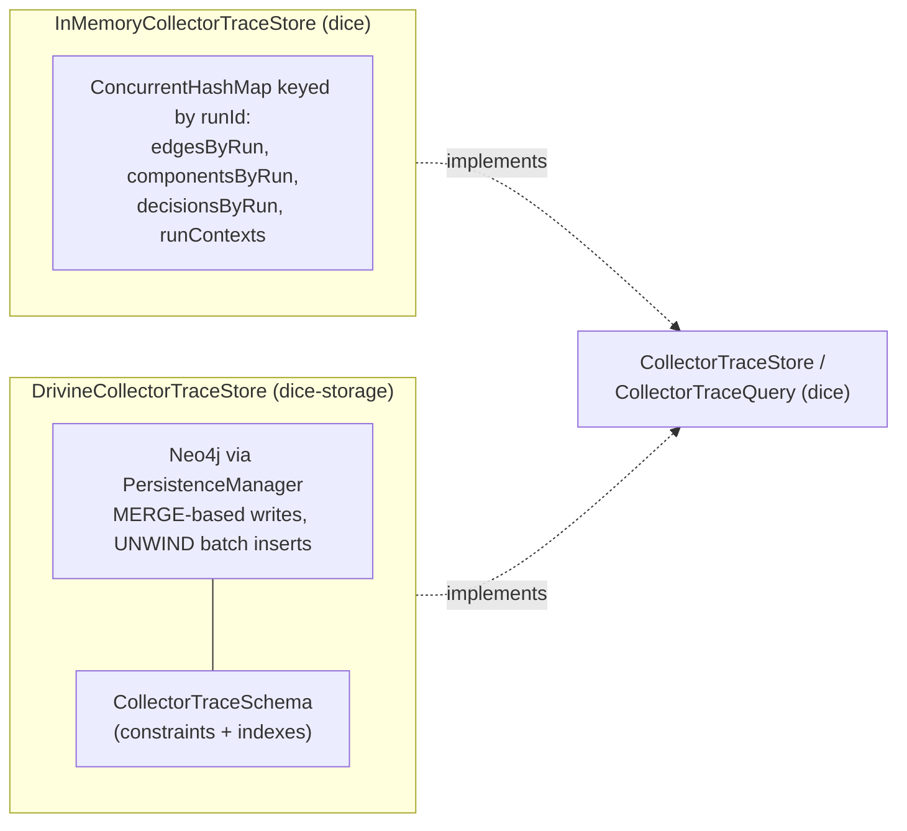
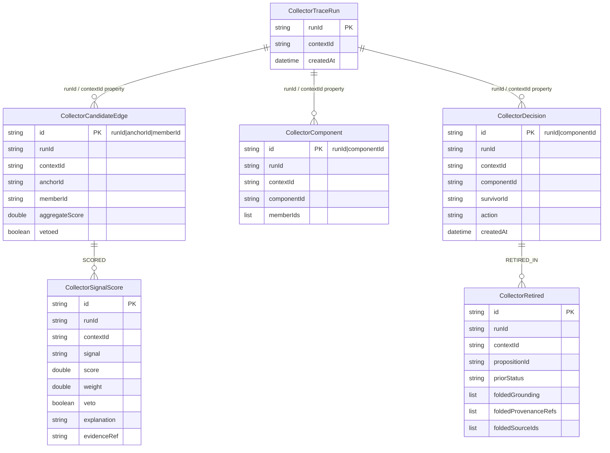
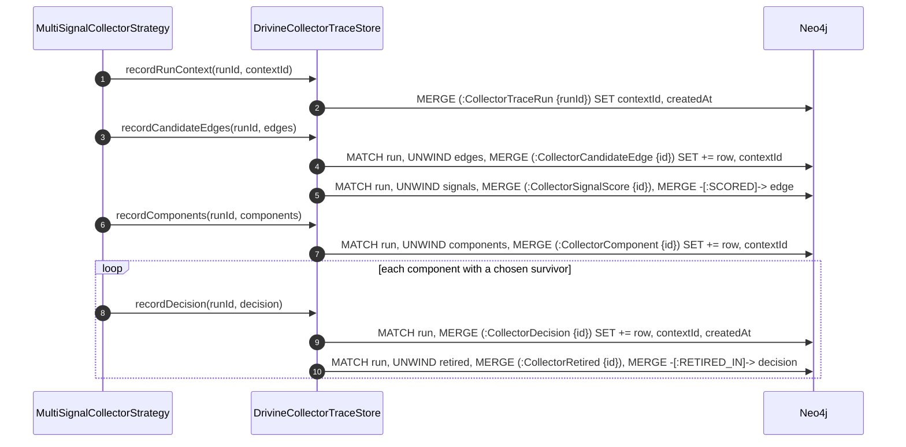

# The collector trace store: recording and explaining a collapse

Every edge scored, every component grouped, and every merge decided by the multi-signal
collector (see [multi-signal-collector](multi-signal-collector.md) for the pipeline that
produces this data) is written to a `CollectorTraceStore` under the run's id. This is the audit
trail that makes a collapse *explainable* after the fact — "why did proposition X get merged
into proposition Y" is a query, not a mystery — and, because nothing about a merge is
destructive (grounding and provenance are folded, not dropped; the loser transitions to `STALE`,
not deleted), the trace is also what a human reviewer needs to decide whether a given collapse
should be manually reversed.

This note covers the trace SPI, the two implementations that ship, the graph schema
`dice-storage` declares for the Neo4j-backed one, and how a run's data is written and read back.

## The trace SPI

```kotlin
interface CollectorTraceStore {
    fun recordRunContext(runId: String, contextId: ContextId)
    fun recordCandidateEdges(runId: String, edges: List<CollectorCandidateEdge>)
    fun recordComponents(runId: String, components: List<CollectorComponent>)
    fun recordDecision(runId: String, decision: CollectorDecision)
    fun deleteTracesForContext(contextId: ContextId)
}

interface CollectorTraceQuery {
    fun findEdgesByRun(runId: String): List<CollectorCandidateEdge>
    fun findDecisionsByRun(runId: String): List<CollectorDecision>
    fun findDecisionForProposition(propositionId: String): CollectorDecision?
}
```

The write side (`CollectorTraceStore`) and the read side (`CollectorTraceQuery`) are declared as
separate interfaces, but both shipped implementations satisfy both from the same class — a
single store handles the full lifecycle of a run's trace, and there is intentionally no separate
query-only bean (see [Wiring: one bean, two interfaces](#wiring-one-bean-two-interfaces) below).

`recordRunContext` is called once per run, before anything else, and exists mainly so
`deleteTracesForContext` has something to key off — the per-edge/component/decision record
calls don't carry a `ContextId` of their own; they carry a `runId`, and the run's registered
context is what makes "delete everything for this context" possible without threading a context
id through every downstream write.

## Two implementations, one contract



**`InMemoryCollectorTraceStore`** (`dice/src/main/kotlin/com/embabel/dice/spi/InMemoryCollectorTraceStore.kt`)
keeps everything in `ConcurrentHashMap`s keyed by `runId`, with `Collections.synchronizedList`
backing each run's list of edges/components/decisions. It's the always-available default — no
external dependency, thread-safe, and what tests exercise directly via its `edgesFor`/
`componentsFor`/`decisionsFor` accessors. Its tradeoff is durability: nothing survives a process
restart. `deleteTracesForContext` scans the `runContexts` map for every run registered against
the given context and clears all four maps for those run ids — a run that was never registered
via `recordRunContext` is simply unreachable from delete, which matters if a caller ever calls
the edge/component/decision record methods without first calling `recordRunContext`.

**`DrivineCollectorTraceStore`** (`dice-storage/src/main/kotlin/com/embabel/dice/storage/DrivineCollectorTraceStore.kt`)
persists the same data to Neo4j via `PersistenceManager`, wrapped in `@Transactional` at both
the class and method level. Every write is a `MERGE` on a natural key, so replaying a run (or
retrying a partially-failed write) updates rows in place rather than duplicating them. Every
multi-row write (edges, signals, components, retired members) goes through a single
`UNWIND $rows AS r ...` statement rather than one round trip per row — no APOC, no GDS, just
plain Cypher. Query methods are corrupt-row-tolerant: a row that fails to map into its data
class is logged and skipped rather than failing the whole read, which keeps one bad row from
making an entire trace unreadable.

## Node model: six labels

`CollectorTraceSchema` (`dice-storage/src/main/kotlin/com/embabel/dice/storage/CollectorTraceSchema.kt`)
declares six node labels, each with a uniqueness constraint on its natural-key id property, plus
range indexes on the fields it's actually queried by:



Only `SCORED` (`CollectorSignalScore` → `CollectorCandidateEdge`) and `RETIRED_IN`
(`CollectorRetired` → `CollectorDecision`) are real graph relationships. Every node's tie back to
its run is a plain `runId`/`contextId` *property*, not an edge — deliberately, so that "give me
everything for this run" or "delete everything for this context" is a property-filtered `MATCH`
per label rather than a graph traversal from a single run node. `CollectorTraceSchema.LABELS`
lists all six for exactly that purpose: `deleteTracesForContext` iterates it, running one
`MATCH (n:$label {contextId: $contextId}) ... DETACH DELETE` per label instead of a
multi-label query.

The `id` naming convention is a composite natural key, not a generated UUID — `edge.id` is
`"runId|anchorId|memberId"`, `component.id` is `"runId|componentId"`, `decision.id` is
`"runId|componentId"`. That's what makes the `MERGE (x:Label {id: ...})` writes idempotent:
replaying the same run produces the same ids, so a retry updates in place instead of duplicating
rows.

## Writing a run's trace

`DrivineCollectorTraceStore` writes in the same order `MultiSignalCollectorStrategy` calls it —
run context first, then edges (with nested signal scores), then components, then decisions (with
nested retired members):



Every statement re-`MATCH`es the `CollectorTraceRun` node for its `contextId`, rather than
threading the context id as a parameter through every call — that's the single-sourcing this
module leans on: `recordRunContext` is the only place `contextId` gets written directly, and
every later write copies it from the matched run node (`e.contextId = run.contextId`).

## Reading a run back

`findEdgesByRun` rehydrates edges and their nested signal scores in two passes — one query for
`CollectorCandidateEdge` nodes, one for their `SCORED` `CollectorSignalScore` children — then
joins them by edge id in Kotlin (`groupBy` into `signalsByEdgeId`) rather than having Cypher
return a nested map per edge. Two reasons: each query stays flat, one row per node, so the
existing flat row mappers (`CollectorCandidateEdgeRowMapper`) consume it directly; and each row is
mapped inside its own `runCatching`, so one unreadable edge or signal row is skipped and logged
rather than poisoning the whole read. A single Cypher query returning nested collections per edge
would mean one result row per (edge, signal) pair to flatten back out, or a `collect()`-based
aggregation to nest them — either way more to reconstruct than two flat result sets. The cost is
two round trips, with both result sets held in memory to join; for one run's bounded trace that's
negligible, but the signals query pulls every `SCORED` signal for the run and groups it
client-side, so an unusually large run means a correspondingly large in-memory result set — the
ceiling to watch if run sizes grow.

`findDecisionsByRun` and `findDecisionForProposition` follow the same shape: fetch the decision
node(s), then a helper (`retiredFor`) fetches the `CollectorRetired` children keyed by
`decisionId`. `findDecisionForProposition` checks both sides of a merge — first whether the id is
a decision's `survivorId`, then (if not) whether it appears on a `CollectorRetired` node reachable
via `RETIRED_IN` — so it answers "what happened to this proposition" whether it survived or was
folded away.

Every mapped row goes through `runCatching { ... }.onFailure { logger.warn(...) }.getOrNull()` —
a single corrupt or partially-written row is skipped and logged rather than aborting the whole
read, which matters for a store that's meant to stay readable even after a crash mid-write.

## Wiring

The two trace-store beans are wired by `CollectorAutoConfiguration` the same way as the rest of
the collector's beans — see
[Graph vs. in-memory trace store selection](multi-signal-collector.md#graph-vs-in-memory-trace-store-selection)
for why each bean returns its concrete type instead of the `CollectorTraceStore` interface.

The one detail specific to tracing: the graph bean carries a second condition beyond the
store-type check, `embabel.dice.collector.trace.enabled` (default `true`). Set it to `false`
with `embabel.dice.store.type=graph` and neither trace-store bean's conditions are satisfied
purely by that combination — in practice the in-memory bean's `@ConditionalOnMissingBean` still
lets it step in as the fallback, so tracing degrades to non-durable rather than disappearing
outright.
