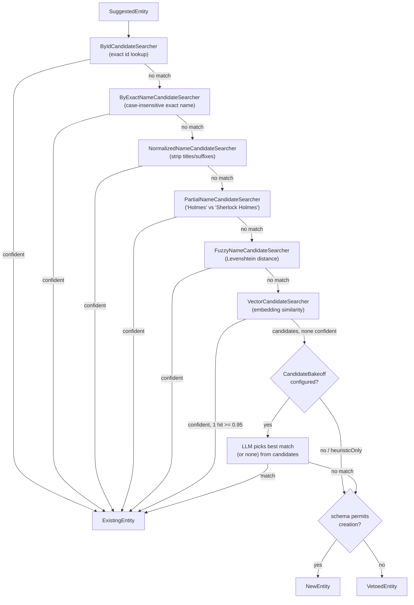
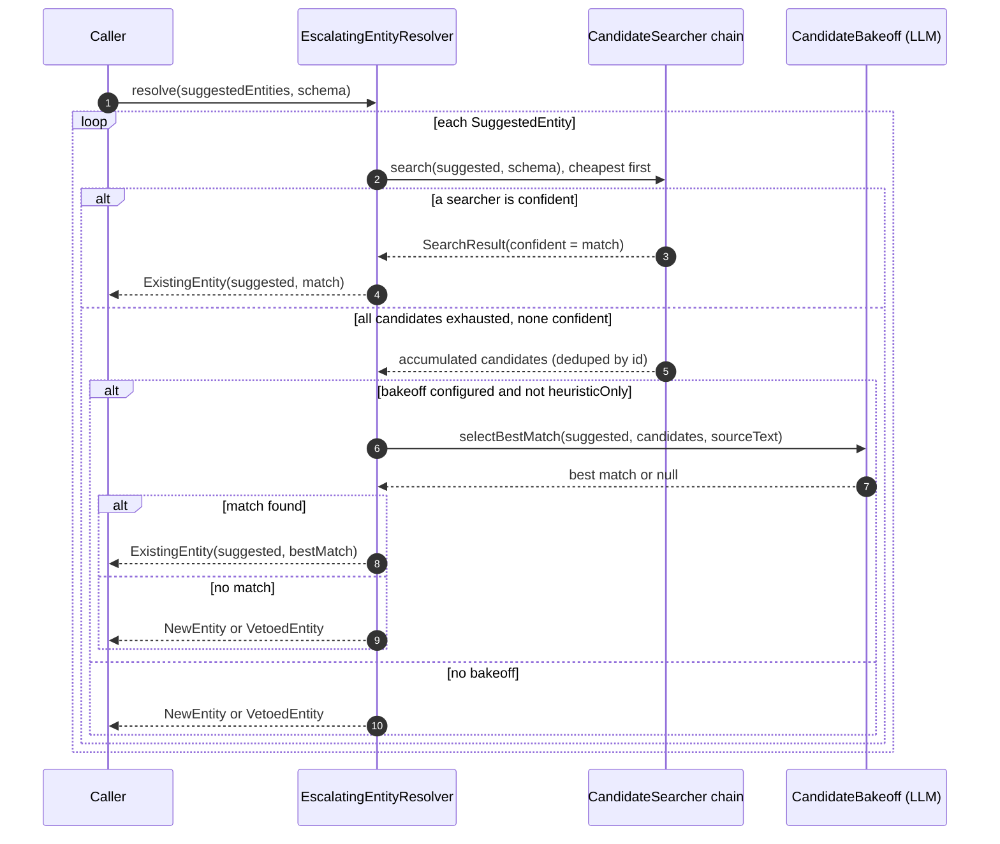

# Entity resolution and text2graph

Turning free text into a knowledge graph means answering the same question over and over: *is
this the entity I already know about, or a new one?* Get it wrong cheaply — miss the LLM budget,
say yes to everything — and the graph fills with duplicate nodes ("Watson", "Dr. Watson", "John
H. Watson") that never converge. Get it right expensively — call an LLM for every mention — and
ingestion is too slow and costly to run at scale. This subsystem is built around escalation: try
the cheap, deterministic matchers first, and only pay for an LLM when the cheap matchers are
genuinely unsure.

Two things live here, and they compose but aren't the same thing:

- **Entity resolution** (`com.embabel.dice.entity`, `com.embabel.dice.common.resolver`) — given a
  *suggested* entity (a name, some labels, maybe a summary), find or create the *canonical* entity
  it refers to.
- **text2graph** (`com.embabel.dice.text2graph`) — the pipeline that turns chunks of text into a
  `KnowledgeGraphDelta`: it extracts entities and relationships, resolves the entities via the
  resolver above, and resolves/merges the relationships.

Neither of these is `projection.graph` (the persistent-store projector covered in
[graph-projection](graph-projection.md)). See [How this differs from projection.graph](#how-this-differs-from-projectiongraph)
below — the naming collision is a real trap, not a stylistic choice.

## Entity extraction

`EntityExtractor` (`com.embabel.dice.entity.EntityExtractor`) is the narrow half of source
analysis: given a `Chunk` and a `SourceAnalysisContext` (schema + config), it returns
`SuggestedEntities` — no relationships, no resolution, just "here's what I think I saw." It exists
as a simpler alternative to `SourceAnalyzer` (below) for callers who only need entities — for
example `EntityResolutionService`, which resolves directly-asserted entities with no text at all.

The shipped implementation, `LlmEntityExtractor`, prompts an LLM against the schema and parses the
response into `ExtractedEntityInfo` (labels, name, summary, optional id, properties), then converts
each to a `SuggestedEntity` tagged with the source `chunkId`. The `id` field matters later: if the
extractor (or a caller) already knows the entity's identity — because the assertion carries a
UUID — resolution can skip straight to an ID lookup instead of guessing from the name.

```kotlin
val extractor: EntityExtractor = LlmEntityExtractor
    .withLlm(llmOptions)
    .withAi(ai)
val suggested: SuggestedEntities = extractor.suggestEntities(chunk, context)
```

## The resolver chain

`EntityResolver` is the interface (`com.embabel.dice.common.EntityResolver`); `EscalatingEntityResolver`
is the production implementation. It walks a list of `CandidateSearcher`s cheapest-first, stopping
as soon as one is confident. If nobody's confident, the accumulated candidates go to an optional
LLM `CandidateBakeoff`; if that also comes up empty, a new entity is minted — or vetoed if the
schema doesn't permit creating that type.



Each searcher returns a `SearchResult`: either a single `confident` match (resolution stops right
there) or a list of `candidates` that get carried forward. "Confident" always means *exactly one*
hit clears that searcher's bar — two plausible hits is exactly the ambiguity the LLM tier exists
to resolve, so no heuristic searcher is allowed to guess between them.

The default chain, cheapest to most expensive (`DefaultCandidateSearchers.create`):

| # | Searcher | Confident when | Notes |
|---|----------|-----------------|-------|
| 1 | `ByIdCandidateSearcher` | `suggested.id` set and resolves to exactly one row | Skips search entirely — used when the caller already knows the identity |
| 2 | `ByExactNameCandidateSearcher` | exactly one exact (case-insensitive) name match | |
| 3 | `NormalizedNameCandidateSearcher` | exactly one match after stripping titles/suffixes | "Dr. Watson" → "Watson" |
| 4 | `PartialNameCandidateSearcher` | exactly one partial match, part ≥ `minPartLength` (default 4) | "Holmes" → "Sherlock Holmes"; "Doe" is too short to match "John Doe" |
| 5 | `FuzzyNameCandidateSearcher` | exactly one match within a Levenshtein ratio (default 0.2) | catches typos |
| 6 | `VectorCandidateSearcher` | exactly one embedding hit ≥ `autoAcceptThreshold` (default 0.95) | anything ≥ `candidateThreshold` (0.7) becomes a bakeoff candidate |
| 7 | `AgenticCandidateSearcher` | LLM-driven, iterative `ToolishRag` search | not in the default chain — opt in when entities have many aliases/translations (musical works, place names) and the fixed heuristics above can't cover it |

`EscalatingEntityResolver.create(repository, bakeoff)` wires searchers 1–6; `withoutVector` drops
the embedding searcher for stores with no vector index. Add `AgenticCandidateSearcher` explicitly
as the last searcher when your domain needs it — see its kdoc for when that trade-off is worth it.

### Resolving one mention



Note the escalation levels tracked alongside the walk (`ResolutionLevel`: `EXACT_MATCH` →
`HEURISTIC_MATCH` → `EMBEDDING_MATCH` → `LLM_VERIFICATION` (exactly one candidate reached the LLM)
→ `LLM_BAKEOFF` (multiple candidates) → `NO_MATCH`). `EscalatingEntityResolver` logs a count per
level for the whole batch — that's the signal to watch if resolution quality regresses: a spike in
`LLM_BAKEOFF` or `NO_MATCH` usually means the heuristic tiers stopped covering your data (new
naming convention, new language, near-duplicate seed data), not that the LLM tier is broken.

Each `CandidateSearcher` declares its own `resolutionLevel`, so the count is accurate whatever the
chain's length or order: the exact searchers report `EXACT_MATCH`, the normalized/partial/fuzzy
searchers `HEURISTIC_MATCH`, and the vector searcher `EMBEDDING_MATCH`.

### The four resolution outcomes

`SuggestedEntityResolution` (`com.embabel.dice.common`) is sealed over four cases, each meaning
something different downstream:

- **`NewEntity`** — nothing matched and creation is permitted. `recommended` is the suggested
  entity's own data.
- **`ExistingEntity`** — a match was found. `recommended` merges labels from both suggested and
  existing (so a `Person` later identified as a `Detective` ends up with both labels) and unions
  properties, preferring the existing entity's description.
- **`ReferenceOnlyEntity`** — a match exists but must not be modified (e.g. the current user,
  managed externally). Referenced but excluded from `updatedEntities`.
- **`VetoedEntity`** — no match, and the schema's `DataDictionary.domainTypeForLabels(...)` says
  this type can't be created (`creationPermitted == false`). The mention is dropped, not persisted.

Downstream code (`EntityResolutionService`, `KnowledgeGraphDelta`) branches on this sealed type
rather than on a boolean "found/not found" — that's the same shape of decision as projection's
`CreateNew`/`Adopt`/`Align`/skip/fail in [graph-projection](graph-projection.md#projection-outcomes),
for the same reason: collapsing distinct outcomes into a boolean throws away information a later
stage needs.

### Standalone entity assertion: `EntityResolutionService`

Not every entity comes from text. `EntityResolutionService`
(`com.embabel.dice.entity.EntityResolutionService`) exposes the resolver chain as a first-class
operation for callers who already have a name/labels/properties in hand — no chunk required. It
turns each `EntityAssertion` into a `SuggestedEntity`, runs it through the full escalation chain,
persists the outcome (`save` for `NewEntity`, `update` for `ExistingEntity`), and then creates the
requested `RelationshipAssertion`s between resolved entities — skipping any relationship whose
endpoint was vetoed.

```kotlin
val service = EntityResolutionService(entityResolver, repository, schema)
val result = service.resolve(
    EntityAssertionRequest(
        entities = listOf(EntityAssertion(labels = listOf("Person"), name = "Ada Lovelace")),
        relationships = listOf(RelationshipAssertion(source = "Ada Lovelace", target = "Analytical Engine", type = "DESIGNED")),
    )
)
```

The key difference from the text2graph pipeline below: **every** asserted entity is persisted here
— there's no "referenced entity IDs" gate filtering out entities that were only mentioned in
passing. If you're asserting it directly, you meant it.

## text2graph: from chunks to a graph delta

`SourceAnalyzer` (`com.embabel.dice.text2graph.SourceAnalyzer`) is the superset of
`EntityExtractor`: per chunk, it suggests entities *and* suggests relationships between already-
resolved entities. It explicitly does not do disambiguation or merging — that's `KnowledgeGraphBuilder`'s
job, one layer up.

`KnowledgeGraphBuilder.computeDelta(chunks, context)` is the orchestrator. The shipped
`MultiPassKnowledgeGraphBuilder` runs, per chunk:

1. `sourceAnalyzer.suggestEntities(chunk, context)` → `SuggestedEntities`
2. `entityResolver.resolve(suggestedEntities, schema)` → the escalating chain above
3. `sourceAnalyzer.suggestRelationships(chunk, entityResolutions, context)` → `SuggestedRelationships`
4. `relationshipResolver.resolveRelationships(...)` → `NewRelationship` / `ExistingRelationship`
5. `entityMergePolicy` / `relationshipMergePolicy` decide what actually goes into the delta

...and accumulates everything across chunks into one `KnowledgeGraphDelta` (`entityMerges`,
`relationshipMerges`), which exposes `newEntities()`, `mergedEntities()`, `newOrModifiedEntities()`
(deduplicated by ID, merged entities' upgraded labels winning) and the relationship equivalents.

`RelationshipResolver` mirrors the entity side but is simpler — there's no escalating searcher
chain, just a decision between `NewRelationship` (suggested as-is) and `ExistingRelationship`
(matches something already in the graph). The shipped `AcceptSuggestionRelationshipResolver`
accepts every suggestion as new; swap in your own when you need relationship-level dedup (e.g. "same
type between the same two resolved entities is one edge, not N").

```kotlin
val builder = KnowledgeGraphBuilders
    .withSourceAnalyzer(LlmSourceAnalyzer(ai, llmOptions))
    .withEntityResolver(EscalatingEntityResolver.create(repository, bakeoff))

val delta = builder.knowledgeGraphBuilder().computeDelta(chunks, sourceAnalysisContext)
// or, to get domain objects directly:
val objects = builder.projector().project(chunks, sourceAnalysisContext)
```

`KgbBuilder.projector()` hands you a `ToObjects` wrapper around a
`text2graph.builder.GraphProjector<Any>` (default `InMemoryObjectGraphGraphProjector`) — its
`project(chunks, context)` walks the delta and instantiates domain objects (`Person`, `Animal`, ...)
with relationships wired as real object references, sharing one instance per entity ID. It's an
in-memory object graph, not a persistence step. (This is the one canonical example of the builder
chain; see [Common use cases](#common-use-cases-and-how-to-extend) for how it composes with
resolution options like `bakeoff`/`heuristicOnly`.)

## How this differs from projection.graph

There are, deliberately or not, **two different types both named `GraphProjector`** in this
codebase:

| | `com.embabel.dice.text2graph.builder.GraphProjector<E>` | `com.embabel.dice.projection.graph.GraphProjector` |
|---|---|---|
| Input | a `KnowledgeGraphDelta` from text2graph | `Proposition`s from the durable store |
| Output | in-memory domain objects (`List<E>`), or a rooted object graph | edges/nodes written to a target backend, with a `ProjectionRecord` per outcome |
| Concerned with | turning *this batch's* extraction result into usable Kotlin/Java objects | lineage, authority tiers, staleness, re-projection over the store's whole lifetime — see [graph-projection](graph-projection.md) |
| Lifetime | one call, one delta, done | ongoing — the same proposition can be reconciled and re-projected many times |

If you're extracting facts from a document right now and want typed objects back, you want
text2graph's `GraphProjector`. If you're asking "should this durable proposition update the graph,
and do we have an auditable trail for it," you want projection.graph's — read
[graph-projection](graph-projection.md) for that side. Don't let the shared name make you reach for
the wrong one; check the package.

The two subsystems also compose in one direction: relationships/entities
extracted through text2graph frequently *become* `Proposition`s that then flow through the
projection pipeline for durable storage — text2graph is upstream of proposition creation, not a
replacement for it.

## Common use cases and how to extend

**Run extraction → resolution end to end** (the common path — most callers want
`KnowledgeGraphBuilders`, not the pieces directly) — see the builder chain example under
[text2graph: from chunks to a graph delta](#text2graph-from-chunks-to-a-graph-delta).

**Assert entities directly, no text involved** — use `EntityResolutionService` (above), not
`KnowledgeGraphBuilder`.

**Add a new `CandidateSearcher`** — implement `search(suggested, schema): SearchResult`, return
`SearchResult.confident(match)` only when you're certain there's exactly one right answer, or
`SearchResult.candidates(list)` otherwise. Insert it into the chain at the right cost tier: cheaper
than vector search but more specific than fuzzy matching, for example, goes between `FuzzyNameCandidateSearcher`
and `VectorCandidateSearcher` in your own list passed to `EscalatingEntityResolver(searchers = ...)`
(the `DefaultCandidateSearchers` factory is a convenience default, not the only valid chain).

**Add a new `EntityResolver` entirely** (rare) — implement the `EntityResolver` interface directly if
escalation-over-searchers isn't the right shape for your store (e.g. `InMemoryEntityResolver` /
`KnownEntityResolver` for tests and seed scenarios that never need to match against real data).

**Tune bakeoff behavior** — pass a `CandidateBakeoff` (e.g. `LlmCandidateBakeoff`) to get LLM
arbitration; omit it (or set `Config(heuristicOnly = true)`) to stop at the searcher tier and
always mint new entities when heuristics are unsure. Use `heuristicOnly` for cost-sensitive or
offline paths where an occasional duplicate is cheaper than an LLM call per ambiguous mention.

**Add a new `RelationshipResolver`** — implement `resolveRelationships`, returning `NewRelationship`
or `ExistingRelationship` per suggestion; use the already-resolved `entityResolution` to check
whether a matching edge already exists between those two resolved entities before accepting a new
one.
