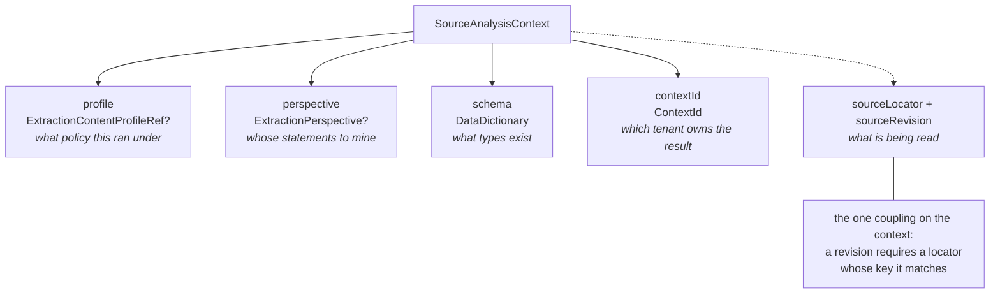
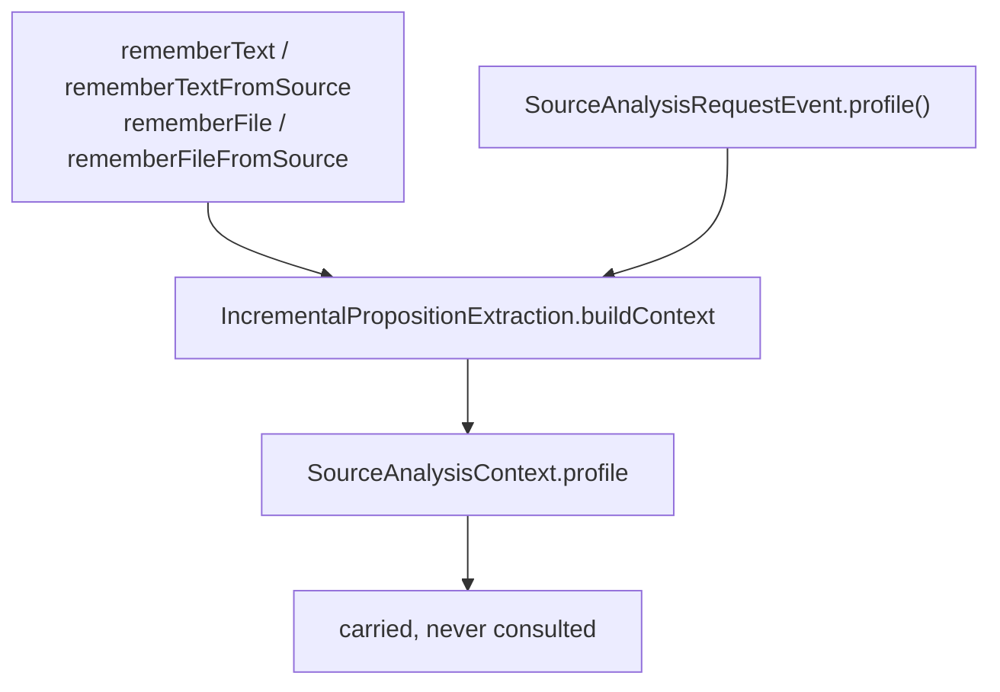
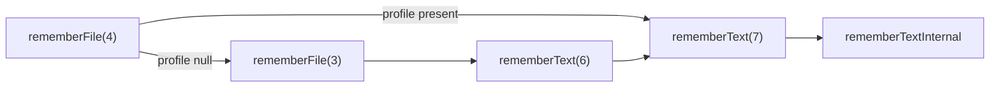

# Extraction profiles: opaque policy identity, carried and never resolved

An extraction content profile is the host's durable answer to "what should extraction of this
kind of material do?" DICE carries its name and version and nothing else. It never looks a
profile up, never reads policy out of it, and never routes on it. The host owns the catalog,
authorizes who may use which profile, and binds it to whatever it actually means.

This note covers DICE #66: `ExtractionContentProfileRef`, where it sits on
`SourceAnalysisContext` and the extraction entry points, and why profile, perspective, schema and
tenant are four independent dimensions rather than one knob with four names. An extraction run
reference travelled with this slice for one PR round and was pulled back out on review — see
[Why there is no run reference here](#why-there-is-no-run-reference-here) below.

## Why the identity is opaque

A profile reference is two strings:

```kotlin
data class ExtractionContentProfileRef(
    val name: String,
    val version: String,
)
```

Neither is parsed. DICE compares them and carries them. The alternative — DICE resolving a
profile into an actual configuration — costs three things it has no business owning:

- **A catalog.** Someone would have to hold the mapping from profile to policy, and it would have
  to be reachable from inside extraction. Every host already has that mapping; DICE would be
  duplicating it, and the two copies would drift.
- **An authorization model.** "May this caller use the `legal-review` profile?" is a product
  question with a product's answer. DICE has no user model to answer it with, and a reference it
  cannot authorize is a reference it must not dereference.
- **A connector per host.** The moment a profile selects behaviour, DICE branches on which host it
  is talking to. That is the connector-branching-inside-DICE outcome #66 exists to avoid.

So the split is: **DICE carries profile identity; the host authorizes and binds it.** A host that
wants a particular prompt, a particular temperature, or a particular model for a given profile
makes that decision on its own side, before it calls DICE, and passes the reference along so its
own extractor can see which policy the call was made under.

**A profile selects no provider, no model, and no credential.** That is a contract, not an
oversight, and it is stated in the KDoc of every surface that accepts one. Nothing downstream of
`buildContext` reads it; a test compares the whole context built with a profile against the one
built without and asserts they differ in exactly that field.

Identity is name *and* version together. A host that republishes `house-style` as `v2` gets a
reference distinct from `v1`, so a later comparison of the two compares two identities and stays
clear of archaeology.

Both strings are bounded — 256 characters for a name, 64 for a version. A reference is an
identifier the host mints, not a place to put a payload.

## Four independent dimensions

Perspective is the dimension a profile is most easily confused with, so the difference is worth
stating plainly. **Perspective describes conversational input** — whose statements to mine out of
a transcript. **A profile is content policy** — what the host wants done with material of this
kind. They answer different questions, and a caller combines them freely.



The dotted branch is the only coupling on the context: a `sourceRevision` requires a
`sourceLocator` whose key it matches, because a revision names a version of a specific source.
Profile is checked against nothing — the `init` block says so — validating it against another
dimension would invent a relationship the contract does not have.

Independence is pinned as a matrix rather than argued. `ExtractionContextIndependenceTest` builds
every combination of 4 profiles (including absent) × 4 perspectives (including absent) × 2 schemas
× 2 tenants — 64 contexts — and asserts three things:

1. every cell is constructible and reads back exactly the values it was given;
2. for every ordered pair of dimensions, the observed pairs are the whole cross product, so a
   dimension that quietly disabled, defaulted or rejected another would leave a hole;
3. varying one dimension leaves the other three identical.

A fourth case pins the copy helper by comparing `withProfile(p)` against `copy(profile = p)`,
which is a statement about all twelve components at once rather than about the one field the
helper names.

## Carrying it in

Everything that reaches extraction builds a `SourceAnalysisContext`, and both entry paths build it
through one `buildContext` call — the same structural argument Wave A used for source revisions,
for the same reason: parallel code in two places is where two paths start behaving differently.



| Path | How a profile arrives |
| --- | --- |
| `rememberText`, `rememberTextFromSource` | a trailing optional `profile` argument |
| `rememberFile`, `rememberFileFromSource` | the same argument, forwarded to the text call |
| async `SourceAnalysisRequestEvent` | `profile()`, open and null-defaulted |
| `ConversationAnalysisRequestEvent` | its longer constructor, whose `sourceLocator` is nullable so a publisher can name a profile for material it has no typed source for |

The direct calls take an extra argument rather than getting their own method name, which is the
opposite of what Wave A did for `rememberTextFromSource`. The reason is the difference in the
contracts: a locator is *required* by the source-aware calls, so those are genuinely different
methods and separate names keep every call site unambiguous. A profile is optional everywhere, so
an extra name would buy nothing and double the surface.

### Why each entry point is two declarations

Growing the existing declarations with a defaulted parameter would have been the obvious shape,
and it is wrong. `@JvmOverloads` emits every reduced-arity overload as `final`, even on an `open`
function — only the declared maximum arity stays open. So adding `profile` to `rememberText`
would have moved the open declaration from six arguments to seven and re-emitted the six-argument
form as a final bridge. Callers would not have noticed. A subclass overriding the six-argument
form would have stopped compiling, and one already compiled could fail verification at class
load.

Each entry point is therefore two declarations: the pre-profile signature exactly as it was
(`@JvmOverloads` where it already had it), delegating to a new maximum-arity form that takes the
reference and carries no default. The default is what forces the split — two overloads that both
supply defaults for the same arity are ambiguous at a Kotlin call site, so the wide form spells
every argument out.

| Method | Overridable before | Overridable now |
| --- | --- | --- |
| `rememberText` | 6 args | 6 args, and 7 |
| `rememberTextFromSource` | 8 args | 8 args, and 9 |
| `rememberFile` | 3 args | 3 args, and 4 |
| `rememberFileFromSource` | 5 args | 5 args, and 6 |

The reduced arities `@JvmOverloads` generates were final before and still are — the fix restores
the previous surface rather than widening it.

### Which chain a call takes

Keeping the old signatures overridable is only half of it. They also have to still be *reached*.
Before profiles, `rememberFile` read the file and handed the text to the six-argument
`rememberText`, so a subclass overriding only that one intercepted file ingestion as well.
Routing the file paths straight to the wide text methods would have taken that away silently: the
override would still compile, still fire for direct text calls, and stop seeing files.

So the rule is that a call dispatches like the call it resembles. A file call carrying no profile
takes the pre-profile chain; one carrying a profile has to go wide, because the legacy text
signature cannot express it.



`rememberFileFromSource` and `rememberTextFromSource` mirror it at their own arities. The wide
text forms are terminal and never route back to the legacy ones — that would be a cycle, since
the legacy forms delegate forwards.

Two consequences worth stating. A subclass overriding only a pre-profile text method sees
everything it used to, files included. And unintercepted, every call still ends at the wide text
form, so a host that wants one place to see all traffic overrides that.

The async path reads the accessor exactly once, which a test asserts by counting: there is one
`buildContext` call and nowhere else for a second read to happen.

## Compatibility

**Additive, with the same scoped ABI boundary Wave A declared.**

- Every Java-visible `SourceAnalysisContext` constructor descriptor that existed before this slice
  is still published. `@JvmOverloads` adds one new one on the end. A test enumerates arities
  3 through 12 (each with the trailing `DefaultConstructorMarker` Kotlin emits because `contextId`
  is a value class) and asserts every one resolves.
- Every `rememberText`, `rememberTextFromSource`, `rememberFile` and `rememberFileFromSource`
  descriptor survives, and the new argument adds exactly one descriptor per method name, on the
  end. A test asserts the exact descriptor set of all four names, and that a profile is always the
  last parameter.
- **Subclass-override compatibility is claimed, and covers being reached as well as being
  overridable.** Every signature that was overridable before this slice still is, and every
  pre-profile call still dispatches through it. A reflection test asserts `Modifier.isFinal` is
  false on all four pre-profile signatures and on the four new maximum-arity forms, and true on
  the reduced arities that were final bridges already. A Java subclass in the compat suite
  overrides all four pre-profile signatures; `javac` rejects `@Override` on a final method, so the
  suite compiling is the second proof. A Kotlin test constructs a subclass overriding the
  six-argument `rememberText` and the three-argument `rememberFile` and asserts a three-argument
  call still reaches the override. Overridability alone is not enough, so two further tests pin
  the dispatch: a subclass overriding only the pre-profile *text* methods still sees both file
  entry points, and a file call that carries a profile goes to the wide text form instead.
- `ConversationAnalysisRequestEvent` keeps its five-argument constructor and gains a
  six-argument form. Its `sourceLocator` parameter relaxes from non-null to nullable, which
  accepts strictly more calls than before.
- **Full Kotlin synthetic `copy` and `componentN` ABI is not claimed.** Adding a field to a data
  class rewrites `copy` and adds a `componentN` method, so Kotlin code compiled against an earlier
  jar must be recompiled rather than swapped in. This is the same half of the boundary #64
  declined, for the same mechanical reason, and a test pins it: exactly one `copy` remains and it
  takes twelve arguments.
- No stored data changes. Nothing serializes a profile yet.

## Status: EXPERIMENTAL

`ExtractionContentProfileRef` carries `@ApiStatus.Experimental`, which is the marker DICE already
uses for API that may still move (`PrologProjector`, `PropositionStatus.STALE`). The KDoc on the
type and on every new parameter says the same in words, and the CHANGELOG entry is labelled.

A Kotlin `@RequiresOptIn` annotation would make the experimental status enforceable at the call
site rather than advisory. Nothing in DICE defines one today, and inventing an opt-in marker is a
policy decision about the whole public surface, not about this slice. It is recorded here as an
open question rather than answered.

## Why there is no run reference here

The PR that shipped this slice also carried `ExtractionRunRef` — a single opaque id, identity
only, meant to ship ahead of the durable run store that would key on it (DICE #67). Review on the
PR (#94) named the reason that does not work as a standalone slice: `persistAndProject`, the
method that actually saves what extraction produces, takes only the pipeline's
`ChunkPropositionResult` — it never receives the `SourceAnalysisContext` that a run reference
would have been carried on. So a caller passing `currentRun` got it accepted onto the context and
then structurally unable to reach the write that saves propositions.

Structurally, `profile` sat on that same context and was equally unreachable from
`persistAndProject`, and `currentRun` reached exactly as far as `profile` still does: both passed
through the identical extension point, `PropositionExtractor.extract(chunk, context)`.
`PropositionPipeline.withExtractor` seeds a pipeline with a host-implemented `PropositionExtractor`,
and `extract` receives the whole context — `currentRun` included, back when it existed. No
extractor DICE ships reads `context.profile` today, and nothing else downstream of `buildContext`
does either (`IncrementalPropositionExtraction.kt:612`); the test `profile reaches the context
through both text entry points` (and its file-entry counterpart) pins that the context reaching
the pipeline carries `profile`, which is the reachability half of the claim, and stops there — it
does not exercise any reading of the value. The asymmetry is about what a host-authored
`PropositionExtractor` has to act on once it does read the field. `profile` names the host's own
content-policy identity, something a host already knows the meaning of and can build a reader for
today. `currentRun` named a run, and nothing in the codebase — not DICE, not a host extractor —
had a run store to look that id up against; a reader for it would have had a value with nowhere to
resolve until DICE #67 supplies one. The gap that keeps `currentRun` out of this slice is that
missing store, exactly the gap `persistAndProject` also runs into.

The comment offered two honest resolutions: wire a consuming write into this slice, or pull the
parameter until one exists. The first was not available here — no proposition-lineage write that
stamps run attribution exists on this branch; the durable run store and the write that would
consume the reference are DICE #67 and the run-model slices above it
(`extraction-run-model`, `-store-contract`, `-store`, `-lineage`), none of which this branch has.
So the parameter was pulled: `ExtractionRunRef`, `SourceAnalysisContext.currentRun`,
`withCurrentRun`, the `currentRun` argument on every `remember*` entry point,
`SourceAnalysisRequestEvent.currentRun()`, and the matching `ConversationAnalysisRequestEvent`
constructor argument are all removed from this slice. Every table, diagram and arity count above
in this note reflects a profile-only surface for that reason.

Nothing on this branch called the parameter for anything (`grep` across this worktree found no
caller of `currentRun`/`ExtractionRunRef` outside the profile slice's own code and tests), so
there is nothing to migrate. The reference returns, unchanged in shape, once #67's store and a
write that consumes it land together — at that point a run reference reaching
`SourceAnalysisContext` will have somewhere to go.

## What this slice does not do

- **No host profile catalog.** DICE holds no mapping from a reference to a policy and offers no
  place to put one.
- **No extraction run reference.** See [Why there is no run reference here](#why-there-is-no-run-reference-here) —
  it shipped in review and was pulled back out; it returns with DICE #67's store and the write
  that consumes it.
- **No REST surface.** `POST /extract` takes no profile. The REST request carries a source locator
  and a revision from Wave A and is otherwise unchanged; adding profile there is a separate
  decision about the authorized boundary, not a mechanical extension of this slice.
- **No behaviour from DICE's own code.** Extraction, resolution and revision ordering are
  behaviour-identical for every extractor DICE ships, with or without a profile. DICE's part ends
  at carrying `context.profile` to whichever `PropositionExtractor` a host supplies; a host
  extractor that reads the field is free to change what it does based on it.
