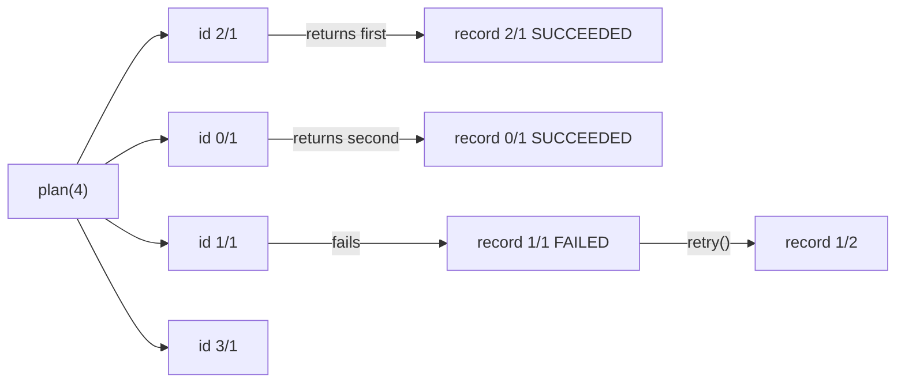

# Extraction runs: what produced a claim, recorded without holding what it read

An extraction run is the durable record of one execution: which profile, prompt, schema and
metamodel versions were in force, which revisions of which sources it read, what it asked a
model for, what the provider actually reported back, how far it got, and what went wrong. It
holds none of the material. No prompts, no source text, no responses, no user or session
objects, no provider SDK payloads, no extension maps.

This note covers DICE #67's value model — the types in `com.embabel.dice.proposition.extraction`
that later slices store, key, and expose. The lifecycle state machine, the store contract, the
Drivine implementation, the proposition-to-run relation and the wiring are separate slices; where
this note says "the store contract", that is what it means.

## What a run holds

```mermaid
flowchart TD
    RUN["ExtractionRun<br/><i>keyed by (ContextId, ExtractionRunRef)</i>"]
    RUN --> LIN["ExtractionRunLineage<br/>run, root, parent, supersedes, pass"]
    RUN --> PROF["ExtractionContentProfileRef<br/><i>#66</i>"]
    RUN --> SRC["List&lt;SourceRevisionRef&gt;<br/><i>#64, ordered</i>"]
    RUN --> FP["ExtractionRunFingerprints<br/>prompt, schema, metamodel"]
    RUN --> RT["ExtractionRuntimeIdentity<br/>extractor, host, runtime"]
    RUN --> REQ["ExtractionRequestedModelConfig<br/><i>what was asked for</i>"]
    RUN --> SUBJ["ExtractionRunSubjectRefs<br/>actor, request, session,<br/>personalization, deployment"]
    RUN --> EXP["ExtractionExperimentRef<br/>ExtractionCohortRef"]
    RUN --> ST["ExtractionRunStatus<br/>ExtractionReplayFidelity<br/>ExtractionRunCounts"]
    RUN --> INV["List&lt;ExtractionInvocationRecord&gt;<br/><i>what was observed</i>"]
    RUN --> FAIL["List&lt;ExtractionFailure&gt;<br/><i>bounded, closed vocabulary</i>"]
    FAIL --> FV["ExtractionFailureCode<br/>ExtractionFailureStage<br/>ExtractionFailureMeasure"]
    INV --> IID["ExtractionInvocationId<br/>plan ordinal + attempt"]
    INV --> USE["ExtractionModelUsage"]
    INV --> PRF["ExtractionProviderResponseFacts"]
    SUBJ --> OP["ExtractionOpaqueRef<br/><i>bounded pseudonymous token</i>"]
    EXP --> OP
```

`ExtractionRunKey` is the tenant-qualified identity: a run id is host-minted and DICE never
assumes it is unique across tenants, so the `ContextId` travels with it. Two tenants that both
mint `run-1` have two runs.

## How a run joins to the metamodel

One field carries the join. `ExtractionRunFingerprints.metamodelFingerprint` holds the declared
schema's content hash — the `contentHash` a `MetamodelVersion` fingerprints itself with, which
`docs/design/metamodel-versioning.md` on the metamodel stack describes. DICE compares it and stores
it and reads nothing out of it, the same as the other two fingerprints.

The extraction coordinator writes it, and that coordinator is a later slice. It resolves the hash
from the host's `DeclaredSchemaSource` and stamps it once per run. Nothing in this slice produces
one, so a run built today carries whatever its caller passed.

The fingerprint says what the whole run ran under. A proposition's schema attribution is answered
through the run that produced it (`PRODUCED_BY_RUN`, the proposition-to-run relation a later slice
adds); the run record carries the declared schema's content hash, resolved by the extraction
coordinator from the host's `DeclaredSchemaSource`. That is why no per-proposition schema stamp
exists. A per-proposition denormalized copy is a coordinator concern for a slice whose reads demand
it.

## Requested and observed are different types

The single most useful thing a run can tell an incident is which of these two it is looking at:
the temperature the host asked for, or the temperature the provider used. A service can clamp a
temperature, ignore a top-k, cap max tokens below what was asked, and route to a different
checkpoint under a stable model name. None of that is visible to DICE, so a model that let one
field mean both would be inviting a false answer to the only question worth asking.

So the split is structural, not conventional:

| | Type | Lives on | Filled in by |
| --- | --- | --- | --- |
| Requested | `ExtractionRequestedModelConfig` | the run header | the host, before any call |
| Observed | `ExtractionInvocationRecord`, with `ExtractionModelUsage` and `ExtractionProviderResponseFacts` | one per attempt | whatever came back |

An invocation record has no field of the requested type, and the two share no property name — the
requested one is `requestedModel`, the reported one is `responseModel`. Both are asserted by test
rather than left to review: a mapper that copied one into the other would have to be written on
purpose.

The corollary is that an absent observed field stays absent. A run that asked for `model-large`
and got no model name back records a null `responseModel`, because telling "the provider did not
say" apart from "the provider said what we asked for" is the whole point of the field.

`ExtractionRequestedModelConfig` carries portable fields only: model and role, temperature, top-p,
top-k, max tokens, the two penalties, a thinking fingerprint, a selection fingerprint, and a
timeout. There is no provider extension object, no settings blob, no free map. That is where
credentials, system prompts and whole SDK request bodies get persisted by accident. A
provider-specific knob a host cares about is folded into one of the fingerprints — an opaque
digest DICE compares and never reads.

Ranges are checked where every provider agrees and left open where they do not. Temperature has no
upper bound because services differ on whether it stops at 1 or 2, and the penalties are only
required to be real numbers for the same reason. Rejecting a legitimate `2.0` would be DICE
deciding for a provider it never talks to.

## Invocation identity comes from the plan, never from completion

A run makes zero, one, or many model calls — chunking splits work, retries repeat it. Every
record needs an identity that a store can use as a deterministic child key, so that a retried
write lands on its own row and a replayed write upserts in place.

The identity is allocated when the call plan is laid out, before the first request goes out:

`invocationIndex` is the ordinal in the plan. `attempt` counts tries at that same call, from 1.
`retry()` carries the index forward, increments the attempt, and resets every observed field,
because those observations belonged to the attempt that just failed.

Timing on a record is an observation like any other and may be absent even on a terminal outcome. A
`SUCCEEDED` attempt with no `startedAt` means the clock was not recorded, not that the call did not
run; requiring timing would push callers to invent a duration, which is worse evidence than none.
The two checks a record can fail on its own terms do apply: a finish cannot precede its start, and
an `IN_FLIGHT` attempt has not finished.

Completion order writes into identities that already exist. There is no factory that takes a
position in a result list, and the run stores records in whatever order they arrived while
`invocationsInPlanOrder()` reads the plan back out. A run rejects two records with the same
`(invocationIndex, attempt)`.

## The root run reference, and why it is denormalized

`ExtractionRunLineage` carries four references: the run, its parent, what it supersedes, and its
root. Parent and supersession are separate axes — a parent is the run this one continues from, a
superseded run is one this one replaces — and a run can have one of each, both, or neither.

The root is redundant with the parent chain, and it is stored anyway. OpenLineage's
`ParentRunFacet` does the same: it carries an optional `root` alongside the immediate parent so
consumers do not have to walk the chain a hop at a time. Deep pass-and-retry chains are exactly
where walking hurts, and the audit projection reads lineage by run.

A denormalized field is only worth having if it cannot drift, so it is fixed at mint:

- a run with no parent is its own root;
- a run with a parent takes its parent's root, and therefore is not its own root;
- a run is neither its own parent nor its own supersession.

`ExtractionRunLineage.root(...)` and `.childOf(...)` do the arithmetic, and `childOf` defaults the
pass index to the parent's plus one.

**The constructor no longer takes a root a caller could get wrong.** A PR #95 review comment
pointed out that the old constructor took `rootRunRef` as an independent parameter: any non-self
value passed, whether or not it named the actual parent's root, and nothing checked it against the
parent. The constructor is now private and `copy()` follows it — `@ConsistentCopyVisibility` on
the class — so `root()` and `childOf()` are the only way in: `root()` sets the root to the run's
own ref, `childOf()` derives it from the actual parent lineage it is handed.

That closes the public API and stops there. Kotlin reflection can still call the private
constructor directly and hand it a root that contradicts the parent it names — the same route a
Jackson deserializer resolving a data class's primary constructor would take. Nothing serializes an
`ExtractionRunLineage` today, so this is a residual for whoever builds that wiring next. It is
written down here so it stays known: a future store slice reconstructing a lineage from stored
fields has to walk through `childOf()` with the parent's own lineage in hand; re-assembling
`rootRunRef` and `parentRunRef` from separate columns is the shortcut that closes. `ExtractionRunLineageTest`
pins both halves — that the public surface is closed, and that the reflective call still succeeds
and produces an inconsistent root.

What a value type cannot check is a cycle of length two or more: that needs the other runs, so
bounded cycle-safe traversal belongs to the store that walks the chains.

## The privacy contract

Five references say whose work a run was — actor, request, session, personalization, deployment —
and two more group runs for comparison: experiment and cohort. All seven are the same kind of
thing, `ExtractionOpaqueRef`: a bounded, host-minted token that DICE compares, stores, and never
parses.

What a host takes on when it mints one:

- it is a pseudonym, not an email address, a username, a phone number, a customer number or a name;
- it is not dereferenceable into anything sensitive — no URL, no signed link, no bearer token, no
  API key, no cookie value;
- it carries no authorization, and DICE never presents it to anything;
- it is stable enough to group by and cheap enough to rotate.

**What the type enforces, and what it cannot.** Construction bounds the length and restricts the
characters to `A-Z a-z 0-9 . _ : ~ -`. That excludes whitespace, control characters, `@`, `/` and
`\`, so an email address, a URL, a file path, a JSON fragment and a human name are all rejected
outright — the common shapes of a leaked identifier cannot be stored at all. It cannot tell a
pseudonym from a username: `jdunnam` and `55512345` both pass. The last mile is the host's, and
the KDoc says so in the same words rather than implying a guarantee the code does not make.

Two smaller things fall out of the same reasoning. A token's `toString` shows the first eight
characters, so a reference does not spread through logs in full. And a validation message names the
field and the length and never quotes the value — an `IllegalArgumentException` propagates into
logs, and the value that failed validation is exactly the one nobody vouched for.

### Failures speak a closed vocabulary

A failure record is a classified code, an optional stage, an optional provider status, an optional
number with its unit, a timestamp, and the attempt it belongs to. The run holds at most 64 of them.
There is no text field anywhere in that list.

Failure records are where source text leaks. A provider quotes the prompt back in its exception
message; a decode error carries the fragment it choked on. Both land in a stored run header the
moment someone writes `e.message` into a text field. A #95 review comment found that the earlier
shape — a code plus a bounded, whitespace-flattened `detail` string — closed nothing: truncating a
prompt still stores a prompt, and a credential, an email address or a paragraph of protected text
all fit in 512 characters. The vocabulary closes it at construction. `ExtractionFailure` has no
`String` parameter, property or field, and no factory that takes a `Throwable`, so free text has no
route into durable storage through this type.

What the vocabulary carries:

| Field | Type | Answers |
| --- | --- | --- |
| `code` | `ExtractionFailureCode` (11 values) | what went wrong |
| `stage` | `ExtractionFailureStage` (10 values) | where in the run's work |
| `providerStatus` | `Int?`, 100..599 | what the provider returned |
| `measure` | `ExtractionFailureMeasure` | one "how much", with its unit |
| `invocation` | `ExtractionInvocationId?` | which call and which attempt |

`ExtractionFailureMeasure` pairs a number with an `ExtractionFailureQuantity` naming both the thing
and its unit — `TOKEN_COUNT`, `ELAPSED_MILLIS`, `RETRY_AFTER_SECONDS`. A bare number on a failure
record is a unit-mismatch bug waiting to happen, and pairing them in a type means 4096 can never be
recorded without saying it is tokens. One measure per record: a failure answers one "how much".

"Chunk 3 of 12 exceeded the token budget" survives the change, said in the vocabulary — the chunk
is `invocation.invocationIndex`, which the call plan already allocated, and the budget is a
`TOKEN_COUNT` measure. What is lost is the sentence, which is the part nobody could vouch for.

A host that wants the exception message, the response body, or the fragment that failed to parse
keeps that material itself. `ProtectedContentRef` is the written contract for the reference such a
host passes around; see below.

The tests match what is enforced. `ExtractionFailureVocabularyTest` takes four kinds of text a
reviewer named — raw source text, a prompt fragment, an email address, and two credential shapes a
scanner recognises — and asserts no constructor, factory or method on the type will take any of
them, that no type a failure reaches has a text field, and that every value a fully populated
failure holds is an enum, a number or an instant. The privacy suite still feeds a fixture with
known source text (a person, an organisation, an email address, a case number) through a
provider-shaped exception that quotes it, and asserts a full field-by-field dump of the populated
run contains none of its fragments, no address shape, no link shape, and no long digit run. The
dump is reflective, so a field the summary omits is still covered — and
`run.toString()` gets its own check that it shows identity, state and sizes and none of the tokens,
digests or failure fields.

### The protected reference is a specification

`ProtectedContentRef` is an interface with two members — an opaque `handle` and an `expiresAt` —
and no implementation anywhere in DICE. It is the written contract for a host that keeps detailed
failure material of its own.

The host owns all three jobs. The **writer** is host code, because DICE never sees the material.
The **reader** is host code, because resolving a handle is a host operation under the host's access
rules; the handle names a row in the host's vault and grants no access to it, so a signed URL, a
bearer token or a decryption key breaks the contract. **Retention** is the host's, and `expiresAt`
is where the host writes it down — nothing in DICE sweeps, deletes, or checks it, and an erasure
request reaches the material through the host's vault.

A type of this name shipped in an earlier #98 draft as a stored value and was deleted during
review, because nothing attached it to a run and DICE had no writer, no reader and no retention
behaviour behind it. It returns as specification only, which is what it always was. The KDoc
carries a worked example: a host minting a handle, writing an exception message into its own vault
under it for ninety days, and running its own nightly retention job. A test asserts the interface
is abstract and that no compiled DICE class mentions the type, so "zero implementations, zero
production references" is a checked property.

## Replay is approximate, and named that way

`ExtractionReplayFidelity` has three values: `NONE`, `METADATA`, `APPROXIMATE`. The strongest one
is still approximate, and `strongest()` returns it so the honesty of the claim survives someone
appending a value later.

There is no value meaning "run this again and get the same output". A hosted model can change
weights, quantization, routing, safety filtering and system instructions under a stable model
name, none of it visible to DICE. Temperature zero narrows the distribution and does not remove
batching and floating-point nondeterminism. The field says what the *record* supports — nothing
recorded, identities and fingerprints only, or those plus the requested configuration — and makes
no promise about the provider. Host replay policy stays the host's.

## Four lifecycle states

`ExtractionRunStatus` is `RUNNING`, `COMPLETED`, `FAILED`, `CANCELLED`. The values only: the
transitions, the compare-and-set rules and idempotent terminal rewrites belong to the store
contract, so this type does not half-encode them. It checks that a finish does not precede a start
and stops there — a terminal status with no finish time is constructible here and is the state
machine's to reject.

`COMPLETED`'s meaning is pinned where the value is declared, because it is not obvious and it is
load-bearing: every product the run's request called for is either durably persisted or terminally
disposed. It is written after persistence, never before, so a run whose persistence never finished
stays `RUNNING` and retryable. A run with zero products terminalizes `COMPLETED` vacuously.

MLflow's run status has five values — `RUNNING`, `SCHEDULED`, `FINISHED`, `FAILED`, `KILLED`.
The two DICE does not have are deliberate:

- **`SCHEDULED`** has no writer. There is no scheduler in this design, so nothing can observe a run
  between "requested" and "started"; the state would be defined and never used.
- **`KILLED`** folds into `CANCELLED`. The fact an operator or an audit acts on is that the run
  stopped short of its products, and that is the same fact whichever side pressed stop. `CANCELLED`
  is also the abandonment path for a partially successful run nobody intends to finish.

## OpenTelemetry GenAI naming, not adopted

OTel's GenAI semantic conventions cover the same ground — `gen_ai.request.*`, `gen_ai.response.*`,
`gen_ai.usage.*`, and an opt-in-only gate on content capture that matches this model's
"no payloads by default" stance almost exactly. The field names are still not adopted, for one
reason: as of mid-2026 every `gen_ai.*` attribute is at stability level Development, and in June
2026 the conventions were moved out of the main semantic-conventions repository into a dedicated
one. Pinning a stored schema to names that are still moving buys interop now and a migration later.

The structural agreement is worth keeping in view. A future OTel-compatible export is a mapping
from these types onto whatever the conventions stabilise as, and this model has a field for each
of the ones that matter. That is a better position than having adopted a naming that then changed.

## The cap rule

Most strings a run stores are bounded: the bound is a named constant on `ExtractionRunLimits`, the
check runs in the `init` block of the type that owns the value, and anything over the bound is
**rejected**. Truncating an identifier would be worse than rejecting it: a shortened id is a
different id, and a store would then key rows on a value the caller never minted.

| Constant | Value | Applies to |
| --- | --- | --- |
| `MAX_IDENTIFIER_LENGTH` | 256 | opaque tokens, fingerprints, model and role names, service names, provider response ids, runtime identifiers |
| `MIN_PROVIDER_STATUS` / `MAX_PROVIDER_STATUS` | 100 / 599 | the status a failure records |
| `MAX_SOURCE_REVISIONS` | 256 | source revisions per run |
| `MAX_INVOCATIONS` | 1024 | invocation records per run, across every call and attempt |
| `MAX_FAILURES` | 64 | failure records per run |

The rule has no exception now that the model has no free-text field for one to apply to. The
failure detail used to be one, clipped by its factories on the way in; the closed vocabulary
removed the field and the exception with it.

Lengths count UTF-16 chars, so a 256-char identifier can be around 1 KB of UTF-8. The bound exists
to keep a run header finite.

`sourceKey` and `sourceRevision` are not part of the cap rule and carry no bound on `ExtractionRun`.
A revision's contract is defined where the type lives —
[docs/design/source-revisions.md](source-revisions.md): opaque, compared for exact equality, never
parsed, and bounded once by `SourceIdentityBounds` in `SourceRevisionRef`'s own constructor. A PR
#95 review comment caught `ExtractionRun` adding a second length cap on top of that contract, so a
revision an earlier query accepted could still fail run recording; the fix deletes the run's cap and
leaves the one on the type that owns the value. A run records whatever a `SourceRevisionRef` can
hold, which is the property that makes "accepted by a query, therefore recordable" true.

One string sits outside the rule and stays outside it: `ContextId.value`, the tenant, which is
validated non-blank and not bounded. `ContextId` is a DICE-wide type owned by the agent framework,
so bounding it is not this model's call. It is worth naming because the tenant is half of
`ExtractionRunKey`, so the run store's key is bounded on one side only — whoever sizes that key's
index in the store slice decides what to do about the other side.

Two bounds are enforced away from the field they protect, because the field is not where the cost
lands. `ExtractionInvocationRecord.plan(count)` checks `MAX_INVOCATIONS` against the count before
allocating anything: a plan size derived from chunking a large document can be enormous, and
learning that from the run's own bound would mean building the whole list first. And a run rejects
a failure whose `invocation` names an identity it holds no record of — a dangling reference reads
as evidence about a call and nothing can join it to one, so the pair arrives together or not at
all. A failure that happened outside any model call names no invocation and is always accepted.

## Value-type discipline

Everything here is immutable and validated in `init`, with `@JvmStatic`/`@JvmOverloads` factories
on the types that have optional parameters.

`ExtractionRun` itself is a plain class rather than a data class, for two reasons. A data class has
to declare its collection parameters as properties, which means the field *is* the caller's list
and there is nowhere to copy it. And a generated `copy`/`componentN` surface would pin an ABI
across seventeen fields while #67 is still moving. Equality and hash are written out over every
component, and a test varies each of the seventeen in turn so a component dropped from `equals`
fails rather than passing quietly.

Collections are copied on the way in **unconditionally**, empty ones included. A copy skipped when
the list is empty leaves the run aliasing a list the caller still holds, and the caller fills it
afterwards; it fails later and stranger than the non-empty case. The copies are unmodifiable, so
the list a caller reads back cannot be edited either.

## Status: EXPERIMENTAL

Every type in this slice carries `@ApiStatus.Experimental`, the marker DICE already uses for API
that may still move, and a test reads the class files to assert none was missed. The KDoc on each
type says the same in words and the CHANGELOG entry is labelled.

As with #66, a Kotlin `@RequiresOptIn` marker would make the status enforceable at the call site
rather than advisory. DICE defines none today, and inventing one is a decision about the whole
public surface.

## What this slice does not do

- **No store.** Nothing persists a run. The store contract, the in-memory implementation and the
  lifecycle state machine are the next slice; the Drivine implementation and its schema follow.
- **No lifecycle.** There are four status values and no transitions. Nothing here can move a run
  from `RUNNING` to anything.
- **No coordinator.** Nothing constructs an `ExtractionRun` during extraction yet, so the
  sanitization tests reproduce the leak path rather than driving a real extraction into a stored
  run.
- **No proposition-to-run relation.** Attribution from a claim to the runs that produced or
  confirmed it is its own slice, on canonical saved ids, and run identity stays out of
  source-provenance equality.
- **No protected-content references.** Optional replay material represented by classified,
  expiring references is part of #67 and is not in this slice; the model's current answer to
  replay material is that there is none.
- **No per-invocation requested configuration.** The requested configuration is one record on the
  run header. A later slice that needs to vary settings per call adds a separate requested record
  keyed by invocation index rather than a field on the observed record, which would collapse the
  distinction this slice exists to draw.
