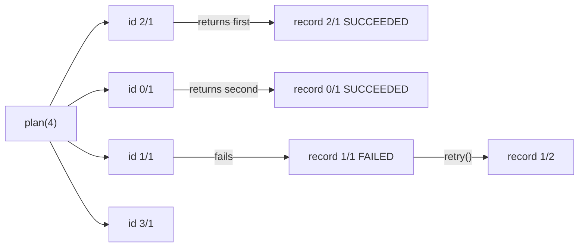
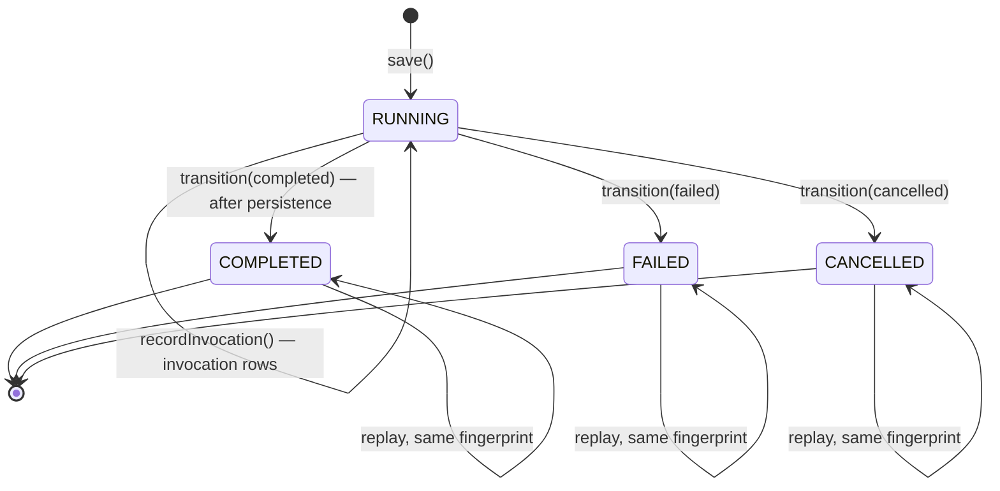

# Extraction runs: what produced a claim, recorded without holding what it read

An extraction run is the durable record of one execution: which profile, prompt, schema and
metamodel versions were in force, which revisions of which sources it read, what it asked a
model for, what the provider actually reported back, how far it got, and what went wrong. It
holds none of the material. No prompts, no source text, no responses, no user or session
objects, no provider SDK payloads, no extension maps.

This note covers DICE #67's value model and its store contract — the types in
`com.embabel.dice.proposition.extraction`, the lifecycle state machine that governs a run's status,
and the reads a store owes. The Drivine implementation, the proposition-to-run relation and the
wiring are separate slices.

## What a run holds

```mermaid
flowchart TD
    RUN["ExtractionRun<br/><i>keyed by (ContextId, ExtractionRunRef)</i>"]
    RUN --> LIN["ExtractionRunLineage<br/>run, root, parent, supersedes, pass"]
    RUN --> PROF["ExtractionContentProfileRef<br/><i>#66</i>"]
    RUN --> SRC["List&lt;SourceRevisionRef&gt;<br/><i>#64, ordered</i>"]
    RUN --> FP["ExtractionRunFingerprints<br/>prompt, schema, metamodel"]
    RUN --> RT["ExtractionRuntimeIdentity<br/>extractor, host, runtime"]
    RUN --> REQ["ExtractionRequestedModelConfig<br/><i>what was asked for</i>"]
    RUN --> SUBJ["ExtractionRunSubjectRefs<br/>actor, request, session,<br/>personalization, deployment"]
    RUN --> EXP["ExtractionExperimentRef<br/>ExtractionCohortRef"]
    RUN --> ST["ExtractionRunStatus<br/>ExtractionReplayFidelity<br/>ExtractionRunCounts"]
    RUN --> INV["List&lt;ExtractionInvocationRecord&gt;<br/><i>what was observed</i>"]
    RUN --> FAIL["List&lt;ExtractionFailure&gt;<br/><i>bounded, closed vocabulary</i>"]
    FAIL --> FV["ExtractionFailureCode<br/>ExtractionFailureStage<br/>ExtractionFailureMeasure"]
    INV --> IID["ExtractionInvocationId<br/>plan ordinal + attempt"]
    INV --> USE["ExtractionModelUsage"]
    INV --> PRF["ExtractionProviderResponseFacts"]
    SUBJ --> OP["ExtractionOpaqueRef<br/><i>bounded pseudonymous token</i>"]
    EXP --> OP
```

`ExtractionRunKey` is the tenant-qualified identity: a run id is host-minted and DICE never
assumes it is unique across tenants, so the `ContextId` travels with it. Two tenants that both
mint `run-1` have two runs.

## How a run joins to the metamodel

One field carries the join. `ExtractionRunFingerprints.metamodelFingerprint` holds the declared
schema's content hash — the `contentHash` a `MetamodelVersion` fingerprints itself with, which
`docs/design/metamodel-versioning.md` on the metamodel stack describes. DICE compares it and stores
it and reads nothing out of it, the same as the other two fingerprints.

The extraction coordinator writes it, and that coordinator is a later slice. It resolves the hash
from the host's `DeclaredSchemaSource` and stamps it once per run. Nothing in this slice produces
one, so a run built today carries whatever its caller passed.

The fingerprint says what the whole run ran under. A proposition's schema attribution is answered
through the run that produced it (`PRODUCED_BY_RUN`, the proposition-to-run relation a later slice
adds); the run record carries the declared schema's content hash, resolved by the extraction
coordinator from the host's `DeclaredSchemaSource`. That is why no per-proposition schema stamp
exists. A per-proposition denormalized copy is a coordinator concern for a slice whose reads demand
it.

## Requested and observed are different types

The single most useful thing a run can tell an incident is which of these two it is looking at:
the temperature the host asked for, or the temperature the provider used. A service can clamp a
temperature, ignore a top-k, cap max tokens below what was asked, and route to a different
checkpoint under a stable model name. None of that is visible to DICE, so a model that let one
field mean both would be inviting a false answer to the only question worth asking.

So the split is structural, not conventional:

| | Type | Lives on | Filled in by |
| --- | --- | --- | --- |
| Requested | `ExtractionRequestedModelConfig` | the run header | the host, before any call |
| Observed | `ExtractionInvocationRecord`, with `ExtractionModelUsage` and `ExtractionProviderResponseFacts` | one per attempt | whatever came back |

An invocation record has no field of the requested type, and the two share no property name — the
requested one is `requestedModel`, the reported one is `responseModel`. Both are asserted by test
rather than left to review: a mapper that copied one into the other would have to be written on
purpose.

The corollary is that an absent observed field stays absent. A run that asked for `model-large`
and got no model name back records a null `responseModel`, because telling "the provider did not
say" apart from "the provider said what we asked for" is the whole point of the field.

`ExtractionRequestedModelConfig` carries portable fields only: model and role, temperature, top-p,
top-k, max tokens, the two penalties, a thinking fingerprint, a selection fingerprint, and a
timeout. There is no provider extension object, no settings blob, no free map. That is where
credentials, system prompts and whole SDK request bodies get persisted by accident. A
provider-specific knob a host cares about is folded into one of the fingerprints — an opaque
digest DICE compares and never reads.

Ranges are checked where every provider agrees and left open where they do not. Temperature has no
upper bound because services differ on whether it stops at 1 or 2, and the penalties are only
required to be real numbers for the same reason. Rejecting a legitimate `2.0` would be DICE
deciding for a provider it never talks to.

## Invocation identity comes from the plan, never from completion

A run makes zero, one, or many model calls — chunking splits work, retries repeat it. Every
record needs an identity that a store can use as a deterministic child key, so that a retried
write lands on its own row and a replayed write upserts in place.

The identity is allocated when the call plan is laid out, before the first request goes out:

`invocationIndex` is the ordinal in the plan. `attempt` counts tries at that same call, from 1.
`retry()` carries the index forward, increments the attempt, and resets every observed field,
because those observations belonged to the attempt that just failed.

Timing on a record is an observation like any other and may be absent even on a terminal outcome. A
`SUCCEEDED` attempt with no `startedAt` means the clock was not recorded, not that the call did not
run; requiring timing would push callers to invent a duration, which is worse evidence than none.
The two checks a record can fail on its own terms do apply: a finish cannot precede its start, and
an `IN_FLIGHT` attempt has not finished.

Completion order writes into identities that already exist. There is no factory that takes a
position in a result list, and the run stores records in whatever order they arrived while
`invocationsInPlanOrder()` reads the plan back out. A run rejects two records with the same
`(invocationIndex, attempt)`.

## The root run reference, and why it is denormalized

`ExtractionRunLineage` carries four references: the run, its parent, what it supersedes, and its
root. Parent and supersession are separate axes — a parent is the run this one continues from, a
superseded run is one this one replaces — and a run can have one of each, both, or neither.

The root is redundant with the parent chain, and it is stored anyway. OpenLineage's
`ParentRunFacet` does the same: it carries an optional `root` alongside the immediate parent so
consumers do not have to walk the chain a hop at a time. Deep pass-and-retry chains are exactly
where walking hurts, and the audit projection reads lineage by run.

A denormalized field is only worth having if it cannot drift, so it is fixed at mint:

- a run with no parent is its own root;
- a run with a parent takes its parent's root, and therefore is not its own root;
- a run is neither its own parent nor its own supersession.

`ExtractionRunLineage.root(...)` and `.childOf(...)` do the arithmetic, and `childOf` defaults the
pass index to the parent's plus one.

**The constructor no longer takes a root a caller could get wrong.** A PR #95 review comment
pointed out that the old constructor took `rootRunRef` as an independent parameter: any non-self
value passed, whether or not it named the actual parent's root, and nothing checked it against the
parent. The constructor is now private and `copy()` follows it — `@ConsistentCopyVisibility` on
the class — so `root()` and `childOf()` are the only way in: `root()` sets the root to the run's
own ref, `childOf()` derives it from the actual parent lineage it is handed.

That closes the public API and stops there. Kotlin reflection can still call the private
constructor directly and hand it a root that contradicts the parent it names — the same route a
Jackson deserializer resolving a data class's primary constructor would take. Nothing serializes an
`ExtractionRunLineage` today, so this is a residual for whoever builds that wiring next. It is
written down here so it stays known: a future store slice reconstructing a lineage from stored
fields has to walk through `childOf()` with the parent's own lineage in hand; re-assembling
`rootRunRef` and `parentRunRef` from separate columns is the shortcut that closes. `ExtractionRunLineageTest`
pins both halves — that the public surface is closed, and that the reflective call still succeeds
and produces an inconsistent root.

What a value type cannot check is a cycle of length two or more: that needs the other runs, so
bounded cycle-safe traversal belongs to the store that walks the chains.

## The privacy contract

Five references say whose work a run was — actor, request, session, personalization, deployment —
and two more group runs for comparison: experiment and cohort. All seven are the same kind of
thing, `ExtractionOpaqueRef`: a bounded, host-minted token that DICE compares, stores, and never
parses.

What a host takes on when it mints one:

- it is a pseudonym, not an email address, a username, a phone number, a customer number or a name;
- it is not dereferenceable into anything sensitive — no URL, no signed link, no bearer token, no
  API key, no cookie value;
- it carries no authorization, and DICE never presents it to anything;
- it is stable enough to group by and cheap enough to rotate.

**What the type enforces, and what it cannot.** Construction bounds the length and restricts the
characters to `A-Z a-z 0-9 . _ : ~ -`. That excludes whitespace, control characters, `@`, `/` and
`\`, so an email address, a URL, a file path, a JSON fragment and a human name are all rejected
outright — the common shapes of a leaked identifier cannot be stored at all. It cannot tell a
pseudonym from a username: `jdunnam` and `55512345` both pass. The last mile is the host's, and
the KDoc says so in the same words rather than implying a guarantee the code does not make.

Two smaller things fall out of the same reasoning. A token's `toString` shows the first eight
characters, so a reference does not spread through logs in full. And a validation message names the
field and the length and never quotes the value — an `IllegalArgumentException` propagates into
logs, and the value that failed validation is exactly the one nobody vouched for.

### Failures speak a closed vocabulary

A failure record is a classified code, an optional stage, an optional provider status, an optional
number with its unit, a timestamp, and the attempt it belongs to. The run holds at most 64 of them.
There is no text field anywhere in that list.

Failure records are where source text leaks. A provider quotes the prompt back in its exception
message; a decode error carries the fragment it choked on. Both land in a stored run header the
moment someone writes `e.message` into a text field. A #95 review comment found that the earlier
shape — a code plus a bounded, whitespace-flattened `detail` string — closed nothing: truncating a
prompt still stores a prompt, and a credential, an email address or a paragraph of protected text
all fit in 512 characters. The vocabulary closes it at construction. `ExtractionFailure` has no
`String` parameter, property or field, and no factory that takes a `Throwable`, so free text has no
route into durable storage through this type.

What the vocabulary carries:

| Field | Type | Answers |
| --- | --- | --- |
| `code` | `ExtractionFailureCode` (11 values) | what went wrong |
| `stage` | `ExtractionFailureStage` (10 values) | where in the run's work |
| `providerStatus` | `Int?`, 100..599 | what the provider returned |
| `measure` | `ExtractionFailureMeasure` | one "how much", with its unit |
| `invocation` | `ExtractionInvocationId?` | which call and which attempt |

`ExtractionFailureMeasure` pairs a number with an `ExtractionFailureQuantity` naming both the thing
and its unit — `TOKEN_COUNT`, `ELAPSED_MILLIS`, `RETRY_AFTER_SECONDS`. A bare number on a failure
record is a unit-mismatch bug waiting to happen, and pairing them in a type means 4096 can never be
recorded without saying it is tokens. One measure per record: a failure answers one "how much".

"Chunk 3 of 12 exceeded the token budget" survives the change, said in the vocabulary — the chunk
is `invocation.invocationIndex`, which the call plan already allocated, and the budget is a
`TOKEN_COUNT` measure. What is lost is the sentence, which is the part nobody could vouch for.

A host that wants the exception message, the response body, or the fragment that failed to parse
keeps that material itself. `ProtectedContentRef` is the written contract for the reference such a
host passes around; see below.

The tests match what is enforced. `ExtractionFailureVocabularyTest` takes four kinds of text a
reviewer named — raw source text, a prompt fragment, an email address, and two credential shapes a
scanner recognises — and asserts no constructor, factory or method on the type will take any of
them, that no type a failure reaches has a text field, and that every value a fully populated
failure holds is an enum, a number or an instant. The privacy suite still feeds a fixture with
known source text (a person, an organisation, an email address, a case number) through a
provider-shaped exception that quotes it, and asserts a full field-by-field dump of the populated
run contains none of its fragments, no address shape, no link shape, and no long digit run. The
dump is reflective, so a field the summary omits is still covered — and
`run.toString()` gets its own check that it shows identity, state and sizes and none of the tokens,
digests or failure fields.

### The protected reference is a specification

`ProtectedContentRef` is an interface with two members — an opaque `handle` and an `expiresAt` —
and no implementation anywhere in DICE. It is the written contract for a host that keeps detailed
failure material of its own.

The host owns all three jobs. The **writer** is host code, because DICE never sees the material.
The **reader** is host code, because resolving a handle is a host operation under the host's access
rules; the handle names a row in the host's vault and grants no access to it, so a signed URL, a
bearer token or a decryption key breaks the contract. **Retention** is the host's, and `expiresAt`
is where the host writes it down — nothing in DICE sweeps, deletes, or checks it, and an erasure
request reaches the material through the host's vault.

A type of this name shipped in an earlier #98 draft as a stored value and was deleted during
review, because nothing attached it to a run and DICE had no writer, no reader and no retention
behaviour behind it. It returns as specification only, which is what it always was. The KDoc
carries a worked example: a host minting a handle, writing an exception message into its own vault
under it for ninety days, and running its own nightly retention job. A test asserts the interface
is abstract and that no compiled DICE class mentions the type, so "zero implementations, zero
production references" is a checked property.

## Replay is approximate, and named that way

`ExtractionReplayFidelity` has three values: `NONE`, `METADATA`, `APPROXIMATE`. The strongest one
is still approximate, and `strongest()` returns it so the honesty of the claim survives someone
appending a value later.

There is no value meaning "run this again and get the same output". A hosted model can change
weights, quantization, routing, safety filtering and system instructions under a stable model
name, none of it visible to DICE. Temperature zero narrows the distribution and does not remove
batching and floating-point nondeterminism. The field says what the *record* supports — nothing
recorded, identities and fingerprints only, or those plus the requested configuration — and makes
no promise about the provider. Host replay policy stays the host's.

## The lifecycle state machine

`ExtractionRunStatus` is `RUNNING`, `COMPLETED`, `FAILED`, `CANCELLED`. A run starts running and
ends in one of the other three. There are no other edges: a terminal run never re-opens, and it
never moves from one terminal state to another.

The two write methods split along that line, and the split is what makes the `COMPLETED` rule
enforceable rather than advisory. `ExtractionRunStore.save` rejects any status other than `RUNNING`,
so a terminal status cannot enter through the door that also accepts new keys.
`ExtractionRunStore.transition` is the only writer of a terminal status, and it is compare-and-set:
it moves a run out of `RUNNING` or it does nothing.

`ExtractionRun` itself still checks only that a finish does not precede a start. The value type does
not half-encode the machine; a terminal status with no finish time is constructible there and is
rejected here, where the rule is defined once.

### What `COMPLETED` asserts, and who may write it

Every product the run's request called for is either durably persisted or terminally disposed.

The store cannot check that — it holds run headers, not products. So it does the next best thing and
makes the claim reachable through one narrow call whose precondition is written down: on the legacy
path the coordinator calls it once `persistAndProject` has returned, and on the #68 commit path the
commit transaction calls it, and only the commit whose cumulative outcomes bring every requested
product to persisted or terminally disposed.

Three consequences follow, and each is a test:

- a run whose persistence never finished stays `RUNNING` and is retryable under compare-and-set;
- a commit that persists some products and leaves others outstanding leaves the run `RUNNING`, so a
  terminal run never has re-committable products behind it;
- a run with zero products completes vacuously — there was nothing to persist, so the coverage claim
  holds.

`FAILED` and `CANCELLED` carry no such precondition. A run that could not finish, or that was
stopped, terminalizes whether or not anything was persisted. `CANCELLED` is also the abandonment
path for a partially successful run nobody intends to finish: its outstanding products stay
outstanding behind it, and recovery goes through a new run linked by parent or superseded reference.

A `FAILED` transition need not carry a failure. A run can stop on something the coordinator
classifies at the run level with no per-attempt detail, and requiring the pairing would make an
honest "we know it failed and not why" unrecordable. A `COMPLETED` transition may carry failures for
the same reason from the other side: a run that retried past a failed attempt and finished still
happened.

### Deriving the terminal run

`ExtractionRun` publishes no `withStatus`, no `finished()` and no `copy`.
`ExtractionRunTransition.applyTo` is the only place a terminal run is derived. Other code re-lists
the run's eighteen constructor arguments — `InMemoryExtractionRunStore` does it to add a child
record or move the header version — but nothing else produces a run in a terminal state.

A transition carries exactly the fields the lifecycle owns: the terminal status, the finish instant,
and optionally the final counts and failures. Everything else is carried across unchanged, including
the header version, and a test asserts that component by component. The alternative — public
mutators on the run — would put the state machine in two places and let anything in the codebase
manufacture a `COMPLETED` run without going near a store. `ExtractionRunLifecycleTest` pins
`applyTo` directly, in `dice`; the cross-backend suite pins the same promise through a store's
`transition()`, which is what a backend that maps rows in and out of its own storage actually has to
get right — `a terminal write through the store preserves every field it does not own, header
version included` and `null counts and failures on a transition keep what the stored run held, and
values replace them`.

`counts` and `failures` are nullable and follow one rule: null keeps what the run recorded, a value
replaces it. An empty failure list is a value. That distinction reaches the fingerprint, so
"leave the counts alone" and "these counts are final" are two different terminal writes even when
they land on the same numbers.

Invocation records do not travel on a transition. They arrive through `recordInvocation` while the
run is still running, keyed by `(invocationIndex, attempt)`, and a terminal run takes no more —
a finished run's invocation list is part of how it finished.

### `recordInvocation` is the only door onto invocation state

`save` writes header fields only. It never creates, updates or deletes an invocation row, whatever
`ExtractionRun.invocations` holds on the run it is handed — that field is not written anywhere by
`save`, and it plays no part in what `save` accepts, rejects, or replays as a no-op. Every
invocation write goes through `recordInvocation`, keyed by the record's own `(invocationIndex,
attempt)`, insert-or-compare on that key alone.

This was not the original design. An earlier version had `save` merge the invocation records it was
handed into the ones already stored, by identity, so a header update built on a run read before an
attempt was recorded would not silently drop that attempt. See
["Why the store uses compare-and-set" below](#why-the-store-uses-compare-and-set) for why that
shared-generation merge produced exactly the defect it was meant to prevent, and why the fix gives
invocation rows their own door and their own key, with compare-and-set scoped to that key alone.

### Invocation records are locked once terminal

A record for an id already stored, and still `IN_FLIGHT`, updates in place — that is how dispatch
details and, eventually, the terminal outcome fill in as an attempt runs. Once the stored record is
terminal it is locked: an incoming record for that id is accepted only when it equals the stored
one exactly (an identical retry replays as a no-op), and every other write for that id is rejected
with `ExtractionRunConflictException`. A different outcome is the
case the review comment named — a delayed `IN_FLIGHT` message arriving after the attempt already
succeeded or failed, from a dispatcher's own retry timer firing late or two writers racing on the
same attempt, which would otherwise put a finished attempt back to outstanding and erase the record
of how it ended. The same-outcome case is narrower and easy to miss: a delayed write that repeats
the correct terminal outcome but carries different timing, usage or provider facts than the write
that actually landed first — accepting it as an in-place update would erase those facts just as
surely, under an outcome that never changed. Locking the whole record closes both cases; a lock
scoped to the outcome field alone would still miss the second. This is the same category of harm
`transition` refuses at the run level: a late or duplicated writer silently rewriting how something
ended. Because `save` never reaches this state, a stale header snapshot cannot be the write that
puts a terminal record back to outstanding or erases its facts — only another `recordInvocation`
call can, and the lock decides it the same way regardless of how old the caller's own copy of the
run is.

A record accepted as an identical replay lands back at the position the stored record already held. `ExtractionRun.equals` compares `invocations` by position, so an
identical resend that moved to the end would read as a change even though nothing about the run
actually differs, which would either bump a header save's version on a no-op or turn a stale but
otherwise identical resend into a rejection the store promises everywhere else not to raise. Only a
genuinely new id is appended.

In the cross-backend suite: `a delayed IN_FLIGHT write does not replace a terminal record for the
same attempt`, `a same-outcome write that differs from a terminal record is rejected too`,
`repeating the same terminal invocation write is idempotent`, and `a terminal record's identical
replay through recordInvocation lands back at its stored position` pin the lock and the
position-preserving replace. `an in-flight record updates in place, and a terminal one accepts only
an identical replay`, in `dice`'s own `ExtractionRunStoreReadsTest`, pins the
retry-lands-on-its-own-record half alongside the lock. The in-place half of the rule — an
identical replay is one shape of accepted write, and a genuinely changed `IN_FLIGHT` write is
another, and a reader sees its new content afterward — is pinned by `a changed IN_FLIGHT record
updates in place through recordInvocation, clearing an omitted fact`, which names a fact on the
first write that the second write omits and reads the result back through `invocationsOf`, a read
against the store's own storage, independent of the object the write call happens to return. A
field-merging backend keeps the omitted fact; only whole-record replacement clears it, and only
that independent read can tell the two apart.

`a header save embedding a brand-new invocation never creates the row`, `a header save embedding a
changed invocation never updates the stored row` and `a header save embedding an empty invocation
list never deletes a stored row` pin the three shapes of "`save` does not touch this state" — a save
cannot originate a row, cannot update one, and cannot remove one, however its own `invocations`
field is populated. `a stale header save carrying an old invocation snapshot leaves the newer
stored invocation intact` is the case the finding named directly: a caller's header save, built on
a run read before a later `recordInvocation` call landed, still names the version currently stored
— `recordInvocation` never moves it — and is accepted as a genuine header change, carrying a stale
invocation snapshot along for a ride the store no longer takes. `two concurrent IN_FLIGHT writers
on different attempts both land, losing neither` is the concurrent form of the same guarantee: two
attempts contend for nothing, because each is decided on its own key and neither touches a shared
header generation.

### Idempotency: insert-or-compare, never overwrite

Every terminal write carries a fingerprint of its payload. A store records the fingerprint of the
write that terminalized a run, and a second write against that run is decided by comparison:

| Second write | Result |
| --- | --- |
| same fingerprint | replays as success, `REPLAYED`, changes nothing |
| different fingerprint | `ExtractionRunConflictException` |
| any `save` | `ExtractionRunConflictException` — a terminal run is not re-openable |

DICE's existing `MERGE … SET` stores upsert by overwriting. That is safe for a record still being
written and wrong for one that is finished: it would let a late or duplicated writer silently
rewrite how a run ended, and the audit would carry the last write rather than the true one. No
method on this contract overwrites a terminal run.

The fingerprint covers the terminal write and not the run. A coordinator that recorded another
attempt between a terminal write it never saw the answer to and its retry made the same terminal
write both times, and folding the run's invocation list in would turn that correct retry into a
rejected conflict.

`save` is the one method that updates in place, and only on a run that is still running. Even there
it is fenced four ways:

- it rejects any status but `RUNNING`, so a terminal status cannot enter through it;
- it rejects a `RUNNING` run carrying a `finishedAt`. `ExtractionRun` deliberately leaves
  status-and-timing pairing to this state machine, and a record that reads as running and as
  finished at once makes every page and audit meeting it guess which;
- it rejects a save disagreeing with the stored lineage or start time — a different run wearing the
  same id. The tenant cannot disagree, since it is half of the key;
- it compares `ExtractionRun.version` before it accepts anything else about the header. A save
  names the version it was read at; the store accepts the write only when that matches the version
  currently stored, and rejects it with `ExtractionRunConflictException` otherwise, naming both
  versions so the caller knows to read the run again and rebuild its update. A save whose header
  content is identical to what is already stored replays as a no-op regardless of the version it
  names — `a save whose content already matches what is stored replays as a no-op at a stale
  version` pins that — the same idempotent-retry courtesy `transition` gives a terminal write. The
  version names the CAS generation the header is currently at: a run that has never been saved, and
  the run its first accepted save produces, both carry `0`, because
  that first save inserts the row and there is no earlier generation for it to raise past, and a
  first save naming any other value is rejected before it reaches the store — `a first save must
  name version 0` pins the rejection and confirms nothing was written. Each later save that actually
  changes the header raises the generation by one; a no-op replay is accepted too, and leaves the
  generation exactly where it stood — `a save whose content already matches what is stored replays
  as a no-op at a stale version` pins that half specifically. `recordInvocation` never moves it, so a
  save built on the header as it stood before an attempt was recorded still names the current
  version and is accepted; the attempt survives because save does not touch invocation rows at all.
  `recording an invocation does not move the header version` pins that in the cross-backend suite.

`save` leaves invocation records alone entirely: it does not read or write invocation rows, so it
cannot delete one, put one back to `IN_FLIGHT`, create one, or update one. Records live under
`recordInvocation`'s own key, with their own lifecycle, entirely independent of the header's
version; see ["`recordInvocation` is the only door onto invocation
state"](#recordinvocation-is-the-only-door-onto-invocation-state) above for what that closes.

#### Why the store uses compare-and-set

The first version of this rule tried the other approach: keep the version field off `ExtractionRun`
entirely and merge two writers' headers field by field instead, letting each save keep whatever
part of the header the other did not touch. It looked smaller, and it was wrong in three
independent ways that a review round found:

- **Counts cannot be merged by taking the larger reading.** Two writers can each account for
  disjoint work — one processed five items, the other seven, and the run really got through twelve
  — and there is no way for the store to tell that case apart from one writer's stale re-report of
  work the other writer's higher count already covers. Taking the larger number is correct in the
  second case and silently drops five items' worth of work in the first. Rejecting the stale write
  and letting the caller re-read and add its own new count to what is now stored gets the right
  total in both cases, because the caller — not the store — knows which one it is in.
- **A union of source revisions loses the order they were read in**, which is the field's own
  documented meaning. Appending a slower writer's unseen revisions after the ones already stored can
  put a source that was read first after one that was read later, if the first writer saved last.
- **A merge assembled from two different writers' saves is a header no writer ever held.** A
  fingerprint from one save could sit beside a replay fidelity from another that fingerprint does
  not support, misstating how much of the run could be set up again from what it recorded.

Compare-and-set does not have any of these problems, because it never combines two writers' data —
either a save is building on the freshest header, and it replaces the whole thing, or it is stale
and is rejected outright. `a stale header save is rejected, and the header it read is left in
place` and `an accepted header save replaces the whole header at once` are in the cross-backend
suite.

**A second version of this rule kept the version field but still had `save` merge invocation
records by identity, and a review round found that merge reintroduced the same defect one layer
down.** Versioning the header protects the header; it does nothing for a row `save` folds in from
the run it was handed, because `recordInvocation` never advances the header's version. A header
save built well before a `recordInvocation` call landed could still name the version currently
stored — nothing about that version had moved — and be accepted as a genuine header change, carrying
a stale invocation snapshot in on the same write. That snapshot could silently replace `IN_FLIGHT`
dispatch details, or a terminal outcome, the later `recordInvocation` call had already settled, with
no conflict raised on either side: the header's CAS check saw a real change and let it through, and
the merge's own terminal lock only compared the stale snapshot against what was stored at write
time, which was already the newer value. Two independent header writers, each merging an attempt
recorded before the other's read, could lose each other's facts the same way. The header's
generation cannot fence state that recording an attempt does not move it for — which is exactly
what the finding on PR #98 named. The fix removes the merge and gives invocation rows their own
key and their own compare-and-set, entirely off the header's generation. Run state is accumulative
the way lineage systems such as OpenLineage model a run: independent writers contribute rows, and
no write rewrites a row another writer owns.

**Replay needs the identical payload, finish time included.** A coordinator retrying after a crash
it never saw the answer to must reuse the transition it built the first time, or read the run back
with `findRun` and stop if it has already ended. Minting a fresh `finishedAt` on the retry produces
a different fingerprint, which is an incompatible rewrite and is rejected. That is safe and it is
the opposite of what a caller expecting idempotency would predict, so it is a constraint the wiring
slice designs its retry path around, the same way it has to around start times on `save`.

#### The canonical encoding, and the RFC 8785 failure modes

RFC 8785 exists because naive JSON serialization is not byte-stable. Three failure modes, each of
which would surface here as a correct retry being rejected as an incompatible rewrite: **key order**
(most serializers emit fields in declaration or reflection order, neither guaranteed stable),
**number rendering** (the same value serializing as `1`, `1.0` or `1e0`, and floating-point
round-tripping differing between implementations), and **insignificant text** (whitespace, escaping,
Unicode normalization).

The encoding is the one DICE already uses for `MetamodelVersion.contentHash`, applied to a different
payload:

- every token is length-prefixed, `<length>:<token>`, because a delimiter-joined encoding lets
  `["a;b"]` and `["a", "b"]` hash the same, and a length prefix keeps two tokens apart whatever
  characters either one carries;
- every collection is preceded by its element count, so a shorter list cannot be a prefix of a
  longer one;
- fields are emitted as `(name, value)` pairs sorted by name;
- a collection whose order carries no meaning is sorted, which is what makes two coordinators
  recording the same failures in a different order the same terminal write — the order is Kotlin's
  natural `String` order, comparing UTF-16 code units, not UTF-8 byte order and not a locale
  collation, and it is named because a backend re-implementing the sort in a query would pick a
  different one and get a different digest;
- instants render as `<epochSecond>.<nanos padded to 9>` — fixed width, and independent of
  `java.time`'s own formatting, whose precision varies with the value;
- absent is its own marker, so null and empty stay distinguishable;
- SHA-256, lowercase hex, with a version tag on the input so a reader meeting a version it does not
  know matches nothing rather than guessing.

This is a persisted format. `ExtractionRunFingerprintTest` pins the digest of a fixed payload with a
literal assertion, so changing the encoding means changing that literal deliberately.

**A store records the string the transition computed and never re-derives it.** That is what makes
the encoding's finer points — which sort order, how an instant renders — unable to cause a
cross-backend divergence: only one implementation ever runs. A backend that re-derived the digest
from the stored run in Cypher would also break the payload-only rule above, and
`a replay after an interleaved invocation record is still a replay` in the cross-backend suite is
the case that catches it.

#### Two mechanisms deliberately not adopted

**No epoch or writer generation.** Kafka's transactional producer bumps a monotonic epoch on every
`initTransactions()` and fences zombie writers with it, because a bare identity key cannot tell the
same logical writer retrying from an old instance that should be shut out. DICE's concurrency is two
writers racing on one row, which the compare-and-set inside a single store transaction already
decides. Epochs solve fencing across systems; this contract does not span systems.

**No idempotency-key expiry.** Stripe prunes idempotency records after roughly 24 hours, and a
pruned key starts a fresh request with no comparison. A run header is a permanent audit row, so the
equivalent here would delete the evidence rather than the bookkeeping.

### Four states, not five

MLflow's run status has five values — `RUNNING`, `SCHEDULED`, `FINISHED`, `FAILED`, `KILLED`.
The two DICE does not have are deliberate:

- **`SCHEDULED`** has no writer. There is no scheduler in this design, so nothing can observe a run
  between "requested" and "started"; the state would be defined and never used.
- **`KILLED`** folds into `CANCELLED`. The fact an operator or an audit acts on is that the run
  stopped short of its products, and that is the same fact whichever side pressed stop. `CANCELLED`
  is also the abandonment path for a partially successful run nobody intends to finish.

## The store contract: every read tenant-scoped and bounded

A run store grows once per extraction forever, so there is no unbounded read on
`ExtractionRunStore`. Every page takes a positive `limit`, and the reads that can span a long
history also take a `since` window.

| Read | Answers |
| --- | --- |
| `findRun(key)` | one run, by tenant-qualified identity |
| `invocationsOf(key)` | that run's attempts, in plan order |
| `runsInContext(tenant, limit, since)` | one tenant's runs, newest first |
| `childrenOf(tenant, parent, limit)` | one hop down the parent axis |
| `runsOfRoot(tenant, root, limit, since)` | a whole lineage, in one read |
| `ancestorsOf(key, limit)` | the parent chain, walked upward |

**Scope is pushed down, never applied afterwards.** An implementation restricts to the tenant inside
the query and then limits. Fetching `limit` rows and filtering by tenant afterwards returns fewer
rows than asked for — or none — whenever a busy neighbouring tenant occupies the head of the index,
and the caller cannot tell that from a tenant with no runs. This is the drift-report store's rule
carried over, and it is why none of the scoped reads has a default body: a default that filtered in
memory would be inherited silently by every backend that forgot to override it.

The `ContextId`-typed overloads do have default bodies and are a different thing — they forward to
the `String`-typed method that is the override point, and cannot return the wrong rows because they
do not filter. The split exists because `ContextId` is a Kotlin value class, so a method taking one
compiles to a mangled JVM name Java cannot reach. `ExtractionRunKey.of(contextIdValue, runId)`
exists for the same reason.

**Pages are ordered newest first by start time, tie-broken by run id ascending.** The tie-break is
what makes a page repeatable: two runs started in the same millisecond would otherwise come back in
whatever order the backend felt like, and a caller paging through would see one twice or neither.

**Cross-tenant reads fail closed.** A run id that exists in two tenants is two runs, and a read
against one never returns the other's. The chain walk stops rather than crossing: a parent reference
that resolves only in another tenant is treated as unresolved. Slice 8 proves this against a real
graph; here it is what every implementation is held to.

**The chain walk is bounded and cycle-safe, and needs to be both.** `limit` stops it in a lineage
deeper than the caller wants to read. A run already visited stops it outright: a value type can
reject a run that is its own parent, but a two-hop cycle needs the other runs to see, so detecting
one is the store's job. A store holding a cycle is corrupt, and a store that hangs on one is worse.

`runsOfRoot` is the read the denormalized root reference exists for. The root is fixed when a
lineage is minted and cannot drift, so a whole lineage is one indexed read on one property rather
than a chain walk a hop at a time.

`InMemoryExtractionRunStore` is the reference implementation, and it is in main sources rather than
test sources for the same reason `InMemoryCollectorTraceStore` is: a host can record and read runs
before it has a database. It therefore has no unscoped read at all, not even a test helper: one
instance holds every tenant's runs, so an "everything in the store" method would hand a host running
the shipped backend a cross-tenant unbounded read on a contract that is neither. The tests read
through the contract like any other caller.

Compare-and-set is real there, not simulated — every write and read runs inside one monitor, so the
read of a run's status and the write that changes it cannot interleave. A durable store gets the
same guarantee from its transaction, and the cross-backend suite races two threads to end one run
and asserts exactly one `APPLIED` and one `REPLAYED`, so the claim is inherited rather than
remembered. Removing the monitor from `transition` fails that test and nothing else.

`AbstractExtractionRunStoreContractTest` in `dice-storage` is the cross-backend suite. Each backend
supplies a store and inherits the whole thing, so the Drivine store is held to the in-memory
reference's semantics at authoring time. The cases there are the ones a durable backend gets wrong
in a way a single-backend test would miss: a `MERGE … SET` upsert passes "a terminal write is
recorded" and fails "an incompatible terminal rewrite is rejected", a finder that filters in memory
passes every single-tenant read and fails "a page scopes before it limits", and a chain walk written
as a recursive Cypher pattern passes on a healthy graph and hangs on a cycle.

## OpenTelemetry GenAI naming, not adopted

OTel's GenAI semantic conventions cover the same ground — `gen_ai.request.*`, `gen_ai.response.*`,
`gen_ai.usage.*`, and an opt-in-only gate on content capture that matches this model's
"no payloads by default" stance almost exactly. The field names are still not adopted, for one
reason: as of mid-2026 every `gen_ai.*` attribute is at stability level Development, and in June
2026 the conventions were moved out of the main semantic-conventions repository into a dedicated
one. Pinning a stored schema to names that are still moving buys interop now and a migration later.

The structural agreement is worth keeping in view. A future OTel-compatible export is a mapping
from these types onto whatever the conventions stabilise as, and this model has a field for each
of the ones that matter. That is a better position than having adopted a naming that then changed.

## The cap rule

Most strings a run stores are bounded: the bound is a named constant on `ExtractionRunLimits`, the
check runs in the `init` block of the type that owns the value, and anything over the bound is
**rejected**. Truncating an identifier would be worse than rejecting it: a shortened id is a
different id, and a store would then key rows on a value the caller never minted.

| Constant | Value | Applies to |
| --- | --- | --- |
| `MAX_IDENTIFIER_LENGTH` | 256 | opaque tokens, fingerprints, model and role names, service names, provider response ids, runtime identifiers |
| `MIN_PROVIDER_STATUS` / `MAX_PROVIDER_STATUS` | 100 / 599 | the status a failure records |
| `MAX_SOURCE_REVISIONS` | 256 | source revisions per run |
| `MAX_INVOCATIONS` | 1024 | invocation records per run, across every call and attempt |
| `MAX_FAILURES` | 64 | failure records per run |

The rule has no exception now that the model has no free-text field for one to apply to. The
failure detail used to be one, clipped by its factories on the way in; the closed vocabulary
removed the field and the exception with it.

Lengths count UTF-16 chars, so a 256-char identifier can be around 1 KB of UTF-8. The bound exists
to keep a run header finite.

`sourceKey` and `sourceRevision` are not part of the cap rule and carry no bound on `ExtractionRun`.
A revision's contract is defined where the type lives —
[docs/design/source-revisions.md](source-revisions.md): opaque, compared for exact equality, never
parsed, and bounded once by `SourceIdentityBounds` in `SourceRevisionRef`'s own constructor. A PR
#95 review comment caught `ExtractionRun` adding a second length cap on top of that contract, so a
revision an earlier query accepted could still fail run recording; the fix deletes the run's cap and
leaves the one on the type that owns the value. A run records whatever a `SourceRevisionRef` can
hold, which is the property that makes "accepted by a query, therefore recordable" true.

One string sits outside the rule and stays outside it: `ContextId.value`, the tenant, which is
validated non-blank and not bounded. `ContextId` is a DICE-wide type owned by the agent framework,
so bounding it is not this model's call. It is worth naming because the tenant is half of
`ExtractionRunKey`, so the run store's key is bounded on one side only — whoever sizes that key's
index in the store slice decides what to do about the other side.

Two bounds are enforced away from the field they protect, because the field is not where the cost
lands. `ExtractionInvocationRecord.plan(count)` checks `MAX_INVOCATIONS` against the count before
allocating anything: a plan size derived from chunking a large document can be enormous, and
learning that from the run's own bound would mean building the whole list first. And a run rejects
a failure whose `invocation` names an identity it holds no record of — a dangling reference reads
as evidence about a call and nothing can join it to one, so the pair arrives together or not at
all. A failure that happened outside any model call names no invocation and is always accepted.

## Value-type discipline

Everything here is immutable and validated in `init`, with `@JvmStatic`/`@JvmOverloads` factories
on the types that have optional parameters.

`ExtractionRun` is a plain class, for two reasons. A data class has
to declare its collection parameters as properties, which means the field *is* the caller's list
and there is nowhere to copy it. And a generated `copy`/`componentN` surface would pin an ABI
across eighteen fields while #67 is still moving. Equality and hash are written out over every
component, and a test varies each of the eighteen in turn, so a component dropped from `equals`
makes that test fail.

Collections are copied on the way in **unconditionally**, empty ones included. A copy skipped when
the list is empty leaves the run aliasing a list the caller still holds, and the caller fills it
afterwards; it fails later and stranger than the non-empty case. The copies are unmodifiable, so
the list a caller reads back cannot be edited either.

## Status: EXPERIMENTAL

Every type in this slice carries `@ApiStatus.Experimental`, the marker DICE already uses for API
that may still move, and a test reads the class files to assert none was missed. The KDoc on each
type says the same in words and the CHANGELOG entry is labelled.

As with #66, a Kotlin `@RequiresOptIn` marker would make the status enforceable at the call site
rather than advisory. DICE defines none today, and inventing one is a decision about the whole
public surface.

## What is not here yet

- **No durable store.** `InMemoryExtractionRunStore` is the only implementation. The Drivine store
  — the tenant-qualified natural key, the deterministic child key for invocation records, the
  uniqueness constraints, and the Cypher that scopes before it limits — is the next slice.
- **No coordinator.** Nothing constructs an `ExtractionRun` during extraction yet, and nothing calls
  `save` or `transition` outside tests. Which means the `COMPLETED` precondition is documented and
  structurally narrowed, not observed: the wiring slice is where "the coordinator really does wait
  for `persistAndProject`" becomes a test rather than a contract clause.
- **No proposition-to-run relation.** Attribution from a claim to the runs that produced or
  confirmed it is its own slice, on canonical saved ids, and run identity stays out of
  source-provenance equality.
- **No protected-content reference type.** A first cut (`ProtectedContentRef`,
  `ProtectedContentClassification`, `ProtectedContentHandle`) landed and was removed again: nothing
  in DICE attached one to an `ExtractionRun`, read one, or enforced its retention, so it was a shape
  with no runtime path exercising it. It returns with the first runtime path that needs it — a
  writer, a reader, or retention behaviour. A value type with no consumer does not stay on the
  branch.
- **No per-invocation requested configuration.** The requested configuration is one record on the
  run header. A later slice that needs to vary settings per call adds a separate requested record
  keyed by invocation index rather than a field on the observed record, which would collapse the
  distinction this model exists to draw.
