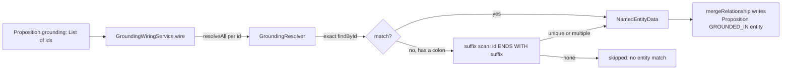
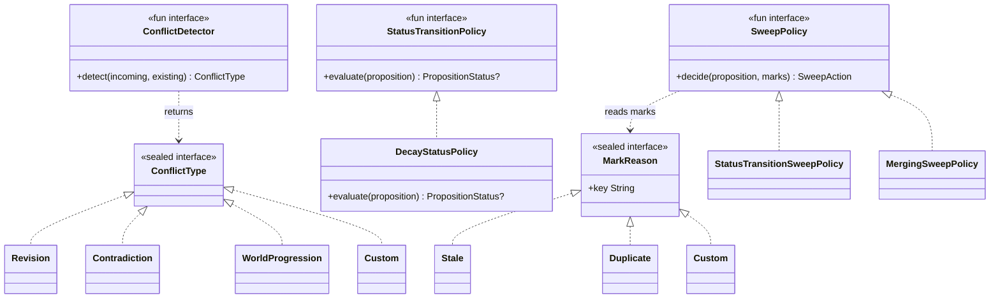
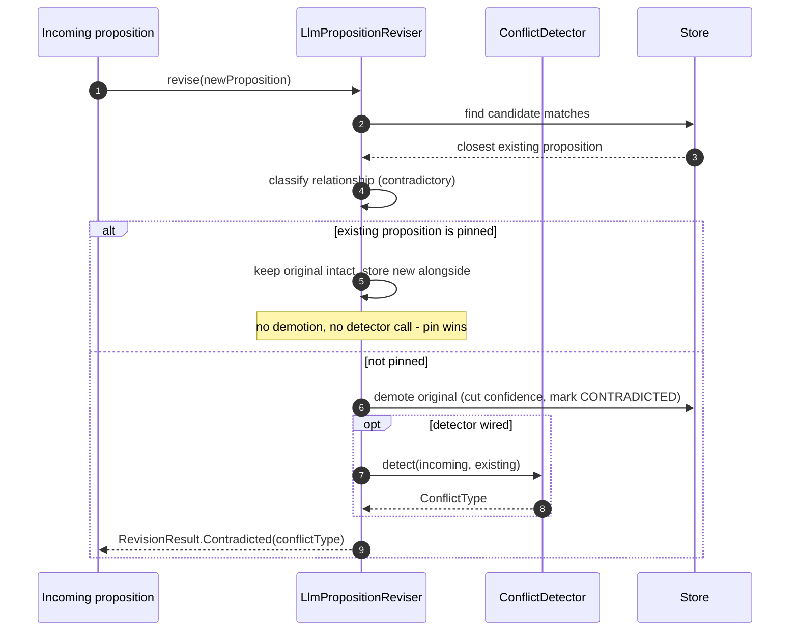

# Grounding and conflict/SPI: how facts stay anchored and how clashes get resolved

Two mechanisms gate whether a proposition can be trusted: **grounding** ties it back to the
source material it came from, and the **conflict/policy SPI** decides what happens when two
propositions disagree. This doc covers the interfaces those two mechanisms expose and how to use
them (see the best-practices summary at the end for the short version); for the broader lifecycle
they participate in — why CONTRADICTED and SUPERSEDED are different, why decay doesn't delete —
see [proposition-lifecycle](proposition-lifecycle.md).

## Grounding: evidence linking a proposition to its sources

A `Proposition.grounding` field is a `List<String>` of ids — the extractor's claim about
which source entities back this fact. On its own that's just strings sitting on the
proposition; nothing forces them to resolve to anything real. Two collaborators turn that
claim into an actual, queryable graph edge:

- **`GroundingResolver`** (`dice/src/main/kotlin/com/embabel/dice/projection/grounding/GroundingResolver.kt`)
  is the single, pluggable definition of what a grounding id *means* — given a grounding id,
  which stored entity node(s) does it refer to? This exists so the resolution rule lives in
  exactly one place instead of being reimplemented (inconsistently) by every caller that
  needs to go from a grounding string to a node.
- **`GroundingWiringService`** (`dice/src/main/kotlin/com/embabel/dice/projection/grounding/GroundingWiringService.kt`)
  is the writer: it walks a batch of propositions, resolves each grounding id via a
  `GroundingResolver`, and materializes a `(:Proposition)-[:GROUNDED_IN]->(:<entity>)` edge for
  every hit.

Why split resolution from writing? Because "what does this id mean" and "what do I do once I
know" are different concerns with different failure modes — the resolver can be tested and
reused (by the wiring service *and* by source-text readers) without dragging in graph-write
side effects.

### The resolution convention

A grounding id is either the full node id (`email:<user>:<hash>`) or a namespace-stripped
form (`email:<hash>`) that some extractors stamp. `DefaultGroundingResolver`
(`dice/src/main/kotlin/com/embabel/dice/projection/grounding/DefaultGroundingResolver.kt`)
resolves it in two steps:

1. **Exact** — `findById(groundingId)`. Most groundings hit here.
2. **Namespace suffix** — on a miss, match any entity whose id ends with the grounding id's
   trailing segment (everything after the first `:`). This bridges `email:<hash>` grounding
   to the stored `email:<user>:<hash>` node, mirroring how source-text readers have always
   matched (`n.id ENDS WITH <suffix>`).

A grounding id with no `:` (a bare chunk hash or free-text fingerprint) only ever matches
exactly — legacy chunk ids stay unresolved and edge-free, exactly as before this resolver
existed.



**A single best match vs. all matches.** `GroundingResolver` exposes two methods for
different callers: `resolveAll` returns every entity a grounding id resolves to (a
proposition grounded in several sources legitimately backs several nodes — the wiring
service uses this to write one edge per match), while `resolve` returns a single best
match — the exact hit, or the unique suffix match — and returns `null` on ambiguity rather
than guessing. **An ambiguous match is never silently collapsed to an arbitrary node.**
Callers that need one canonical entity (not a fan-out of edges) use `resolve`.

**Endpoint identity matters.** The wiring service always writes the edge using the
*resolved* node's real id, never the raw grounding string — a stripped id used directly as
an endpoint would `MERGE`-create a phantom bare `{id}` node instead of attaching to the real
one. This is the kind of bug that's invisible in a unit test with one entity and only shows
up once you have a namespace-suffix grounding pointed at a real, differently-shaped stored
id — which is exactly the resolver's reason to exist as a shared interface rather than duplicated
`ENDS WITH` logic per call site.

**Backward compatible, best-effort.** `Proposition.grounding` is unchanged, still a
`List<String>`. Ids that don't resolve (legacy chunk hashes, free-text fingerprints,
message-level ids with no entity row of their own) are silently skipped — no edge, no error.
Writing is idempotent via `mergeRelationship`, so re-running wiring over the same
propositions never duplicates edges.

### Wiring it up

`GroundingWiringService` is optional and opt-in — it's wired into
`IncrementalPropositionExtraction` (`dice/src/main/kotlin/com/embabel/dice/proposition/extraction/IncrementalPropositionExtraction.kt`)
via an optional constructor parameter, and `PropositionPipeline`
(`dice/src/main/kotlin/com/embabel/dice/pipeline/PropositionPipeline.kt`) documents the
convention extractors follow when populating `grounding` so this wiring can resolve it later.
Consumers who don't supply a `GroundingWiringService` see no behavior change — grounding ids
sit on the proposition as before, just without materialized edges.

```kotlin
// The convention: pass the entity's stable id verbatim into Proposition.grounding.
val proposition = Proposition(
    text = "Alice works at Acme",
    grounding = listOf(emailSignal.id), // e.g. "email:alice@acme.com:9f2a..."
    // ...
)

// Somewhere batch-processing extracted propositions:
val wiring = GroundingWiringService(entityRepository)
val report = wiring.wire(propositions)
// report.written / .skipped / .failed — log or assert on it; most callers just log the count
```

To use a custom resolution strategy (e.g. a different id convention for a specific
source type), implement `GroundingResolver` and pass it into the wiring service's
constructor instead of relying on `DefaultGroundingResolver`.

## Conflict and policy SPI

Grounding answers "is this fact backed by something real?" The conflict/policy SPI answers a
different question: "what do we do when two facts disagree, and when does a proposition's
lifecycle status actually change?" Four SPI types live in `com.embabel.dice.spi` and compose
into that answer. `ConflictDetector` and `ConflictType` are introduced in
[proposition-lifecycle](proposition-lifecycle.md)'s conflict-classification section; this doc
documents their contract precisely, plus two SPI types not documented elsewhere:
`StatusTransitionPolicy` and the mark-and-sweep pair `MarkReason`/`SweepPolicy` (the sweep
*runtime* — how a collection run actually applies these — is covered operationally in
[reclamation-and-collector](reclamation-and-collector.md); here is the SPI contract those
runtimes are built against).



### `ConflictDetector` — classifying a clash, not detecting one

`ConflictDetector` (`dice/src/main/kotlin/com/embabel/dice/spi/ConflictDetector.kt`) does one
job: given an incoming proposition and an existing one the reviser has already judged to
clash, label *what kind* of clash it is. Detecting that a clash exists at all is the
reviser's job (`LlmPropositionReviser`); the detector only refines the label once a
contradiction is already on the table. See
[proposition-lifecycle's conflict classification](proposition-lifecycle.md#conflict-classification)
for the why of the four `ConflictType` values (`Revision`, `Contradiction`,
`WorldProgression`, `Custom`).

Two implementations ship:

- **`AlwaysContradictionDetector`** — the conservative default. Every clash is labeled
  `Contradiction`. With this installed, conflict classification is a no-op refinement and
  behavior matches a reviser with no conflict typing at all.
- **`TemporalConflictDetector`** — distinguishes world progression from genuine
  contradiction using the proposition's predicate and temporal recency. A clash is
  `WorldProgression` only when both hold: the predicate is in a configurable
  `evolvingPredicates` set (defaults to `employer`, `residence`, `status`, `role`,
  `location`, `title` — facts that legitimately change over time), and the incoming
  proposition is *not older* than the existing one. Equal timestamps are deliberately *not*
  a temporal contradiction — only a strictly older incoming proposition falls back to
  `Contradiction`. Everything else (a stable predicate, no predicate on either side, or a
  strictly older incoming) is conservatively `Contradiction`. No LLM or IO involved —
  classification is deterministic and O(1).

The detector is wired into `LlmPropositionReviser` as an optional constructor collaborator
(`conflictDetector: ConflictDetector? = null`, set via `withConflictDetector(detector)`).
When it's present, the reviser attaches the detector's `ConflictType` to the
`RevisionResult.Contradicted` result instead of the conservative default:



A contradicted proposition is deliberately **not** trust-rescored — it keeps its existing
confidence-reduction trajectory; a wired detector only refines the classification label, never
the confidence math (see [proposition-lifecycle's pinning
section](proposition-lifecycle.md#pinning-permanent-protection-from-the-lifecycle) for why the
pinned branch skips the detector entirely).

#### Implementing a custom `ConflictDetector`

`ConflictDetector` is a `fun interface`, so a lambda is enough for anything that doesn't need
state:

```kotlin
// Treat clashes on a "priority" predicate as a custom conflict kind, everything else
// falls through to the temporal detector's judgment.
val detector = ConflictDetector { incoming, existing ->
    val predicate = incoming.metadata[Proposition.PREDICATE] as? String
    if (predicate == "priority") {
        ConflictType.Custom("priority-override")
    } else {
        TemporalConflictDetector().detect(incoming, existing)
    }
}

val reviser = LlmPropositionReviser(/* ... */).withConflictDetector(detector)
```

Best practice: keep detectors deterministic and side-effect free (no IO, no LLM calls) unless
you have a specific reason to do otherwise — the shipped detectors are O(1) and the sweep/dream-loop
paths that eventually consume `ConflictType` run over potentially large batches.

### `StatusTransitionPolicy` — deciding whether a proposition should transition

`StatusTransitionPolicy` (`dice/src/main/kotlin/com/embabel/dice/spi/StatusTransitionPolicy.kt`)
is the other half of "what state should this proposition be in?" — separate from the
`PropositionStatus` enum, which is just the label applied after a policy decision. The
interface is a `fun interface` with one method: `evaluate(proposition): PropositionStatus?`,
returning `null` when no transition is needed. Implementations are stateless and are invoked
per-proposition by `DecaySweeper` (`dice/src/main/kotlin/com/embabel/dice/proposition/DecaySweeper.kt`).

The shipped default, `DecayStatusPolicy`, transitions `ACTIVE → STALE` when a proposition's
decayed utility drops below `stalenessThreshold`, and `STALE → ACTIVE` when utility recovers
above `recoveryThreshold`. The two thresholds form a hysteresis band — a proposition sitting
between them doesn't transition either way, which is what prevents flapping back and forth
right at a single cutoff (see
[proposition-lifecycle's decay section](proposition-lifecycle.md#decay-instead-of-deletion)
for why decay exists as a distinct, non-destructive lifecycle stage). Utility is a composite
of decayed effective confidence, optional importance weighting, and optional
reinforcement-count weighting; with default weights of `0.0` it reduces to plain decayed
confidence. Pinned propositions are always sweep-exempt — `evaluate` returns `null`
immediately.

```kotlin
// A domain-specific policy: force STALE whenever a proposition references a schema version
// that's been retired, regardless of decay.
val policy = StatusTransitionPolicy { proposition ->
    val schemaVersion = proposition.metadata["schemaVersion"] as? String
    when {
        proposition.pinned -> null
        schemaVersion != null && schemaVersion in retiredSchemaVersions -> PropositionStatus.STALE
        else -> DecayStatusPolicy().evaluate(proposition)
    }
}
```

### `MarkReason` and `SweepPolicy` — the mark-and-sweep SPI contract

These two types are the pluggable extension points behind the mark-and-sweep collector described
operationally in [reclamation-and-collector](reclamation-and-collector.md) and
[knowledge-hygiene](knowledge-hygiene.md#reclamation-mark-and-sweep) (sweep *runtime*,
audit trail, dry runs, `CollectorRunner` live there — this section is only the SPI shapes
those runtimes are built on).

`MarkReason` (`dice/src/main/kotlin/com/embabel/dice/spi/MarkReason.kt`) is a sealed
interface describing *why* a proposition was flagged — purely descriptive, never mutating
anything on its own:

- `Stale` — decayed utility dropped below threshold.
- `Duplicate(survivorId)` — duplicates another, surviving proposition; carries which one
  should be kept.
- `Custom(key, description)` — a consumer-defined reason with its own machine key. The
  constructor rejects a `key` that collides with a built-in (`"stale"` or `"duplicate"`),
  because the persisted form keys a reason only by its `key` string — a colliding custom key
  would silently read back as the built-in reason on the next load.

Every variant exposes a stable `key: String` so an audit record can group/label reasons
without pattern-matching on the concrete type.

`SweepPolicy` (`dice/src/main/kotlin/com/embabel/dice/spi/SweepPolicy.kt`) is the other half:
given a proposition and its accumulated `List<PropositionMark>`, decide the `SweepAction` —
`TransitionStatus(newStatus)`, `MergeInto(survivorId, thenStatus)`, `HardDelete`, or `Skip`.
Deciding is the policy's job; *applying* the decision belongs to the collector runner, not
the policy.

Two implementations ship:

- **`StatusTransitionSweepPolicy`** — the safe default. Pinned propositions are always
  skipped; a proposition with no marks is skipped; everything else transitions to
  `targetStatus` (default `STALE`). It never returns `HardDelete` — the non-destructive
  outcome is the only one the default policy can produce.
- **`MergingSweepPolicy`** — for the dedup path. Instead of just flipping a duplicate to
  STALE (which would make its grounding and provenance invisible once STALE is excluded from
  retrieval), it returns `MergeInto(survivorId, targetStatus)`, and the runner folds the
  loser's evidence onto the survivor before retiring it. Falls back to a plain
  `TransitionStatus` if a `Duplicate` mark doesn't name a usable survivor (blank, or pointing
  at itself).

```kotlin
// Custom SweepPolicy: hard-delete anything double-marked stale AND duplicate (clearly
// worthless), otherwise defer to the merging default.
class AggressiveDedupPolicy(
    private val delegate: SweepPolicy = MergingSweepPolicy(),
) : SweepPolicy {
    override fun decide(proposition: Proposition, marks: List<PropositionMark>): SweepAction {
        val reasons = marks.map { it.reason.key }.toSet()
        return if ("stale" in reasons && "duplicate" in reasons) {
            SweepAction.HardDelete
        } else {
            delegate.decide(proposition, marks)
        }
    }
}
```

Note this is an explicit opt-in override — the shipped defaults never choose `HardDelete` on
their own, matching the "decay, don't delete" default posture across the lifecycle.

## How conflicts drive status transitions

Grounding, conflict classification, and status transition are three separate interfaces, but they
converge on one thing: the value of `PropositionStatus` on a stored proposition. This is the same
lifecycle as [proposition-lifecycle's overview](proposition-lifecycle.md#lifecycle-overview),
reframed around *which SPI type fires each transition*:

| Transition | Fired by | Pinned? |
|---|---|---|
| `[*] → ACTIVE` | ingest (grounding attached if `GroundingWiringService` wired) | — |
| `ACTIVE → CONTRADICTED` | reviser demotes the loser; `ConflictDetector` labels the `ConflictType` | never demoted — kept intact, new fact stored alongside |
| `ACTIVE → STALE` | `StatusTransitionPolicy.evaluate` returns `STALE` (`DecaySweeper`, or a mark-and-sweep collector run) | `evaluate` returns `null` — sweep-exempt |
| `STALE → ACTIVE` | `StatusTransitionPolicy.evaluate` returns `ACTIVE` on reinforcement (recovery threshold) | n/a |
| `STALE → [*]` | `SweepPolicy.decide` returns `HardDelete` (opt-in only) | n/a |
| `CONTRADICTED → [*]` | kept for audit, no auto-revival | n/a |

- **`ConflictDetector` never causes a transition by itself.** The reviser decides *that* a
  contradiction happened and demotes the loser; the detector only labels *which kind* of
  contradiction it was, for downstream consumers (e.g. a dream-loop pass that treats
  `WorldProgression` differently from a genuine `Contradiction`). If no detector is wired,
  the contradiction still happens — the label is just absent.
- **`StatusTransitionPolicy` and `SweepPolicy` are two different axes of the same sweep.** A
  `StatusTransitionPolicy` (used by `DecaySweeper`) evaluates a proposition directly and
  returns a target status. A `SweepPolicy` (used by the mark-and-sweep collector) instead
  reacts to accumulated `MarkReason`s from one or more marker strategies. Both can result in
  a transition to `STALE`, but they're triggered by different runners for different reasons
  — decay-driven sweep vs. collector-driven mark-and-sweep. Don't assume wiring one also
  wires the other.

## Best practices summary

- **Grounding**: pass the entity's real, stable id into `Proposition.grounding` at
  extraction time — don't invent a synthetic id, the resolver's suffix-matching exists to
  bridge legitimate namespace variance, not arbitrary strings. Wire `GroundingWiringService`
  whenever you want `GROUNDED_IN` edges materialized; it's safe to leave unwired if you don't
  need graph-queryable provenance yet, since nothing else depends on the edges existing.
- **ConflictDetector**: only classify clashes the reviser has already decided are
  contradictory — don't use this interface to implement new conflict *detection* logic; that
  belongs upstream in the reviser's matching. Keep implementations deterministic and cheap.
- **StatusTransitionPolicy / SweepPolicy**: prefer composing the shipped defaults
  (`DecayStatusPolicy`, `StatusTransitionSweepPolicy`, `MergingSweepPolicy`) over
  reimplementing from scratch — most custom needs are "the default, plus one extra
  condition," as shown above. Reach for `HardDelete` only when you've deliberately decided
  destructive cleanup is acceptable for that data; it's opt-in for a reason.
