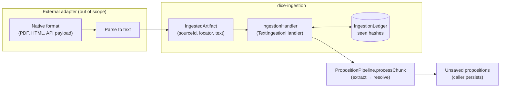
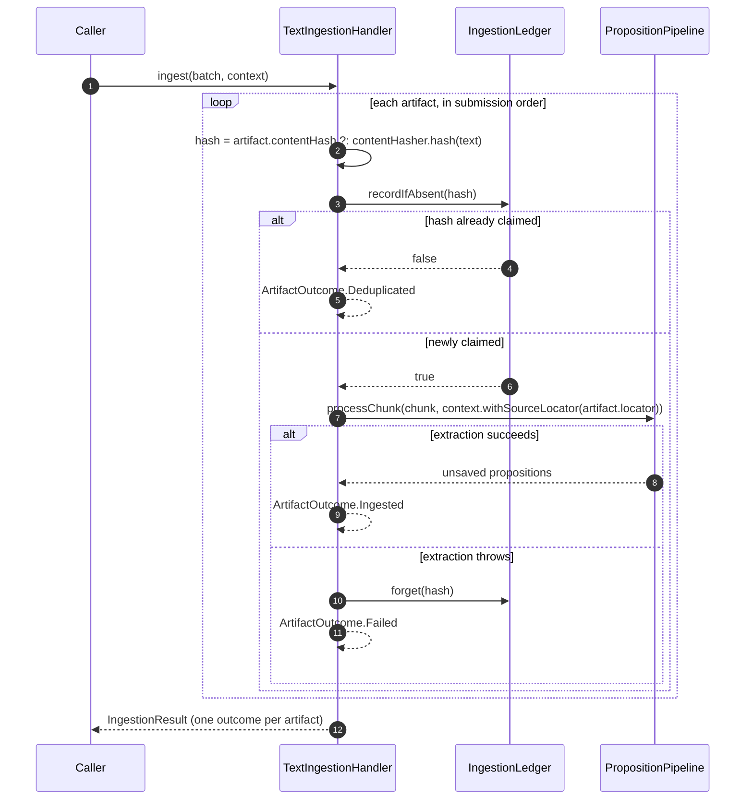

# Ingestion: the front door onto the extraction pipeline

`dice-ingestion` is the normalized handoff between "raw source material a connector parsed" and
the [extraction pipeline](extraction-pipeline.md). It owns exactly two jobs and nothing else:
claiming a content hash before extraction runs (so identical content is never processed twice),
and bridging an artifact's text into a `Chunk` the pipeline understands. Parsing native formats
(PDF, HTML, connector payloads) is explicitly out of scope — that happens upstream, before an
`IngestedArtifact` is even constructed.



The pipeline itself is unmodified by ingestion — `TextIngestionHandler` just wraps
`processChunk` with dedup and provenance. See
[extraction-pipeline](extraction-pipeline.md) for what happens once a chunk crosses that
boundary.

## Core types

| Type | Role |
|---|---|
| `IngestedArtifact` | A normalized unit of source material: `sourceId`, `locator` (provenance), `text`, optional `contentHash`, `trust` tier, timestamps. Adapters build these after parsing. |
| `IngestionBatch` | A submission-ordered group of artifacts; the primary handoff surface. |
| `IngestionHandler` | The SPI: `ingest(batch, context) -> IngestionResult`. Single-artifact `ingest` is a convenience that wraps one artifact in a batch. |
| `IngestionLedger` | Dedup ledger: `recordIfAbsent(hash)` atomically claims a hash; `forget(hash)` releases a claim (used on failure so retries aren't poisoned). `InMemoryIngestionLedger` ships as the default. |
| `TextIngestionHandler` | The one shipped `IngestionHandler` — wraps `PropositionPipeline` with dedup and grounding. |
| `ArtifactOutcome` | Sealed per-artifact result: `Ingested` (propositions), `Deduplicated` (hash already seen), `Failed` (cause, isolated to that artifact). |
| `IngestionResult` | Aggregate of `ArtifactOutcome`s in batch order; `.propositions` flattens every `Ingested` outcome. |

## Batch lifecycle

`TextIngestionHandler.ingest` processes a batch **sequentially, in submission order** — this is
a documented contract, not an implementation detail a caller can ignore. Intra-batch
deduplication (two artifacts in one batch that hash to the same content collapse to a single
ingest) depends on that ordering: an earlier artifact's ledger claim must be visible before a
later identical one is checked. A handler that parallelizes the batch must supply its own atomic
dedup instead of relying on order.



Each artifact's failure is isolated — a `runCatching` around `ingestOne` turns a thrown
exception into `ArtifactOutcome.Failed` for that artifact only, so one bad document never aborts
the rest of the batch. The handler runs **extraction only**; revision and persistence stay
downstream caller concerns (same boundary the pipeline itself draws — see
[extraction-pipeline: the result, and who persists it](extraction-pipeline.md#the-result-and-who-persists-it)).

## Provenance grounding

The handler stamps the artifact's `locator` onto the context before calling the pipeline
(`context.withSourceLocator(artifact.locator)`), so every proposition the pipeline extracts from
that chunk is grounded in where the source material came from. This is how ingestion feeds
provenance into the rest of the system without the pipeline needing to know anything about
`IngestedArtifact` at all.

## Common use case: ingesting a text source end-to-end

```kotlin
val handler = TextIngestionHandler(pipeline = propositionPipeline)

val artifact = IngestedArtifact
    .withSourceId("doc-42")
    .withLocator(UriLocator("https://example.com/doc-42"))
    .withText(extractedText)
    .withTrust(AuthorityTier.SECONDARY)

val result = handler.ingest(artifact, context)

when (val outcome = result.outcomes.single()) {
    is ArtifactOutcome.Ingested -> persist(outcome.propositions)  // caller's transaction
    is ArtifactOutcome.Deduplicated -> logger.debug("already seen: {}", outcome.contentHash)
    is ArtifactOutcome.Failed -> logger.warn("ingestion failed", outcome.cause)
}
```

A caller ingesting a batch instead just swaps `IngestionBatch.of(a, b, c)` and iterates
`result.outcomes` — the dedup and failure-isolation behavior is identical per-artifact.

## Design notes

- **Ledger is advisory identity, not security** — see [Core types](#core-types); the shipped
  `InMemoryIngestionLedger` is single-process only, so a durable implementation is a drop-in
  replacement for cross-session dedup.
- **Sequential is a contract, not an accident** — see [Batch lifecycle](#batch-lifecycle); a
  handler that parallelizes the batch must supply its own atomic dedup.
- **Ingestion never persists**, same as the pipeline it wraps — see
  [extraction-pipeline: the result, and who persists it](extraction-pipeline.md#the-result-and-who-persists-it).
