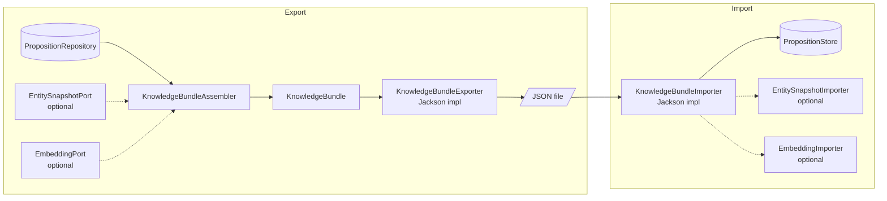
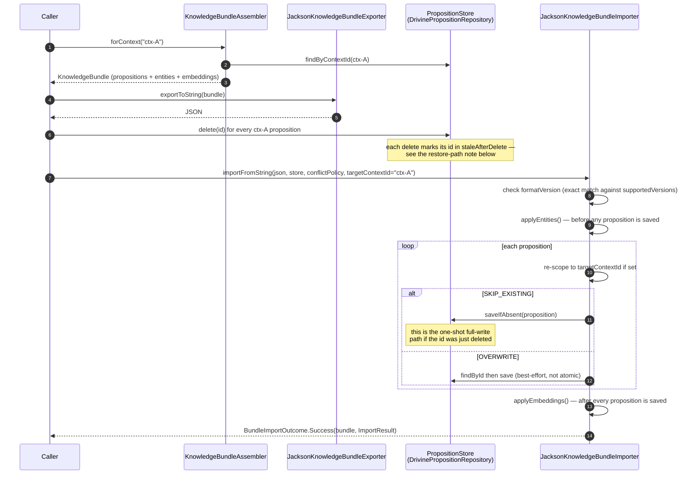

# Knowledge bundles: export and import

A knowledge bundle is a self-contained, versioned JSON file that holds a set of propositions from
one DICE context, so a graph can be snapshotted, archived, shared, or carried to another
deployment without a live store. Export and import are the obvious part. The decisions worth
writing down are what a bundle *preserves*, what it deliberately leaves out, and the storage-layer
hazard restoring one can trigger.

## Components

`KnowledgeBundleAssembler` (`dice-bundle`) turns a repository's propositions for a context into a
`KnowledgeBundle` envelope. It optionally calls out to two host-app-owned collaborators — an
`EntitySnapshotExporter` and an `EmbeddingExporter` — to pull in the entity data and vectors that
travel alongside the propositions. Both default to no-ops (`NoOpEntitySnapshotPort`,
`NoOpEmbeddingPort`), so a bundle without either wired is still fully valid, just without those
sections. A `KnowledgeBundleExporter` (the shipped one is `JacksonKnowledgeBundleExporter`) then
serializes the envelope to JSON. On the way back in, a `KnowledgeBundleImporter`
(`JacksonKnowledgeBundleImporter`) parses the JSON and writes propositions into a target
`PropositionStore`, optionally calling an `EntitySnapshotImporter` and `EmbeddingImporter` to
restore the other two sections.



## Primary use case: scoped export, wipe, re-scoped import

The scenario a bundle exists for: back up one context, clear it from the store, and restore it —
possibly into a different context than it came from (`targetContextId`). Import checks the bundle's
`formatVersion` before touching the store; an unrecognized version is a clean no-op. It applies
`entities` first (so a proposition's mentions resolve to entities that already exist), then walks
propositions applying the chosen `ImportConflictPolicy`, then applies `embeddings` last (a vector is
only meaningful once its proposition exists).



## Format specification

`formatVersion` is a single, exact-match version string — currently `"2.0"`
(`KnowledgeBundle.FORMAT_VERSION`, `KnowledgeBundle.kt:91`). There is no highest-supported-floor
logic: an importer rejects anything that isn't in its `supportedVersions` set, including a missing
field, as `BundleImportOutcome.UnknownFormatVersion` before the payload is ever bound to a model.
`entities` and `embeddings` were added without bumping this constant, because both are additive,
default-empty fields — an older importer reading a bundle that carries them still works (unknown
properties are ignored), and a newer importer reading an older bundle without them just gets empty
sections.

### Envelope (`KnowledgeBundle`)

| Field | Type | Optional | Notes |
|---|---|---|---|
| `formatVersion` | string | no (defaults to current) | Exact match required on import. |
| `contextId` | string | no | The source context. Every proposition inside must belong to it (`KnowledgeBundle.from` throws `IllegalArgumentException` otherwise). |
| `propositions` | array of Proposition | no (may be empty) | See below. |
| `createdAt` | ISO-8601 instant | no (defaults to now) | Participates in structural equality — two bundles built from the same data at different times aren't `==`. |
| `metadata` | map of string→string | yes (default `{}`) | Free-form (author, description, tags). |
| `entities` | array of EntitySnapshot | yes (default `[]`) | Present only if an `EntitySnapshotExporter` was wired at export time. |
| `embeddings` | array of EmbeddingEntry | yes (default `[]`) | Present only if an `EmbeddingExporter` was wired at export time. |

### Proposition

Every field on `com.embabel.dice.proposition.Proposition` travels with the bundle — this is
deliberate; see "Full-proposition fidelity" below.

| Field | Type | Optional | Notes |
|---|---|---|---|
| `id` | string | no | Preserved exactly; a re-import keeps the original id. |
| `contextId` | string | no | Must equal the bundle's own `contextId`, or the proposition is rejected on import. |
| `text` | string | no | |
| `mentions` | array of EntityMention | no (may be empty) | See below. |
| `confidence` | number (0.0–1.0) | no | |
| `decay` | number (0.0–1.0) | no (default 0.0) | |
| `importance` | number (0.0–1.0) | yes (default 0.5) | |
| `reasoning` | string or null | yes (default null) | |
| `grounding` | array of string | yes (default `[]`) | Legacy chunk-id-only grounding. |
| `created` | ISO-8601 instant | yes (default now) | |
| `contentRevised` | ISO-8601 instant | yes (default now) | The decay anchor. |
| `metadataRevised` | ISO-8601 instant | yes (default now) | Administrative touch time; doesn't reset decay. |
| `pinned` | boolean | yes (default false) | |
| `lastAccessed` | ISO-8601 instant | yes (default now) | |
| `status` | string enum (`ACTIVE`, `SUPERSEDED`, `CONTRADICTED`, `PROMOTED`, `STALE`) | yes (default `ACTIVE`) | |
| `level` | integer ≥ 0 | yes (default 0) | Abstraction level. |
| `sourceIds` | array of string | yes (default `[]`) | Required non-empty if `level > 0`. |
| `reinforceCount` | integer ≥ 0 | yes (default 0) | |
| `metadata` | map of string→any | yes (default `{}`) | Carries things like `dice.metamodel.quarantine.reason` (see [metamodel-governance](metamodel-governance.md)). |
| `uri` | string or null | yes (default null) | |
| `temporal` | TemporalMetadata or null | yes (default null) | `observedAt`, `validFrom`, `validTo`, `invalidatedAt`, `supersedes`, `contradicts`. |
| `provenanceEntries` | array of ProvenanceEntry | yes (default `[]`) | Each has a `locator` (`SourceLocator`), plus optional `chunkId`, `startOffset`, `endOffset`, `contentHash`. |

**Jackson also serializes three computed, constructor-less properties on every `Proposition`:
`contextIdValue` (a plain-string mirror of `contextId`), `revised` (deprecated alias of
`contentRevised`), and `lastTouched` (max of `contentRevised`/`metadataRevised`) — plus `current`
on `TemporalMetadata` when `temporal` is set (from its `isCurrent()` getter). These round-trip out
on export but carry no meaning on import: `Proposition` and `KnowledgeBundle` are both
`@JsonIgnoreProperties(ignoreUnknown = true)`, so they're silently dropped when read back. They are
not part of the format contract — don't rely on them.**

### EntityMention

| Field | Type | Optional | Notes |
|---|---|---|---|
| `span` | string | no | The text as it appeared in the proposition. |
| `type` | string | no | Free-text entity type label. |
| `resolvedId` | string or null | yes (default null) | The id an `EntitySnapshot` in the bundle's `entities` section corresponds to. |
| `role` | string enum (`SUBJECT`, `OBJECT`, `OTHER`) | yes (default `OTHER`) | |
| `hints` | map of string→any | yes (default `{}`) | |

### EntitySnapshot

| Field | Type | Optional | Notes |
|---|---|---|---|
| `id` | string | no | Matches some mention's `resolvedId`. |
| `type` | string | no | Free-text; dice doesn't validate it. |
| `properties` | map of string→any | yes (default `{}`) | Whatever the owning consumer's entity shape is. |

### EmbeddingEntry

| Field | Type | Optional | Notes |
|---|---|---|---|
| `propositionId` | string | no | |
| `vectorBase64` | string | no | Float32 values packed big-endian, 4 bytes each, no length prefix, base64-encoded (`EmbeddingCodec`). Vector length = decoded byte count ÷ 4. |

### Sample bundle

Two propositions (one with a resolved mention, one without), one entity snapshot, one embedding —
matching exactly what `JacksonKnowledgeBundleExporter` emits for that shape (computed properties
included, since they're really on the wire):

```json
{
  "formatVersion": "2.0",
  "contextId": "ctx-A",
  "propositions": [
    {
      "id": "prop-1",
      "contextId": "ctx-A",
      "text": "Alice works at Acme Corp",
      "mentions": [
        {
          "span": "Alice",
          "type": "Person",
          "resolvedId": "person-42",
          "role": "SUBJECT",
          "hints": {}
        }
      ],
      "confidence": 0.9,
      "decay": 0.05,
      "importance": 0.5,
      "reasoning": null,
      "grounding": [],
      "created": "2025-06-01T08:00:00Z",
      "contentRevised": "2025-06-01T08:00:00Z",
      "metadataRevised": "2025-06-01T08:00:00Z",
      "pinned": false,
      "lastAccessed": "2026-01-15T10:00:00Z",
      "status": "ACTIVE",
      "level": 0,
      "sourceIds": [],
      "reinforceCount": 0,
      "metadata": {},
      "uri": null,
      "temporal": null,
      "provenanceEntries": [],
      "contextIdValue": "ctx-A",
      "revised": "2025-06-01T08:00:00Z",
      "lastTouched": "2025-06-01T08:00:00Z"
    },
    {
      "id": "prop-2",
      "contextId": "ctx-A",
      "text": "Acme Corp is based in Austin",
      "mentions": [
        {
          "span": "Acme Corp",
          "type": "Organization",
          "resolvedId": null,
          "role": "OBJECT",
          "hints": {}
        }
      ],
      "confidence": 0.85,
      "decay": 0.05,
      "importance": 0.5,
      "reasoning": null,
      "grounding": [],
      "created": "2025-06-01T08:05:00Z",
      "contentRevised": "2025-06-01T08:05:00Z",
      "metadataRevised": "2025-06-01T08:05:00Z",
      "pinned": false,
      "lastAccessed": "2026-01-15T10:00:00Z",
      "status": "ACTIVE",
      "level": 0,
      "sourceIds": [],
      "reinforceCount": 0,
      "metadata": {},
      "uri": null,
      "temporal": null,
      "provenanceEntries": [],
      "contextIdValue": "ctx-A",
      "revised": "2025-06-01T08:05:00Z",
      "lastTouched": "2025-06-01T08:05:00Z"
    }
  ],
  "createdAt": "2026-01-15T10:00:00Z",
  "metadata": {},
  "entities": [
    {
      "id": "person-42",
      "type": "Person",
      "properties": {
        "name": "Alice"
      }
    }
  ],
  "embeddings": [
    {
      "propositionId": "prop-1",
      "vectorBase64": "PczMzT5MzM0+mZma"
    }
  ]
}
```

(`vectorBase64` above decodes to the float32 vector `[0.1, 0.2, 0.3]`.)

## Kotlin samples

### (a) Wiring both ports for a host application

`DrivineEmbeddingAccess` (`dice-storage`) is the shipped `EmbeddingPort`, reading and writing the
same `Proposition.embedding` Neo4j property the repository's vector index uses. There's no shipped
`EntitySnapshotPort` — dice never owns entity data — so a host app implements one over its own
entity store:

```kotlin
class MyAppEntitySnapshotPort(
    private val entityStore: MyAppEntityStore,
) : EntitySnapshotPort {

    override fun snapshotsFor(resolvedIds: Set<String>): List<EntitySnapshot> =
        entityStore.findByIds(resolvedIds).map { entity ->
            EntitySnapshot(
                id = entity.id,
                type = entity.typeName,
                properties = entity.toPropertyMap(),
            )
        }

    override fun importSnapshots(snapshots: List<EntitySnapshot>) {
        snapshots.forEach { snapshot ->
            entityStore.upsert(snapshot.id, snapshot.type, snapshot.properties)
        }
    }
}

// Wiring, e.g. as Spring beans:
val embeddingPort = DrivineEmbeddingAccess(persistenceManager)
val entityPort = MyAppEntitySnapshotPort(entityStore)
```

### (b) Scoped export and re-scoped import

```kotlin
val assembler = KnowledgeBundleAssembler(
    repository = propositionRepository,
    entitySnapshotExporter = entityPort,
    embeddingExporter = embeddingPort,
)
val exporter = JacksonKnowledgeBundleExporter()
val importer = JacksonKnowledgeBundleImporter(
    entitySnapshotImporter = entityPort,
    embeddingImporter = embeddingPort,
)

// Export ctx-A.
val bundle = assembler.forContext("ctx-A")
val json = exporter.exportToString(bundle)
Files.writeString(Path.of("ctx-A-backup.json"), json)

// ... later, restore into a different workspace ("ctx-A-v2") rather than "ctx-A" itself.
val outcome = importer.importFromString(
    serialised = Files.readString(Path.of("ctx-A-backup.json")),
    store = propositionRepository,
    conflictPolicy = ImportConflictPolicy.SKIP_EXISTING,
    targetContextId = "ctx-A-v2",
)
when (outcome) {
    is BundleImportOutcome.Success -> println("imported=${outcome.result.imported}")
    is BundleImportOutcome.UnknownFormatVersion -> error("unsupported bundle: ${outcome.foundVersion}")
    is BundleImportOutcome.ParseFailure -> error("bad bundle: ${outcome.reason}")
}
```

### (c) Conflict policy and the `overwriteFailures` reconciliation loop

`OVERWRITE` is best-effort, not atomic — there's no store primitive tying the `findById` check to
the `save` that follows, so a mid-flight failure leaves the store's state for that id undetermined.
Any id in `overwriteFailures` needs the caller to reconcile by hand:

```kotlin
val outcome = importer.importFromString(
    serialised = json,
    store = propositionRepository,
    conflictPolicy = ImportConflictPolicy.OVERWRITE,
)

if (outcome is BundleImportOutcome.Success) {
    outcome.result.overwriteFailures.forEach { propositionId ->
        // Store state for this id is unknown: old copy, new copy, or a half-written one.
        // Re-fetch from the source of truth and re-attempt, or restore from a snapshot.
        reconcileOverwriteFailure(propositionId)
    }
}
```

## Restore-path note: the delete → re-save hazard

Bundle restore's most realistic shape is delete-then-reimport under the *same* proposition ids
(back up a context, wipe it, restore it). That collides with an optimization in
`DrivinePropositionRepository`: `GraphObjectManager` keeps a session-scoped cache of every view it
has saved or loaded and diffs each new save against that cached snapshot, only emitting `SET`
clauses for fields that actually changed. `delete()` removes the Neo4j node but has no way to evict
that cache — Drivine exposes no per-id eviction API. So a proposition deleted and then re-persisted
under the same id would, without a fix, get diffed against its own *pre-delete* snapshot: any field
whose new value happens to match the old one is treated as "unchanged" and never gets a `SET`,
silently leaving it null on what's actually a brand-new, empty node.

The fix is `staleAfterDelete` (`DrivinePropositionRepository.kt:107`): `delete()` marks the id in a
`ConcurrentHashMap`-backed set; the very next `doPersist()` for that id consumes the mark (one-shot)
and routes through `saveFully()` instead of the normal session-aware save. `saveFully()` builds the
same merge statements Drivine would, but against a throwaway, never-tracked `SessionManager`, so
every field looks "never seen before" and gets written unconditionally — exactly the full-write
behavior a proposition gets on its actual first save. Every save after that first one goes back
through the normal, dirty-diffed path, which is what keeps `DELETE_ORPHAN` mention cleanup working
for ordinary updates (an earlier attempt that routed *every* save through the always-full-write path
broke that: a re-save with fewer mentions left the removed `Mention` node orphaned).

**Known gap:** `setProvenance()` still calls `graphObjectManager.save()` directly and is exposed to
the same staleness class if provenance is re-set on a just-restored id — not fixed, since no current
test exercises it. **Upstream gap:** the real fix belongs in Drivine itself — `delete()` should evict
its own session entry (or expose an eviction API) so any delete-then-recreate workflow, not just
bundle restore, doesn't need a caller-side workaround.

## Limits

- **No collector traces or lifecycle history.** A bundle carries the propositions as they are right
  now (including their current `status`, `metadata`, and drift-quarantine annotations), not the
  history of how they got there.
- **In-memory, not streaming.** `KnowledgeBundleAssembler` loads every matching proposition into
  memory per call (`forContext`), and `allContexts()` loads the entire store. There's no batching or
  cursor support; a very large context should be exported in application-level batches if memory is
  a concern.
- **50 MB default import cap.** `JacksonKnowledgeBundleImporter.DEFAULT_MAX_BUNDLE_BYTES` rejects
  anything larger up front (string path) or aborts mid-parse (stream/reader paths) — configurable via
  the constructor's `maxBundleBytes`.
- **Cross-context id collisions are rejected by design, not resolved.** `PropositionStore` keys
  propositions by id alone, not `(contextId, id)`. If an id already exists under a *different*
  context than the one being imported into — original or re-scoped — the importer refuses to touch
  that row (counted as `rejected`, with a note) rather than guess whether it's safe to move or
  overwrite. Restoring into a context that still holds different data under the same ids is not a
  supported path; the source rows need to be gone first.
