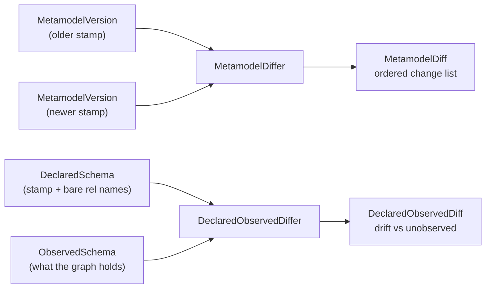

# Metamodel diffing: what moved, and against what

A version stamp answers one question: *is this the same schema as last time?* That's a yes or a no,
and it's enough to notice something happened, but not enough to do anything about it. Knowing that
`Person` lost a property, or that a live graph is full of a type nobody declares any more, needs a
comparison that says **what** moved.

That's what this note covers. Two comparisons live in `dice-metamodel`, and they're separate on
purpose because they answer different questions.



**Declared vs. declared** (`MetamodelDiffer`) compares two stamps — two things somebody decided. It
is symmetric: every difference is a change, and the result is an ordered list of them.

**Declared vs. observed** (`DeclaredObservedDiffer`) compares a declaration against a snapshot of a
live graph. It is asymmetric, because one side is a decision and the other is reality, and the two
disagree in two very different ways.

Both are contracts plus one shipped implementation, `StructuralMetamodelDiffer`, which does both.
No LLM, no heuristics, no database: it walks the same fields the content hash is built from, which
is what makes "empty diff" and "same hash" mean the same thing.

## The change taxonomy

`MetamodelChange` is a sealed interface, so a `when` over it is exhaustive and the compiler speaks
up when a new kind lands. That matters more than usual here, because the next slice decides which
changes are lossy enough to quarantine data over — a change kind nobody noticed would be silently
treated as harmless.

| Kind | What it means |
| --- | --- |
| `EntityTypeAdded` / `EntityTypeRemoved` | A type appeared or disappeared. |
| `EntityTypeModified` | A type present in both versions gained or lost labels, or gained or lost whole properties (matched by name), with the full signature of each. |
| `PropertySignatureChanged` | A property kept its name but changed shape: its type, its cardinality, or whether it holds a value or points at another type. Carries `before` and `after`. |
| `RelationshipAdded` / `RelationshipRemoved` | An allowed relationship descriptor appeared or disappeared. |

The kinds don't overlap. Each difference is reported exactly once, by whichever kind describes it
most precisely.

`PropertySignatureChanged` is the one worth dwelling on, because it is the whole reason the stamp
carries signatures rather than property names. `age` turning from a string into an integer, or a
single `worksAt` becoming a list of them, is a real change to what the graph can hold — data
extracted under the old shape may simply not fit the new one. Under a name-only taxonomy both
schemas have a property called `age`, nothing moved, and nothing gets reported. So the differ
matches properties **by name** and pairs the two signatures: one change with a before and an after,
rather than a deletion sitting next to an unrelated-looking addition that a caller has to pair back
up. `typeChanged`, `cardinalityChanged` and `kindChanged` say which part moved.

There is one honest gap. A `DataDictionary` may hold two same-named domain types whose properties
get unioned into a single stamp, so one property name can carry two signatures at once. There is no
single before and after to pair then, and inventing one would be a fiction, so the differing
signatures come back as `addedProperties` and `removedProperties` on `EntityTypeModified` instead.
Rare, and better than a guessed pairing.

What the diff deliberately does *not* do is judge. It says `age` went from `string` to `integer`; it
does not say that this strands existing values while `integer` → `string` wouldn't. That's a policy
question, and it belongs to the quarantine slice.

Output is canonical. Type names, property names and signatures all come out sorted, so the same two
stamps always produce the same list in the same order — the sets inside a `MetamodelVersion` are
JVM-immutable copies whose iteration order is deliberately unspecified and varies between runs, so
anything leaving the differ is sorted first. And sets are compared as sets, never as a
delimiter-joined projection: these names come from free text and LLM extraction and routinely
contain commas and spaces, so `{"a", "b c"}` and `{"a b", "c"}` must not collapse into the same
thing.

## Declared vs. observed, and the asymmetry

`ObservedSchema` is what a live graph actually holds: entity labels, relationship types, and when
the snapshot was taken. A storage layer builds one by querying its database; `ObservedSchemaSource`
is the SPI it implements, and this module has no graph driver, so it can't provide a default. Tests
hand in a canned snapshot and never touch a database. `observe(contextId)` scopes the snapshot to a
single context; `observe()` takes the whole graph.

Comparing that against a declaration gives two clearly separated buckets, not a change list:

- **Drift** — observed in the graph, never declared. This is the actionable case. Concretely, data
  is sitting in the graph whose declaring integration has since been switched off, or never
  registered one, so nothing can tell that data apart as valid or explain its shape.
- **Unobserved** — declared, but with zero instances in the graph right now. Purely informational. A
  declared type with no data yet is a completely normal state, not a problem.

Folding these into one symmetric change list would force every caller to sift it to tell an
emergency from a shrug.

**A declared label counts as declared.** What a graph reports is labels, and a type carries every
label in its hierarchy — declare `Person` with parent `Agent` and every Person node comes back
carrying both. So the declared side of the drift check is every entity type name *plus* every label
those types declare; comparing against type names alone would report `Agent` as undeclared drift on
a schema nobody had touched. The unobserved direction stays on type names, because "declared but
with no data" is a statement about types, and listing a parent label as an unobserved type would be
noise about something that was never a type in its own right.

**The observed side is names only, and that is a real limit, not an oversight.** A graph can tell
you which labels and relationship types exist in it. It cannot tell you what a property was
*declared* to be: two nodes with the same label can carry different property sets, a property can be
absent on most of them, and a value that looks like an integer today may be a string tomorrow.
Anything richer than a name would be a sample, not a schema — and a diff built on a sample reads as
authoritative when it isn't. So `DeclaredObservedDiff` stops at type and relationship names and says
nothing about property shape. Signatures are compared where both sides genuinely have them:
declared against declared.

One more asymmetry, smaller but sharp. `MetamodelVersion.relationshipNames` holds rendered
`From-[name]->To` descriptors; a graph only knows the bare type name, because a
`db.relationshipTypes()`-style query knows the type, not which node types an instance actually
connected. So the comparison happens on the bare name — and that name is never recovered by parsing
a descriptor. Relationship names are free text, so a name can itself contain a `-[...]->`-shaped
substring, and a greedy parse of `Foo-[A-[X]->B]->Bar` picks `X` rather than `A-[X]->B`. That's why
`DeclaredObservedDiffer` takes a whole `DeclaredSchema`: the declaration carries the bare names
alongside the stamp, un-rendered, built under the same governance rule so the two halves can't drift
apart.

## Using it

```kotlin
val differ = StructuralMetamodelDiffer()

// Declared vs. declared: has the schema moved since the stamp we recorded?
val previous = versionStore.latestVersion("my-schema")
val current = DeclaredSchema.from(dataDictionary, governed)
val diff = previous?.let { differ.diff(it, current.version) }

diff?.changes?.forEach { change ->
    when (change) {
        is MetamodelChange.PropertySignatureChanged ->
            log.warn("{}.{}: {} -> {}", change.typeName, change.propertyName, change.before, change.after)
        else -> log.info("{}", change)
    }
}

// Declared vs. observed: is anything in the graph undeclared?
val observed = observedSchemaSource.observe()
val drift = differ.diffAgainstObserved(current, observed)
if (drift.hasDrift) {
    log.warn("undeclared in graph: {} {}", drift.driftedEntityTypes, drift.driftedRelationshipTypes)
}
```

`MetamodelDiffer` also has a convenience overload taking two `DataDictionary` instances. It stamps
both with everything governed, the closed-world reading — fine for a domain that's closed-world
throughout, wrong for one that isn't, where exploratory types nobody committed to would show up as
schema changes. If governance is partial, stamp with the `GovernedTypeSelector` first (or take both
stamps off `DeclaredSchema.from(...)`) and use the `MetamodelVersion` overload.

`StructuralMetamodelDiffer` is stateless and thread-safe; one shared instance is fine. There is no
Spring wiring in this module — it's an ordinary constructor call until the autoconfigure slice
arrives.

## What comes next

Diffing is the comparison half of the middle tier described in
[metamodel-versioning.md](metamodel-versioning.md#the-tiers-ahead). The other half is *doing*
something with the result: a drift check that sequences observe → declare → diff → record, a store
for the reports it produces so a drift you saw last week is still answerable, and then quarantine —
marking propositions stale when a change actually strands them, never deleting. Those land in the
next slices, on top of these contracts.
