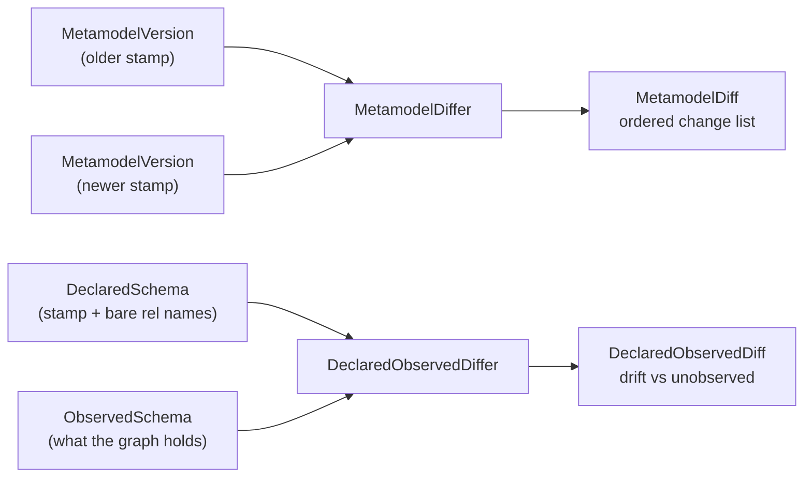
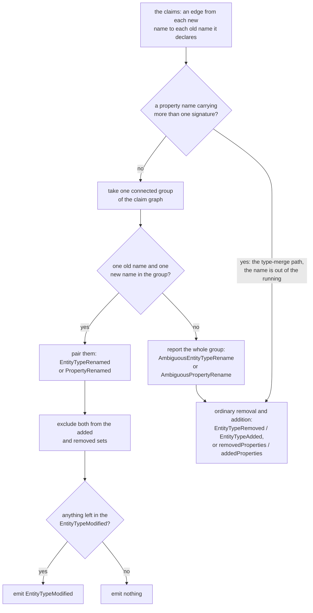

# Metamodel diffing: the change taxonomy and drift

DICE compares schema stamps to say what changed between them, and compares a declared schema against
a live graph to say where the two disagree.

A version stamp answers "is this the same schema as last time?", a yes or a no. Acting on the answer
needs more: which property `Person` lost, or which type a live graph is full of that nobody declares
any more. Two comparisons in `dice-metamodel` cover those, and they are separate because they answer
different questions.



**Declared vs. declared** (`MetamodelDiffer`) compares two stamps, both of them declarations. It is
symmetric: every difference is a change, and the result is an ordered list of them.

**Declared vs. observed** (`DeclaredObservedDiffer`) compares a declaration against a snapshot of a
live graph. It is asymmetric, because one side is a decision and the other is an observation, and
the two disagree in two different ways.

Both are contracts, with one shipped implementation, `StructuralMetamodelDiffer`, which does both.
No LLM, no heuristics, no database: it walks the same fields the content hash is built from, which
is what makes "empty diff" and "same hash" mean the same thing.

## The change taxonomy

`MetamodelChange` is a sealed interface, so a `when` over it is exhaustive and the compiler speaks
up when a new kind lands. The next slice decides which changes are lossy enough to quarantine data
over, where an unhandled change kind would be treated as harmless.

| Kind | What it means |
| --- | --- |
| `EntityTypeAdded` / `EntityTypeRemoved` | A type appeared or disappeared. |
| `EntityTypeRenamed` | A type changed name, paired up through a former name the newer declaration carries. |
| `EntityTypeAliasesChanged` | A type's declared former names changed, with nothing else about the type moving. |
| `EntityTypeModified` | A type present in both versions gained or lost labels, or gained or lost whole properties (matched by name), with the full signature of each. |
| `PropertyRenamed` | A property changed name, paired up through a former name its new signature carries. Carries `before` and `after`. |
| `PropertySignatureChanged` | A property kept its name but changed shape: its type, its cardinality, or whether it holds a value or points at another type. Carries `before` and `after`. |
| `AmbiguousEntityTypeRename` / `AmbiguousPropertyRename` | A contested claim, so no rename was read: more than one new name claiming one former name, or one new name claiming more than one former name that was still live. Carries the whole contested group. |
| `RelationshipAdded` / `RelationshipRemoved` | An allowed relationship descriptor appeared or disappeared. |

The kinds don't overlap. Each difference is reported exactly once, by whichever kind describes it
most precisely. Rendered relationship descriptors are the exception, and
[Where exactly-once stops](#where-exactly-once-stops) says why.

The two ambiguity kinds sit outside that accounting. They describe a declaration the differ could
not act on rather than a difference between the two schemas, and the names inside one are also
reported as ordinary additions and removals. [The pairing rule](#the-pairing-rule) says when they
come up.

`PropertySignatureChanged` is why the stamp carries signatures rather than property names. `age`
turning from a string into an integer, or a single `worksAt` becoming a list of them, changes what
the graph can hold, and data extracted under the old shape may not fit the new one. Under a
name-only taxonomy both schemas have a property called `age` and nothing gets reported. So the
differ matches properties **by name** and pairs the two signatures into one change with a before and
an after, which saves a caller pairing up a deletion and an unrelated-looking addition.
`typeChanged`, `cardinalityChanged` and `kindChanged` say which part moved.

One gap. A `DataDictionary` may hold two same-named domain types whose properties get unioned into a
single stamp, so one property name can carry two signatures at once. There is no single before and
after to pair then, so the differing signatures come back as `addedProperties` and
`removedProperties` on `EntityTypeModified`.

The diff doesn't judge. It says `age` went from `string` to `integer`. Deciding that this strands
existing values while `integer` → `string` wouldn't is a policy question for the quarantine slice.

Output is canonical. Type names, property names and signatures all come out sorted, so the same two
stamps always produce the same list in the same order. The sets inside a `MetamodelVersion` are
JVM-immutable copies whose iteration order is unspecified and varies between runs, so anything
leaving the differ is sorted first. Sets are compared as sets, never as a delimiter-joined
projection: these names come from free text and LLM extraction and routinely contain commas and
spaces, so `{"a", "b c"}` and `{"a b", "c"}` must not collapse into the same thing.

Entity-type changes come first, by type name, then relationship changes. Any
`AmbiguousEntityTypeRename` comes after the added and removed types and before the per-type blocks,
ordered by first contested former name. Within one type the order is `EntityTypeRenamed`,
`EntityTypeAliasesChanged`, `EntityTypeModified`, `PropertyRenamed` by new property name,
`AmbiguousPropertyRename` by first contested former name, then `PropertySignatureChanged` by
property name. A renamed type is filed under its new name.

## Declared renames

Names are identity in a stamp, so a property or type that changes name disappears and reappears.
That reads as loss on data nobody stranded, and the quarantine slice acts on that reading. Iceberg
and Delta avoid it with stable field ids minted when a column is created; DICE extracts its schema
from LLM output and has no id to mint, so the declaration carries the old name instead.
`SchemaAliases` puts former names into the stamp — `MetamodelVersion.entityTypeAliases` per type,
`PropertySignature.aliases` per property — and the differ pairs on them.

Aliases accumulate. A type renamed `A` to `B` to `C` declares `{A, B}`, and pairing matches the
whole set, so a diff across stamps that aren't adjacent still pairs. Names are exact and
case-sensitive.

### The pairing rule

Pairing runs on what is left after the ordinary name matching, so a name present on both sides is
never a candidate: an alias naming a property that still exists says nothing, and matches nothing.

A rename pairs when the claim is **exclusive both ways among the claims that are in the running**:
the old name is claimed by one new name alone, and that new name claims one old name alone. The way
to see it is as a graph — old names on one side, new names on the other, an edge for every declared
former name still in the running. A piece of that graph holding one name on each side is a rename.
Anything larger is contested and pairs nothing.

Two declarations never enter that graph, so neither one contests a pairing:

- **A surviving type's alias.** Exclusivity is judged among the types that are *new* in this
  version, because only a removed name arriving on a new type is shaped like a rename. A type
  present in both versions can legally declare the removed name as a former name — `Keeper`
  aliasing `Person` while `Person` moves to `Customer`. That is a merge rather than a rename
  candidate, so `Person → Customer` still pairs, and `Keeper`'s declaration reports where it
  belongs, as an `EntityTypeAliasesChanged` on `Keeper`.
- **A property name carrying two signatures.** The type-merge path below takes such a name out of
  the running before claims are read, so a claim on it is voided rather than contested. A signature
  declaring `aliases = {age, b}` where `age` carries two signatures still pairs `b` exclusively.



**The ambiguity is reported, never guessed.** Two new types both declaring `Person` as a former name
is a declaration saying two things at once. Resolving it on sort order, or on any other tiebreak,
attaches `Person`'s labels, properties and references to a type nobody nominated, and hands the
other a clean bill as something brand new. The same holds in the other direction: one new type
claiming two old names that were both live is a merge, and neither old name is the rename. So the
differ pairs neither, every name in the group reports as an ordinary addition or removal, and one
ambiguity entry names the whole group so the set-aside declaration is visible instead of silent.
Groups are found by walking out from each old name, so claims that chain together — `X` claims `A`
while `Y` claims both `A` and `B` — come back as a single entry covering all four names.

Reporting rather than throwing is deliberate. `MetamodelVersion` already refuses an alias naming a
type the same schema still declares, and stays quiet about two types sharing one former name, so a
schema in this state stamps cleanly. The two sides of a diff are then two independently stamped
versions, and a caller comparing historical stamps out of a store cannot edit either one; throwing
would leave it with no way to read its own history. The reading a caller gets is the conservative
one — the old name looks lost, which is what quarantine should act on — with the ambiguity entry
beside it saying why. The fix belongs in the declaration: retire the alias from the types that
should not carry it, or stamp the moves separately so each rename stands alone.

The type-merge branch is the same exception `EntityTypeModified` already documents: a
`DataDictionary` may hold two same-named domain types whose properties get unioned, so one property
name can carry two signatures, and there is no single before to pair. Declaring an alias on such a
name is refused at declaration time, in `DeclaredSchema.from` and `MetamodelVersion.from`; the
comparison falls back to a removal and an addition.

Paired properties are excluded from `EntityTypeModified.addedProperties` and `removedProperties`,
and an entry left with nothing in it is not emitted, so its at-least-one-set-non-empty contract
holds.
When paired signatures differ in more than the name, the whole delta rides inside `PropertyRenamed`,
whose `typeChanged`, `cardinalityChanged` and `kindChanged` read the same way they do on
`PropertySignatureChanged`.

A paired type rename suppresses the `EntityTypeAdded`/`EntityTypeRemoved` pair. Whatever else moved
on the type is diffed between the two paired types and reported under the new name.

### Comparison modulo renames

A type's own name is one of its labels, children inherit it, and other types point at it. Renaming
`Person` to `Human` therefore shows up again on every referrer's reference target and every child's
label set. Reported literally, a declared rename becomes label loss and signature loss across the
schema, and the quarantine policy sweeps the rename's own ripples.

So after pairing, the older version is read modulo the renames this diff found. The differ
substitutes old name for new in exactly two places:

1. the `type` field of `Kind.REFERENCE` property signatures, and
2. label sets.

Substitution rides on the pairs the differ made, so a contested claim substitutes nothing: a
referrer that followed the move reports its reference change in full, the reading it would get with
no alias declared at all.

A delta that vanishes under the substitution is the rename propagating and folds into
`EntityTypeRenamed`. A delta that survives is reported and judged normally, stated in substituted
form: a referrer that moved from `A` to `D` while `A` was renamed to `B` reports `B → D`, because
the `A → B` half already rides in the rename. An `EntityTypeModified` emptied by substitution is
not emitted, the same as one emptied by pairing.

`Kind.VALUE` type strings are never substituted. A value type is a free-text rendering of a JVM type
copied verbatim from the dictionary, so a schema holding an entity type named `Date` that renames to
`Timestamp` would otherwise rewrite every `birthday: Date` value property in the older version and
report a change on each of them.

Substitution goes by name, so a label or reference target that merely shares a renamed type's old
name without deriving from it — reachable when an unselected parent contributes its name as a label
while a governed type of the same name renames — is rewritten too, and can surface as label churn
on a type nothing touched. The same-name merge corner it takes to get there is already documented
as its own hazard; this is one more reason a schema should not lean on it.

### Where exactly-once stops

Relationships are a knowing exception. `MetamodelVersion.relationshipNames` holds rendered
`From-[name]->To` descriptors, and these names are free text that can contain a `-[...]->`-shaped
substring, so the differ compares them as atoms and never parses one. A relationship touching a
renamed endpoint therefore churns as a `RelationshipRemoved` plus a `RelationshipAdded` beside the
`EntityTypeRenamed` that already described the move. Exactly-once holds for entity-type and property
changes. Quarantine ignores relationship changes, so this costs a duplicated line in a report and
nothing else.

### Alias-only changes

Aliases are hashed, so declaring or retiring one moves `contentHash`, and an empty diff has to keep
meaning the same thing as an equal hash. A property whose signature moved only in its aliases is an
ordinary `PropertySignatureChanged` with `typeChanged`, `cardinalityChanged` and `kindChanged` all
false. A type whose declared former names moved is an `EntityTypeAliasesChanged`. Neither says
anything about stored data.

The alias a rename implies rides in `EntityTypeRenamed`. `Human` declaring `Person` as a former name
is what made the pairing, so a rename emits `EntityTypeRenamed` alone and no alias change beside it.
What the declaration says beyond that still reports. Diffing across stamps that aren't adjacent is
where this shows: comparing the stamp for `A` against the stamp for `C`, where `C` declares
`{A, B}`, pairs `A` with `C` and reports the intermediate name `B` as an alias change, because the
older stamp never knew `C` claims it. Each hop diffed on its own emits the rename alone.

### Renames and the observed side

Declared former names join the declared side of the drift comparison, alongside type names and
labels. Nodes written before a rename keep the old label, and the rename was declared, so the old
label is known and is not drift. The alternative — keeping it red as a migration signal — makes
`hasDrift` permanently true on a schema whose rename was explicit, which trains operators to ignore
the report; migration progress belongs to run lineage. Former names stay out of the unobserved
direction, for the same reason parent labels do: a former name was never a type of its own.

## Declared vs. observed, and the asymmetry

`ObservedSchema` is what a live graph holds: entity labels, relationship types, and when the
snapshot was taken. A storage layer builds one by querying its database; `ObservedSchemaSource` is
the SPI it implements, and this module has no graph driver, so it can't provide a default. Tests
hand in a canned snapshot and never touch a database. `observe(contextId)` scopes the snapshot to a
single context; `observe()` takes the whole graph.

Comparing that against a declaration gives two separate buckets rather than a change list:

- **Drift**: observed in the graph, never declared. This is the actionable case. Data is sitting in
  the graph whose declaring integration has since been switched off, or never registered one, so
  nothing can confirm that data as valid or explain its shape.
- **Unobserved**: declared, with zero instances in the graph right now. Informational. A declared
  type with no data yet is a normal state.

A single symmetric change list would leave every caller to sift the actionable case out of the
informational one.

**A declared label counts as declared.** A graph reports labels, and a type carries every label in
its hierarchy: declare `Person` with parent `Agent` and every Person node comes back carrying both.
So the declared side of the drift check is every entity type name, every label those types declare,
and every former name they declare. Comparing against type names alone would report `Agent` as
undeclared drift on a schema nobody had touched, and dropping the former names would do the same to
data written before a declared rename. The unobserved direction stays on type names, because
"declared but with no data" is a statement about types, and neither a parent label nor a former name
was a type in its own right.

**The observed side is names only.** A graph can report which labels and relationship types exist in
it. It cannot report what a property was *declared* to be: two nodes with the same label can carry
different property sets, a property can be absent on most of them, and a value that looks like an
integer today may be a string tomorrow. Anything richer than a name would be a sample of the data
rather than the schema. So `DeclaredObservedDiff` stops at type and relationship names and says
nothing about property shape. Signatures are compared where both sides have them: declared against
declared.

One more asymmetry. `MetamodelVersion.relationshipNames` holds rendered `From-[name]->To`
descriptors; a graph only knows the bare type name, because a `db.relationshipTypes()`-style query
knows the type, not which node types an instance connected. So the comparison happens on the bare
name, and that name is never recovered by parsing a descriptor. Relationship names are free text, so
a name can itself contain a `-[...]->`-shaped substring, and a greedy parse of `Foo-[A-[X]->B]->Bar`
picks `X` where the name is `A-[X]->B`. That is why `DeclaredObservedDiffer` takes a whole
`DeclaredSchema`: the declaration carries the bare names alongside the stamp, un-rendered, built
under the same governance rule so the two halves can't drift apart.

## Using it

```kotlin
val differ = StructuralMetamodelDiffer()

// Declared vs. declared: has the schema moved since the stamp we recorded?
val previous = versionStore.latestVersion("my-schema")
val current = DeclaredSchema.from(dataDictionary, governed)
val diff = previous?.let { differ.diff(it, current.version) }

diff?.changes?.forEach { change ->
    when (change) {
        is MetamodelChange.PropertySignatureChanged ->
            log.warn("{}.{}: {} -> {}", change.typeName, change.propertyName, change.before, change.after)
        else -> log.info("{}", change)
    }
}

// Declared vs. observed: is anything in the graph undeclared?
val observed = observedSchemaSource.observe()
val drift = differ.diffAgainstObserved(current, observed)
if (drift.hasDrift) {
    log.warn("undeclared in graph: {} {}", drift.driftedEntityTypes, drift.driftedRelationshipTypes)
}
```

`MetamodelDiffer` also has a convenience overload taking two `DataDictionary` instances. It stamps
both with everything governed, the closed-world reading, which suits a domain that is closed-world
throughout. Where governance is partial, exploratory types nobody committed to would show up as
schema changes, so stamp with the `GovernedTypeSelector` first (or take both stamps off
`DeclaredSchema.from(...)`) and use the `MetamodelVersion` overload.

`StructuralMetamodelDiffer` is stateless and thread-safe; one shared instance is fine. This module
has no Spring wiring, so it's an ordinary constructor call. In a Boot app,
`dice-storage-autoconfigure` registers one, resolvable as both a `MetamodelDiffer` and a
`DeclaredObservedDiffer`; see [metamodel-wiring.md](metamodel-wiring.md).

## What comes next

Diffing is the comparison half of the middle tier described in
[metamodel-versioning.md](metamodel-versioning.md#the-tiers-ahead). The other half acts on the
result, and has landed on top of these contracts in [metamodel-drift.md](metamodel-drift.md):
`DriftCheckRunner` sequences declare, stamp, observe, diff, record; `DriftReportStore` keeps the
reports, so a drift seen last week is still answerable; and `DriftQuarantinePolicy` marks stranded
propositions stale rather than deleting them.

The drift note is also where a change gets judged. A `PropertySignatureChanged` here states that
`age` went from `string` to `integer`; the quarantine policy decides whether that can strand data.
Any type change can, as can a cardinality that shrinks; a cardinality that widens holds everything
it held before.
