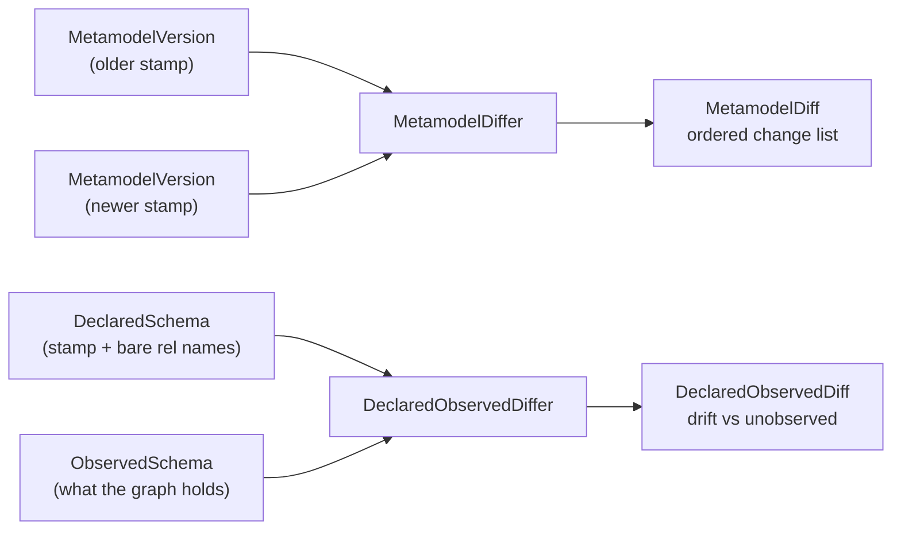

# Metamodel diffing: the change taxonomy and drift

DICE compares schema stamps to say what changed between them, and compares a declared schema against
a live graph to say where the two disagree.

A version stamp answers "is this the same schema as last time?", a yes or a no. Acting on the answer
needs more: which property `Person` lost, or which type a live graph is full of that nobody declares
any more. Two comparisons in `dice-metamodel` cover those, and they are separate because they answer
different questions.



**Declared vs. declared** (`MetamodelDiffer`) compares two stamps, both of them declarations. It is
symmetric: every difference is a change, and the result is an ordered list of them.

**Declared vs. observed** (`DeclaredObservedDiffer`) compares a declaration against a snapshot of a
live graph. It is asymmetric, because one side is a decision and the other is an observation, and
the two disagree in two different ways.

Both are contracts, with one shipped implementation, `StructuralMetamodelDiffer`, which does both.
No LLM, no heuristics, no database: it walks the same fields the content hash is built from, which
is what makes "empty diff" and "same hash" mean the same thing.

## The change taxonomy

`MetamodelChange` is a sealed interface, so a `when` over it is exhaustive and the compiler speaks
up when a new kind lands. The next slice decides which changes are lossy enough to quarantine data
over, where an unhandled change kind would be treated as harmless.

| Kind | What it means |
| --- | --- |
| `EntityTypeAdded` / `EntityTypeRemoved` | A type appeared or disappeared. |
| `EntityTypeModified` | A type present in both versions gained or lost labels, or gained or lost whole properties (matched by name), with the full signature of each. |
| `PropertySignatureChanged` | A property kept its name but changed shape: its type, its cardinality, or whether it holds a value or points at another type. Carries `before` and `after`. |
| `RelationshipAdded` / `RelationshipRemoved` | An allowed relationship descriptor appeared or disappeared. |

The kinds don't overlap. Each difference is reported exactly once, by whichever kind describes it
most precisely.

`PropertySignatureChanged` is why the stamp carries signatures rather than property names. `age`
turning from a string into an integer, or a single `worksAt` becoming a list of them, changes what
the graph can hold, and data extracted under the old shape may not fit the new one. Under a
name-only taxonomy both schemas have a property called `age` and nothing gets reported. So the
differ matches properties **by name** and pairs the two signatures into one change with a before and
an after, which saves a caller pairing up a deletion and an unrelated-looking addition.
`typeChanged`, `cardinalityChanged` and `kindChanged` say which part moved.

One gap. A `DataDictionary` may hold two same-named domain types whose properties get unioned into a
single stamp, so one property name can carry two signatures at once. There is no single before and
after to pair then, so the differing signatures come back as `addedProperties` and
`removedProperties` on `EntityTypeModified`.

The diff doesn't judge. It says `age` went from `string` to `integer`. Deciding that this strands
existing values while `integer` → `string` wouldn't is a policy question for the quarantine slice.

Output is canonical. Type names, property names and signatures all come out sorted, so the same two
stamps always produce the same list in the same order. The sets inside a `MetamodelVersion` are
JVM-immutable copies whose iteration order is unspecified and varies between runs, so anything
leaving the differ is sorted first. Sets are compared as sets, never as a delimiter-joined
projection: these names come from free text and LLM extraction and routinely contain commas and
spaces, so `{"a", "b c"}` and `{"a b", "c"}` must not collapse into the same thing.

## Declared vs. observed, and the asymmetry

`ObservedSchema` is what a live graph holds: entity labels, relationship types, and when the
snapshot was taken. A storage layer builds one by querying its database; `ObservedSchemaSource` is
the SPI it implements, and this module has no graph driver, so it can't provide a default. Tests
hand in a canned snapshot and never touch a database. `observe(contextId)` scopes the snapshot to a
single context; `observe()` takes the whole graph.

Comparing that against a declaration gives two separate buckets rather than a change list:

- **Drift**: observed in the graph, never declared. This is the actionable case. Data is sitting in
  the graph whose declaring integration has since been switched off, or never registered one, so
  nothing can confirm that data as valid or explain its shape.
- **Unobserved**: declared, with zero instances in the graph right now. Informational. A declared
  type with no data yet is a normal state.

A single symmetric change list would leave every caller to sift the actionable case out of the
informational one.

**A declared label counts as declared.** A graph reports labels, and a type carries every label in
its hierarchy: declare `Person` with parent `Agent` and every Person node comes back carrying both.
So the declared side of the drift check is every entity type name *plus* every label those types
declare. Comparing against type names alone would report `Agent` as undeclared drift on a schema
nobody had touched. The unobserved direction stays on type names, because "declared but with no
data" is a statement about types, and a parent label was never a type in its own right.

**The observed side is names only.** A graph can report which labels and relationship types exist in
it. It cannot report what a property was *declared* to be: two nodes with the same label can carry
different property sets, a property can be absent on most of them, and a value that looks like an
integer today may be a string tomorrow. Anything richer than a name would be a sample of the data
rather than the schema. So `DeclaredObservedDiff` stops at type and relationship names and says
nothing about property shape. Signatures are compared where both sides have them: declared against
declared.

One more asymmetry. `MetamodelVersion.relationshipNames` holds rendered `From-[name]->To`
descriptors; a graph only knows the bare type name, because a `db.relationshipTypes()`-style query
knows the type, not which node types an instance connected. So the comparison happens on the bare
name, and that name is never recovered by parsing a descriptor. Relationship names are free text, so
a name can itself contain a `-[...]->`-shaped substring, and a greedy parse of `Foo-[A-[X]->B]->Bar`
picks `X` where the name is `A-[X]->B`. That is why `DeclaredObservedDiffer` takes a whole
`DeclaredSchema`: the declaration carries the bare names alongside the stamp, un-rendered, built
under the same governance rule so the two halves can't drift apart.

## Using it

```kotlin
val differ = StructuralMetamodelDiffer()

// Declared vs. declared: has the schema moved since the stamp we recorded?
val previous = versionStore.latestVersion("my-schema")
val current = DeclaredSchema.from(dataDictionary, governed)
val diff = previous?.let { differ.diff(it, current.version) }

diff?.changes?.forEach { change ->
    when (change) {
        is MetamodelChange.PropertySignatureChanged ->
            log.warn("{}.{}: {} -> {}", change.typeName, change.propertyName, change.before, change.after)
        else -> log.info("{}", change)
    }
}

// Declared vs. observed: is anything in the graph undeclared?
val observed = observedSchemaSource.observe()
val drift = differ.diffAgainstObserved(current, observed)
if (drift.hasDrift) {
    log.warn("undeclared in graph: {} {}", drift.driftedEntityTypes, drift.driftedRelationshipTypes)
}
```

`MetamodelDiffer` also has a convenience overload taking two `DataDictionary` instances. It stamps
both with everything governed, the closed-world reading, which suits a domain that is closed-world
throughout. Where governance is partial, exploratory types nobody committed to would show up as
schema changes, so stamp with the `GovernedTypeSelector` first (or take both stamps off
`DeclaredSchema.from(...)`) and use the `MetamodelVersion` overload.

`StructuralMetamodelDiffer` is stateless and thread-safe; one shared instance is fine. This module
has no Spring wiring, so it's an ordinary constructor call until the autoconfigure slice arrives.

## What comes next

Diffing is the comparison half of the middle tier described in
[metamodel-versioning.md](metamodel-versioning.md#the-tiers-ahead). The other half acts on the
result: a drift check that sequences observe, declare, diff, record; a store for the reports it
produces, so a drift seen last week is still answerable; and quarantine, which marks propositions
stale when a change strands them rather than deleting them. Those land in the next slices, on top of
these contracts.
