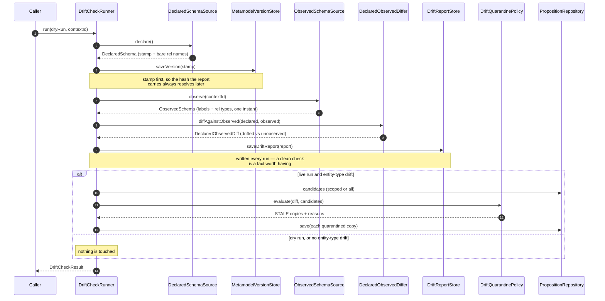

# Metamodel drift: checking a live graph against what you declared

A stamp says whether the schema moved. A diff says what moved. Neither of them looks at the graph.

This note is about the step that does: a **drift check**, which takes the schema an application says
it governs, goes and sees what a live graph is actually holding, writes down where the two disagree,
and — only if you ask it to — pulls the propositions that disagreement stranded out of normal use.

The shape of a run is fixed, and every step of it leaves something behind:



## Three tiers, and why quarantine is last

Schema governance in DICE escalates in three steps, and they shipped in this order deliberately.

**Stamp and observe.** Capture the schema as a content hash and keep the history. Identity, no
opinions. See [metamodel-versioning.md](metamodel-versioning.md).

**Detect and report.** Compare — two declarations against each other, or a declaration against a
live graph — and write down what you find. This is where the drift check sits, and it is the
default: `run()` with no arguments is a dry, whole-graph check that persists a report and changes
nothing. Reporting is safe to leave running forever, so it should be the thing you never have to
think about.

**Quarantine.** Act on a lossy change by marking the affected propositions stale, never deleting
them. Opt-in, off by default, and one argument away: `run(dryRun = false)`. The contracts land here;
the wiring that actually schedules a live run arrives with the autoconfigure slice.

Each tier is only safe on top of the one below, and each is worth having alone. You can stamp for a
year without detecting, and detect for a year without quarantining. What is still not on the list is
*rejecting* undeclared types at write time: extraction is LLM-driven, and a type nobody declared is
often a real finding, so throwing it away at the door is the one thing that can't be undone later.

The prior art is worth naming, because it is the same instinct. RDF's SHACL doesn't refuse data that
violates a shape; it produces a **validation report** — a document listing each violation, what was
expected, and where. Validation is a thing you run against data that already exists, and its output
is evidence for a person, not a gate. A `DriftReport` is the same idea for a property graph: it names
the undeclared types, records the schema version they were judged against, and stays on file whether
or not anybody acts on it.

## Stamp before you report

A `DriftReport` records the `versionHash` of the declared schema it was measured against. That hash
is what turns an old report back into something meaningful — pull a report from six months ago, look
its hash up with `MetamodelVersionStore.findVersion`, and you get the exact shape that was expected
when the observation was taken.

That only works if the stamp is already in the store. So `DefaultDriftCheckRunner` saves the declared
version on **every** run, before it writes the report, even when the schema hasn't moved.

It looks wasteful and isn't. `saveVersion` upserts on `(schemaName, contentHash)`, so an unchanged
schema re-saves onto its own key and stores nothing new — the cost is one idempotent write per check.
What it buys is that a report can never name a hash nothing has recorded. Stamping afterwards, or
only when the schema changed, would leave exactly the reports that matter most — the first check
after somebody changed the schema — pointing at nothing.

## What counts as drift

The comparison itself is [`DeclaredObservedDiffer`](metamodel-diff.md), and it is asymmetric on
purpose:

- **Drifted** — observed in the graph, never declared. Actionable. Data is sitting there whose
  declaring integration has been removed, or was never registered, so nothing can tell it apart as
  valid or explain its shape.
- **Unobserved** — declared, but with no instances right now. Purely informational. A declared type
  with no data yet is an ordinary state, not a problem.

One subtlety decides whether a drift check is usable at all: **an inherited label is declared.** A
graph reports labels, and a type carries every label in its hierarchy — declare `Person` with parent
`Agent` and every `Person` node comes back carrying both. Comparing observed labels against declared
*type names* would call `Agent` undeclared drift on a schema nobody had touched, and on a live run
would quarantine perfectly good propositions for it. So the declared side of the comparison is the
type names plus the full label closure those types declare.

## Reports are bounded reads, always

`DriftReportStore` is the durable log: `saveDriftReport` plus three reads that name their scope at
the call site — `driftReports` (everything), `globalDriftReports` (unscoped whole-graph checks only),
`driftReportsInContext` (one context). Three names rather than one method with a nullable context,
because `driftReports(schema, null)` would have quietly meant "the global ones" while
`driftReports(schema)` meant "all of them": the same-looking call with a different answer.

Every read takes a `limit`, and optionally a `since` instant. There is no "give me all of them", and
that is not a convenience decision. A drift log grows once per check per schema forever, so an
unbounded read is a query that works on a laptop and falls over after a month of hourly checks — and
the caller who wrote it had no way to know. Callers ask for a page; they never ask for a table.

Bounding the reads is also why none of the three has a default implementation. Filtering a limited
page down to the global reports in memory would apply the limit *before* the filter, so a schema
whose recent history happened to be mostly context-scoped could report zero global drift while plenty
sat in the store — a wrong answer that looks like a right one. The scope has to go into the query, so
every backend writes all three.

## Quarantine: what it does, and what it refuses to do

A drift check that isn't a dry run hands the drifted types to a `DriftQuarantinePolicy`. The shipped
one, `MentionTypeDriftQuarantinePolicy`, quarantines a proposition when one of its entity mentions
names a type a **lossy** change touched:

| Change | Lossy? |
| --- | --- |
| Type removed | Yes — nothing describes those mentions any more |
| Type lost labels or whole properties | Yes — a mention may have relied on what's gone |
| Property narrowed: type changed, value ↔ reference, or cardinality shrank | Yes — the new shape may not hold the old data |
| Type, label or property added | No |
| Cardinality widened (`ONE` → `OPTIONAL` → `SET` → `LIST`) | No — everything that fit before still fits |

That last row is the ordering the policy uses: the four cardinalities line up by what they can hold,
so moving up is safe and moving down can strand something — a list of three doesn't fit in a single
value, and a list collapsing to a set drops duplicates. This is where the diff's deliberate refusal
to judge gets resolved. `MetamodelDiff` states that `age` went from `string` to `integer`; deciding
that this can strand data is policy, and it lives here.

Type changes count as lossy in **both** directions. We know the declared types moved; we don't know
how a backend stored the values or whether the new type can read the old ones, and guessing wrong in
the permissive direction leaves unreadable data looking healthy.

Two properties make this safe to run as routine maintenance:

- **Non-destructive.** Nothing is deleted and nothing is mutated. An affected proposition comes back
  as an immutable copy moved to `STALE` and annotated with a human-readable reason under
  `dice.metamodel.quarantine.reason`. Leaving drifted propositions in normal retrieval would corrupt
  query results; deleting them would destroy something a person might want to rescue. Quarantine
  takes the middle path — out of normal use, kept, and flagged with *why*.
- **Idempotent.** A proposition an earlier sweep already quarantined comes back in its own bucket,
  `AlreadyQuarantined`, untouched and with its original reason intact — never re-flagged, and never
  counted as conforming, so `conforming.size` stays an honest number. To force one back through
  evaluation, clear its reason metadata first. Status alone isn't enough to skip a proposition:
  ordinary decay makes propositions stale too, and those carry no reason and are still candidates.
  And that classification never depends on the diff in front of it. Being already quarantined is a
  fact about the proposition, so an empty or purely additive diff still sorts one into
  `alreadyQuarantined` — a shortcut there would report quarantined records as clean on exactly the
  runs that find nothing, which is most of them.

The policy decides; it never writes. The `STALE` copies come back to the caller, and the runner is
what persists them. That separation is exactly what lets a dry run produce the same decisions without
changing anything.

The runner reads and writes those propositions through `PropositionStore`, the base persistence
port — not `PropositionRepository`. A drift check only ever reads by context or in bulk and saves, so
demanding vector search, graph traversal and temporal query alongside would shut a plain
store-and-retrieve backend out of drift checking over capabilities it never uses.

## Scope is the blast radius

Every part of a run takes the same optional `ContextId`, and it means the same thing throughout: the
observed snapshot, the candidate propositions read for quarantine, and the persisted report are all
confined to that one context. A mis-declared schema in one context can then only ever quarantine
propositions in that same context — it has no way to reach another one. Pass `null` and the check
covers the whole graph.

## Using it

```kotlin
val runner = DefaultDriftCheckRunner(
    declaredSchemaSource = { DeclaredSchema.from(dataDictionary, governed) },
    versionStore = versionStore,
    observedSchemaSource = observedSchemaSource,
    differ = StructuralMetamodelDiffer(),
    driftReportStore = driftReportStore,
    quarantinePolicy = MentionTypeDriftQuarantinePolicy(),
    propositionStore = propositionStore,
)

// The default: dry, whole graph. Reports, changes nothing.
val result = runner.run()
if (result.hasDrift) {
    log.warn("undeclared in the graph: {} {}", result.driftedEntityTypes, result.driftedRelationshipTypes)
}

// Opt in to acting on it.
val live = runner.run(dryRun = false)
log.info("quarantined {} proposition(s)", live.quarantinedCount)

// What did the last week look like?
driftReportStore.globalDriftReports(schemaName, limit = 50, since = Instant.now().minus(7, ChronoUnit.DAYS))
```

`DriftCheckResult` reads its drifted types straight off the `report` it saved rather than keeping a
second copy, so what you log and what an operator later reads out of the store can't disagree.

The runner is stateless and schedules nothing. Running it repeatedly, or for different schemas at
once, is fine; two concurrent checks of the *same* schema aren't corrupting — each captures its own
complete snapshot — but they are wasteful, so serialize at the scheduling layer if that matters.

## What comes next

Two things are contracts here with no implementation yet. `DriftReportStore` and `ObservedSchemaSource`
need a graph-backed implementation — a Drivine-backed report store, and an observer that asks Neo4j
for its distinct labels and relationship types. And none of this is wired: there is no Spring
configuration in `dice-metamodel`, so a runner is an ordinary constructor call until the autoconfigure
slice assembles one, with quarantine still off unless a host turns it on.
