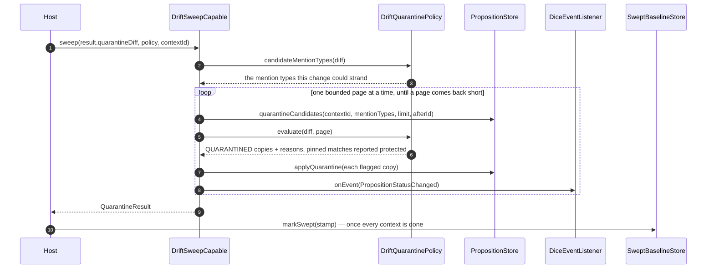
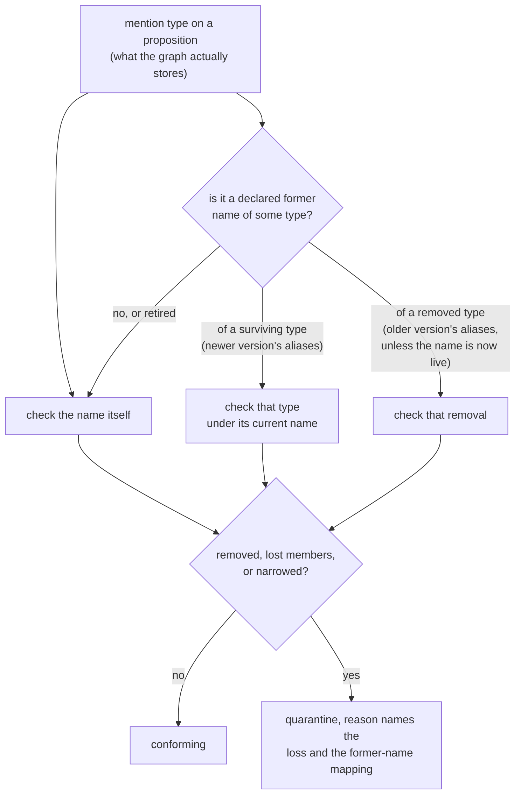

# Metamodel drift: checking a live graph against a declared schema

A drift check takes the schema an application declares, observes what a live graph is holding, and
records where the two disagree. Pulling the propositions that disagreement stranded out of normal use
is a separate, deliberate step a host takes afterwards.

Stamping and diffing both work on declarations. A drift check is the step that reads the graph.

## Two halves, and only one of them runs itself

**A check reports.** `DriftCheckRunner` has one mode. It reads, compares, writes a `DriftReport`, and
no path through it moves a proposition or the swept baseline. It holds no quarantine policy and no
proposition store, so there is nothing for it to move them with.

**A sweep acts.** `DriftSweepCapable` is the store-side SPI a host calls once it has read a report and
decided. Its candidate selection is bounded, confined to one `ContextId`, and filtered on mention
type. Nothing in DICE calls it on a timer, from a scheduler, or out of auto-configuration.

The split is what makes a report trustworthy. While a check could also act, a report was a preview of
one half of what a run would do, and the honest thing to say about it was that a clean report and a
quarantining run could describe the same state. Now a check reports the *whole* comparison a sweep
would evaluate — see [What a report carries](#what-a-report-carries) — so reading one and deciding
from it is sound.

The shape of a check is fixed, and every step leaves something behind:

```mermaid
sequenceDiagram
    autonumber
    participant Caller
    participant Runner as DriftCheckRunner
    participant Declared as DeclaredSchemaSource
    participant Versions as MetamodelVersionStore
    participant Observed as ObservedSchemaSource
    participant Differ as DeclaredObservedDiffer
    participant MetamodelDiffer as MetamodelDiffer
    participant Reports as DriftReportStore

    Caller->>Runner: run(contextId)
    Runner->>Declared: declare()
    Declared-->>Runner: DeclaredSchema (stamp + bare rel names)
    Runner->>Versions: sweptVersion(schemaName) — when the store is a SweptBaselineStore
    Versions-->>Runner: reconciled baseline, or null if no sweep has completed yet
    Runner->>Versions: saveVersion(stamp)
    Note over Runner,Versions: history write, every run;<br/>it leaves the reconciled baseline alone
    Runner->>Observed: observe(contextId)
    Observed-->>Runner: ObservedSchema (labels + rel types, one instant)
    Runner->>Differ: diffAgainstObserved(declared, observed)
    Differ-->>Runner: DeclaredObservedDiff (drifted vs unobserved)
    Runner->>MetamodelDiffer: diff(baseline, current) — only when a baseline exists
    MetamodelDiffer-->>Runner: declared-vs-previous MetamodelDiff
    Runner->>Reports: saveDriftReport(report, including the declared comparison)
    Note over Runner,Reports: written on every run, including<br/>checks that find nothing
    Runner-->>Caller: DriftCheckResult
```

A sweep is the second diagram, and a person starts it:



## The three tiers

Schema governance in DICE has three tiers, shipped in that order.

**Stamp and observe.** Capture the schema as a content hash and keep the history. See
[metamodel-versioning.md](metamodel-versioning.md).

**Detect and report.** Compare two declarations against each other, or a declaration against a live
graph, and record what you find. The drift check sits here, and it is all `DriftCheckRunner` does:
`run()` is a whole-graph check that persists a report and changes nothing.

**Quarantine.** Act on a lossy change by marking the affected propositions stale, which is a
different thing from deleting them. A host does this through `DriftSweepCapable`, at a moment it
chooses. This slice adds the contracts and a reference implementation; a durable store's own
implementation comes later. In a Boot app the wiring is described in
[metamodel-wiring.md](metamodel-wiring.md). Nothing schedules a check, and nothing sweeps unless a
host calls it.

Each tier builds on the one below it, and each is useful on its own. You can stamp for a year
without detecting, and detect for a year without quarantining. Rejecting undeclared types at write
time is still not on the list: extraction is LLM-driven, a type nobody declared is often a real
finding, and discarding it is the one thing that can't be undone later.

The prior art is RDF's SHACL, which validates data that already exists and reports each violation,
what was expected, and where, without blocking the write. A `DriftReport` is the same idea for a
property graph: it names the undeclared types, records the schema version they were judged against,
and stays on file whether or not anybody acts on it.

## Stamping the version before writing the report

A `DriftReport` records the `versionHash` of the declared schema it was measured against. Look that
hash up with `MetamodelVersionStore.findVersion` and a report from six months ago resolves back to
the exact schema shape expected when the observation was taken.

That works only while the stamp is in the store, so `DefaultDriftCheckRunner` saves the declared
version on every run, before it writes the report, including runs where the schema hasn't moved.

The cost is one idempotent write per check: `saveVersion` upserts on `(schemaName, contentHash)`, so
an unchanged schema re-saves onto its own key and stores nothing new. Stamping afterwards, or only
when the schema changed, would leave the first check after a schema change pointing at a hash
nothing recorded.

This is a history write only. It says nothing about which declaration quarantine should diff
against next — that's a separate, deliberately narrower pointer, covered under
[Two sources of drift](#two-sources-of-drift).

## What counts as drift

The comparison itself is [`DeclaredObservedDiffer`](metamodel-diff.md), and it is asymmetric on
purpose:

- **Drifted** — observed in the graph, never declared. Actionable. Data is sitting there whose
  declaring integration was removed or never registered, so nothing describes its shape or vouches
  for it.
- **Unobserved** — declared, with no instances at the moment. Informational: a declared type with no
  data yet is an ordinary state.

Inherited labels count as declared. A graph reports labels, and a type carries every label in its
hierarchy: declare `Person` with parent `Agent` and every `Person` node comes back carrying both.
Comparing observed labels against declared *type names* would report `Agent` as drift on a schema
nobody had touched, and a live run would quarantine sound propositions for it. So the declared side
of the comparison is the type names plus the full label closure those types declare.

## Every read of the drift log is bounded

`DriftReportStore` is the durable log: `saveDriftReport`, plus three reads that name their scope at
the call site — `driftReports` (everything), `globalDriftReports` (unscoped whole-graph checks only),
`driftReportsInContext` (one context). Three names rather than one method with a nullable context,
because `driftReports(schema, null)` would have meant "the global ones" while `driftReports(schema)`
meant "all of them": two near-identical calls with different answers.

Every read takes a `limit`, and optionally a `since` instant. There is no unbounded read. A drift log
grows once per check per schema forever, so an unbounded query works on a laptop and falls over after
a month of hourly checks.

That is also why none of the three has a default implementation. Filtering a limited page down to the
global reports in memory would apply the limit *before* the filter, so a schema whose recent history
was mostly context-scoped could report zero global drift while plenty sat in the store. The scope has
to go into the query, so every backend writes all three.

## Quarantine

A sweep hands a `DriftQuarantinePolicy` a single merged `MetamodelDiff` built from two independent
comparisons, and quarantines whatever the policy flags in either one.

### Two sources of drift

**Declared vs. observed** (`DeclaredObservedDiffer`, described above) catches a type the live graph
holds that this declaration doesn't recognise — the drift a `DriftReport` records. On its own, this
comparison is blind to a change that never shows up in the graph: a property the declaration quietly
narrowed or dropped on a type the graph and the declaration still agree the name of. Nothing about
that change is observed drift, because nothing about the *type* is undeclared — only its shape moved.

**Declared vs. previous declared** (`MetamodelDiffer`) closes that gap. Before its own history write,
the runner reads `SweptBaselineStore.sweptVersion` for this schema — the declaration the *last
completed sweep* reconciled against — and diffs it against the current declaration with the same
kind of comparison [metamodel-diff.md](metamodel-diff.md) describes for comparing any two versions.
Whatever moved — a removed property, a narrowed cardinality, a whole type dropped — reaches the
policy exactly like an observed removal does, because it becomes the same `MetamodelChange` entries
the policy already knows how to judge. There is no baseline on a schema's first-ever check, so this
half doesn't run at all.

The two comparisons are merged into one diff before the policy sees it, evaluated once — never as two
separate sweeps that could each make an independent call about the same proposition.

### What a report carries

A `DriftReport` records both halves. `driftedEntityTypes` and `driftedRelationshipTypes` are the
graph-truth signal — "the graph holds something nobody declared" — an operator watching the log wants.
`declaredDiff` is how the declaration itself moved since the last completed sweep, and it is `null`
when there was no baseline to compare against. `DriftReport.quarantineDiff(declaredVersion)` merges
the two into the exact comparison a sweep evaluates, and `DriftCheckResult.quarantineDiff` is the same
thing off a live result.

Carrying both is what makes a report a sound basis for deciding. A report holding only the graph-truth
half could read completely clean while a sweep on the very same state quarantined, because a property
that quietly narrowed shows up in neither drifted set. The person who checked would have had no way to
know. `hasDrift` still answers the narrow graph-truth question; `hasAnyChange` answers "would a sweep
have anything at all to look at?".

The declared comparison is part of the record, so a `DriftReportStore` backend persists it alongside
the drifted type sets. A report read back out of the store a year later resolves to the same
`quarantineDiff` the live result did.

### Where this lives

The quarantine policy and the sweep SPI — `DriftQuarantinePolicy`, `DriftSweepCapable`,
`MentionTypeDriftQuarantinePolicy`, `PropositionStoreDriftSweep` — sit in `dice` core, in
`com.embabel.dice.spi`, beside the other proposition lifecycle policies. They move a proposition
between lifecycle statuses, which is what that package is for, and putting them there is what keeps
the module dependency pointing one way: `dice` reads a `MetamodelDiff`, and `dice-metamodel` stays a
leaf over the agent `DataDictionary` with no view of the proposition model at all. A drift check
therefore has no type through which it could reach a proposition, which is the structural half of
"a check changes nothing".

### The sweep SPI

`DriftSweepCapable` is three store operations plus one `sweep` that composes them:

- `quarantineCandidates(contextId, mentionTypes, limit, afterId)` — **bounded** by `limit`,
  **scoped** to one required `ContextId`, and **filtered** on mention type by the backend, ordered by
  proposition id so `afterId` is a usable cursor. All three are contract requirements, spelled out in
  the KDoc. Reading every proposition and filtering afterwards materialises every tenant in one heap,
  and costs the size of the store on a change that touches one type.
- `applyQuarantine(decision)` — persist one `QUARANTINED` copy the policy built, and announce the
  transition.
- `releaseFromQuarantine(propositionId)` — see [Release](#release) below.

The mention types come from `DriftQuarantinePolicy.candidateMentionTypes(diff)`, so the store needs no
policy knowledge of its own. The contract that makes that sound: a proposition whose mention types are
all outside that set must evaluate to conforming, or a bounded sweep would skip something it should
have caught. Both spellings of every name are offered, since a declaration can be fully qualified
where a graph writes the simple label.

A store implements `DriftSweepCapable` when its backend can honour that. One that can't sweeps through
`PropositionStoreDriftSweep`, the reference implementation, which works over any `PropositionStore` and
is honest about the cost: it reads the one context and applies the mention-type filter, the ordering
and the page bound in the JVM. The context bound is real there — the read never leaves the context —
and the rest is the part a backend should push down.

### `QUARANTINED` is a status, so the hold has an owner

A quarantined proposition carries `PropositionStatus.QUARANTINED`. It reads like `STALE` to anything
filtering on `ACTIVE`, so it drops out of retrieval, projection and consolidation the same way. The
difference is who owns it.

`STALE` is decay's status: decay puts propositions there and `DecayStatusPolicy` takes them back out
again once utility climbs past the recovery ceiling. A quarantine expressed as `STALE` plus a metadata
note would sit directly in that path — and confidence says nothing about whether the schema change has
been dealt with, so a confident proposition held for drift would be revived by the next decay sweep,
held again by the next drift sweep, and the two would take turns indefinitely. Recovery from
quarantine would be a side effect of that overlap, with no operation behind it.

With a status of its own the hold is exact:

- Reads that filter on `ACTIVE` exclude it structurally, with nothing new to remember.
- `DecayStatusPolicy` never sees a `STALE` to revive, and returns `null` for `QUARANTINED` outright,
  so a host that widens `DecaySweepConfig.targetStatuses` to every status still can't lift a hold.
- Contradiction resolution and the abstraction pass read `ACTIVE` propositions, so neither can move one.
- `pruneStale` deletes `STALE` propositions and leaves quarantined ones alone.
- The idempotency check is the status, so editing the reason metadata by hand doesn't release anything.
- Release is an explicit transition with a name.

`ProjectionLineageStaleCascade` treats `QUARANTINED` as terminal alongside `SUPERSEDED`,
`CONTRADICTED` and `STALE`: the proposition has left ordinary use, so anything projected from it is no
longer backed by a live belief.

### Release

Quarantine is reversible, and `releaseFromQuarantine` is what reverses it: it restores the status the
proposition carried before quarantine and clears both quarantine keys in one write.

Release is the **only** way out. Which propositions are held is read off `PropositionStatus.QUARANTINED`,
so clearing `dice.metamodel.quarantine.reason` by hand changes nothing about the hold: the proposition
stays out of ordinary retrieval with nothing on it saying why. Every lifecycle policy in DICE leaves
`QUARANTINED` alone, so no decay sweep and no consolidation pass can lift it either.

The status to restore comes from `dice.metamodel.quarantine.previousStatus`, which the policy writes
onto the quarantined copy at the moment it flags it — a proposition can be quarantined from any
status, ordinary decay's `STALE` included, so a release with nothing recorded could only guess. A
proposition carrying no usable value there goes back to `ACTIVE`, which is what "let this back into
use" means once the record is gone.

Releasing a proposition that isn't quarantined answers `null` and changes nothing, so releasing twice
is safe.

#### The baseline only moves once a sweep finishes

`sweptVersion` is a pointer to one reconciled declaration per schema, tracked apart from the ordinary
stamp history above. **A completed sweep is the only thing that may move it**, and the host that ran
the sweep is what calls `SweptBaselineStore.markSwept`, once every context it meant to reconcile is
done. Three writes look tempting and are all wrong:

- A **drift check** never marks. It reads `sweptVersion`, computes the declared-vs-previous diff, and
  reports it. The lossy change it found is still waiting for somebody to act on, so retiring it would
  mean the next check compared the declaration against itself and found nothing at all.
- A sweep **scoped to one context** reconciled that context alone. Marking after it would tell every
  other context's later check "this declaration is already reconciled," when only one context's
  candidates were ever looked at.
- An **interrupted** sweep leaves `markSwept` uncalled, because the host never reaches it, so the
  next check sees the same unreconciled baseline and the next sweep retries the same comparison. The
  already-quarantined bucket makes that retry safe: anything the interrupted sweep did manage to save
  comes back as already handled, and never re-flagged.

Marking after a sweep that found nothing to quarantine is correct. "Nothing needed doing" is a
completed reconciliation against that declaration.

`sweptVersion` and `markSwept` live on `SweptBaselineStore`, a separate interface a version store
implements when it can keep the pointer honestly, with **no default bodies**. That absence is the
point. A forwarding default answering `MetamodelVersionStore.latestVersion` made every store look like
it tracked a baseline while answering with write order, so a check's own stamp moved what the next
sweep treated as already reconciled. A store implementing nothing here reports `declaredDiff = null`
and gets the graph-truth half alone, which is the honest answer.

`sweptVersion` is also a different question from `latestVersion`, which the store's own doc covers in
detail: `latestVersion` tracks write order and answers wrong once a declaration cycles back to a stamp
it already used before.

### Lossy changes

The shipped policy, `MentionTypeDriftQuarantinePolicy`, quarantines a proposition when one of its
entity mentions names a type a **lossy** change touched, wherever that change came from:

| Change | Lossy? |
| --- | --- |
| Type removed | Yes — nothing describes those mentions any more |
| Type lost labels or whole properties | Yes — a mention may have relied on what's gone |
| Property narrowed: value ↔ reference, cardinality shrank, or the type moved outside the widening allow-list | Yes — the new shape may not hold the old data |
| Type, label or property added | No |
| Cardinality widened (`ONE` → `OPTIONAL` → `SET` → `LIST`) | No — everything that fit before still fits |
| Value type promoted within the allow-list (`int` → `long`, and three more) | No — every old value has an exact representation |
| Type renamed under a declared alias | No on its own; whatever else moved on the type is judged separately |
| Property renamed under a declared alias | No on its own; the paired signatures are judged by the narrowing row |
| Declared former names added or retired | No — the declaration's list of old names moved, and no data went with it |

The cardinality row is an ordering the policy uses: the four cardinalities line up by what they can
hold, so moving up is safe and moving down can strand something. A list of three doesn't fit in a
single value, and a list collapsing to a set drops duplicates. The diff itself makes no judgement.
`MetamodelDiff` states that `age` went from `string` to `integer`; deciding whether that can strand
data is this policy's job.

Outside the widening allow-list, a type change counts as lossy in **both** directions. We know the
declared types moved; we don't know how a backend stored the values or whether the new type can read
the old ones, and guessing wrong in the permissive direction leaves unreadable data looking healthy.

### Declared renames

A rename is a fact the declaration states, so on its own it strands nothing.
`EntityTypeRenamed` and `PropertyRenamed` are non-lossy per se, and `EntityTypeAliasesChanged` never
quarantines at all.

**A declared rename or alias changes how the diff and the drift check read old data. Nothing rewrites
a stored mention type.** A proposition extracted under `Person` still says `Person` after the schema
renames the type to `Human`, and it says `Person` forever; what the declaration buys is that both
halves of a drift check know the two names belong together, so a later loss on `Human` reaches that
proposition and an observed `Person` in the graph is read as declared. There is no migration here and
no backfill to schedule.

That holds for a type rename **by construction**, because of what the differ does upstream. A type's
own name is one of its labels, so `Person` becoming `Human` mechanically loses the label `Person`;
the same swap propagates into every referrer's signature and every child's inherited label. The
differ folds all of it into `EntityTypeRenamed`, so none of it reaches this policy as a removed label
or a changed signature. See [metamodel-diff.md](metamodel-diff.md#comparison-modulo-renames). A
parent label that genuinely went away survives the fold, reports on the paired type, and quarantines
normally.

A property rename carries a before and an after signature, and those two can differ in more than the
name. `PropertyRenamed` exposes the same `typeChanged` / `cardinalityChanged` / `kindChanged` that
`PropertySignatureChanged` does, and the policy runs one narrowing rule over both. So `age: integer
LIST` renamed to `years: integer ONE` quarantines, and `age: int` renamed to `years: long` does not.

**Matching goes through every former name.** Whatever else moved on a renamed type is reported under
the type's **new** name, and the data in the graph still carries the old one. Matching mention types
against the new name alone would let a lossy change escape every proposition it stranded — the
old-name evasion hole. So a mention type is checked against its own name plus every current type
name that used to go by it, read off `MetamodelVersion.entityTypeAliases` on the newer side.

The whole declared alias map is read, not just the renames the diff in hand happens to contain. A
rename and a loss usually land in different releases: stamp 2 renames `Person` to `Human`, stamp 3
drops a property, and the stamp-2-to-stamp-3 diff holds no rename at all — while the graph still
holds nodes labelled `Person`, and the observed-side rule keeps that old label legally in the graph
indefinitely. Keying off the diff's rename entries would let that loss pass silently over every
proposition it stranded. Reading the declaration instead is safe because of the reuse-collision
refusal: an alias may not name a type the schema still declares, so no former name can shadow a live
type.

A **removed** type is resolved from the older version instead. Deleting `C` outright leaves
`removedEntityTypes = [C]`, and the newer version has no entry for `C` at all, so nothing on that
side records that `A` and `B` were ever its names. Reading the removal's former names off the older
side is what keeps data labelled `A` from conforming while no declared type describes it. The one
exclusion is a former name the newer version declares as a live type of its own: reusing a retired
name is legal once the type that claimed it is gone, and the removal's rationale — nothing describes
those mentions any more — is false when the schema declares a type by that exact name, so data under
it is judged as that live type's.

Retiring a former name stops it matching. Retirement is a declaration that the schema no longer
claims the name, and from then on data still carrying it is reported by the observed-side comparison
as ordinary undeclared drift, which is the louder signal of the two.

Former names accumulate rather than shifting one hop at a time. A type renamed `A` → `B` → `C`
declares `{A, B}`, so a lossy change on `C` — or `C` being removed — quarantines data labelled `A`,
`B` or `C` alike: however many renames deep the old label sits, whether or not the intermediate stamp
was ever diffed against, and whether or not the rename rides in the same diff as the loss:



A former name can point at more than one current type. The declaration guard refuses an alias naming
a type the schema still declares, and says nothing about two live types both claiming one retired
name. Nothing distinguishes which of the two a piece of data under that name belongs to, so it is
checked against both and a lossy change on either quarantines it.

The reason text says which current type an old name resolved to. Without that, an operator reads a
complaint about `Human` on a proposition whose mentions all say `Person`.

### The type-widening allow-list

Four value type changes are treated as safe:

| Before | After |
| --- | --- |
| `int` | `long` |
| `float` | `double` |
| `Integer` | `Long` |
| `Float` | `Double` |

Iceberg defines two of these as safe column promotions, `int` → `long` and `float` → `double`. The
boxed pair is the same two promotions as a JVM dictionary spells them, and Iceberg's reason carries
over: every value of the older type has an exact representation in the newer one, so nothing already
written needs rewriting or can fail to read back.

Primitive to primitive and boxed to boxed only. `int` → `Long` is a boxing change and `Integer` →
`long` a nullability change; both move what the property can hold beyond its numeric range. Narrowing
is never safe, so no pair appears reversed. The allow-list is scoped to `Kind.VALUE`, since a
reference target names an entity type and one entity type is never a promotion of another.

The names in the table are the ones a stamp actually carries. `PropertySignature.of` copies the
dictionary's type string verbatim, and for a JVM-reflected type that string is
`Class.getSimpleName()` — so a Kotlin `Int` field renders as `int` and a nullable `Int?` as
`Integer`. `DriftQuarantinePolicyTest` renders a real eight-field declaration through the same path
and asserts each of the eight names, so a rendering change upstream fails the build instead of
quietly emptying the list.

Swap in a different `DriftQuarantinePolicy` if your storage makes more promotions provably safe.

Three properties make this safe to run as routine maintenance:

- **Non-destructive.** Nothing is deleted and nothing is mutated. An affected proposition comes back
  as an immutable copy moved to `QUARANTINED`, annotated with a human-readable reason under
  `dice.metamodel.quarantine.reason`. Leaving drifted propositions in normal retrieval would corrupt
  query results; deleting them would destroy something a person might want to rescue.
- **Idempotent.** A proposition an earlier sweep quarantined comes back in its own
  `alreadyQuarantined` bucket, untouched and with its original reason intact, so it is neither
  re-flagged nor counted in `conforming`. To force one back through evaluation, release it. The
  check is the status and nothing else: `QUARANTINED` means held, while a proposition ordinary decay
  left `STALE` is a live candidate here like any other. The classification doesn't
  depend on the diff in front of it: being already quarantined is a fact about the proposition, so
  an empty or purely additive diff still sorts one into `alreadyQuarantined`. Skipping the check on
  an empty diff would report quarantined records as conforming on every run that finds no drift.
- **Respects pinning.** A pinned proposition a lossy change would otherwise catch is left exactly as
  it was and reported in its own `protected` bucket. Pinning is DICE's cross-cutting promise that a
  proposition resists reclamation — the decay collector, the sweep policy and contradiction
  resolution already honor it — and quarantine is one more reclamation path that has to keep the same
  promise. A proposition an earlier sweep already
  quarantined before it was pinned is unaffected: idempotency is checked first, so it stays
  `alreadyQuarantined`.

The policy decides and doesn't write. The `QUARANTINED` copies it returns come back to the caller, and the
sweep persists them through `applyQuarantine`. A drift check never calls `evaluate` at all, so there
is no policy decision for it to persist.

`PropositionStoreDriftSweep` reads and writes those propositions through `PropositionStore`, the base
persistence port, and never `PropositionRepository`. A sweep reads by context and saves; requiring
vector search, graph traversal and temporal query alongside would shut a plain store-and-retrieve
backend out of drift work over capabilities it never uses.

### Announcing a quarantine

Each proposition a sweep actually quarantines is announced to a `DiceEventListener` as a
`PropositionStatusChanged` (`previousStatus` the status it carried in, `newStatus` `QUARANTINED`,
`reason` the same text the metadata carries), right after it is saved. A release announces the
transition back. This is what lets something like `ProjectionLineageStaleCascade` hear that a
proposition left ordinary use and mark its projection records stale in turn.

A proposition can arrive at the sweep already `STALE` from ordinary decay, and the policy treats that
as a fresh candidate — the idempotency rule skips one that is *already quarantined*, which is a
status of its own. Quarantining that proposition moves it from `STALE` to `QUARANTINED`, the event
says exactly that, and a later release puts it back to `STALE`.

The sweep emits this itself. The injected `PropositionStore` is never asked to notice the
transition and emit it on its own — the way `EventEmittingPropositionRepository` does when an
application chooses to wrap its repository in one — because that would make the signal conditional
on a wiring choice made somewhere else entirely, and silently absent for an application that wires a
plain, undecorated store, which is what auto-configuration hands out by default. Emitting the event
from inside the sweep, the same way `DefaultCollectorRunner` already emits its own transitions,
means the signal fires wherever the sweep runs, independent of what store backs it. `listener`
defaults to a no-op, so nothing about the rest of this section changes for a caller who isn't
listening.

## Prior art

SHACL is the model for the report half, and it is already described above: validate data that exists,
record each violation with what was expected and where, don't block the write.

**Delta Lake's `_rescued_data`** is the model for the quarantine half. When a Delta read finds a
column whose value doesn't fit the declared schema, the value is captured into a `_rescued_data`
column rather than dropped, and the row still lands. The stance is that data an extraction already
produced is evidence: a schema that no longer describes it sets that data aside for a person to look
at, and deletes nothing. Quarantine is the same move on a proposition — `QUARANTINED`, annotated with
a reason, still in the store, still readable, and reversible through `releaseFromQuarantine`.

**Enforcement and evolution are separate settings**, which is how Delta and the Snowflake-style
lakehouses organize this. Enforcement asks whether an incoming write matches; evolution asks whether
the schema should move to accommodate it. DICE splits them the same way, and both halves are opt-in:
the declared schema — which types a `GovernedTypeSelector` governs and what `SchemaAliases` says they
used to be called — is the enforcement side, and calling `DriftSweepCapable.sweep` is what a host
does about a mismatch. A schema that governs nothing enforces nothing, and a check changes nothing
whatever it finds.

### Not adopted: auto-adopting additive drift

Snowflake can evolve a table to accept a column an incoming file carries but the table doesn't,
adding it automatically when the change is purely additive. The equivalent here would be a drift
check that saw an undeclared entity type, decided it was additive, and folded it into the declared
schema on its own.

DICE does not do this, and the reason is the input. A Snowflake load is a file whose columns a person
or a pipeline produced deliberately. A DICE type comes out of an LLM reading raw text, and a
misparse, a hallucinated type name and a genuine new domain concept are indistinguishable at the
moment they appear. Auto-adoption would write the misparse into the declared schema, move
`contentHash`, and produce a stamp nobody chose that then reads as authoritative. It also removes the
signal: a drift report exists to tell a person the graph is holding something nobody declared, and a
check that declares it has nothing left to report.

If it is ever wanted, the shape that would be safe:

- **Opt-in per type**, on the same `GovernedTypeSelector` seam governance already uses, with no
  global switch;
- **additive only**, and refused for anything that removes or reshapes;
- **capped** per run, so a bad extraction batch can't rewrite a schema wholesale;
- **provenance-recorded**, with the stamp itself naming the check that caused it, so the history
  says which stamps a machine wrote and which a person did.

## Scope

A check takes an optional `ContextId`: the observed snapshot and the persisted report are both
confined to that one context, and `null` covers the whole graph.

A sweep takes a **required** one. There is no whole-graph sweep, so a mis-declared schema in one
context has no way to reach another context's propositions. A host that means to reconcile several
contexts sweeps each in turn and marks the baseline once they are all done.

## Using it

```kotlin
val differ = StructuralMetamodelDiffer() // implements both differ interfaces below
val runner = DefaultDriftCheckRunner(
    declaredSchemaSource = { DeclaredSchema.from(dataDictionary, governed) },
    versionStore = versionStore, // a SweptBaselineStore, to get the declared comparison too
    observedSchemaSource = observedSchemaSource,
    differ = differ,
    metamodelDiffer = differ,
    driftReportStore = driftReportStore,
)

// A check. Reports, changes nothing.
val result = runner.run()
if (result.hasDrift) {
    log.warn("undeclared in the graph: {} {}", result.driftedEntityTypes, result.driftedRelationshipTypes)
}
if (result.hasAnyChange) {
    log.warn("a sweep would evaluate: {}", result.quarantineDiff.changes)
}

// What did the last week look like?
driftReportStore.globalDriftReports(schemaName, limit = 50, since = Instant.now().minus(7, ChronoUnit.DAYS))
```

Acting on it is a separate call a person decides to make:

```kotlin
val sweep = PropositionStoreDriftSweep(
    propositionStore,
    SafeDiceEventListener(projectionLineageStaleCascade), // optional; defaults to a no-op
)

for (contextId in contextsToReconcile) {
    val swept = sweep.sweep(result.quarantineDiff, MentionTypeDriftQuarantinePolicy(), contextId)
    log.info("quarantined {} proposition(s) in {}", swept.quarantined.size, contextId)
}
// Only now, with every context done, has anything actually been reconciled.
versionStore.markSwept(result.declaredVersion)

// Changed your mind about one of them?
sweep.releaseFromQuarantine(propositionId)
```

`DriftCheckResult` reads its drifted types off the `report` it saved and keeps no second copy, so what
you log and what an operator later reads out of the store can't disagree.

The runner is stateless and schedules nothing. Running it repeatedly, or for different schemas at
once, is fine. Two concurrent checks of the same schema don't corrupt anything, since each captures
its own complete snapshot, but they duplicate work; serialize at the scheduling layer if that
matters.

## Persistence

Both storage-side contracts are implemented in `dice-storage`, against Neo4j via Drivine.

`DrivineDriftReportStore` keeps each check as a `(:MetamodelDriftReport)` node, MERGEd on the
natural key `(schemaName, versionHash, capturedAt, contextKey)`, where `contextKey` is `global` for
an unscoped check and `ctx:<id>` for a scoped one, because a Cypher MERGE cannot key on a null. The
prefix makes the encoding injective: `ContextId` accepts any non-blank string, so an unprefixed id
plus a bare sentinel would let a context named after the sentinel share a key with the global bucket
and rewrite its scope. Each of the three bounded reads is its own statement with its scope in the
`WHERE` clause and the `LIMIT` after it. Filtering a page that has already been cut applies the limit
ahead of the scope, and can report zero global drift while plenty sits in the store. Reports come
back newest first by capture instant, compared to the nanosecond so a `since` window stays exact,
with a per-schema counter breaking exact ties so a limited page is repeatable.

`DrivineObservedSchemaSource` takes the snapshot. Unscoped, it reads the database's own catalogue
(`db.labels()`, `db.relationshipTypes()`) **and** asks dice's own propositions for the distinct
`Mention.type` values they carry, reporting those in their own set; scoped to a context, it derives
entity types from that context's mentions and relationship types from the `sourcePropositions` each
projected edge carries. Either way
it subtracts dice's own storage: the proposition, mention, provenance, lineage, collector-trace and
metamodel node labels, and the `HAS_MENTION`/`DERIVED_FROM`-style edges. That subtraction is
load-bearing. Stamping a version and writing a report both add nodes to the graph the next check
looks at, so without it every run reports the previous run as drift.

The second question the unscoped path asks is there because a mention type reaches `db.labels()`
only once something projects a node for it. An extraction that recorded `Ghost` and produced no
`(:Ghost)` node left a graph full of undeclared data looking clean to every whole-graph check, while
the context-scoped check on the same data reported it. The global query holds both ends to dice's
own shape, so mention types come off dice's extraction records and a domain node wearing
`:Proposition` contributes nothing.

Ownership goes by node shape, so that a domain type called `Source` stays visible. A dice label is
excluded only while every node carrying it matches dice's shape for it, and a dice relationship type
only while no edge of that type carries `sourcePropositions`, the marker the graph writer stamps on
every edge it projects from domain data. The context-scoped query selects on the same marker.

The shapes are derived, in `DiceOwnedSchema`, from the storage definitions themselves. A node
fragment's shape is every constructor parameter dice's writer cannot leave out — declared non-null
with no default — so `Source` is `key` **and** `kind`, and a host's own `(:Source {key: ...})` stays
observable where a key-only rule would have hidden it. A Cypher-backed store's shape is the union of
the properties its uniqueness constraints name, which is what it MERGEs on. Adding a label to
`MetamodelSchema`, `CollectorTraceSchema` or `LineageSchema` carries its shape along with it, and an
integration test writes through the real stores and asserts dice never reports its own nodes.

Three limits follow. Ownership is decided per label, so a graph mixing a domain `Source` with dice's
own reports `Source` every run until the type is declared. Deciding it costs a scan of dice's own
labels on each unscoped observation; context-scoped checks don't pay it. And a domain node carrying
every property dice writes for a label they share is indistinguishable from dice's own; closing that
last case needs an ownership marker written at persistence time, which is a data migration for
existing graphs.

`observe` runs its whole set of queries — bookkeeping-exclusion probes included — inside one Neo4j
transaction, so the several reads that get assembled into one `ObservedSchema` come from a single
transaction's view of the graph, closing the case where a concurrent write landing between separately
transacted queries produces a combined observation the graph never actually held at any instant.
Neo4j's default isolation level is read committed, and that guarantee holds per row, leaving both a
statement and a transaction free to see the graph shift underneath them: a write that commits mid-statement can still land in that same statement's own
result set, so a single statement can itself see a non-repeatable, missing, or double read of data
it touches more than once while it runs, and its rows are not guaranteed to reflect one coherent
instant of the graph, on top of the residual race between two different statements inside the same
transaction. This narrows the exposure to the span of one transaction and rules out reads that were
never even in the same transaction, and no more than that; the method's own KDoc states the residual
plainly.

The observation also tags what kind of name its entity types are: `ObservedSchema.EntityTypeBasis`,
`GRAPH_LABELS` for the unscoped path and `MENTION_TYPES` for the context-scoped one. The two answer
different questions. A Neo4j label carries a type's whole declared hierarchy — `Person` with parent
`Agent` puts both labels on every `Person` node — so the differ's declared side for a `GRAPH_LABELS`
observation widens to every label a declared type carries. `Mention.type` is domain data an extractor
wrote, and a governed type's inherited label has no bearing on it, so the differ's declared side for a
`MENTION_TYPES` observation stays on declared type names and their declared former names, with no
widening. Tagging the two the same way let a mention typed `Agent` conform under a schema that only
governs `Person` with parent `Agent` — an undeclared mention type escaping detection by riding a
governed type's parent label — until the observation itself carried which comparison it needs.

An unscoped observation holds both kinds of name, in two sets. `entityTypeNames` carries the labels
and states its basis as before; `ObservedSchema.mentionTypeNames` carries the mention types, needs no
tag, and is always judged by the `MENTION_TYPES` rule. `StructuralMetamodelDiffer.diffAgainstObserved`
compares each set with the declared side its own rule calls for, and unions what drifted. One set for both would have
to pick one rule: picking the label rule reopens exactly what the mention rule closes — a mention
typed `Agent` passing under a schema that governs `Person` with parent label `Agent` and declares no
`Agent` type — and picking the mention rule reports every inherited parent label in the graph as
drift. An unscoped check and a context-scoped one now read mention types the same strict way. Any
source that can only reach a label catalogue leaves `mentionTypeNames` empty, and the comparison is
what it always was.

Hosts declare the constraints these stores need (see `MetamodelSchema`); a MERGE is race-free only
under a uniqueness constraint on the key it merges on.

## What comes next

`DriftReportStore` and `ObservedSchemaSource` now have Drivine implementations in `dice-storage`.

`SweptBaselineStore` now has a durable implementation: `DrivineMetamodelVersionStore` declares it and
keeps the reconciled baseline as `sweptContentHash` on the schema's own `(:MetamodelSchemaCounter)`
node, moved by `markSwept` alone. A Drivine-backed host therefore gets the declared-vs-previous half
of a report as soon as its first sweep completes, and the shared contract suite
(`AbstractMetamodelVersionStoreContractTest`) runs against the graph store and the in-memory
reference alike.

`DriftSweepCapable` is still a contract with an in-memory reference implementation and no durable
one. Until the graph-backed store implements it, a host sweeps through `PropositionStoreDriftSweep`,
which is correct and does its filtering in the JVM.

There is no Spring configuration in `dice-metamodel` or `dice-storage`, so a runner is an ordinary
constructor call until the autoconfigure slice assembles one, and nothing sweeps unless a host
calls it.

**Registration-time compatibility evaluation** is deferred design, tracked under the metamodel epic
(`embabel/dice#45`) until it gets its own issue. A registry-style compatibility check would grade a
new stamp against the one before it — backward, forward, full — at the moment it is registered. The
shape that fits DICE is advisory and post-stamp: the stamp is always taken, and the grade is recorded
beside it rather than gating the write, because stamping is what makes the history usable and a
rejecting gate is bypassable by anything that writes to the graph directly. The grading itself would
be a decision table over `MetamodelChange` kinds, since each kind already carries what a grade needs:
`EntityTypeAdded` is backward-compatible, `EntityTypeRemoved` is not, a `PropertySignatureChanged`
grades on the same narrowing rule this policy uses, and a paired rename grades on the delta inside
it. The two rev-1 design reviews archived under the roadmap dish are the input: both showed that
transplanting a registry's mode taxonomy wholesale fails here, so the taxonomy is the part that needs
designing.
