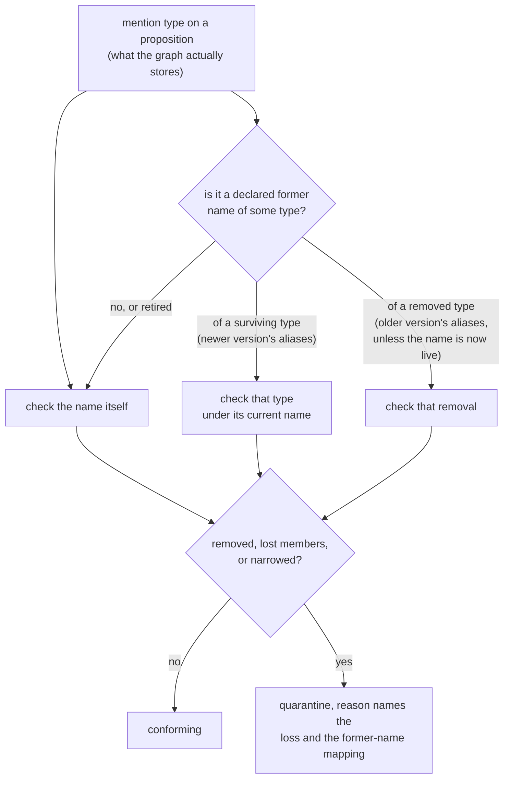

# Metamodel drift: checking a live graph against a declared schema

A drift check takes the schema an application declares, observes what a live graph is holding,
records where the two disagree, and, when asked to, pulls the propositions that disagreement
stranded out of normal use.

Stamping and diffing both work on declarations. A drift check is the step that reads the graph.

The shape of a run is fixed, and every step leaves something behind:

```mermaid
sequenceDiagram
    autonumber
    participant Caller
    participant Runner as DriftCheckRunner
    participant Declared as DeclaredSchemaSource
    participant Versions as MetamodelVersionStore
    participant Observed as ObservedSchemaSource
    participant Differ as DeclaredObservedDiffer
    participant MetamodelDiffer as MetamodelDiffer
    participant Reports as DriftReportStore
    participant Policy as DriftQuarantinePolicy
    participant Props as PropositionRepository
    participant Listener as DiceEventListener

    Caller->>Runner: run(dryRun, contextId)
    Runner->>Declared: declare()
    Declared-->>Runner: DeclaredSchema (stamp + bare rel names)
    Runner->>Versions: sweptVersion(schemaName)
    Versions-->>Runner: reconciled baseline, or null if no sweep has completed yet
    Runner->>Versions: saveVersion(stamp)
    Note over Runner,Versions: history write, every run, dry or live;<br/>on a store without independent tracking, moves the<br/>reconciled baseline too, but only when the stamp is new
    Runner->>Observed: observe(contextId)
    Observed-->>Runner: ObservedSchema (labels + rel types, one instant)
    Runner->>Differ: diffAgainstObserved(declared, observed)
    Differ-->>Runner: DeclaredObservedDiff (drifted vs unobserved)
    Runner->>MetamodelDiffer: diff(baseline, current) — only when a baseline exists
    MetamodelDiffer-->>Runner: declared-vs-previous MetamodelDiff
    Runner->>Reports: saveDriftReport(report)
    Note over Runner,Reports: written on every run, including<br/>checks that find nothing
    alt live run and (entity-type observed drift or a non-empty declared-vs-previous diff)
        Runner->>Props: candidates (scoped or all)
        Runner->>Policy: evaluate(merged diff, candidates)
        Policy-->>Runner: STALE copies + reasons, pinned matches reported protected
        Runner->>Props: save(each quarantined copy)
        Runner->>Listener: onEvent(PropositionStatusChanged), skipped if status didn't move
    else dry run, or relationship-only/no drift from either comparison
        Note over Runner: nothing is touched, nothing is emitted
    end
    alt live run AND unscoped (contextId is null)
        Runner->>Versions: markSwept(stamp)
        Note over Runner,Versions: on a store with independent tracking, this is<br/>the moment the reconciled baseline advances; a default-forwarding<br/>store's baseline follows write order instead — a new stamp moved it<br/>back at saveVersion, a re-saved stamp never moves it
    end
    Runner-->>Caller: DriftCheckResult
```

## The three tiers

Schema governance in DICE has three tiers, shipped in that order.

**Stamp and observe.** Capture the schema as a content hash and keep the history. See
[metamodel-versioning.md](metamodel-versioning.md).

**Detect and report.** Compare two declarations against each other, or a declaration against a live
graph, and record what you find. The drift check sits here, and it is the default: `run()` with no
arguments is a dry, whole-graph check that persists a report and changes nothing.

**Quarantine.** Act on a lossy change by marking the affected propositions stale rather than
deleting them. Off by default; `run(dryRun = false)` turns it on. This slice adds the contracts, and
the wiring that schedules a live run arrives with the autoconfigure slice.

Each tier builds on the one below it, and each is useful on its own. You can stamp for a year
without detecting, and detect for a year without quarantining. Rejecting undeclared types at write
time is still not on the list: extraction is LLM-driven, a type nobody declared is often a real
finding, and discarding it is the one thing that can't be undone later.

The prior art is RDF's SHACL, which validates data that already exists and reports each violation,
what was expected, and where, without blocking the write. A `DriftReport` is the same idea for a
property graph: it names the undeclared types, records the schema version they were judged against,
and stays on file whether or not anybody acts on it.

## Stamping the version before writing the report

A `DriftReport` records the `versionHash` of the declared schema it was measured against. Look that
hash up with `MetamodelVersionStore.findVersion` and a report from six months ago resolves back to
the exact schema shape expected when the observation was taken.

That works only while the stamp is in the store, so `DefaultDriftCheckRunner` saves the declared
version on every run, before it writes the report, including runs where the schema hasn't moved.

The cost is one idempotent write per check: `saveVersion` upserts on `(schemaName, contentHash)`, so
an unchanged schema re-saves onto its own key and stores nothing new. Stamping afterwards, or only
when the schema changed, would leave the first check after a schema change pointing at a hash
nothing recorded.

This is a history write only. It says nothing about which declaration quarantine should diff
against next — that's a separate, deliberately narrower pointer, covered under
[Two sources of drift](#two-sources-of-drift).

## What counts as drift

The comparison itself is [`DeclaredObservedDiffer`](metamodel-diff.md), and it is asymmetric on
purpose:

- **Drifted** — observed in the graph, never declared. Actionable. Data is sitting there whose
  declaring integration was removed or never registered, so nothing describes its shape or vouches
  for it.
- **Unobserved** — declared, with no instances at the moment. Informational: a declared type with no
  data yet is an ordinary state.

Inherited labels count as declared. A graph reports labels, and a type carries every label in its
hierarchy: declare `Person` with parent `Agent` and every `Person` node comes back carrying both.
Comparing observed labels against declared *type names* would report `Agent` as drift on a schema
nobody had touched, and a live run would quarantine sound propositions for it. So the declared side
of the comparison is the type names plus the full label closure those types declare.

## Every read of the drift log is bounded

`DriftReportStore` is the durable log: `saveDriftReport`, plus three reads that name their scope at
the call site — `driftReports` (everything), `globalDriftReports` (unscoped whole-graph checks only),
`driftReportsInContext` (one context). Three names rather than one method with a nullable context,
because `driftReports(schema, null)` would have meant "the global ones" while `driftReports(schema)`
meant "all of them": two near-identical calls with different answers.

Every read takes a `limit`, and optionally a `since` instant. There is no unbounded read. A drift log
grows once per check per schema forever, so an unbounded query works on a laptop and falls over after
a month of hourly checks.

That is also why none of the three has a default implementation. Filtering a limited page down to the
global reports in memory would apply the limit *before* the filter, so a schema whose recent history
was mostly context-scoped could report zero global drift while plenty sat in the store. The scope has
to go into the query, so every backend writes all three.

## Quarantine

A live run hands a `DriftQuarantinePolicy` a single merged `MetamodelDiff` built from two independent
comparisons, and quarantines whatever the policy flags in either one.

### Two sources of drift

**Declared vs. observed** (`DeclaredObservedDiffer`, described above) catches a type the live graph
holds that this declaration doesn't recognise — the drift a `DriftReport` records. On its own, this
comparison is blind to a change that never shows up in the graph: a property the declaration quietly
narrowed or dropped on a type the graph and the declaration still agree the name of. Nothing about
that change is observed drift, because nothing about the *type* is undeclared — only its shape moved.

**Declared vs. previous declared** (`MetamodelDiffer`) closes that gap. Before its own history write,
the runner reads `MetamodelVersionStore.sweptVersion` for this schema — the declaration the *last
completed live, unscoped sweep* reconciled against — and diffs it against the current declaration with the same
kind of comparison [metamodel-diff.md](metamodel-diff.md) describes for comparing any two versions.
Whatever moved — a removed property, a narrowed cardinality, a whole type dropped — reaches the
policy exactly like an observed removal does, because it becomes the same `MetamodelChange` entries
the policy already knows how to judge. There is no baseline on a schema's first-ever check, so this
half doesn't run at all.

The two comparisons are merged into one diff before the policy sees it, evaluated once — never as two
separate sweeps that could each make an independent call about the same proposition. `DriftReport`
itself is unaffected by this merge: it still records only declared-vs-observed drift, which is the
graph-truth signal — "the graph holds something nobody declared" — an operator watching the log
wants; the declared-vs-previous comparison exists to feed quarantine, not to duplicate the report.

#### The baseline only moves once a sweep finishes

`sweptVersion` is a pointer to one reconciled declaration per schema, tracked apart from the ordinary
stamp history above, and it advances only when `DefaultDriftCheckRunner.run()` calls
`MetamodelVersionStore.markSwept` — the very last thing it does, and only for a **live, unscoped**
run. The three cases below only hold for a store that overrides `sweptVersion`/`markSwept` with
genuinely independent tracking, such as `InMemoryMetamodelVersionStore`. A store that doesn't
override them inherits the interface default, `sweptVersion` answering `latestVersion` — see that
method's doc on `MetamodelVersionStore` for how much of the runner's care this reopens.

- A **dry run** never calls `markSwept`. It still reads `sweptVersion` and computes the
  declared-vs-previous diff, but throws the result away without acting on it — `DriftReport.hasDrift`
  comes only from the observed-vs-declared comparison, so a dry run cannot preview what a live run
  would quarantine from the declared-vs-previous side. This is a known limitation, not an oversight:
  a dry run can report `hasDrift = false` and `quarantinedCount = 0` while the very next live run,
  same declaration, finds and quarantines a lossy declared change. Treating a dry run as having
  reconciled the schema would make this worse — a live run right after would compare the declaration
  against itself and find nothing at all — so `run()` with no arguments stays a check that reports
  and changes nothing, including this pointer, at the cost of not being a reliable preview of
  declared-vs-previous quarantine.
- A run **scoped to one context** still computes and acts on the declared-vs-previous diff for that
  context's own candidates, but leaves the schema-wide baseline where it was. Advancing it after a
  scoped sweep would tell every other context's later check "this declaration is already
  reconciled," when only one context's candidates were ever looked at.
- A **crash between the history write and the end of the sweep** leaves `markSwept` uncalled, so the
  next check — whenever it runs — sees the same unreconciled baseline and retries the same
  comparison. The already-quarantined bucket makes that retry safe: anything the interrupted run did
  manage to save comes back as already handled, not re-flagged.

`sweptVersion` is a different question from `MetamodelVersionStore.latestVersion`, which the store's
own doc covers in detail: `latestVersion` tracks write order and answers wrong once a declaration
cycles back to a stamp it already used before.

### Lossy changes

The shipped policy, `MentionTypeDriftQuarantinePolicy`, quarantines a proposition when one of its
entity mentions names a type a **lossy** change touched, wherever that change came from:

| Change | Lossy? |
| --- | --- |
| Type removed | Yes — nothing describes those mentions any more |
| Type lost labels or whole properties | Yes — a mention may have relied on what's gone |
| Property narrowed: value ↔ reference, cardinality shrank, or the type moved outside the widening allow-list | Yes — the new shape may not hold the old data |
| Type, label or property added | No |
| Cardinality widened (`ONE` → `OPTIONAL` → `SET` → `LIST`) | No — everything that fit before still fits |
| Value type promoted within the allow-list (`int` → `long`, and three more) | No — every old value has an exact representation |
| Type renamed under a declared alias | No on its own; whatever else moved on the type is judged separately |
| Property renamed under a declared alias | No on its own; the paired signatures are judged by the narrowing row |
| Declared former names added or retired | No — the declaration's list of old names moved, and no data went with it |

The cardinality row is an ordering the policy uses: the four cardinalities line up by what they can
hold, so moving up is safe and moving down can strand something. A list of three doesn't fit in a
single value, and a list collapsing to a set drops duplicates. The diff itself makes no judgement.
`MetamodelDiff` states that `age` went from `string` to `integer`; deciding whether that can strand
data is this policy's job.

Outside the widening allow-list, a type change counts as lossy in **both** directions. We know the
declared types moved; we don't know how a backend stored the values or whether the new type can read
the old ones, and guessing wrong in the permissive direction leaves unreadable data looking healthy.

### Declared renames

A rename is a fact the declaration states, so on its own it strands nothing.
`EntityTypeRenamed` and `PropertyRenamed` are non-lossy per se, and `EntityTypeAliasesChanged` never
quarantines at all.

That holds for a type rename **by construction**, because of what the differ does upstream. A type's
own name is one of its labels, so `Person` becoming `Human` mechanically loses the label `Person`;
the same swap propagates into every referrer's signature and every child's inherited label. The
differ folds all of it into `EntityTypeRenamed`, so none of it reaches this policy as a removed label
or a changed signature. See [metamodel-diff.md](metamodel-diff.md#comparison-modulo-renames). A
parent label that genuinely went away survives the fold, reports on the paired type, and quarantines
normally.

A property rename carries a before and an after signature, and those two can differ in more than the
name. `PropertyRenamed` exposes the same `typeChanged` / `cardinalityChanged` / `kindChanged` that
`PropertySignatureChanged` does, and the policy runs one narrowing rule over both. So `age: integer
LIST` renamed to `years: integer ONE` quarantines, and `age: int` renamed to `years: long` does not.

**Matching goes through every former name.** Whatever else moved on a renamed type is reported under
the type's **new** name, and the data in the graph still carries the old one. Matching mention types
against the new name alone would let a lossy change escape every proposition it stranded — the
old-name evasion hole. So a mention type is checked against its own name plus every current type
name that used to go by it, read off `MetamodelVersion.entityTypeAliases` on the newer side.

The whole declared alias map is read, not just the renames the diff in hand happens to contain. A
rename and a loss usually land in different releases: stamp 2 renames `Person` to `Human`, stamp 3
drops a property, and the stamp-2-to-stamp-3 diff holds no rename at all — while the graph still
holds nodes labelled `Person`, and the observed-side rule keeps that old label legally in the graph
indefinitely. Keying off the diff's rename entries would let that loss pass silently over every
proposition it stranded. Reading the declaration instead is safe because of the reuse-collision
refusal: an alias may not name a type the schema still declares, so no former name can shadow a live
type.

A **removed** type is resolved from the older version instead. Deleting `C` outright leaves
`removedEntityTypes = [C]`, and the newer version has no entry for `C` at all, so nothing on that
side records that `A` and `B` were ever its names. Reading the removal's former names off the older
side is what keeps data labelled `A` from conforming while no declared type describes it. The one
exclusion is a former name the newer version declares as a live type of its own: reusing a retired
name is legal once the type that claimed it is gone, and the removal's rationale — nothing describes
those mentions any more — is false when the schema declares a type by that exact name, so data under
it is judged as that live type's.

Retiring a former name stops it matching. Retirement is a declaration that the schema no longer
claims the name, and from then on data still carrying it is reported by the observed-side comparison
as ordinary undeclared drift, which is the louder signal of the two.

Former names accumulate rather than shifting one hop at a time. A type renamed `A` → `B` → `C`
declares `{A, B}`, so a lossy change on `C` — or `C` being removed — quarantines data labelled `A`,
`B` or `C` alike: however many renames deep the old label sits, whether or not the intermediate stamp
was ever diffed against, and whether or not the rename rides in the same diff as the loss:



A former name can point at more than one current type. The declaration guard refuses an alias naming
a type the schema still declares, and says nothing about two live types both claiming one retired
name. Nothing distinguishes which of the two a piece of data under that name belongs to, so it is
checked against both and a lossy change on either quarantines it.

The reason text says which current type an old name resolved to. Without that, an operator reads a
complaint about `Human` on a proposition whose mentions all say `Person`.

### The type-widening allow-list

Four value type changes are treated as safe:

| Before | After |
| --- | --- |
| `int` | `long` |
| `float` | `double` |
| `Integer` | `Long` |
| `Float` | `Double` |

Iceberg defines two of these as safe column promotions, `int` → `long` and `float` → `double`. The
boxed pair is the same two promotions as a JVM dictionary spells them, and Iceberg's reason carries
over: every value of the older type has an exact representation in the newer one, so nothing already
written needs rewriting or can fail to read back.

Primitive to primitive and boxed to boxed only. `int` → `Long` is a boxing change and `Integer` →
`long` a nullability change; both move what the property can hold beyond its numeric range. Narrowing
is never safe, so no pair appears reversed. The allow-list is scoped to `Kind.VALUE`, since a
reference target names an entity type and one entity type is never a promotion of another.

The names in the table are the ones a stamp actually carries. `PropertySignature.of` copies the
dictionary's type string verbatim, and for a JVM-reflected type that string is
`Class.getSimpleName()` — so a Kotlin `Int` field renders as `int` and a nullable `Int?` as
`Integer`. `DriftQuarantinePolicyTest` renders a real eight-field declaration through the same path
and asserts each of the eight names, so a rendering change upstream fails the build instead of
quietly emptying the list.

Swap in a different `DriftQuarantinePolicy` if your storage makes more promotions provably safe.

Three properties make this safe to run as routine maintenance:

- **Non-destructive.** Nothing is deleted and nothing is mutated. An affected proposition comes back
  as an immutable copy moved to `STALE`, annotated with a human-readable reason under
  `dice.metamodel.quarantine.reason`. Leaving drifted propositions in normal retrieval would corrupt
  query results; deleting them would destroy something a person might want to rescue.
- **Idempotent.** A proposition an earlier sweep quarantined comes back in its own
  `alreadyQuarantined` bucket, untouched and with its original reason intact, so it is neither
  re-flagged nor counted in `conforming`. To force one back through evaluation, clear its reason
  metadata first. Status alone is not enough to skip a proposition: ordinary decay also makes
  propositions stale, and those carry no reason and are still candidates. The classification doesn't
  depend on the diff in front of it: being already quarantined is a fact about the proposition, so
  an empty or purely additive diff still sorts one into `alreadyQuarantined`. Skipping the check on
  an empty diff would report quarantined records as conforming on every run that finds no drift.
- **Respects pinning.** A pinned proposition a lossy change would otherwise catch is left exactly as
  it was and reported in its own `protected` bucket. Pinning is DICE's cross-cutting promise that a
  proposition resists reclamation — the decay collector, the sweep policy and contradiction
  resolution already honor it — and quarantine is one more reclamation path that has to keep the same
  promise. A proposition an earlier sweep already
  quarantined before it was pinned is unaffected: idempotency is checked first, so it stays
  `alreadyQuarantined`.

The policy decides and doesn't write. On a live run, the `STALE` copies it returns come back to the
caller, and the runner persists them. A dry run never calls `evaluate` at all, so there is no policy
decision to persist. See "The baseline only moves once a sweep finishes" above for what a dry run
does and doesn't do.

The runner reads and writes those propositions through `PropositionStore`, the base persistence port,
rather than `PropositionRepository`. A drift check only reads by context or in bulk and saves;
requiring vector search, graph traversal and temporal query alongside would shut a plain
store-and-retrieve backend out of drift checking over capabilities it never uses.

### Announcing a quarantine

Each proposition the runner actually quarantines is announced to a `DiceEventListener` as a
`PropositionStatusChanged` (`previousStatus` the status it carried in, `newStatus` `STALE`, `reason`
the same text the metadata carries), right after it is saved. This is what lets something like
`ProjectionLineageStaleCascade` hear that a proposition went stale and mark its projection records
stale in turn.

A proposition can arrive at the sweep already `STALE` from ordinary decay, with no quarantine reason
yet, and the policy correctly treats that as a fresh candidate — the idempotency rule only skips one
that's *already quarantined*, not one that's merely stale for some other reason. Quarantining it
writes the reason but doesn't move its status, so no event fires for it: the event promises a
transition happened, and here one didn't.

The runner emits this itself. The injected `PropositionStore` is never asked to notice the
transition and emit it on its own — the way `EventEmittingPropositionRepository` does when an
application chooses to wrap its repository in one — because that would make the signal conditional
on a wiring choice made somewhere else entirely, and silently absent for an application that wires a
plain, undecorated store, which is what auto-configuration hands out by default. Emitting the event
from inside the runner, the same way `DefaultCollectorRunner` already emits its own transitions,
means the signal fires wherever the runner runs, independent of what store backs it. `listener`
defaults to a no-op, so nothing about the rest of this section changes for a caller who isn't
listening.

## Prior art

SHACL is the model for the report half, and it is already described above: validate data that exists,
record each violation with what was expected and where, don't block the write.

**Delta Lake's `_rescued_data`** is the model for the quarantine half. When a Delta read finds a
column whose value doesn't fit the declared schema, the value is captured into a `_rescued_data`
column rather than dropped, and the row still lands. The stance is that data an extraction already
produced is evidence: a schema that no longer describes it sets that data aside for a person to look
at rather than deleting it. Quarantine is the same move on a proposition: `STALE`, annotated
with a reason, still in the store, still readable, and reversible by clearing one metadata key.

**Enforcement and evolution are separate settings**, which is how Delta and the Snowflake-style
lakehouses organize this. Enforcement asks whether an incoming write matches; evolution asks whether
the schema should move to accommodate it. DICE splits them the same way, and both halves are opt-in:
the declared schema — which types a `GovernedTypeSelector` governs and what `SchemaAliases` says they
used to be called — is the enforcement side, and the drift mode (`run()` dry versus
`run(dryRun = false)`) is what a check is allowed to do about a mismatch. A schema that governs
nothing enforces nothing, and a dry check changes nothing whatever it finds.

### Not adopted: auto-adopting additive drift

Snowflake can evolve a table to accept a column an incoming file carries but the table doesn't,
adding it automatically when the change is purely additive. The equivalent here would be a drift
check that saw an undeclared entity type, decided it was additive, and folded it into the declared
schema on its own.

DICE does not do this, and the reason is the input. A Snowflake load is a file whose columns a person
or a pipeline produced deliberately. A DICE type comes out of an LLM reading raw text, and a
misparse, a hallucinated type name and a genuine new domain concept are indistinguishable at the
moment they appear. Auto-adoption would write the misparse into the declared schema, move
`contentHash`, and produce a stamp nobody chose that then reads as authoritative. It also removes the
signal: a drift report exists to tell a person the graph is holding something nobody declared, and a
check that declares it has nothing left to report.

If it is ever wanted, the shape that would be safe:

- **Opt-in per type**, on the same `GovernedTypeSelector` seam governance already uses, with no
  global switch;
- **additive only**, and refused for anything that removes or reshapes;
- **capped** per run, so a bad extraction batch can't rewrite a schema wholesale;
- **provenance-recorded**, with the stamp itself naming the check that caused it, so the history
  says which stamps a machine wrote and which a person did.

## Scope

Every part of a run takes the same optional `ContextId`, and it means the same thing throughout: the
observed snapshot, the candidate propositions read for quarantine, and the persisted report are all
confined to that one context. A mis-declared schema in one context can only quarantine propositions
in that same context. Pass `null` and the check covers the whole graph.

## Using it

```kotlin
val differ = StructuralMetamodelDiffer() // implements both differ interfaces below
val runner = DefaultDriftCheckRunner(
    declaredSchemaSource = { DeclaredSchema.from(dataDictionary, governed) },
    versionStore = versionStore,
    observedSchemaSource = observedSchemaSource,
    differ = differ,
    metamodelDiffer = differ,
    driftReportStore = driftReportStore,
    quarantinePolicy = MentionTypeDriftQuarantinePolicy(),
    propositionStore = propositionStore,
    listener = SafeDiceEventListener(projectionLineageStaleCascade), // optional; defaults to a no-op
)

// The default: dry, whole graph. Reports, changes nothing.
val result = runner.run()
if (result.hasDrift) {
    log.warn("undeclared in the graph: {} {}", result.driftedEntityTypes, result.driftedRelationshipTypes)
}

// Opt in to acting on it.
val live = runner.run(dryRun = false)
log.info("quarantined {} proposition(s)", live.quarantinedCount)

// What did the last week look like?
driftReportStore.globalDriftReports(schemaName, limit = 50, since = Instant.now().minus(7, ChronoUnit.DAYS))
```

`DriftCheckResult` reads its drifted types off the `report` it saved rather than keeping a second
copy, so what you log and what an operator later reads out of the store can't disagree.

The runner is stateless and schedules nothing. Running it repeatedly, or for different schemas at
once, is fine. Two concurrent checks of the same schema don't corrupt anything, since each captures
its own complete snapshot, but they duplicate work; serialize at the scheduling layer if that
matters.

## What comes next

`DriftReportStore` and `ObservedSchemaSource` are contracts here with no implementation yet. They
need a Drivine-backed report store, and an observer that asks Neo4j for its distinct labels and
relationship types. There is no Spring configuration in `dice-metamodel` either, so a runner is an
ordinary constructor call until the autoconfigure slice assembles one, with quarantine off unless a
host turns it on.

**Registration-time compatibility evaluation** is deferred design, tracked under the metamodel epic
(`embabel/dice#45`) until it gets its own issue. A registry-style compatibility check would grade a
new stamp against the one before it — backward, forward, full — at the moment it is registered. The
shape that fits DICE is advisory and post-stamp: the stamp is always taken, and the grade is recorded
beside it rather than gating the write, because stamping is what makes the history usable and a
rejecting gate is bypassable by anything that writes to the graph directly. The grading itself would
be a decision table over `MetamodelChange` kinds, since each kind already carries what a grade needs:
`EntityTypeAdded` is backward-compatible, `EntityTypeRemoved` is not, a `PropertySignatureChanged`
grades on the same narrowing rule this policy uses, and a paired rename grades on the delta inside
it. The two rev-1 design reviews archived under the roadmap dish are the input: both showed that
transplanting a registry's mode taxonomy wholesale fails here, so the taxonomy is the part that needs
designing.
