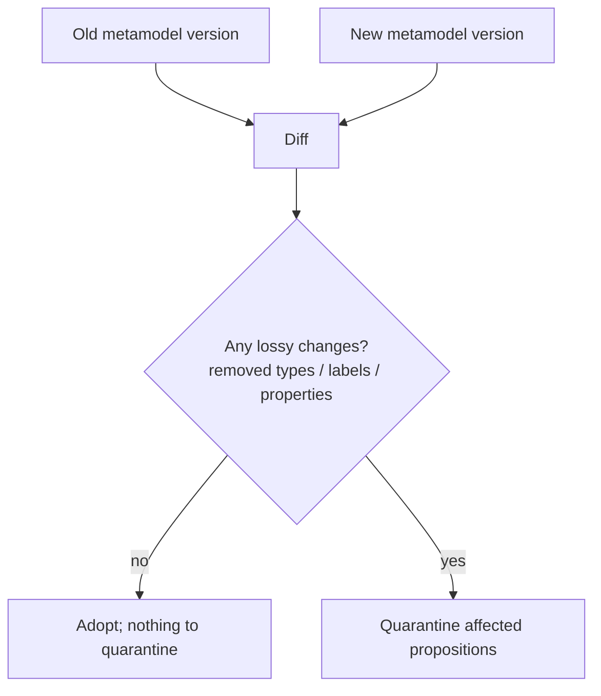
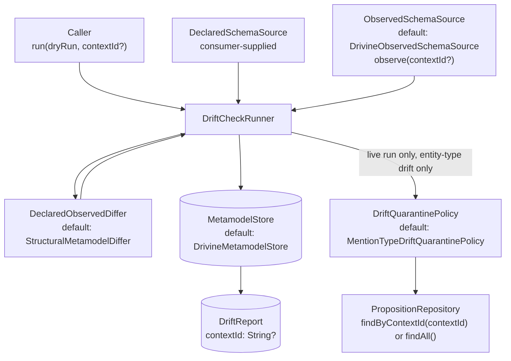
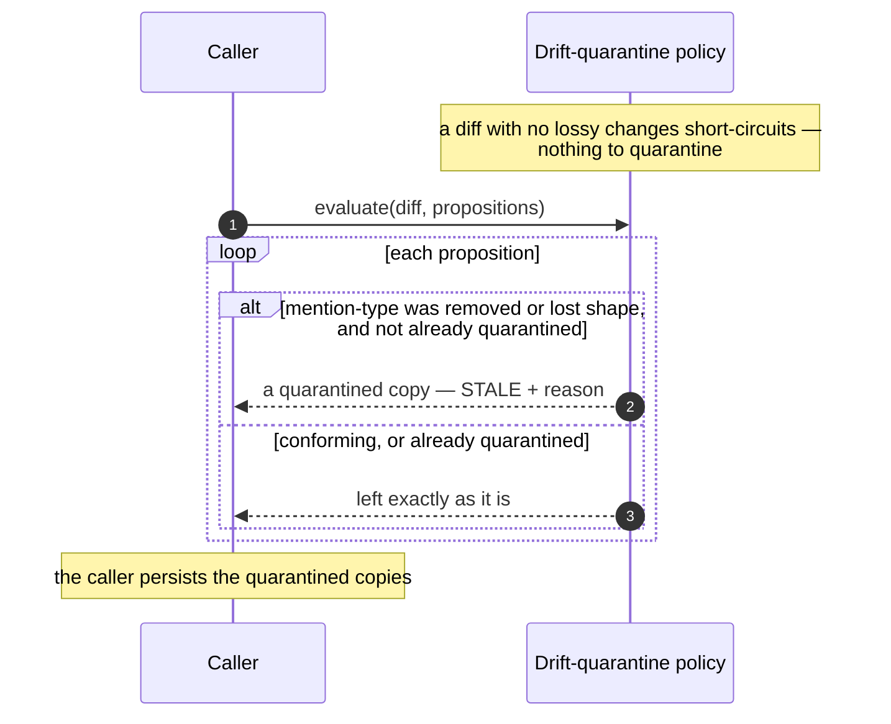

# Metamodel governance: versioning, diffing, and drift quarantine

DICE extracts entities and relationships against a metamodel — the schema of entity types, their
labels and properties, and the relationships allowed between them. That schema isn't frozen; it
changes as a domain is understood better, and it can also silently diverge from what's actually
sitting in a live graph (an integration that stopped declaring a type it once wrote data under, for
example). This note is about the decisions that let the metamodel move, and be checked against
reality, without poisoning existing knowledge.

There are two related but distinct comparisons in this module:

- **Declared vs. declared** (`MetamodelDiffer`): comparing two schema versions you decided on, e.g.
  "the schema before this migration" vs. "the schema after it".
- **Declared vs. observed** (`DeclaredObservedDiffer`, `DriftCheckRunner`): comparing what you
  declared against what a live graph actually contains right now.

## Versioned schema stamps

At any moment the live schema can be captured as an immutable **metamodel version**
(`MetamodelVersion`) — a sorted, deterministic snapshot of every entity type, its full label and
property sets, and the allowed relationships — fingerprinted with a SHA-256 content hash
(`MetamodelVersion.contentHash`, `MetamodelVersion.kt:44`). That stamp, not the mutable live
`DataDictionary`, is what you store and compare.

The reason is reproducibility. The live schema can drift between when a proposition was extracted
and when you later need to reason about schema changes; a stamp gives you a fixed point to compare
against. Two design choices sharpen it:

- The hash deliberately **excludes the schema's name**, so the same structure in a dev and a prod
  environment fingerprints identically (`MetamodelVersion.kt:104`).
- The hash input is built by **length-prefixing every name, label, and property** (`<len>:<token>`,
  `MetamodelVersion.kt:60-62`) rather than joining them with a delimiter. Entity and relationship
  names are free-text / LLM-extracted and routinely contain characters like `;`, `[`, `=`, or
  spaces; a delimiter-joined encoding could make `["a;b"]` and `["a", "b"]` hash identically and hide
  a real, lossy schema change. Length-prefixing makes the encoding unambiguous.

A proposition can record the version it was extracted under via the
`DiceMetadataKeys.METAMODEL_VERSION` (`"dice.metamodel.version"`) metadata key, which is what later
lets the system tell which propositions a schema change actually affects.

## Diffing additive vs. lossy changes (declared vs. declared)

Before taking on a new schema version, `StructuralMetamodelDiffer.diff` computes a **`MetamodelDiff`**
against the old one that enumerates exactly what changed: `EntityTypeAdded`, `EntityTypeRemoved`,
`EntityTypeModified` (label/property deltas on a same-named type), `RelationshipAdded`,
`RelationshipRemoved` (`MetamodelDiff.kt:23-73`). The diff isn't a summary or a flag; it's the
concrete input the quarantine step reads.

The distinction that matters is *additive vs. lossy*. Adding types, labels, or properties is safe —
nothing that was valid before becomes invalid. Removing a type, or stripping labels/properties from
a type that mentions relied on, is lossy: it can orphan existing references.



## Declared-vs-observed drift checking

The declared-vs-declared diff above only fires when *you* change the schema. It says nothing about
a graph that has quietly accumulated data under a type nobody ever declared — a common way for that
to happen is an integration that used to register a `DeclaredSchemaSource` contribution and no
longer does, while its old data is still sitting in the graph. `DriftCheckRunner` answers that
different question: what does the live graph actually contain, and does any of it fall outside
what's currently declared?

### Components



`ObservedSchemaSource.observe(contextId: ContextId? = null)` returns an `ObservedSchema` — a plain
value type of `entityTypeNames`, `relationshipTypeNames`, and `capturedAt` (`ObservedSchema.kt:36`).
The module itself has no graph driver dependency; `DrivineObservedSchemaSource`
(`dice-storage-autoconfigure`) is the real implementation. It has two observation paths, chosen by
whether `contextId` is `null`: the global path queries `CALL db.labels()` / `CALL
db.relationshipTypes()`; the scoped path is covered in
[Context-scoped drift checks](#context-scoped-drift-checks) below.

`DeclaredSchemaSource.declare()` returns a `DeclaredSchema` (the stamped `MetamodelVersion` plus the
bare relationship type names it allows) — there's no default implementation, since there's no
default declared schema; a consuming app supplies one over whatever it already uses to define its
schema. A declared schema is not context-scoped: what a deployment declares as valid is one thing
regardless of which context a check is currently looking at.

### Drift semantics

`DeclaredObservedDiff` (`MetamodelDiff.kt:136`) is asymmetric by design, unlike the symmetric
`MetamodelDiff` above:

- **Drift** (`driftedEntityTypes` / `driftedRelationshipTypes`) — observed in the graph, never
  declared. This is the actionable case: it means data exists whose declaring integration is gone
  (or never registered), so nothing can tell that data apart as valid or explain its shape.
- **Unobserved** (`unobservedEntityTypes` / `unobservedRelationshipTypes`) — declared, but zero
  instances currently in the graph. Purely informational; a declared type with no data yet is
  normal, not drift.

`StructuralMetamodelDiffer.diffAgainstObserved` computes this directly as set difference —
`observedTypes - declaredTypes` is drift, `declaredTypes - observedTypes` is unobserved
(`StructuralMetamodelDiffer.kt:119-120`). Relationship names are compared on the bare type name (a
caller-supplied set), never by parsing the rendered `From-[name]->To` descriptor back apart — those
descriptors are built from free-text names that can themselves contain `-[...]->`-shaped substrings,
so reverse-parsing would be ambiguous.

### One drift-check run

```mermaid
sequenceDiagram
    autonumber
    participant Caller
    participant Runner as DefaultDriftCheckRunner
    participant OSS as ObservedSchemaSource
    participant DSS as DeclaredSchemaSource
    participant Differ as DeclaredObservedDiffer
    participant Store as MetamodelStore
    participant Policy as DriftQuarantinePolicy
    participant Repo as PropositionRepository

    Caller->>Runner: run(dryRun, contextId?)
    Runner->>OSS: observe(contextId?)
    Note over OSS: contextId == null: global db.labels()/db.relationshipTypes()<br/>contextId != null: that context's own mention types only
    OSS-->>Runner: ObservedSchema
    Runner->>DSS: declare()
    DSS-->>Runner: DeclaredSchema
    Runner->>Differ: diffAgainstObserved(declared, declaredRelNames, observed)
    Differ-->>Runner: DeclaredObservedDiff
    Runner->>Store: saveDriftReport(report with contextId)
    Note over Store: persisted unconditionally —<br/>even a zero-drift check is a fact worth having on record
    alt dryRun == false AND driftedEntityTypes not empty
        alt contextId != null
            Runner->>Repo: findByContextId(contextId)
        else contextId == null
            Runner->>Repo: findAll()
        end
        Runner->>Policy: evaluate(syntheticDiff, propositions)
        Policy-->>Runner: QuarantineResult
        Runner->>Repo: save(quarantined proposition) for each
    else dryRun == true, or no entity-type drift
        Note over Runner: no proposition touched;<br/>relationship-only drift can never match a mention's type
    end
    Runner-->>Caller: DriftCheckResult
```

`DriftCheckRunner.run(dryRun: Boolean = true, contextId: ContextId? = null)`
(`DriftCheckRunner.kt:74`) always persists a `DriftReport`, dry run or not — "checked and found
nothing" needs to be as retrievable as "checked and found drift". Quarantine only runs on a live
call (`dryRun = false`) *and* only when `driftedEntityTypes` is non-empty; relationship-only drift
is never handed to the quarantine policy, since nothing about a mention's type could ever match a
relationship name. When it does run, the runner doesn't reimplement quarantine decisions — it
synthesizes a `MetamodelDiff` whose only content is `EntityTypeRemoved` for each drifted type, and
hands that to the same `DriftQuarantinePolicy` used for declared-vs-declared quarantine
(`DriftCheckRunner.kt:168-188`), so "removed in a new declared version" and "observed but never
declared" are handled by one policy, not two.

`contextId` is threaded through every step that touches data: the observed snapshot, the candidate
propositions read for quarantine, and the persisted report. See
[Context-scoped drift checks](#context-scoped-drift-checks) for the full semantics.

### Version hashing recap

Persistence keys off `MetamodelVersion.contentHash`, which is the same SHA-256, length-prefixed
fingerprint described above — `DriftReport.versionHash` records which declared version a drift
observation was checked against (`MetamodelDiff.kt:29-30`), so later checks can correlate repeated
observations against the same baseline.

### Persistence natural keys

`MetamodelStore` is an append-only log for both versions and reports — no deletion, no updates
(`MetamodelStore.kt:52`). `DrivineMetamodelStore` MERGEs on natural keys so retries are idempotent:

- `MetamodelVersion` node: `(schemaName, contentHash)` (`DrivineMetamodelStore.kt:52`); `savedAt` is
  set only `ON CREATE`, so an idempotent re-save preserves the original creation timestamp.
- `MetamodelDriftReport` node: `(schemaName, versionHash, capturedAt)`
  (`DrivineMetamodelStore.kt:106`). `contextId` is not part of this natural key — two reports for
  different contexts, checked at the same instant against the same version, are two distinct
  reports regardless, so `contextId` rides along as a plain property. A global report has no
  `contextId` property on the node at all (a Neo4j node never stores an explicit null), which is
  what `driftReports(schemaName, contextId = null)` matches against.

Type sets (entity types, labels, properties, relationships) are stored as JSON strings
(`MetamodelRowMappers.kt`), not delimiter-joined, for the same escape-safety reason the content hash
is length-prefixed.

### The bookkeeping-label exclusion set

`DrivineObservedSchemaSource` excludes dice's own storage bookkeeping labels from the entity side of
what it reports as observed, because they were never part of any declared *domain* schema and would
otherwise show up as "drift" on every single run:

```kotlin
val DICE_BOOKKEEPING_LABELS: Set<String> = setOf(
    "Proposition",
    "Mention",
    "CollectorRecord",
    "CollectorRun",
    "MetamodelVersion",
    "MetamodelDriftReport",
    "ProjectionRecord",
)
```

(`DrivineObservedSchemaSource.kt:31-39`.) There's no equivalent relationship-type exclusion: dice's
bookkeeping is represented entirely as node labels, never relationship types.

## Context-scoped drift checks

Every piece of the pipeline above accepts an optional `ContextId` and, when it's non-null,
confines itself to that one context: `DriftCheckRunner.run`, `ObservedSchemaSource.observe`, the
candidate propositions read for quarantine, and the persisted `DriftReport`. `null` means what it
always meant — the whole graph.

### Why scope a drift check

- **Multi-tenant schemas.** Different tenants often enable different integrations, and each
  integration contributes its own entity and relationship types. A type that's perfectly valid for
  one tenant is drift for another; checking the whole graph at once conflates the two, either
  hiding a real problem in one tenant behind a `union` of everyone's declared types, or flagging
  another tenant's normal data as drift. A per-context check compares each tenant against exactly
  the schema that applies to it.
- **Canary rollout.** Before running a drift check live across an entire deployment, scope it to
  one context first. A dry run there tells you what a full rollout would find, at a fraction of the
  blast radius, before you trust it everywhere.
- **Blast-radius containment.** Quarantine is powerful precisely because it mutates data; scoping a
  live check to one context means a mis-declared schema — an integration accidentally left out of
  `DeclaredSchemaSource`, say — can only ever quarantine propositions inside that one context. It
  has no way to reach any other.
- **Per-context integration removal.** When one context stops using an integration but others still
  do, the global observed schema still shows the type (other contexts have it). A scoped check
  against just the context that dropped the integration is the only way to see that its own data is
  now orphaned.

### Semantics: null vs. scoped

| | `contextId = null` (global) | `contextId = X` (scoped) |
|---|---|---|
| Candidate propositions (quarantine) | `PropositionRepository.findAll()` | `PropositionRepository.findByContextId(X)` |
| Observed entity types | `CALL db.labels()`, minus dice's bookkeeping labels | Distinct `Mention.type` values reachable from context `X`'s own `Proposition` nodes |
| Observed relationship types | `CALL db.relationshipTypes()` | Always empty — see below |
| Persisted `DriftReport.contextId` | `null` | `X.value` |
| Quarantine blast radius | Any proposition in the graph | Only propositions in context `X` |

The scoped relationship-type set is always empty, not best-effort. Dice doesn't currently persist
relationship edges tagged by context, so there's no honest way to attribute an observed
relationship type to one context specifically — reporting *something* there would be a guess dressed
up as an observation. An empty set means the differ finds no relationship drift for a scoped check,
which is the safe direction to be wrong in: it can only under-report, never manufacture a false
positive that quarantines something it shouldn't.

### One Kotlin sample: canary, then global

```kotlin
val tenantA = ContextId("tenant-a")

// Canary: see what a live check would find for one tenant first, without touching anything.
val canary = driftCheckRunner.run(dryRun = true, contextId = tenantA)
if (canary.hasDrift) {
    logger.warn("tenant-a drift: entities=${canary.driftedEntityTypes}")
}

// Satisfied it's clean (or ready to accept the quarantine), run it live for real, scoped first...
driftCheckRunner.run(dryRun = false, contextId = tenantA)

// ...then, once every tenant's been checked this way, or once you trust the check outright,
// run the same check across the whole graph.
driftCheckRunner.run(dryRun = false)
```

## Drift quarantine

Whether a lossy change comes from a declared-vs-declared diff or a declared-vs-observed drift check,
the propositions whose entity mentions reference an affected type have *drifted*. DICE moves each of
those to **`STALE`** and annotates it with a human-readable reason under
`DiceMetadataKeys.QUARANTINE_REASON` (`"dice.metamodel.quarantine.reason"`), as an immutable copy —
never deleted, never left sitting in the graph looking valid.

This is the same instinct as the rest of the lifecycle (see
[proposition-lifecycle](proposition-lifecycle.md)): silently leaving drifted propositions in normal
retrieval would corrupt query results, but deleting them would destroy information a human might
want to rescue. Quarantine takes the middle path — pull them out of normal use, keep them, and flag
*why*.

Two properties make this safe to run as routine maintenance:

- **Non-destructive**: the original proposition is never mutated; a quarantined copy is produced
  and the caller persists it (`MentionTypeDriftQuarantinePolicy.kt:103-105`).
- **Idempotent**: a proposition already quarantined from an earlier sweep (`STALE` status *and* a
  `QUARANTINE_REASON` entry) is left exactly as it is, original reason intact, rather than
  re-flagged (`MentionTypeDriftQuarantinePolicy.kt:77-87`). Re-evaluating one deliberately requires
  clearing its quarantine annotation first.



## Kotlin samples

### (a) Implementing `DeclaredSchemaSource`

A consuming Spring app maps whatever it already uses to define its schema (a `DataDictionary`, a
config file, a registry) into a stamped `DeclaredSchema`, including the un-rendered relationship
names — those have to come from the caller directly, not be recovered by parsing a rendered
descriptor:

```kotlin
class MyAppDeclaredSchemaSource(
    private val dataDictionary: DataDictionary,
    private val allowedRelationshipNames: Set<String>, // e.g. {"WORKS_AT", "LOCATED_IN"}
) : DeclaredSchemaSource {

    override fun declare(): DeclaredSchema = DeclaredSchema(
        version = MetamodelVersion.from(dataDictionary),
        relationshipTypeNames = allowedRelationshipNames,
    )
}
```

### (b) Enabling via properties

`MetamodelProperties` (`dice-storage-autoconfigure`, prefix `embabel.dice.metamodel`):

| Property | Type | Default |
|---|---|---|
| `embabel.dice.metamodel.enabled` | boolean | `false` |
| `embabel.dice.metamodel.dry-run` | boolean | `true` |
| `embabel.dice.metamodel.schema-name` | string (nullable) | `null` |

```yaml
embabel:
  dice:
    metamodel:
      enabled: true
      dry-run: true       # flip to false once you trust the checks
      schema-name: my-app-schema
```

`MetamodelAutoConfiguration` is gated by `@ConditionalOnProperty(enabled=true)` on the whole feature,
and its `driftCheckRunner` bean additionally requires a `DeclaredSchemaSource` bean to exist
(`@ConditionalOnBean`) — there's no sensible default declared schema, so nothing runs until the
consumer supplies one:

```kotlin
@Bean
fun myAppDeclaredSchemaSource(dataDictionary: DataDictionary): DeclaredSchemaSource =
    MyAppDeclaredSchemaSource(dataDictionary, allowedRelationshipNames = setOf("WORKS_AT", "LOCATED_IN"))
```

### (c) Reading `DriftReport`s back for review

```kotlin
val reports: List<DriftReport> = metamodelStore.driftReports("my-app-schema") // newest first
reports.firstOrNull()?.let { latest ->
    if (latest.driftingEntityTypes.isNotEmpty() || latest.driftingRelationshipTypes.isNotEmpty()) {
        println("Drift as of ${latest.capturedAt}: entities=${latest.driftingEntityTypes}, " +
            "relationships=${latest.driftingRelationshipTypes}")
    }
}
```

## Limits

- **No scheduler.** `MetamodelAutoConfiguration` only wires the *capability* to run a check; nothing
  calls `DriftCheckRunner.run()` on its own. A consumer decides when (cron, an admin endpoint, a
  startup hook) — the auto-configuration's own doc comment notes the `me` app has its own scheduling
  harness for this.
- **Quarantine delegates to existing policy semantics.** A live drift check doesn't introduce new
  quarantine behavior; it synthesizes a `MetamodelDiff` and hands it to the same
  `DriftQuarantinePolicy` used for declared-vs-declared changes — non-destructive, idempotent, and
  already-quarantined (pinned via `STALE` + `QUARANTINE_REASON`) propositions are skipped rather than
  re-flagged.
- **Schema name excluded from the content hash.** Two schemas with identical structure but different
  names produce the same `contentHash` — intentional, for dev/prod parity — but it means
  `contentHash` alone can't distinguish schemas by name; `MetamodelStore` keys on
  `(schemaName, contentHash)` together for that reason.
- **`EntityTypeModified` only fires for types common to both versions.** A type removed and re-added
  under the same name in one diff shows up as `EntityTypeRemoved` + `EntityTypeAdded`, not a single
  `EntityTypeModified`.
- **Scoped observation has no relationship-type signal.** A context-scoped observed schema always
  reports an empty relationship-type set, because dice doesn't persist relationship edges tagged by
  context; there's nothing honest to attribute one to. A scoped check only ever finds entity-type
  drift, never relationship-type drift — see
  [Context-scoped drift checks](#context-scoped-drift-checks).
- **Declared schema is never scoped.** `DeclaredSchemaSource` has no `contextId` parameter; what a
  deployment declares as valid schema is one thing, independent of which context a check happens to
  be looking at.
