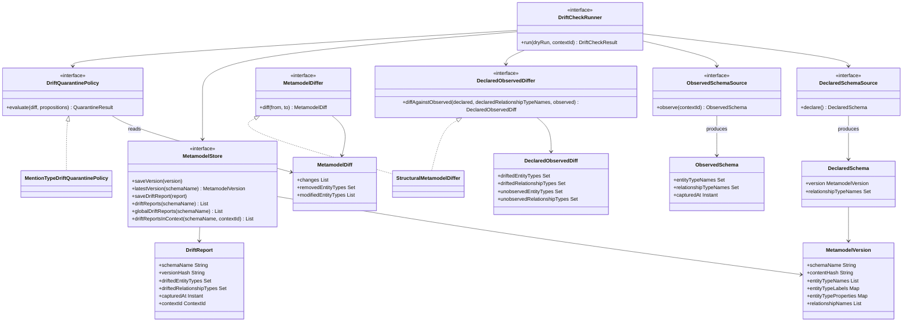
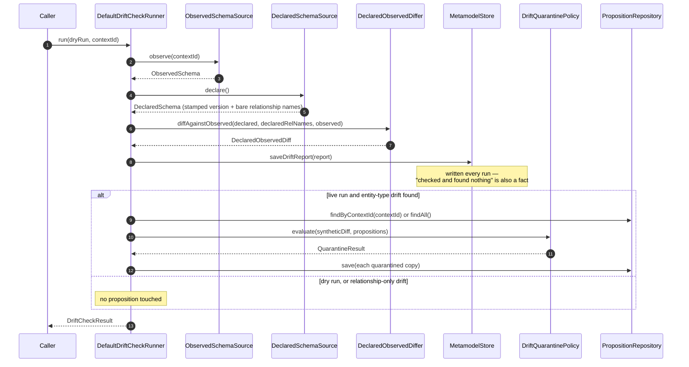

# Metamodel governance: stamping a schema, watching it drift, quarantining the fallout

DICE extracts entities and relationships against a metamodel — the entity types, their labels and
properties, and the relationships allowed between them. That schema moves. It's edited as a domain
is understood better, and it can quietly diverge from what a live graph actually holds, because an
integration that used to declare a type can be switched off while its data stays behind. This note
is about the decisions that let the schema move without poisoning stored knowledge. The types
themselves are documented in `dice-metamodel`'s own guide; this note is the *why*.

Two different comparisons live in this module, and keeping them apart is the first design decision:

- **Declared vs. declared** (`MetamodelDiffer`) — two schema versions you chose, before and after a
  migration. Symmetric: a list of changes.
- **Declared vs. observed** (`DeclaredObservedDiffer`, `DriftCheckRunner`) — what you declared
  against what the graph contains right now. Asymmetric: drift on one side, unobserved on the other.

They answer different questions and have different result shapes, so they're different interfaces —
folding the second into an overload of the first would leave every caller sifting a generic change
list to work out which kind of disagreement it had. Both feed the same quarantine machinery, which is
where they meet.

## The contract family



Nothing on that diagram knows how to read a graph. `ObservedSchemaSource` and `MetamodelStore` are
ports; the module holds value types, comparison logic, and the runner that sequences them. That's
what lets a test hand the runner a canned `ObservedSchema` and exercise the whole loop with no
database in sight.

## Why a version is a content hash

The live schema is mutable. What you store, compare, and stamp onto extracted data has to not be.
`MetamodelVersion.from(dataDictionary)` takes an immutable snapshot — sorted entity type names, the
full label and property set per type, sorted relationship descriptors — and fingerprints it as a
SHA-256 `contentHash`. That stamp is the fixed point. A proposition can record which one it was
extracted under via `DiceMetadataKeys.METAMODEL_VERSION` (`"dice.metamodel.version"`), which is how
you later tell which stored knowledge a schema change actually touches.

Two choices in the fingerprint carry weight.

**The schema name is excluded.** Two structurally identical schemas hash identically no matter what
they're called, so a dev environment and a prod environment compare cleanly. The cost is that
`contentHash` alone can't tell two same-shaped schemas apart by name, which is why `MetamodelStore`
keys on `(schemaName, contentHash)` together.

**The hash is derived, not passed in.** `MetamodelVersion` computes it from its own structural
fields; there is no constructor parameter for it. That's not tidiness — the hash is the store's
MERGE key, what `hasSameContentAs` compares, and what every drift report records as its baseline. If
a caller could supply it, two schemas with different types could claim the same hash, compare equal,
and overwrite each other in storage.

**Every name, label, and property is length-prefixed** (`<len>:<token>`) before hashing, and each set
is preceded by its size. These names come from free-text and LLM extraction; they routinely contain
`;`, `[`, `=`, and spaces. A delimiter-joined encoding would let `["a;b"]` and `["a", "b"]` produce
the same digest — and a schema change that collapsed one into the other would be invisible. Losing a
property silently is exactly the failure this whole module exists to catch, so the encoding is made
unambiguous rather than merely tidy.

One subtlety: a `DataDictionary` can legally hold two domain types sharing a name but differing in
shape, so `from` unions their labels and properties per name rather than letting the last one win.
Otherwise a label under that name never reaches the fingerprint, and removing it later wouldn't
change the hash.

## Additive is safe, lossy is not

`StructuralMetamodelDiffer.diff` compares two stamps and enumerates what changed: `EntityTypeAdded`,
`EntityTypeRemoved`, `EntityTypeModified` (the label and property deltas on a type whose name
survived), `RelationshipAdded`, `RelationshipRemoved`. The diff isn't a summary or a boolean; it's
the concrete input the quarantine step reads.

The distinction that drives everything downstream is additive vs. lossy. Adding a type, label, or
property invalidates nothing. Removing a type — or stripping labels or properties off a type that
mentions relied on — can orphan references already in the graph. Only lossy changes reach quarantine.
Sets are compared directly, never through a joined string projection, for the same escape-safety
reason the hash is length-prefixed.

## Observe and diff, don't gate the write

The declared-vs-declared diff only fires when *you* change the schema. It says nothing about a graph
that has accumulated data under a type nobody currently declares. `DriftCheckRunner` answers that
second question, and it does it after the fact: snapshot what's really there, diff it against the
declaration, record the result.

The obvious alternative is rejecting undeclared types at write time, and it isn't the right first
move. Extraction is LLM-driven, and a type nobody declared is often a real finding — refusing the
write throws information away at the one moment it's cheap to keep and expensive to recover.
Integrations come and go, so a graph holding types outside the current declaration is a normal state
to *observe*, not an error to *prevent*. And an observer is safe to point at production: a dry run
tells you what enforcement would have done before anything enforces it.

Write-time gating is the known next step, not an oversight. The stamp and the diff are the pieces it
needs; what's missing is a decision about what a rejected extraction should become.

## One drift-check run



`run()` is the default shape: preview, whole graph. It and `run(dryRun)` are real overloads rather
than Kotlin default arguments, because Java can't see a default argument and these two are the only
`run` forms it can call at all — `ContextId` is a value class, so the scoped form gets a mangled JVM
name. `ObservedSchemaSource.observe()` is split the same way for the same reason. The report is
persisted either way, because a clean check needs to be as retrievable as a dirty one — that's what
lets you tell "drift appeared last Tuesday" from "nobody has looked since Tuesday". Quarantine, by
contrast, runs only on a live call *and* only when some entity type drifted. Relationship-only drift
never reaches the policy: a mention carries an entity type, so no relationship name could ever match
one, and sweeping anyway would be a full repository scan that decides nothing.

When quarantine does run, the runner re-decides nothing. It synthesizes a `MetamodelDiff` whose only
content is `EntityTypeRemoved` for each drifted type and hands that to the same
`DriftQuarantinePolicy` the declared-vs-declared path uses. A mention whose type the declared schema
doesn't recognize is orphaned identically whether the type was deleted from a newer declaration or
never declared at all — one policy, not two that drift apart. Both ends of the synthetic diff point
at the same declared version; they exist only to give the reason string something to name.

## Drift semantics: drift vs. unobserved

`DeclaredObservedDiff` is deliberately asymmetric, and it's computed as plain set difference.

- **Drift** — observed, never declared (`observed - declared`). Actionable: data exists that nothing
  can vouch for or explain the shape of.
- **Unobserved** — declared, zero instances (`declared - observed`). Informational: a declared type
  with no data yet is normal, not a problem.

Relationships are compared on the bare type name, supplied by the caller alongside the stamp.
`MetamodelVersion.relationshipNames` holds rendered `From-[name]->To` descriptors, and those are built
from free-text names that can themselves contain a `-[...]->`-shaped substring. Reverse-parsing one is
ambiguous and can silently pick the wrong segment, so `DeclaredSchema` carries the un-rendered names
through instead of recovering them.

An observer also has to exclude dice's own bookkeeping labels — `Proposition`, `Mention`, the
collector and projection records, and the metamodel nodes themselves — from the entity side of what
it reports. None of them was ever part of a declared *domain* schema, so an implementation that
reports them makes every single run look like drift. There's no relationship-side equivalent: dice's
bookkeeping is all node labels.

## Quarantine marks stale; it never deletes

Whether the lossy change came from a declared-vs-declared diff or a drift check, a proposition whose
entity mentions reference an affected type has drifted. `MentionTypeDriftQuarantinePolicy` moves each
one to `STALE` and annotates it with a human-readable reason under
`DiceMetadataKeys.QUARANTINE_REASON` (`"dice.metamodel.quarantine.reason"`).

This is the same instinct as the rest of the lifecycle (see
[proposition-lifecycle](proposition-lifecycle.md)): leaving drifted propositions in normal retrieval
corrupts query results, but deleting them destroys something a human might want to rescue. Cold
beats gone. Two properties make the sweep safe to run as routine maintenance:

- **Non-destructive.** The original is never mutated. The policy returns an immutable copy and the
  caller persists it, so a sweep that's evaluated but not saved has changed nothing.
- **Idempotent.** A proposition already `STALE` *with* a quarantine reason is passed through
  untouched, original reason intact — re-running a sweep can't overwrite the record of why something
  was pulled out. Forcing a re-evaluation means deliberately clearing that annotation first. Those
  come back as `QuarantineDecision.AlreadyQuarantined`, a third outcome alongside conforming and
  newly quarantined, so a caller counting conforming propositions isn't counting stale ones too.

A diff with no lossy change short-circuits — every proposition comes back conforming.

## Scoping a check to one context

Every step that touches data takes an optional `ContextId`: the observation, the candidate
propositions, and the persisted report. `null` means the whole graph.

| | `contextId = null` | `contextId = X` |
|---|---|---|
| Candidate propositions | `findAll()` | `findByContextId(X)` |
| Observed entity types | every label in the graph, minus dice's bookkeeping labels | the types reachable from context `X`'s own data |
| Observed relationship types | every relationship type in the graph | always empty — see below |
| `DriftReport.contextId` | `null` | `X` |
| Quarantine blast radius | any proposition | only propositions in `X` |

Scoping earns its keep three ways. Multi-tenant deployments enable different integrations per tenant,
so a type that's valid for one is drift for another; a global check hides that behind the union of
everyone's declarations, and when one context drops an integration others still use, only a scoped
check can see that its data is now orphaned. A scoped dry run is a canary — what a full rollout would
find, at a fraction of the blast radius. And because quarantine mutates data, a mis-declared schema
scoped to one context has no way to reach another.

The scoped relationship-type set is empty by design, not best-effort. Dice doesn't persist
relationship edges tagged by context, so there's no honest way to attribute an observed relationship
type to one. Reporting something anyway would be a guess dressed up as an observation. Empty means a
scoped check finds no relationship drift — it can under-report, but it can never manufacture a false
positive that quarantines something it shouldn't.

A declared schema, by contrast, is never scoped. `DeclaredSchemaSource.declare()` takes no context:
what a deployment declares valid is one thing, whatever the check happens to be looking at.

## Persistence accumulates, and upserts on a natural key

`MetamodelStore` has no delete. Versions accumulate, reports accumulate, and history is the point —
correlating today's observation against the same baseline as last month's is how you tell growing
drift from a stale finding.

What it does have is an upsert. Both writes MERGE on a natural key, and a MERGE that *matches* sets
the non-key properties from what you just passed. `DrivineMetamodelStore` (in `dice-storage`) MERGEs
a version on `(schemaName, contentHash)` and sets `savedAt` only `ON CREATE`, so re-saving preserves
the original timestamp but rewrites the stored type, label, property and relationship sets. A drift
report MERGEs on `(schemaName, versionHash, capturedAt, contextKey)` and rewrites its drifted type
sets the same way.

In practice that's idempotence rather than mutation, because the key carries the content: a version's
key includes its content hash, and that hash is derived from exactly the fields the MERGE would
overwrite, so anything landing on an existing key has identical content by construction. "Append-only"
is the shape you observe; it isn't a promise the interface makes, and an implementation is not
expected to reject a re-save.

`contextKey` is a separate property from the domain-visible `contextId` for a Cypher-shaped reason:
property-map equality against a literal `null` never matches, so MERGE-ing on a nullable `contextId`
would send every global report down the CREATE branch and duplicate it on each retry. `contextKey`
holds the context id when there is one and a sentinel when there isn't. Global reports stay
idempotent, and two reports captured at the same instant for different contexts stay two nodes rather
than one silent overwrite. Type sets are stored as JSON, not joined with a delimiter — the content
hash's escape-safety argument, applied to storage.

## Where this lives, and what's still a port

`dice-metamodel` holds the contracts and the value types, with the three shipped defaults —
`StructuralMetamodelDiffer`, `MentionTypeDriftQuarantinePolicy`, `DefaultDriftCheckRunner` — one
package down in `support`, so the package layout marks the API boundary. It depends on the core
`dice` module and nothing that talks to a database, and it has no Spring dependency: the defaults are
ordinary constructor calls.

Ready-made beans arrive with the autoconfigure slice rather than from here. `@ConditionalOnMissingBean`
is only well defined inside a real auto-configuration class — Spring Boot orders those deliberately,
where a plain `@Configuration` is evaluated in registration order — so "define your own bean and ours
steps aside" is a promise only an `AutoConfiguration.imports` entry can actually keep.

`MetamodelStore`'s Neo4j implementation, `DrivineMetamodelStore`, lives in `dice-storage` — one step
out, where a graph driver is allowed. `ObservedSchemaSource` is still a port with no shipped
implementation: the Neo4j one lands with the autoconfigure wiring that also assembles the
`DriftCheckRunner` bean, since a runner is only useful once something can observe. Until then a
deployment builds `DefaultDriftCheckRunner` itself, and tests supply a canned `ObservedSchema`.

`DeclaredSchemaSource` has no default and never will — there's no such thing as a default declared
schema. A consuming app maps whatever it already uses to define one, passing the bare relationship
names alongside the stamp:

```kotlin
class MyAppDeclaredSchemaSource(
    private val dataDictionary: DataDictionary,
    private val allowedRelationshipNames: Set<String>, // e.g. {"WORKS_AT", "LOCATED_IN"}
) : DeclaredSchemaSource {

    override fun declare(): DeclaredSchema = DeclaredSchema(
        version = MetamodelVersion.from(dataDictionary),
        relationshipTypeNames = allowedRelationshipNames,
    )
}
```

Nothing schedules a check. `DriftCheckRunner` is a capability; when to call it — cron, an admin
endpoint, a startup hook — is the consumer's decision, the same stance the collector takes (see
[reclamation-and-collector](reclamation-and-collector.md)).

## Known edges

- `EntityTypeModified` only fires for types present in both versions. A type removed and re-added
  under the same name shows up as `EntityTypeRemoved` + `EntityTypeAdded`.
- `contentHash` ignores schema names, so it can't tell two identically-shaped schemas apart; pair it
  with `schemaName` when identity matters.
- A drift check reads every candidate proposition to evaluate quarantine. On a large graph, scope it.
