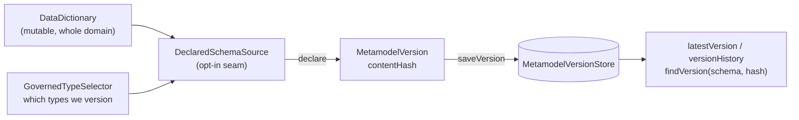
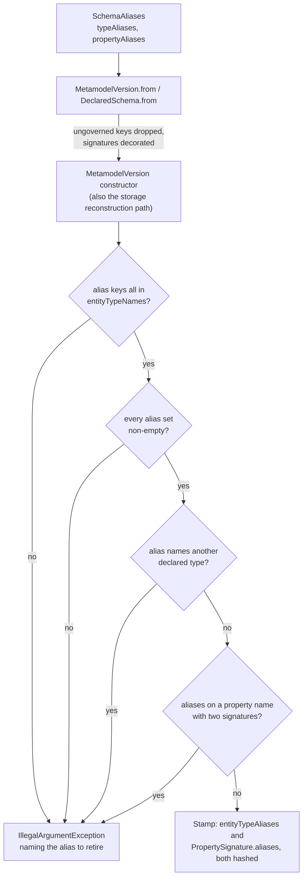

# Metamodel versioning: stamping, governance, and history

DICE stamps the governed part of a metamodel with a content hash, so a schema has an identity you
can record against extracted data and compare later.

DICE extracts entities and relationships against a metamodel: the entity types, their labels and
properties, and the relationships allowed between them. That schema moves. It gets edited as a
domain is understood better, and it can diverge from what a live graph holds, because an
integration that used to declare a type can be switched off while its data stays behind.

This note covers turning a mutable `DataDictionary` into an immutable stamp, deciding which types
the stamp is about, and keeping the stamps so history is answerable. Comparing two stamps, or a
stamp against a live graph, is [metamodel-diff.md](metamodel-diff.md); [the tiers
ahead](#the-tiers-ahead) says how the two fit together.

The types live in `dice-metamodel`, a small pure-JVM module: `MetamodelVersion`,
`GovernedTypeSelector`, `DeclaredSchema`/`DeclaredSchemaSource`, `SchemaAliases`, and the
`MetamodelVersionStore` contract with its `InMemoryMetamodelVersionStore` reference
implementation. It depends on Embabel's agent core types and nothing else.
`SchemaAliases` and the alias fields on `PropertySignature` and `MetamodelVersion` are
experimental; their shape may change before 1.0.

## Declare, stamp, store



Three moving parts, in order. An application says what it governs (`DeclaredSchemaSource`).
Stamping freezes that into a `MetamodelVersion` with a content hash. The store keeps every stamp,
so the hash a piece of extracted data carries can be resolved back into the schema shape it stood
for.

## Why a version is a content hash

The live schema is mutable, so stamping means taking an immutable snapshot of it.
`MetamodelVersion.from(dataDictionary)` snapshots sorted entity type names, the full label set per
type, the full property *signature* set per type, and sorted relationship descriptors, then
fingerprints them as a SHA-256 `contentHash`. A proposition's schema attribution is answered through
the run that produced it (PRODUCED_BY_RUN); the run record carries the declared schema's content hash,
resolved by the extraction coordinator from the host's DeclaredSchemaSource. A per-proposition
denormalized copy is a coordinator concern for a later slice if reads demand it.

Four choices in the fingerprint matter.

**The schema name is excluded.** Two structurally identical schemas hash identically whatever
they're called, so a dev environment and a prod environment compare cleanly. The cost is that
`contentHash` alone can't tell two same-shaped schemas apart by name, which is why the store keys
on `(schemaName, contentHash)` together.

**The hash is derived inside the class.** `MetamodelVersion` computes it from its own structural
fields; there is no constructor parameter for it. The hash is the store's natural key and what
`hasSameContentAs` compares. If a caller could supply it, two schemas with different types could
claim the same hash, compare equal, and overwrite each other in storage.

**Properties go in as signatures, not names.** A property contributes its name, whether it holds a
value or points at another type, that value type (`string`, `integer`, ...) or target type name,
and its cardinality. With names alone, `age` turning from a string into an integer, or a single
`worksAt` becoming a list of them, would leave the hash untouched, though both change what the
graph can hold. Descriptions and semantic metadata are left out: they steer extraction, but they
don't change the shape of what gets stored, so re-wording one doesn't count as a schema change.

**Every name, label, and signature component is length-prefixed** (`<len>:<token>`) before hashing,
and each set is preceded by its size. These names come from free-text and LLM extraction, and
routinely contain `;`, `[`, `=`, and spaces. A delimiter-joined encoding would let `["a;b"]` and
`["a", "b"]` produce the same digest, hiding a schema change that collapsed one into the other.
Length-prefixing makes the encoding unambiguous, so distinct content always yields a distinct hash.

The hashed form is `types:<n>|` followed, for each type name in sorted order, by the length-prefixed
name, an optional `typealiases:<n>|` block, then `labels:<n>|` and its sorted labels, then
`props:<n>|` and its sorted signatures — each signature contributing name, kind, type, and
cardinality as four length-prefixed tokens, followed by an optional `aliases:<n>|` block. Then
`rels:<n>|` and the sorted relationship descriptors. The schema name appears nowhere.

The two alias blocks are written only when they hold something, which is what lets aliases be added
to a shipped encoding at all. A schema that declares no former names renders exactly the bytes this
encoding produced before aliases existed, so every hash already recorded against it still resolves.
`MetamodelVersionTest` pins that. One test asserts the golden digest for the same dictionary stamped
four ways: `from(dictionary)`, `from(dictionary, GovernedTypeSelector.ALL)`, the same with an
explicit `SchemaAliases.NONE`, and the same with an explicitly empty
`SchemaAliases(emptyMap(), emptyMap())`. A second asserts it for a stamp rebuilt field by field
through the public constructor with an empty alias map, which is the path a storage mapper takes.

The block shape is the one the rest of the encoding already uses: `<tag>:<count>|` and then
length-prefixed entries in sorted order. Position keeps the two tags apart — the type block sits
between a type's name and its labels, the property block after a signature's fourth token — so
declaring `old` as a former type name and declaring it as a former property name are different
digests.

Two things about the input. A `DataDictionary` can legally hold two domain types sharing a name but
differing in shape, so `from` unions their labels and properties per name. Keeping only the last
would drop a label from the fingerprint, and removing that label later wouldn't change the hash.
The same split can render one relationship descriptor twice, so the constructor sorts *and*
deduplicates the type and relationship lists: declaring a type once or splitting it in two is the
same schema, and has to be the same hash.

The constructor is strict about the rest, too. It copies every collection into a JVM-immutable one,
down to the alias set inside each property signature, which arrives however the caller built it.
Kotlin's read-only view is a compile-time promise that a Java caller sees straight through, so it
wouldn't stop anything being reshaped out from under the precomputed hash. The constructor also
rejects a label or property map keyed by a type missing from `entityTypeNames`: only listed types
are walked when hashing, so such an entry would never reach `contentHash`, and two structurally
different stamps could end up sharing the store's natural key. `MetamodelVersion` is a plain class
rather than a `data class` for the same reason: a generated `copy()` would hand its arguments
straight to the fields and skip all of that.

The encoding is a persisted format. `MetamodelVersionTest` pins the digest of a fixed schema to a
literal, because changing how the fingerprint is built orphans every hash already recorded against
it, and needs a migration.

## Versioning is per type, and opt-in

A DICE domain is rarely all one thing. Part of it is closed-world: the types you have committed to,
whose shape you want to notice changing. The rest is open-world: exploratory types that extraction
proposes, that come and go, and that nobody has decided about yet.

Stamping the whole dictionary treats both alike. Every new exploratory type then produces a new
content hash, the version history fills with entries nobody chose, and comparisons stop meaning
anything. Governance is therefore per type. `GovernedTypeSelector` is a predicate over
`DomainType`, and `MetamodelVersion.from(dictionary, selector)` stamps only what it governs:

```kotlin
val governed = setOf("Person", "Company")
val version = MetamodelVersion.from(dataDictionary, GovernedTypeSelector { it.name in governed })
```

Add, remove or reshape an ungoverned type and `contentHash` doesn't move. Do the same to a governed
one and it does. `from(dictionary)` with no selector governs everything, which is the right stamp
for a domain that is closed-world throughout.

The model is Hibernate's `@Version`: governance is declared per entity, and nothing is versioned by
default.

Relationships follow the type that declares them. A governed type's outgoing relationship is part of
that type's declared shape, so it stays in the stamp even when it points at an ungoverned type; a
relationship declared *by* an ungoverned type is left out entirely. Without that rule, an
exploratory type wiring itself to `Person` would move `Person`'s hash.

`DeclaredSchema.from(dictionary, selector)` applies the same rule to both halves of a declaration,
which is why it exists. A declaration carries the bare relationship type names alongside the stamp,
because `relationshipNames` holds rendered `From-[name]->To` descriptors and reverse-parsing one is
ambiguous when the names themselves can contain a `-[...]->`-shaped substring. Building the stamp
from a governed subset while taking the names from the whole dictionary would declare relationships
the stamp never covered, and the mismatch would only surface much later, as phantom disagreement.

## The opt-in seam

`DeclaredSchemaSource` is where an application states what it governs: a single method returning a
`DeclaredSchema`. It has no default implementation, because there is no default declared schema. A
consuming app maps whatever it already uses to define its types:

```kotlin
class MyAppDeclaredSchemaSource(
    private val dataDictionary: DataDictionary,
) : DeclaredSchemaSource {

    private val governed = GovernedTypeSelector { it.name in setOf("Person", "Company") }

    override fun declare(): DeclaredSchema = DeclaredSchema.from(dataDictionary, governed)
}
```

Versioning starts here: with no declared schema, nothing is stamped. The Spring wiring that lands
in a later slice activates only when a `DeclaredSchemaSource` bean is present, so an application
that hasn't decided what it governs is left alone.

## Declared renames

Renaming a type or a property is the change a content hash reads worst. `email` becoming
`emailAddress` is one property with a new spelling, and a stamp comparison sees a removal and an
addition, which is the same shape as deleting a property and inventing an unrelated one. A declared
alias says what the name used to be, so the comparison can pair the two.

Iceberg and Delta hold identity in stable field ids assigned when a column is created, leaving the
name as a label over an identity the format already carries. DICE has no id to assign. Its types
come from LLM extraction against a `DataDictionary` an application edits, and the upstream
`PropertyDefinition` has nowhere to put an id even if DICE minted one. The adapted form is the
former name itself, declared at the moment the rename is made:

```kotlin
DeclaredSchema.from(
    dataDictionary,
    governed,
    SchemaAliases(
        typeAliases = mapOf("Organisation" to setOf("Company")),
        propertyAliases = mapOf("Person" to mapOf("emailAddress" to setOf("email"))),
    ),
)
```

Types get the mechanism as well as properties because a type rename is the more destructive of the
two: every proposition labelled with the old name and every referrer pointing at it move at once.

Alias names are exact and case-sensitive. LLM extraction drifts on case, and folding `worksAt` into
`worksat` here would pair two names nobody declared as the same one.

Aliases accumulate. A type renamed `A` to `B` to `C` declares `{A, B}`, so a comparison across
non-adjacent stamps still pairs. Retiring a name means deleting it from the declaration.

`SchemaAliases` is a declaration-time input; the stamp carries the result. `MetamodelVersion.from`
decorates each signature with the former names declared for its property, inside the per-type loop
right after the signature is read, because the stamp is immutable and hashes at construction. Type
aliases land in `entityTypeAliases`. Aliases declared for a type the selector doesn't govern are
dropped, along with everything else about an ungoverned type.

A property alias equal to the property's own name, or naming a property that still exists on both
sides of a comparison, matches nothing: nothing looks data up by property name, so a stale property
alias can mislead nothing. It stays part of the signature and moves the hash. A type alias naming
another declared type is a different case, and the third guard below rejects it.

Comparing two stamps is the next slice. Until it lands, an alias is a recorded intention that moves
the hash and nothing more.

### The four guards



**Alias-map keys are a subset of `entityTypeNames`.** Only listed types are walked when hashing, so
an entry keyed by anything else never reaches `contentHash`. This is the rule the label and property
maps already follow.

**Every alias set is non-empty.** An entry mapping a type to no former names hashes differently from
having no entry at all while saying the same thing, so two stamps of one schema could land on two
different natural keys. `SchemaAliases` drops empty sets on the way in, which keeps a harmless
declaration from becoming an error at the seam.

**No declared type name appears in another type's alias set.** This is the reuse collision. A schema
renames `Company` to `Organisation`, keeps `{Company}` as the alias, and later declares a fresh
`Company` for something unrelated. A live type now shares a retired name, and the comparison has two
bad options: sweep the new `Company`'s data into the renamed type's quarantine matching, or treat
the old label as declared forever and never report drift on it. Reusing a retired name therefore
requires deleting the alias that still claims it first. A type listing its own name is fine — a
rename to `B` and back to `A` accumulates `{A, B}` — because the guard is about other types' names.

**No aliases on a property name a type holds more than one signature for.** Two same-named domain
types can each declare `age` with a different shape, and the union keeps both signatures. An old
name has no way to say which of the two it meant, so the declaration is refused.

All four run in the `MetamodelVersion` constructor, so the public constructors and the storage
mapper's reconstruction path are covered. The last two also run at `MetamodelVersion.from` and
`DeclaredSchema.from`, which is where duplicates and reused names actually become visible, and where
the message can name the alias to retire.

### What the duplicate-name refusal costs

A dictionary can legally evolve into duplicate-hood. Someone adds a second `Person` declaration
carrying its own `age`, and a name that had one signature now has two. If an alias was standing on
that name, every stamp and every drift check from that moment throws, with a message naming the
alias to retire. That is a loud, conservative hard stop on a schema that was fine the day before.

Retiring the alias clears the throw and costs the pairing. The name then diffs through the duplicate
fallback as a removal plus an addition, the drift policy reads that as lossy, and an additive
evolution earns a quarantine sweep. Both outcomes cost more than an ordinary signature change would,
and both beat the only other option, which is guessing which of the two signatures the old name
referred to.

## Stamp provenance waits for a caller

A stamp says nothing about who or what caused it. That is deliberate for now. Recording the cause
means fixing a type for it, deciding how long its strings may be, finding it somewhere to live in
every backend, and settling what a re-save does to a value that is already there — a pile of
commitments made on behalf of a caller that doesn't exist yet. Nothing in DICE stamps with a cause
today: `MetamodelVersion.from` builds a stamp from a dictionary, and the drift check that arrives
in a later slice re-stamps the
declared schema without anything to attribute it to.

Provenance returns with the first stamping caller that records it. Whoever that caller is will
settle the shape, which is a better basis for the decision than a guess made here.

Snowflake's `SCHEMA_EVOLUTION_RECORD` shows where it lands when it does arrive: the evolution event
sits alongside the schema rather than inside the schema's identity. Two stamps of one schema taken
for different reasons are the same schema, and the hash is the store's natural key, so hashing the
cause would give one schema as many identities as it had causes.

## History accumulates

`MetamodelVersionStore` is a port with four operations: `saveVersion`, `latestVersion`,
`versionHistory`, and `findVersion(schemaName, contentHash)`. There is no delete. Correlating what
a graph holds today against the stamp it was extracted under only works while the old stamps are
still there.

`MetamodelVersion` and `MetamodelVersionStore` carry no context dimension — one declared schema
serves every tenant, the default where a `DataDictionary` is application-wide. Drift reports and
observation are per `ContextId`; a reader arriving from the drift store should not assume versions
are scoped.

`saveVersion` is an upsert on `(schemaName, contentHash)`. Re-saving is idempotent, because the key
carries the content: the hash is derived from exactly the fields a re-save would overwrite, so
anything landing on an existing key has identical content by construction. The interface doesn't
promise append-only storage, and an implementation isn't expected to reject a re-save.

This is where schema registries have already landed. AWS Glue Schema Registry and Confluent Schema
Registry both identify a schema version by a fingerprint of its content and answer a re-registration
of an identical schema with the existing version rather than a new one. Deriving identity from the
content is what makes registration idempotent, and it is why a client that re-registers on every
boot doesn't inflate the history. DICE keys on `(schemaName, contentHash)` for that reason, and an
application stamping its declared schema on every start is exactly the client those registries are
built for.

`findVersion` resolves a recorded hash back to the schema shape it named. The default scans
`versionHistory`, which is correct for any implementation but reads the whole history to answer a
keyed question; a backend that can push the lookup down to the database should override it.

The only implementation this module ships is `InMemoryMetamodelVersionStore`, which keeps stamps in
a list. It exists so a host can stamp and compare schemas before it has a database, and so the
contract has an executable statement of what its rules mean; durable storage is a separate concern.

The durable implementation lives in `dice-storage`. `DrivineMetamodelVersionStore` keeps each stamp
as a `(:MetamodelVersion)` node and MERGEs on `(schemaName, contentHash)`, so re-stamping an
unchanged schema updates the node already there. Three things govern how it behaves:

- **It needs three uniqueness constraints**, declared in a `SchemaCatalog` bean. A MERGE is
  race-free only when what it merges on is unique, so `MetamodelVersion(schemaName, contentHash)`
  and `MetamodelSchemaCounter(schemaName)` are both required. Without the first, concurrent saves of
  one version all miss the match, all create, and history fills with copies. The third,
  `MetamodelVersion(schemaName, sequence)`, guards the ordering described below.
- **Ordered reads sort on a per-schema counter.** "Most recent" here means logical write order,
  which no timestamp can express: two saves land in the same millisecond routinely, and an NTP
  correction or a failover can move the clock backwards between them. Each schema owns a
  `(:MetamodelSchemaCounter)` node, and a version takes the next number off it in the same statement
  that creates the version node. `savedAt` and `savedAtEpochMillis` are informational; nothing sorts
  on them. Because `(schemaName, sequence)` is unique, a lost counter update surfaces as a retryable
  failure.
- **A re-save updates content only.** Sequence, counter, and `savedAt` keep their existing values,
  so an old stamp stays at its original position in the history. `InMemoryMetamodelVersionStore`,
  the reference implementation `dice-metamodel` ships, behaves the same way.

The structural fields are stored as JSON strings, since Neo4j properties are scalars and flat
arrays. Property signatures get explicit named fields with enums by name
(`{"name": "age", "kind": "VALUE", "type": "integer", "cardinality": "ONE"}`); an ordinal would
re-point the day someone inserts a constant into `Cardinality`. The content hash is derived, so the
`contentHash` on a node is a checksum: the store recomputes it on read and skips a node that
disagrees with itself, logging a warning.

### Aliases in storage

Declared aliases land in two places on the node: the version-level `entityTypeAliases` map as its
own property, and a property's former names as a fifth `aliases` field inside its stored signature.
Both are written only when they hold something, so a stamp that declares no former names writes
exactly the properties the store wrote before aliases existed, and a node from that older build
reads back as a stamp declaring none.

Getting that wrong is unrecoverable. Aliases feed `contentHash`, and the read side recomputes the
hash from the persisted fields, so a writer that dropped the alias map would produce nodes that
fail their own checksum on every read and can never be read back. Three tests pin it: one writes a
row in the old four-field shape through raw Cypher and reads it back, one round-trips a stamp
carrying both alias kinds, and one deletes the stored alias map and asserts the integrity check
rejects the row.

`AbstractMetamodelVersionStoreContractTest` runs one suite against the graph store and the in-memory
reference, so the two can't drift apart on rules that live in Cypher on one side and Kotlin on the
other.

## Plain classes, not data classes

`MetamodelVersion`, `DeclaredSchema` and `SchemaAliases` each write their own `equals`, `hashCode`
and `toString`. That is one deliberate pattern, for one reason: each of them copies what the
constructor is handed into a JVM-immutable collection in its body, and a `data class` cannot do
that. A constructor `val` takes no initialiser, so the generated `equals` and `copy` would read the
raw arguments and skip the copy, and a stamp whose collections could still be changed from the
outside would disagree with its own precomputed hash.

`PropertySignature` is the exception that proves it. It is a `data class`, and its `aliases` set is
therefore held as handed in; `MetamodelVersion` copies that set into an immutable one when it takes
a signature. The KDoc on each class says as much, and this section is here so the pattern is read
as a module decision and not raised class by class.

Two notions of equality live on `MetamodelVersion`, and both are meant. `equals` compares the schema
name along with the content, so a `Set<MetamodelVersion>` keys the way the store does. `contentHash`
and `hasSameContentAs` leave the name out, so two schemas with the same shape under different names
compare equal there. That is also why the store's natural key is `(schemaName, contentHash)` and not
the hash alone: history is per schema, and one schema adopting a shape another had earlier must not
land on the other schema's record.

## The tiers ahead

Versioning is the first of three escalating tiers, shipped in that order.

**Stamp and observe** is this slice: identity and history.

**Detect and report** is underway. The comparison half has landed, in
[metamodel-diff.md](metamodel-diff.md): `MetamodelDiffer` compares two declared stamps and reports
a typed change list, and `DeclaredObservedDiffer` compares a declaration against an
`ObservedSchema` snapshot of a live graph. Still to come on this tier: a drift check that sequences
observe, declare, diff, and a store for the reports it produces.

**Quarantine** is last: acting on a lossy change by marking affected propositions stale rather than
deleting them.

Each tier builds on the one below it, and each is useful on its own. You can stamp for a year
without detecting, and detect for a year without quarantining. Rejecting undeclared types at write
time is not on the list yet: extraction is LLM-driven, a type nobody declared is often a real
finding, and discarding it is the one thing that can't be undone later.
