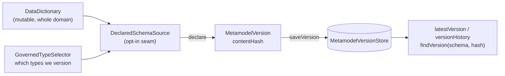

# Metamodel versioning: stamping, governance, and history

DICE stamps the governed part of a metamodel with a content hash, so a schema has an identity you
can record against extracted data and compare later.

DICE extracts entities and relationships against a metamodel: the entity types, their labels and
properties, and the relationships allowed between them. That schema moves. It gets edited as a
domain is understood better, and it can diverge from what a live graph holds, because an
integration that used to declare a type can be switched off while its data stays behind.

This note covers turning a mutable `DataDictionary` into an immutable stamp, deciding which types
the stamp is about, and keeping the stamps so history is answerable. Comparing two stamps, or a
stamp against a live graph, comes later — see [the tiers ahead](#the-tiers-ahead).

The types live in `dice-metamodel`, a small pure-JVM module: `MetamodelVersion`,
`GovernedTypeSelector`, `DeclaredSchema`/`DeclaredSchemaSource`, and the `MetamodelVersionStore`
contract. It depends on Embabel's agent core types and nothing else.

## Declare, stamp, store



Three moving parts, in order. An application says what it governs (`DeclaredSchemaSource`).
Stamping freezes that into a `MetamodelVersion` with a content hash. The store keeps every stamp,
so the hash a piece of extracted data carries can be resolved back into the schema shape it stood
for.

## Why a version is a content hash

The live schema is mutable, so stamping means taking an immutable snapshot of it.
`MetamodelVersion.from(dataDictionary)` snapshots sorted entity type names, the full label set per
type, the full property *signature* set per type, and sorted relationship descriptors, then
fingerprints them as a SHA-256 `contentHash`. A proposition records the version it was extracted
under in the `dice.metamodel.version` metadata key, which is how you later tell which stored
knowledge a schema change touches.

Four choices in the fingerprint matter.

**The schema name is excluded.** Two structurally identical schemas hash identically whatever
they're called, so a dev environment and a prod environment compare cleanly. The cost is that
`contentHash` alone can't tell two same-shaped schemas apart by name, which is why the store keys
on `(schemaName, contentHash)` together.

**The hash is derived inside the class.** `MetamodelVersion` computes it from its own structural
fields; there is no constructor parameter for it. The hash is the store's natural key and what
`hasSameContentAs` compares. If a caller could supply it, two schemas with different types could
claim the same hash, compare equal, and overwrite each other in storage.

**Properties go in as signatures, not names.** A property contributes its name, whether it holds a
value or points at another type, that value type (`string`, `integer`, ...) or target type name,
and its cardinality. With names alone, `age` turning from a string into an integer, or a single
`worksAt` becoming a list of them, would leave the hash untouched, though both change what the
graph can hold. Descriptions and semantic metadata are left out: they steer extraction, but they
don't change the shape of what gets stored, so re-wording one doesn't count as a schema change.

**Every name, label, and signature component is length-prefixed** (`<len>:<token>`) before hashing,
and each set is preceded by its size. These names come from free-text and LLM extraction, and
routinely contain `;`, `[`, `=`, and spaces. A delimiter-joined encoding would let `["a;b"]` and
`["a", "b"]` produce the same digest, hiding a schema change that collapsed one into the other.
Length-prefixing makes the encoding unambiguous, so distinct content always yields a distinct hash.

The hashed form is `types:<n>|` followed, for each type name in sorted order, by the length-prefixed
name, then `labels:<n>|` and its sorted labels, then `props:<n>|` and its sorted signatures — each
signature contributing name, kind, type, and cardinality as four length-prefixed tokens. Then
`rels:<n>|` and the sorted relationship descriptors. The schema name appears nowhere.

Two things about the input. A `DataDictionary` can legally hold two domain types sharing a name but
differing in shape, so `from` unions their labels and properties per name. Keeping only the last
would drop a label from the fingerprint, and removing that label later wouldn't change the hash.
The same split can render one relationship descriptor twice, so the constructor sorts *and*
deduplicates the type and relationship lists: declaring a type once or splitting it in two is the
same schema, and has to be the same hash.

The constructor is strict about the rest, too. It copies every collection into a JVM-immutable one.
Kotlin's read-only view is a compile-time promise that a Java caller sees straight through, so it
wouldn't stop anything being reshaped out from under the precomputed hash. The constructor also
rejects a label or property map keyed by a type missing from `entityTypeNames`: only listed types
are walked when hashing, so such an entry would never reach `contentHash`, and two structurally
different stamps could end up sharing the store's natural key. `MetamodelVersion` is a plain class
rather than a `data class` for the same reason: a generated `copy()` would hand its arguments
straight to the fields and skip all of that.

The encoding is a persisted format. `MetamodelVersionTest` pins the digest of a fixed schema to a
literal, because changing how the fingerprint is built orphans every hash already recorded against
it, and needs a migration.

## Versioning is per type, and opt-in

A DICE domain is rarely all one thing. Part of it is closed-world: the types you have committed to,
whose shape you want to notice changing. The rest is open-world: exploratory types that extraction
proposes, that come and go, and that nobody has decided about yet.

Stamping the whole dictionary treats both alike. Every new exploratory type then produces a new
content hash, the version history fills with entries nobody chose, and comparisons stop meaning
anything. Governance is therefore per type. `GovernedTypeSelector` is a predicate over
`DomainType`, and `MetamodelVersion.from(dictionary, selector)` stamps only what it governs:

```kotlin
val governed = setOf("Person", "Company")
val version = MetamodelVersion.from(dataDictionary, GovernedTypeSelector { it.name in governed })
```

Add, remove or reshape an ungoverned type and `contentHash` doesn't move. Do the same to a governed
one and it does. `from(dictionary)` with no selector governs everything, which is the right stamp
for a domain that is closed-world throughout.

The model is Hibernate's `@Version`: governance is declared per entity, and nothing is versioned by
default.

Relationships follow the type that declares them. A governed type's outgoing relationship is part of
that type's declared shape, so it stays in the stamp even when it points at an ungoverned type; a
relationship declared *by* an ungoverned type is left out entirely. Without that rule, an
exploratory type wiring itself to `Person` would move `Person`'s hash.

`DeclaredSchema.from(dictionary, selector)` applies the same rule to both halves of a declaration,
which is why it exists. A declaration carries the bare relationship type names alongside the stamp,
because `relationshipNames` holds rendered `From-[name]->To` descriptors and reverse-parsing one is
ambiguous when the names themselves can contain a `-[...]->`-shaped substring. Building the stamp
from a governed subset while taking the names from the whole dictionary would declare relationships
the stamp never covered, and the mismatch would only surface much later, as phantom disagreement.

## The opt-in seam

`DeclaredSchemaSource` is where an application states what it governs: a single method returning a
`DeclaredSchema`. It has no default implementation, because there is no default declared schema. A
consuming app maps whatever it already uses to define its types:

```kotlin
class MyAppDeclaredSchemaSource(
    private val dataDictionary: DataDictionary,
) : DeclaredSchemaSource {

    private val governed = GovernedTypeSelector { it.name in setOf("Person", "Company") }

    override fun declare(): DeclaredSchema = DeclaredSchema.from(dataDictionary, governed)
}
```

Versioning starts here: with no declared schema, nothing is stamped. The Spring wiring that lands
in a later slice activates only when a `DeclaredSchemaSource` bean is present, so an application
that hasn't decided what it governs is left alone.

## History accumulates

`MetamodelVersionStore` is a port with four operations: `saveVersion`, `latestVersion`,
`versionHistory`, and `findVersion(schemaName, contentHash)`. There is no delete. Correlating what
a graph holds today against the stamp it was extracted under only works while the old stamps are
still there.

`saveVersion` is an upsert on `(schemaName, contentHash)`. Re-saving is idempotent, because the key
carries the content: the hash is derived from exactly the fields a re-save would overwrite, so
anything landing on an existing key has identical content by construction. The interface doesn't
promise append-only storage, and an implementation isn't expected to reject a re-save.

`findVersion` resolves a recorded hash back to the schema shape it named. The default scans
`versionHistory`, which is correct for any implementation but reads the whole history to answer a
keyed question; a backend that can push the lookup down to the database should override it. This
module ships no implementation. Storage is a separate concern, and a stamp is useful in memory
before anything durable exists.

## The tiers ahead

Versioning is the first of three escalating tiers, shipped in that order.

**Stamp and observe** is this slice: identity and history.

**Detect and report** comes next: comparing two declared stamps, comparing a declaration against
what a live graph contains, and recording the result.

**Quarantine** is last: acting on a lossy change by marking affected propositions stale rather than
deleting them.

Each tier builds on the one below it, and each is useful on its own. You can stamp for a year
without detecting, and detect for a year without quarantining. Rejecting undeclared types at write
time is not on the list yet: extraction is LLM-driven, a type nobody declared is often a real
finding, and discarding it is the one thing that can't be undone later.
