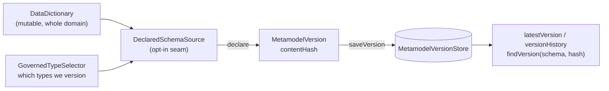

# Metamodel versioning: stamping a schema you can compare later

DICE extracts entities and relationships against a metamodel — the entity types, their labels and
properties, and the relationships allowed between them. That schema moves. It gets edited as a
domain is understood better, and it can quietly diverge from what a live graph actually holds,
because an integration that used to declare a type can be switched off while its data stays behind.

Before any of that can be reasoned about, a schema needs an identity you can write down. That's what
this note covers: turning a mutable `DataDictionary` into an immutable stamp, deciding which types
the stamp is even about, and keeping the stamps around so history is answerable. Comparing two
stamps, or a stamp against a live graph, comes later — see [the tiers ahead](#the-tiers-ahead).

The types live in `dice-metamodel`. It's a small, pure-JVM module: `MetamodelVersion`,
`GovernedTypeSelector`, `DeclaredSchema`/`DeclaredSchemaSource`, and the `MetamodelVersionStore`
contract. It depends on Embabel's agent core types and nothing else — not `dice`, not a database
driver, not Spring.

## Declare, stamp, store



Three moving parts, in order. An application says what it governs (`DeclaredSchemaSource`). Stamping
freezes that into a `MetamodelVersion` with a content hash. The store keeps every stamp, so the hash
a piece of extracted data carries can be resolved back into the schema shape it stood for.

## Why a version is a content hash

The live schema is mutable. What we store, compare, and stamp onto extracted data has to not be.
`MetamodelVersion.from(dataDictionary)` takes an immutable snapshot — sorted entity type names, the
full label set per type, the full property *signature* set per type, sorted relationship descriptors
— and fingerprints it as a SHA-256 `contentHash`. That stamp is the fixed point. A proposition can
record which one it was extracted under via the `dice.metamodel.version` metadata key, which is how
you later tell which stored knowledge a schema change actually touches.

Four choices in the fingerprint carry weight.

**The schema name is excluded.** Two structurally identical schemas hash identically no matter what
they're called, so a dev environment and a prod environment compare cleanly. The cost is that
`contentHash` alone can't tell two same-shaped schemas apart by name, which is why the store keys on
`(schemaName, contentHash)` together.

**The hash is derived, not passed in.** `MetamodelVersion` computes it from its own structural
fields; there is no constructor parameter for it. That's not tidiness — the hash is the store's
natural key and what `hasSameContentAs` compares. If a caller could supply it, two schemas with
different types could claim the same hash, compare equal, and overwrite each other in storage.

**Properties go in as signatures, not names.** A property contributes its name, whether it holds a
value or points at another type, that value type (`string`, `integer`, ...) or target type name, and
its cardinality. With names alone, `age` turning from a string into an integer, or a single `worksAt`
becoming a list of them, would leave the hash untouched — a real change to what the graph can hold,
invisible. Descriptions and semantic metadata are deliberately left out: they steer extraction and
matter in a prompt, but they don't change the shape of what gets stored, so re-wording one shouldn't
read as a schema change.

**Every name, label, and signature component is length-prefixed** (`<len>:<token>`) before hashing,
and each set is preceded by its size. These names come from free-text and LLM extraction; they
routinely contain `;`, `[`, `=`, and spaces. A delimiter-joined encoding would let `["a;b"]` and
`["a", "b"]` produce the same digest — and a schema change that collapsed one into the other would be
invisible. Losing a property silently is exactly the failure versioning exists to catch, so the
encoding is unambiguous rather than merely tidy.

Concretely, the hashed form is `types:<n>|` followed, for each type name in sorted order, by the
length-prefixed name, then `labels:<n>|` and its sorted labels, then `props:<n>|` and its sorted
signatures — each signature contributing name, kind, type, and cardinality as four length-prefixed
tokens. Then `rels:<n>|` and the sorted relationship descriptors. The schema name appears nowhere.

Two subtleties about input. A `DataDictionary` can legally hold two domain types sharing a name but
differing in shape, so `from` unions their labels and properties per name rather than letting the
last one win — otherwise a label under that name never reaches the fingerprint, and removing it later
wouldn't change the hash. The same split can render one relationship descriptor twice, so the
constructor sorts *and* deduplicates the type and relationship lists: declaring a type once or
splitting it in two is the same schema, and has to be the same hash.

The constructor is strict about the rest, too. It copies every collection into a genuinely immutable
one — the JVM kind that throws, not just Kotlin's read-only view, which a Java caller sees straight
through — so nothing can be reshaped out from under the precomputed hash. And it rejects a label or
property map keyed by a type missing from `entityTypeNames`: only listed types are walked when
hashing, so such an entry would never reach `contentHash`, and two structurally different stamps
could end up sharing the store's natural key. `MetamodelVersion` is a plain class rather than a
`data class` for the same reason — a generated `copy()` would hand its arguments straight to the
fields and skip all of it.

The encoding is a persisted format. `MetamodelVersionTest` pins the digest of a fixed schema to a
literal for that reason — changing how the fingerprint is built orphans every hash already recorded
against it, so it's a migration, not a refactor.

## Versioning is per type, and opt-in

A DICE domain is rarely all one thing. Part of it is closed-world: the types you have committed to,
whose shape you want to notice changing. The rest is open-world — exploratory types that extraction
proposes, that come and go, and that nobody has decided about yet.

Stamping the whole dictionary treats both the same, and that's wrong in a specific, annoying way:
every new exploratory type produces a new content hash, so the version history fills with entries
nobody chose and no comparison means anything. So governance is per type. `GovernedTypeSelector` is
a predicate over `DomainType`, and `MetamodelVersion.from(dictionary, selector)` stamps only what it
governs:

```kotlin
val governed = setOf("Person", "Company")
val version = MetamodelVersion.from(dataDictionary, GovernedTypeSelector { it.name in governed })
```

Add, remove or reshape an ungoverned type and `contentHash` doesn't move. Do the same to a governed
one and it does. `from(dictionary)` with no selector is the govern-everything case — the same stamp
as before, for a domain that is closed-world throughout.

The model here is Hibernate's `@Version`: you version what you declare, per entity, and everything
else is left alone. Nothing is inferred, and nothing is versioned by default.

Relationships follow the type that declares them. A governed type's outgoing relationship is part of
that type's declared shape, so it stays in the stamp even when it points at an ungoverned type; a
relationship declared *by* an ungoverned type is left out entirely. That rule is what makes the
guarantee hold end to end — otherwise an exploratory type wiring itself to `Person` would move
`Person`'s hash.

`DeclaredSchema.from(dictionary, selector)` applies the same rule to both halves of a declaration,
which is why it exists. A declaration carries the bare relationship type names alongside the stamp,
because `relationshipNames` holds rendered `From-[name]->To` descriptors and reverse-parsing one is
ambiguous when the names themselves can contain a `-[...]->`-shaped substring. Building the stamp
from a governed subset while taking the names from the whole dictionary would declare relationships
the stamp never covered — a mismatch that only surfaces much later, as phantom disagreement.

## The opt-in seam

`DeclaredSchemaSource` is where an application says "here is what I govern". It's a single method
returning a `DeclaredSchema`, and it has no default implementation — there's no such thing as a
default declared schema. A consuming app maps whatever it already uses to define its types:

```kotlin
class MyAppDeclaredSchemaSource(
    private val dataDictionary: DataDictionary,
) : DeclaredSchemaSource {

    private val governed = GovernedTypeSelector { it.name in setOf("Person", "Company") }

    override fun declare(): DeclaredSchema = DeclaredSchema.from(dataDictionary, governed)
}
```

This is the on-switch for the whole story: no declared schema, no versioning. Nothing stamps on its
own, and the Spring wiring that lands in a later slice activates only when a `DeclaredSchemaSource`
bean is present. An app that hasn't decided what it governs is left entirely alone — which is the
right default for a substrate whose whole point is accepting knowledge it wasn't expecting.

## History accumulates

`MetamodelVersionStore` is a port: `saveVersion`, `latestVersion`, `versionHistory`, and
`findVersion(schemaName, contentHash)`. No delete. Versions accumulate, and that's the point —
correlating what a graph holds today against the stamp it was extracted under is only possible if
the old stamps are still there.

`saveVersion` is an upsert on `(schemaName, contentHash)`, not a blind append. In practice that's
idempotence rather than mutation, because the key carries the content: the hash is derived from
exactly the fields a re-save would overwrite, so anything landing on an existing key has identical
content by construction. "Append-only" is the shape you observe; it isn't a promise the interface
makes, and an implementation isn't expected to reject a re-save.

`findVersion` is the reverse lookup — a recorded hash back to the schema shape it named. It ships
with a default that scans `versionHistory`, correct everywhere and efficient nowhere; a backend that
can push a keyed lookup down to the database should override it. There's no implementation in this
module. Storage is a separate concern, and a stamp is useful in memory long before anything durable
exists.

## The tiers ahead

Versioning is the first of three escalating tiers, and they ship in that order deliberately.
**Stamp and observe** is this slice: identity, history, no opinions. **Detect and report** comes
next — comparing two declared stamps, and comparing a declaration against what a live graph
actually contains, then recording the result. **Quarantine** is last: acting on a lossy change by
marking affected propositions stale rather than deleting them. Each tier is only safe to build on
the one below it, and each is worth having on its own — you can stamp for a year without ever
detecting, and detect for a year without ever quarantining. Rejecting undeclared types at write
time is not on the list yet: extraction is LLM-driven and a type nobody declared is often a real
finding, so throwing it away is the one thing that can't be undone later.
