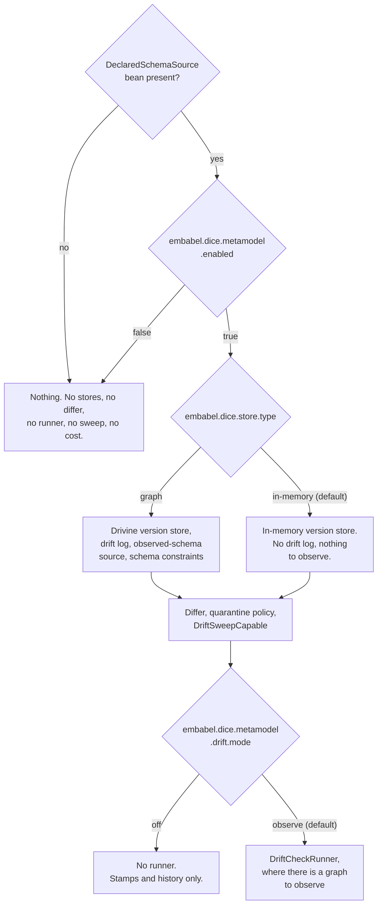

# Metamodel wiring: turning governance on

The governance pieces (stamps, diffs, drift checks, quarantine) are ordinary objects with
constructors. This note covers how a Spring Boot application gets them without assembling them by
hand, and what it has to do to switch them on.

## The opt-in is a declared schema

`MetamodelAutoConfiguration` activates when the application supplies a `DeclaredSchemaSource` bean,
and only then. It is the same arrangement Spring Boot has with JPA: a `DataSource` on the context
brings an `EntityManagerFactory` and the repository infrastructure with it, and leaving the
`DataSource` out means that machinery was never created.



There is no sensible default declared schema, and both ways of guessing one are bad. Govern
everything in the `DataDictionary` and every exploratory type an extractor invented becomes reported
drift, which trains everyone to ignore the reports. Govern nothing and the loop is a no-op that
still writes log lines saying it ran. Making the application say what it governs puts that decision
in the consumer's own code, where a reader can see it.

`embabel.dice.metamodel.enabled=false` is a kill switch on top of that, for switching governance off
in one environment while the bean stays in place. It is consulted only once the bean exists, so it
changes nothing for an application that never declared a schema.

## Nothing runs, and nothing quarantines

Every bean the auto-configuration registers is a capability sitting still.

There is no scheduler and no startup hook. A check happens when the application calls
`DriftCheckRunner.run()`, from a cron, an admin endpoint or a migration script. The check declares,
stamps, observes, runs both comparisons and writes a `DriftReport`, and no path through it moves a
proposition.

Acting on what a check found is a second, deliberate step. The application reads
`DriftCheckResult.quarantineDiff`, decides, and calls `DriftSweepCapable.sweep` once per context it
means to reconcile. The wiring supplies the object that performs a sweep and never calls it.

```kotlin
val result = runner.run()
if (result.hasAnyChange) {
    val swept = sweep.sweep(result.quarantineDiff, policy, contextId)
    log.info("quarantined {} proposition(s)", swept.quarantined.size)
}
```

`embabel.dice.metamodel.drift.mode` picks whether the runner bean exists at all:

| Mode | What you get | What it can change |
| --- | --- | --- |
| `off` | Stores and stamps. Schema history is recorded and readable. | Nothing |
| `observe` (default) | The same, plus a runner that checks and writes reports | Nothing |

`observe` is the default because reporting is safe to leave running indefinitely. `off` is there for
an application that wants schema stamps and version history without a check running against its
graph.

There is no `quarantine` mode, and there is no property anywhere that turns one on. Quarantine
happens because a host called `sweep`, and a configuration value that could make DICE move
propositions by itself would be exactly the surprise this shape exists to remove.

## Status transitions reach your listeners

A sweep moves a proposition to `STALE`, and things downstream need to hear about it.
`ProjectionLineageStaleCascade` marks every projection record derived from that proposition stale,
and it can only do so if the transition is announced.

So the sweep is built with every `DiceEventListener` bean on the context, fanned out through a
`CompositeDiceEventListener`, which makes each delivery exception-safe: a listener that throws is
logged and the remaining listeners still hear the event. Registering the cascade is a one-liner in
the application:

```kotlin
@Bean
fun projectionLineageStaleCascade(records: ProjectionRecordStore) =
    ProjectionLineageStaleCascade(records)
```

An application with no listener bean gets the no-op listener and everything else behaves the same.

## Backend selection follows the store

The Drivine/Neo4j governance beans register under `embabel.dice.store.type=graph`, the same switch
`DiceStorageAutoConfiguration` reads for the proposition store, and they are declared before their
in-memory counterparts so the fallback resolves by registration order.

Declaring a schema on the default in-memory backend starts cleanly, with no `PersistenceManager`
anywhere. What such an application gets:

| Piece | In-memory backend | Graph backend |
| --- | --- | --- |
| `MetamodelVersionStore` | `InMemoryMetamodelVersionStore` | `DrivineMetamodelVersionStore` |
| `DriftReportStore` | — | `DrivineDriftReportStore` |
| `ObservedSchemaSource` | — | `DrivineObservedSchemaSource` |
| `DeclaredObservedDiffer` / `MetamodelDiffer` | `StructuralMetamodelDiffer` | same |
| `DriftQuarantinePolicy` | `MentionTypeDriftQuarantinePolicy` | same |
| `DriftSweepCapable` | `PropositionStoreDriftSweep` | same |
| `DriftCheckRunner` | — | `DefaultDriftCheckRunner` |
| `SchemaCatalog` | — | metamodel uniqueness constraints |

The two blanks in the middle column are the honest answer for a host with no graph. An
observed-schema source reports what a live graph holds, and there is no live graph here; a drift log
is a durable record an operator reads days later, and a heap map is not one. With nothing to
observe, a check has no question to ask, so no runner is registered either.

That still leaves the first tier of governance fully working: such an application can stamp its
declaration, keep a version history, compare two declarations through the differ, and sweep on a
diff it built itself. It moves to the graph backend when it wants live drift detection.

The metamodel uniqueness constraints ride along as a `SchemaCatalog` bean, the same way the
proposition and lineage constraints do; Drivine's `SchemaManager` applies them idempotently on
startup. The stores' MERGEs are only race-free under them, so that bean carries no
`@ConditionalOnMissingBean`. Catalogs accumulate, so an application adding its own gets both.

## Replacing a default

Every default is `@ConditionalOnMissingBean`, and `MetamodelAutoConfiguration` is a real
`@AutoConfiguration` listed in
`META-INF/spring/org.springframework.boot.autoconfigure.AutoConfiguration.imports`.

Both halves matter, and the second is the one that is easy to get wrong. `@ConditionalOnMissingBean`
asks whether a bean of this type exists *yet*, so the answer depends on when it is asked. A plain
`@Configuration` picked up by component scanning carries the same annotations but is processed in
scan order, which leaves it to luck whether the consumer's bean has been registered by then. Spring
Boot registers every application bean definition before it processes a single auto-configuration, so
registering through the imports file makes "your bean wins" a guarantee.
`MetamodelAutoConfigurationTest` checks it from both directions, registering the consumer's
configuration before and after the auto-configuration and asserting the same result.

`DriftSweepCapable` is the one worth calling out. The shipped `PropositionStoreDriftSweep` works on
any `PropositionStore` and does its mention-type filtering, ordering and paging in the JVM. A
durable store that can push all three into a query implements `DriftSweepCapable` itself, and this
default then steps aside.

## The two differ roles are resolved separately

A check asks two different questions, and each has its own interface:

- `DeclaredObservedDiffer` — what the live graph holds that this declaration doesn't recognise.
- `MetamodelDiffer` — what moved in the declaration itself since the baseline a sweep last
  reconciled.

The shipped `StructuralMetamodelDiffer` answers both, so it is registered under its concrete type
and resolves as either interface. The runner looks the two up independently, which means one object
can fill both roles, a consumer can replace either role on its own, and a consumer can supply two
distinct beans and have both used. Whichever role no bean fills falls back to a
`StructuralMetamodelDiffer` the runner builds for itself.

The default differ bean backs off as soon as the application supplies either interface. That keeps a
consumer's `MetamodelDiffer` from competing with the shipped differ for the same injection point,
which is how such a bean could end up quietly ignored.

## The sweep takes the narrow port

`PropositionStoreDriftSweep` is wired against `PropositionStore`, the base persistence port.
`PropositionRepository` adds vector search, graph traversal, temporal query, and core search
operations on top, and a sweep uses none of them: it reads one context's propositions and saves the
flagged copies back.

Asking for the wider interface at the wiring layer would shut a plain store-and-retrieve backend out
of governance over capabilities it is never asked to use, and would do so as a missing
`PropositionRepository` bean at startup. A `PropositionRepository` satisfies the narrow parameter,
so asking for less costs nothing.

## The operator surface

Everything above wires capabilities that sit still. The operator surface is how a person or an agent
reaches them: read the drift log, read the current declaration, run a check, release a quarantined
proposition.

### One service, two front ends

`GovernanceOperationsService` (in `dice`) is the whole surface. `GovernanceController` puts it on
HTTP and `GovernanceTools` exposes it as agent tools, and both call the one service, so an operator
reading over HTTP and an agent reading through tools can never see different answers.

| Operation | HTTP | Tool |
| --- | --- | --- |
| Current declaration | `GET /api/v1/metamodel/declared-version` | `declared_schema_version` |
| Whole-graph drift reports | `GET /api/v1/metamodel/drift-reports` | `latest_drift_reports` |
| One context's drift reports | `GET /api/v1/metamodel/contexts/{contextId}/drift-reports` | `drift_reports_in_context` |
| Run a check | `POST /api/v1/metamodel/drift-checks` | `run_drift_check` |
| Run a check in one context | `POST /api/v1/metamodel/contexts/{contextId}/drift-checks` | `run_drift_check` |
| Release a quarantined proposition | `POST /api/v1/metamodel/contexts/{contextId}/quarantine/{propositionId}/release` | `release_quarantined_proposition` |

Reads are bounded. `limit` defaults to 20 and must fall between 1 and 200; a value outside that
answers `400` with the bound named in the body, so an operator who asked for too much can see what to
ask for. Page backwards with `since`, an ISO-8601 instant.

`declared-version` answers two things beyond the declaration itself: whether that exact content hash
has ever been stamped, and which version the last completed sweep reconciled against. A baseline
differing from the current hash says there is a declared change nobody has acted on yet. A version
store that tracks no baseline answers `null` there.

A check still reports and moves nothing, so its response is a preview and carries the whole
comparison a sweep would act on: both drift sets, the declaration's own movement in `declaredDiff`,
and the two merged into `sweepImpact`. A response carrying only the drift sets could read clean while
a sweep on the same state quarantined.

Releasing is scoped before it writes. The context in the path is an access-control bound: a
proposition belonging to another context answers `404` and is left exactly as it was. A successful
release restores the status the proposition carried before quarantine, clears the quarantine
metadata, and answers the state the proposition is in afterwards.

There is no operation that releases a whole report's worth of propositions. Nothing in the model ties
a quarantined proposition back to the report whose application quarantined it — a `DriftReport` has
no identity beyond its natural key, and the reason a sweep writes names the two schemas and nothing
about the check that produced them.

### Conditions

The service and the tools are registered by `MetamodelAutoConfiguration`, under the loop's own
conditions plus the three collaborators the surface needs:

| Bean | Registered when |
| --- | --- |
| `GovernanceOperationsService` | the governance loop is wired, and a `DriftReportStore`, a `DriftCheckRunner`, a `DriftSweepCapable` and a `PropositionStore` are all on the context |
| `GovernanceTools` | a `GovernanceOperationsService` is on the context |
| `GovernanceController` | a `GovernanceOperationsService` is on the context, the application is a servlet web application, and Spring MVC is on the classpath |

So `enabled=false`, no `DeclaredSchemaSource`, `drift.mode=off`, and the default in-memory backend
each remove the surface along with the rest of the loop. With no runner there is no check to run, and
a surface that could answer only half its own routes would be worse than none.

All three are `@ConditionalOnMissingBean`, so an application that defines its own service, tools or
controller keeps it — that is how a host puts the routes on a different path or behind extra
authorization.

Registering these beans runs nothing. Building the context stamps no version, writes no report and
moves no proposition; a check happens when somebody calls one.

### Turning the HTTP surface off

The surface is worth having through agent tools or a host's own code without opening an endpoint.
`GovernanceController` therefore has its own auto-configuration, so switching it off is one line and
leaves the service and the tools wired:

```yaml
spring:
  autoconfigure:
    exclude: com.embabel.dice.storage.autoconfigure.GovernanceHttpAutoConfiguration
```

The release route changes stored data, so put it behind whatever authorization the host uses for its
administrative endpoints.

## Property reference

| Property | Default | Meaning |
| --- | --- | --- |
| `embabel.dice.metamodel.enabled` | `true` | Kill switch. Consulted only when a `DeclaredSchemaSource` bean exists |
| `embabel.dice.metamodel.drift.mode` | `observe` | `off` or `observe` — whether a `DriftCheckRunner` bean is registered |
| `embabel.dice.store.type` | `in-memory` | Shared with the proposition store. `graph` selects the Drivine-backed governance stores |
