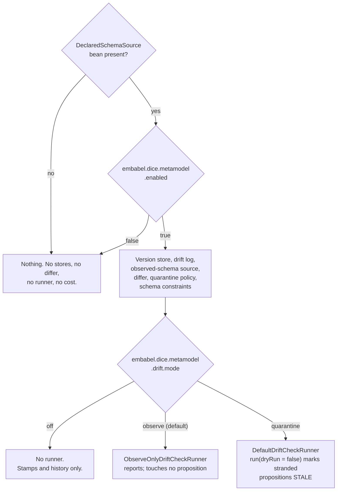

# Metamodel wiring: turning governance on

The governance pieces (stamps, diffs, drift checks, quarantine) are ordinary objects with
constructors. This note covers how a Spring Boot application gets them without assembling them by
hand, and what it has to do to switch them on.

## The opt-in is a declared schema

`MetamodelAutoConfiguration` activates when the application supplies a `DeclaredSchemaSource` bean,
and only then. It is the same arrangement Spring Boot has with JPA: a `DataSource` on the context
brings an `EntityManagerFactory` and the repository infrastructure with it, and leaving the
`DataSource` out means that machinery was never created.

There is no sensible default declared schema, and both ways of guessing one are bad. Govern
everything in the `DataDictionary` and every exploratory type an extractor invented becomes reported
drift, which trains everyone to ignore the reports. Govern nothing and the loop is a no-op that
still writes log lines saying it ran. Making the application say what it governs puts that decision
in the consumer's own code, where a reader can see it.

`embabel.dice.metamodel.enabled=false` is a kill switch on top of that, for switching governance off
in one environment while the bean stays in place. It is consulted only once the bean exists, so it
changes nothing for an application that never declared a schema.

## Drift tiers

`embabel.dice.metamodel.drift.mode` sets how far a check may go. It maps the three tiers in
[metamodel-drift.md](metamodel-drift.md) onto one property value each:

| Mode | What you get | What it can change |
| --- | --- | --- |
| `off` | Stores and stamps. Schema history is recorded and readable. | Nothing |
| `observe` (default) | A runner that checks and writes reports | Nothing |
| `quarantine` | The real runner | Marks stranded propositions `STALE`, with a reason |

The default is `observe`. Reporting is safe to leave running indefinitely; changing proposition
state is a decision somebody makes on purpose.

Which mistakes are recoverable drives that choice. A typo in a declared type name under `observe`
produces a report naming a type you expected to see, which takes five minutes to fix. The same typo
under `quarantine` marks every proposition mentioning that type stale on the next check. Quarantine
is non-destructive, so that is recoverable too, but only if somebody notices.

The `observe` guarantee lives in the wiring. The bean you get is an `ObserveOnlyDriftCheckRunner`
wrapping the real one; it downgrades `run(dryRun = false)` to a dry run, logs a warning, and returns
a result whose `dryRun` is `true`. A dry-run default on the method only protects the caller who
passes no arguments, and a scheduler, an admin endpoint, or one line in a script all reach straight
past it. Making the tier a property of the bean holds the guarantee whoever calls, and moving
between tiers is then a config change.

Nothing is scheduled here. This wires the capability to run a check; when one runs is the
application's call.

## Replacing a default

Every default is `@ConditionalOnMissingBean`, and `MetamodelAutoConfiguration` is a real
`@AutoConfiguration` listed in
`META-INF/spring/org.springframework.boot.autoconfigure.AutoConfiguration.imports`.

Both halves matter, and the second is the one that is easy to get wrong. `@ConditionalOnMissingBean`
asks whether a bean of this type exists *yet*, so the answer depends on when it is asked. A plain
`@Configuration` picked up by component scanning carries the same annotations but is processed in
scan order, which leaves it to luck whether the consumer's bean has been registered by then. Spring
Boot registers every application bean definition before it processes a single auto-configuration, so
registering through the imports file makes "your bean wins" a guarantee.
`MetamodelAutoConfigurationTest` checks it from both directions, registering the consumer's
configuration before and after the auto-configuration and asserting the same result.

The replaceable pieces:

| Type | Default | Backed by |
| --- | --- | --- |
| `MetamodelVersionStore` | `DrivineMetamodelVersionStore` | Neo4j |
| `DriftReportStore` | `DrivineDriftReportStore` | Neo4j |
| `ObservedSchemaSource` | `DrivineObservedSchemaSource` | Neo4j |
| `DeclaredObservedDiffer` | `StructuralMetamodelDiffer` | pure JVM |
| `DriftQuarantinePolicy` | `MentionTypeDriftQuarantinePolicy` | pure JVM |
| `DriftCheckRunner` | per `drift.mode`, above | — |

The differ is registered under its concrete type, because `StructuralMetamodelDiffer` answers two
questions — declaration against declaration (`MetamodelDiffer`) and declaration against a live graph
(`DeclaredObservedDiffer`) — and both need to resolve. Backing off keys on `DeclaredObservedDiffer`
alone, since that is the collaborator the runner needs. An application supplying only a
`MetamodelDiffer`, which is a legitimate thing to want on its own, still gets a working drift check.

The metamodel uniqueness constraints ride along as a `SchemaCatalog` bean, the same way the
proposition and lineage constraints do; Drivine's `SchemaManager` applies them idempotently on
startup. The stores' MERGEs are only race-free under them, so that bean carries no
`@ConditionalOnMissingBean`. Catalogs accumulate, so an application adding its own gets both.

## The runner takes the narrow port

`DefaultDriftCheckRunner` is wired against `PropositionStore`, the base persistence port.
`PropositionRepository` adds vector search, graph traversal, temporal query, and core search
operations on top, and a drift check uses none of them: it reads propositions by context or in bulk
and saves the flagged copies back.

Asking for the wider interface at the wiring layer would shut a plain store-and-retrieve backend out
of governance over capabilities it is never asked to use, and would do so as a missing
`PropositionRepository` bean at startup. A `PropositionRepository` satisfies the narrow parameter,
so asking for less costs nothing.

## A missing PersistenceManager fails startup

The defaults are Drivine/Neo4j-backed and are not gated on a `PersistenceManager` being present. An
application that declared a schema without a graph connection fails at startup with the missing bean
named. Wiring nothing when the connection is missing would leave somebody believing governance is
running when it isn't. An application that wants the loop without Drivine supplies its own three
stores; they are `@ConditionalOnMissingBean` like everything else, and then no `PersistenceManager`
is asked for at all.

## Property reference

| Property | Default | Meaning |
| --- | --- | --- |
| `embabel.dice.metamodel.enabled` | `true` | Kill switch. Consulted only when a `DeclaredSchemaSource` bean exists |
| `embabel.dice.metamodel.drift.mode` | `observe` | `off`, `observe`, or `quarantine` — see above |
