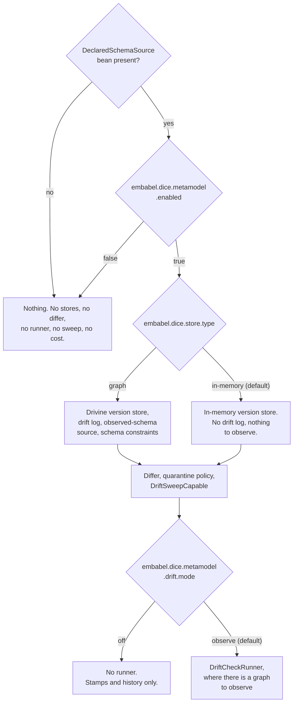

# Metamodel wiring: turning governance on

The governance pieces (stamps, diffs, drift checks, quarantine) are ordinary objects with
constructors. This note covers how a Spring Boot application gets them without assembling them by
hand, and what it has to do to switch them on.

## The opt-in is a declared schema

`MetamodelAutoConfiguration` activates when the application supplies a `DeclaredSchemaSource` bean,
and only then. It is the same arrangement Spring Boot has with JPA: a `DataSource` on the context
brings an `EntityManagerFactory` and the repository infrastructure with it, and leaving the
`DataSource` out means that machinery was never created.



There is no sensible default declared schema, and both ways of guessing one are bad. Govern
everything in the `DataDictionary` and every exploratory type an extractor invented becomes reported
drift, which trains everyone to ignore the reports. Govern nothing and the loop is a no-op that
still writes log lines saying it ran. Making the application say what it governs puts that decision
in the consumer's own code, where a reader can see it.

`embabel.dice.metamodel.enabled=false` is a kill switch on top of that, for switching governance off
in one environment while the bean stays in place. It is consulted only once the bean exists, so it
changes nothing for an application that never declared a schema.

## Nothing runs, and nothing quarantines

Every bean the auto-configuration registers is a capability sitting still.

There is no scheduler and no startup hook. A check happens when the application calls
`DriftCheckRunner.run()`, from a cron, an admin endpoint or a migration script. The check declares,
stamps, observes, runs both comparisons and writes a `DriftReport`, and no path through it moves a
proposition.

**Quarantine is applied by exactly one thing: a host calling `DriftSweepCapable.sweep`.** That is a
deliberate narrowing, and it is worth stating plainly because the obvious alternatives were all
available. Nothing quarantines on a schedule, nothing quarantines while the context starts, no
property switches quarantining on, and a drift check that found everything wrong still moves no
proposition. The application reads `DriftCheckResult.quarantineDiff`, decides, and calls
`DriftSweepCapable.sweep` once per context it means to reconcile. The wiring supplies the object
that performs a sweep and leaves the calling to the host.

```kotlin
val result = runner.run()
if (result.hasAnyChange) {
    val swept = sweep.sweep(result.quarantineDiff, policy, contextId)
    log.info("quarantined {} proposition(s)", swept.quarantined.size)
}
```

`embabel.dice.metamodel.drift.mode` picks whether the runner bean exists at all:

| Mode | What you get | What it can change |
| --- | --- | --- |
| `off` | Stores and stamps. Schema history is recorded and readable. | Nothing |
| `observe` (default) | The same, plus a runner that checks and writes reports | Nothing |

`observe` is the default because reporting is safe to leave running indefinitely. `off` is there for
an application that wants schema stamps and version history without a check running against its
graph.

There is no `quarantine` mode, and there is no property anywhere that turns one on. Quarantine
happens because a host called `sweep`, and a configuration value that could make DICE move
propositions by itself would be exactly the surprise this shape exists to remove.

## Status transitions reach your listeners

A sweep moves a proposition to `QUARANTINED`, and things downstream need to hear about it.
`ProjectionLineageStaleCascade` marks every projection record derived from that proposition stale,
and it can only do so if the transition is announced.

So the sweep is built with every `DiceEventListener` bean on the context, fanned out through a
`CompositeDiceEventListener`, which makes each delivery exception-safe: a listener that throws is
logged and the remaining listeners still hear the event. Registering the cascade is a one-liner in
the application:

```kotlin
@Bean
fun projectionLineageStaleCascade(records: ProjectionRecordStore) =
    ProjectionLineageStaleCascade(records)
```

An application with no listener bean gets the no-op listener and everything else behaves the same.

## Backend selection follows the store

The Drivine/Neo4j governance beans register under `embabel.dice.store.type=graph`, the same switch
`DiceStorageAutoConfiguration` reads for the proposition store, and they are declared before their
in-memory counterparts so the fallback resolves by registration order.

Declaring a schema on the default in-memory backend starts cleanly, with no `PersistenceManager`
anywhere. What such an application gets:

| Piece | In-memory backend | Graph backend |
| --- | --- | --- |
| `MetamodelVersionStore` | `InMemoryMetamodelVersionStore` | `DrivineMetamodelVersionStore` |
| `DriftReportStore` | — | `DrivineDriftReportStore` |
| `ObservedSchemaSource` | — | `DrivineObservedSchemaSource` |
| `DeclaredObservedDiffer` / `MetamodelDiffer` | `StructuralMetamodelDiffer` | same |
| `DriftQuarantinePolicy` | `MentionTypeDriftQuarantinePolicy` | same |
| `DriftSweepCapable` | `PropositionStoreDriftSweep` | same |
| `DriftCheckRunner` | — | `DefaultDriftCheckRunner` |
| `SchemaCatalog` | — | metamodel uniqueness constraints |

The two blanks in the middle column are the honest answer for a host with no graph. An
observed-schema source reports what a live graph holds, and there is no live graph here; a drift log
is a durable record an operator reads days later, and a heap map is not one. With nothing to
observe, a check has no question to ask, so no runner is registered either.

That still leaves the first tier of governance fully working: such an application can stamp its
declaration, keep a version history, compare two declarations through the differ, and sweep on a
diff it built itself. It moves to the graph backend when it wants live drift detection.

The metamodel uniqueness constraints ride along as a `SchemaCatalog` bean, the same way the
proposition and lineage constraints do; Drivine's `SchemaManager` applies them idempotently on
startup. The stores' MERGEs are only race-free under them, so that bean carries no
`@ConditionalOnMissingBean`. Catalogs accumulate, so an application adding its own gets both.

## Replacing a default

Every default is `@ConditionalOnMissingBean`, and `MetamodelAutoConfiguration` is a real
`@AutoConfiguration` listed in
`META-INF/spring/org.springframework.boot.autoconfigure.AutoConfiguration.imports`.

Both halves matter, and the second is the one that is easy to get wrong. `@ConditionalOnMissingBean`
asks whether a bean of this type exists *yet*, so the answer depends on when it is asked. A plain
`@Configuration` picked up by component scanning carries the same annotations but is processed in
scan order, which leaves it to luck whether the consumer's bean has been registered by then. Spring
Boot registers every application bean definition before it processes a single auto-configuration, so
registering through the imports file makes "your bean wins" a guarantee.
`MetamodelAutoConfigurationTest` checks it from both directions, registering the consumer's
configuration before and after the auto-configuration and asserting the same result.

`DriftSweepCapable` is the one worth calling out. The shipped `PropositionStoreDriftSweep` works on
any `PropositionStore` and does its mention-type filtering, ordering and paging in the JVM. A
durable store that can push all three into a query implements `DriftSweepCapable` itself, and this
default then steps aside.

## The two differ roles are resolved separately

A check asks two different questions, and each has its own interface:

- `DeclaredObservedDiffer` — what the live graph holds that this declaration doesn't recognise.
- `MetamodelDiffer` — what moved in the declaration itself since the baseline a sweep last
  reconciled.

The shipped `StructuralMetamodelDiffer` answers both, so it is registered under its concrete type
and resolves as either interface. The runner looks the two up independently, which means one object
can fill both roles, a consumer can replace either role on its own, and a consumer can supply two
distinct beans and have both used. Whichever role no bean fills falls back to a
`StructuralMetamodelDiffer` the runner builds for itself.

The default differ bean backs off as soon as the application supplies either interface. That keeps a
consumer's `MetamodelDiffer` from competing with the shipped differ for the same injection point,
which is how such a bean could end up quietly ignored.

## The sweep takes the narrow port

`PropositionStoreDriftSweep` is wired against `PropositionStore`, the base persistence port.
`PropositionRepository` adds vector search, graph traversal, temporal query, and core search
operations on top, and a sweep uses none of them: it reads one context's propositions and saves the
flagged copies back.

Asking for the wider interface at the wiring layer would shut a plain store-and-retrieve backend out
of governance over capabilities it is never asked to use, and would do so as a missing
`PropositionRepository` bean at startup. A `PropositionRepository` satisfies the narrow parameter,
so asking for less costs nothing.

## The operator surface

Everything above wires capabilities that sit still. The operator surface is how a person or an agent
reaches them: read the drift log, read the current declaration, run a check, release a quarantined
proposition.

### One service, two front ends

`GovernanceOperationsService` (in `dice`) is the whole surface. `GovernanceController` puts it on
HTTP and `GovernanceTools` exposes it as agent tools, and both call the one service, so an operator
reading over HTTP and an agent reading through tools can never see different answers. The service is
the only one of the three the wiring supplies; the host decides about the other two, by importing
the DICE REST surface and by building the tools.

| Operation | HTTP | Tool |
| --- | --- | --- |
| Current declaration | `GET /api/v1/metamodel/declared-version` | `declared_schema_version` |
| Whole-graph drift reports | `GET /api/v1/metamodel/drift-reports` | `latest_drift_reports` |
| One context's drift reports | `GET /api/v1/metamodel/contexts/{contextId}/drift-reports` | `drift_reports_in_context` |
| Run a check | `POST /api/v1/metamodel/drift-checks` | `run_drift_check` |
| Run a check in one context | `POST /api/v1/metamodel/contexts/{contextId}/drift-checks` | `run_drift_check` |
| Release a quarantined proposition | `POST /api/v1/metamodel/contexts/{contextId}/quarantine/{propositionId}/release` | `release_quarantined_proposition` |

Reads are bounded. `limit` defaults to 20 and must fall between 1 and 200; a value outside that
answers `400` with the bound named in the body, so an operator who asked for too much can see what to
ask for. Page backwards with `since`, an ISO-8601 instant.

`declared-version` answers two things beyond the declaration itself: whether that exact content hash
has ever been stamped, and which version the last completed sweep reconciled against. A baseline
differing from the current hash says there is a declared change nobody has acted on yet. A version
store that tracks no baseline answers `null` there.

A check still reports and moves nothing, so its response is a preview and carries the whole
comparison a sweep would act on: both drift sets, the declaration's own movement in `declaredDiff`,
and the two merged into `sweepImpact`. A response carrying only the drift sets could read clean while
a sweep on the same state quarantined.

Releasing is scoped before it writes. The context in the path is an access-control bound: a
proposition belonging to another context answers `404` and is left exactly as it was. A successful
release restores the status the proposition carried before quarantine, clears the quarantine
metadata, and answers the state the proposition is in afterwards.

**Release works one proposition at a time, by design.** An operator who wants twenty propositions
back makes twenty calls. The narrowing follows from what the model records: a `DriftReport` carries
no identity a reason could name — its natural key is the schema name, the version hash, the context
and the capture instant — and the reason a sweep writes on a held proposition names the two schemas
and nothing about the check that produced them. So there is no honest way to ask for "everything
this report quarantined", and inventing a report id to make the bulk route possible would put a
promise in the API that the stored data cannot keep.

### What the wiring supplies, and what the host supplies

`MetamodelAutoConfiguration` registers one thing here: the service.

| Piece | Where it comes from |
| --- | --- |
| `GovernanceOperationsService` | the auto-configuration, when the governance loop is wired and a `DriftReportStore`, a `DriftCheckRunner`, a `DriftSweepCapable` and a `PropositionStore` are all on the context |
| `GovernanceController` | `@Import(DiceRestConfiguration.class)` in the host's own configuration, when a `GovernanceOperationsService` is on the context |
| `GovernanceTools` | the host, calling `GovernanceTools.asTools(service)` |

So `enabled=false`, no `DeclaredSchemaSource`, `drift.mode=off`, and the default in-memory backend
each remove the service along with the rest of the loop, and the two front ends go with it. With no
runner there is no check to run, and a surface that could answer only half its own routes would be
worse than none.

The service is `@ConditionalOnMissingBean`, so an application that defines its own keeps it and both
front ends then run through that one.

Registering the service runs nothing. Building the context stamps no version, writes no report and
moves no proposition; a check happens when somebody calls one.

### HTTP switches on with the rest of the DICE REST surface

`GovernanceController` has no auto-configuration. It goes on the context through
`DiceRestConfiguration`, the single import that opens any DICE REST surface, which is how
`PropositionPipelineController`, `MemoryController` and `DiscoveryController` have always arrived:

```java
@Configuration
@Import(DiceRestConfiguration.class)
public class MyAppConfiguration { }
```

Two host decisions therefore have to line up before a `/api/v1/metamodel` URL resolves: import DICE
REST, and wire the governance loop. Leave the import out and the loop still works through the agent
tools and the host's own code, with no endpoint open. Import it with no schema declared and the
application starts clean, publishing its other DICE routes and none of these.

There is one wrinkle worth knowing, because it decides where the controller can be named.
`@ConditionalOnBean` on an imported class is answered while Spring reads the configuration class
that imported it, and Spring Boot registers auto-configuration bean definitions after that point. A
plain entry in `DiceRestConfiguration`'s `@Import` list would therefore see no
`GovernanceOperationsService` in any application whose loop came from the auto-configuration —
which is every application following this note. `GovernanceControllerImport`, a
`DeferredImportSelector` with the lowest precedence, is what puts the question after Spring Boot's
own auto-configuration selector has answered. `GovernanceOperatorAutoConfigurationTest` pins all
four combinations of import and loop, reading the live handler mapping so an empty answer means a
client gets a 404.

A host that wants these operations somewhere else — a different path, extra authorization, a shape
of its own — declares its own `GovernanceController` bean and keeps the import for the other
controllers; the shipped one is `@ConditionalOnMissingBean` and backs off.

The release route changes stored data, so put it behind whatever authorization the host uses for its
administrative endpoints.

### The agent tools are yours to build

Nothing registers a `GovernanceTools` bean. No DICE tool object is a bean — `DiscoveryTools`,
`GraphQueryTools` and `Memory` are all constructed by the application that wants them, because a
tool object is only useful once it has been registered with a particular agent or MCP server, and
that registration is the host's call:

```kotlin
@Bean
fun governanceTools(operations: GovernanceOperationsService): List<Tool> =
    GovernanceTools.asTools(operations)
```

## Property reference

| Property | Default | Meaning |
| --- | --- | --- |
| `embabel.dice.metamodel.enabled` | `true` | Kill switch. Consulted only when a `DeclaredSchemaSource` bean exists |
| `embabel.dice.metamodel.drift.mode` | `observe` | `off` or `observe` — whether a `DriftCheckRunner` bean is registered |
| `embabel.dice.store.type` | `in-memory` | Shared with the proposition store. `graph` selects the Drivine-backed governance stores |
