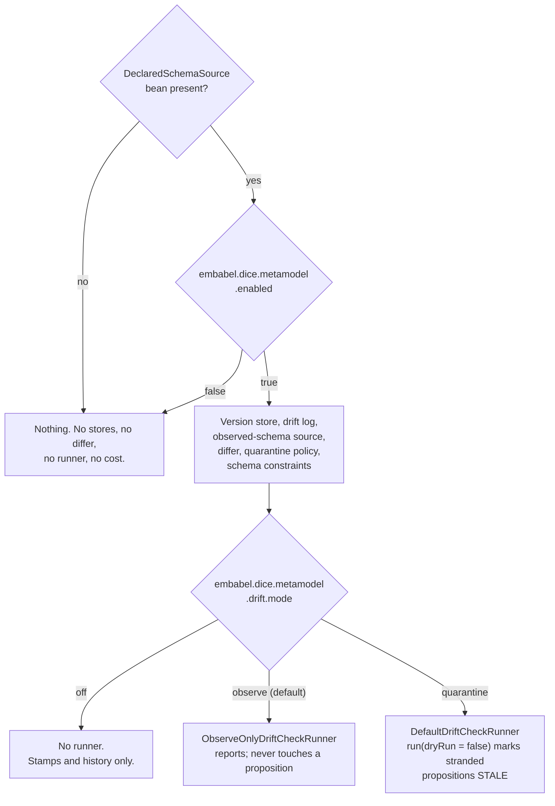

# Metamodel wiring: turning governance on

The governance pieces — stamps, diffs, drift checks, quarantine — are ordinary objects with
constructors. This note is about the last mile: how a Spring Boot application gets them without
assembling them by hand, and why turning them on is a thing you have to *do* rather than a thing
that happens to you.

## The bargain: bring a declared schema, get the plumbing

`MetamodelAutoConfiguration` activates when — and only when — the application supplies a
`DeclaredSchemaSource` bean.

That is the same deal Spring Boot makes with JPA. Put a `DataSource` on the context and an
`EntityManagerFactory`, a transaction manager, and a repository infrastructure appear behind it.
Leave it out and none of that machinery exists; it isn't disabled, it was never created. Declaring a
schema is the DICE equivalent: the one decision only the application can make, and the signal that
it wants everything downstream of it.

Requiring the bean is not ceremony. There is no sensible default declared schema, and both ways of
guessing one are bad. Govern everything in the `DataDictionary` and every exploratory type an
extractor invented becomes reported drift, which trains everyone to ignore the reports. Govern
nothing and the loop is a no-op that still writes reassuring log lines. Making the application say
what it governs puts that decision in the consumer's own code, where a reader can see it.

`embabel.dice.metamodel.enabled=false` sits on top as a kill switch — the way to switch governance
off in one environment without deleting the bean. It is only consulted once the bean exists, so it
changes nothing for an application that never declared a schema.

## Tiers, and why quarantine is never the default

`embabel.dice.metamodel.drift.mode` picks how far a check may go. It mirrors the three tiers in
[metamodel-drift.md](metamodel-drift.md), one property value each:

| Mode | What you get | What it can change |
| --- | --- | --- |
| `off` | Stores and stamps. Schema history is recorded and readable. | Nothing |
| `observe` (default) | A runner that checks and writes reports | Nothing |
| `quarantine` | The real runner | Marks stranded propositions `STALE`, with a reason |

Reporting is safe to leave running forever, so it is the default. Changing proposition state is a
decision somebody has to make on purpose, so it is not.

The asymmetry is about which mistakes are recoverable. A typo in a declared type name under
`observe` produces a report naming a type you expected to see — annoying, five minutes to fix.
The same typo under `quarantine` marks every proposition mentioning that type stale on the next
scheduled check. Quarantine is non-destructive, so that is recoverable too, but only if somebody
notices. Defaults should fail in the direction where nobody has to notice.

`observe` is enforced by wiring rather than by convention. The bean you get is an
`ObserveOnlyDriftCheckRunner` wrapping the real one, and it downgrades `run(dryRun = false)` to a dry
run, logs a warning, and returns a result whose `dryRun` is `true`. A dry-run *default* only protects
the caller who passes no arguments; a scheduler, an admin endpoint, or one line in a script all reach
straight past it. Making the tier a property of the bean means the guarantee holds no matter who
calls, and moving between tiers is a config change rather than a code change.

Nothing is scheduled here. This wires the *capability* to run a check; when one runs is the
application's call.

## Your bean always wins, whatever the order

Every default is `@ConditionalOnMissingBean`, and `MetamodelAutoConfiguration` is a real
`@AutoConfiguration` listed in
`META-INF/spring/org.springframework.boot.autoconfigure.AutoConfiguration.imports`.

Both halves matter, and the second is the one that is easy to get wrong. `@ConditionalOnMissingBean`
asks "does a bean of this type exist *yet*?" — a question whose answer depends on when it is asked.
A plain `@Configuration` picked up by component scanning carries the same annotations but is
processed in scan order, so whether the consumer's bean has been registered by then is luck. Spring
Boot registers every application bean definition *before* it processes a single auto-configuration,
so registering through the imports file turns "your bean wins" from a coincidence into a guarantee.
`MetamodelAutoConfigurationTest` checks it from both directions, registering the consumer's
configuration before and after the auto-configuration and asserting the same result.

The replaceable pieces:

| Type | Default | Backed by |
| --- | --- | --- |
| `MetamodelVersionStore` | `DrivineMetamodelVersionStore` | Neo4j |
| `DriftReportStore` | `DrivineDriftReportStore` | Neo4j |
| `ObservedSchemaSource` | `DrivineObservedSchemaSource` | Neo4j |
| `DeclaredObservedDiffer` | `StructuralMetamodelDiffer` | pure JVM |
| `DriftQuarantinePolicy` | `MentionTypeDriftQuarantinePolicy` | pure JVM |
| `DriftCheckRunner` | per `drift.mode`, above | — |

The differ is registered under its concrete type, because `StructuralMetamodelDiffer` answers two
different questions — declaration against declaration (`MetamodelDiffer`) and declaration against a
live graph (`DeclaredObservedDiffer`) — and both need to resolve. Backing off keys on
`DeclaredObservedDiffer` alone, since that is the collaborator the runner needs. Supplying only a
`MetamodelDiffer`, which is a legitimate thing to want on its own, leaves drift checking working
rather than refusing to start.

The metamodel uniqueness constraints ride along as a `SchemaCatalog` bean, the same way the
proposition and lineage constraints do; Drivine's `SchemaManager` applies them idempotently on
startup. They are not optional — the stores' MERGEs are only race-free under them — so unlike the
store beans they carry no `@ConditionalOnMissingBean`. Catalogs accumulate rather than compete.

## The runner takes the narrow port

`DefaultDriftCheckRunner` is wired against `PropositionStore`, the base persistence port — not
`PropositionRepository`, which adds vector search, graph traversal, temporal query, and core search
operations on top.

A drift check reads propositions by context or in bulk and saves the flagged copies back. That is
all of it. Asking for the wider interface at the wiring layer would shut a plain store-and-retrieve
backend out of governance over capabilities it is never asked to use, and it would do so invisibly:
the context would simply fail to find a bean. A `PropositionRepository` satisfies the narrow
parameter anyway, so nothing is given up by asking for less.

## Failing loudly

The defaults are Drivine/Neo4j-backed, and they are not gated on a `PersistenceManager` being
present. An application that declared a schema without a graph connection fails at startup with the
missing bean named.

That is deliberate. The alternative — quietly wiring nothing when the connection is missing — leaves
somebody believing governance is running when it isn't, which is the one outcome a governance
feature must never produce. An application that genuinely wants the loop without Drivine supplies its
own three stores; they are `@ConditionalOnMissingBean` like everything else, and then no
`PersistenceManager` is asked for at all.

## Property reference

| Property | Default | Meaning |
| --- | --- | --- |
| `embabel.dice.metamodel.enabled` | `true` | Kill switch. Only consulted when a `DeclaredSchemaSource` bean exists |
| `embabel.dice.metamodel.drift.mode` | `observe` | `off`, `observe`, or `quarantine` — see above |
