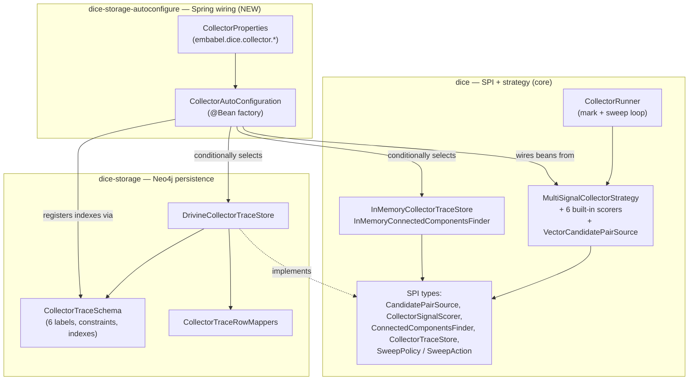
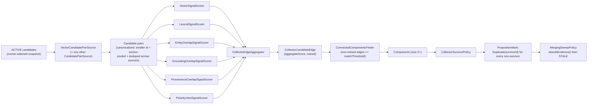
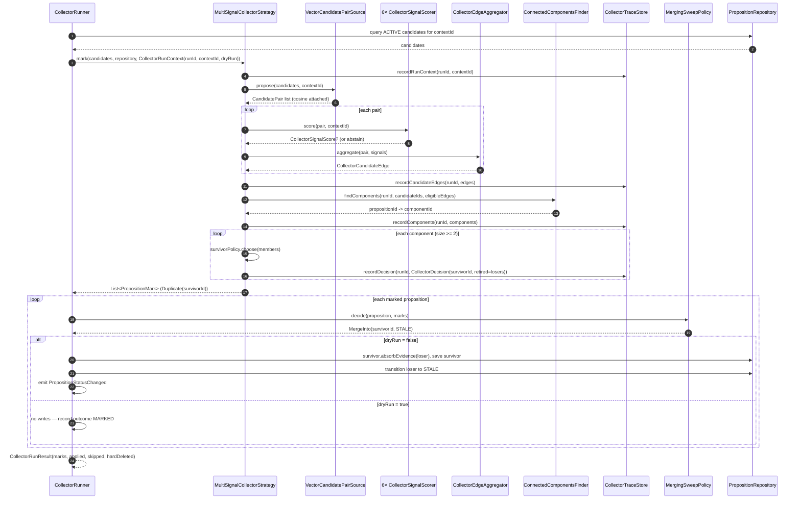
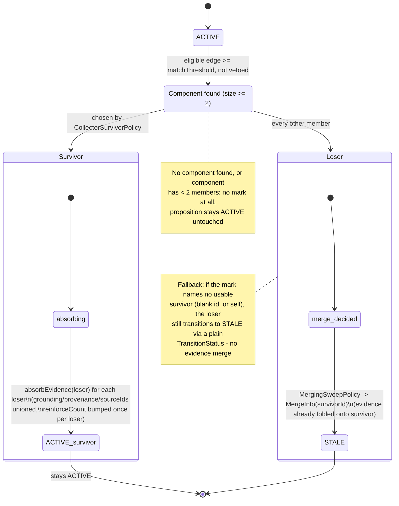

# The multi-signal collector: pluggable duplicate detection

DICE's original duplicate strategy cut on one signal — cosine similarity from vector
clustering — and called it done. That works for exact-ish rewordings but misses a lot: two
propositions can be near-identical in wording but contradict each other, or dissimilar in
wording but clearly about the same fact once you look at shared entities or shared grounding.
A single threshold on one number can't represent that. `MultiSignalCollectorStrategy` replaces
the single cut with a small pipeline: pool candidate pairs from any number of sources, score
each pair on six independent signals, blend the scores into one edge, group edges into
connected components, and pick one survivor per component. Every step of a run is recorded, so
a merge decision can be explained — and, because nothing is deleted, effectively reversed — well
after the fact.

This strategy is one plug-in to the collector framework covered in
[reclamation-and-collector](reclamation-and-collector.md): it's a `RunAwareCollectorStrategy`
that runs in the mark phase, same as `DecayCollectorStrategy` or the older
`DuplicateCollectorStrategy`. It fits into the same lifecycle transitions described in
[proposition-lifecycle](proposition-lifecycle.md) (a collapsed duplicate ends up `STALE`, same
destination as decay) and follows the same admission/maintenance separation described in
[knowledge-hygiene](knowledge-hygiene.md) — marking never mutates anything; only the sweep
phase does. The collector's own audit trail — the trace store, its schema, and how a
collapse gets explained after the fact — has enough surface area of its own to warrant a
companion note: see [collector-trace-store](collector-trace-store.md).

This document covers the whole subsystem: architecture across three modules, the pipeline
dataflow, the six signals, survivor selection and evidence merge, sweep policies, and
configuration. The trace store's persistence model gets its own document.

## Motivation: why one cosine cut wasn't enough

Vector-cluster recall answers "does this look similar," which is a good *candidate* filter but
a bad *decision* rule on its own. Three concrete gaps drove the multi-signal design:

- **Lexical near-duplicates that don't cluster well.** Minor rewordings sometimes land outside
  a cosine threshold that catches semantic paraphrase — a Jaro-Winkler check on normalized text
  catches those directly.
- **Corroborating structure vector similarity doesn't see.** Two propositions sharing entities,
  grounding, or provenance are more likely to be the same fact restated — evidence a pure
  embedding comparison throws away.
- **The one thing a similarity score can actively get wrong: polarity.** "Alice works at Acme"
  and "Alice no longer works at Acme" can be extremely similar by every distance metric and
  mean opposite things. A collapse policy built only on similarity has no way to refuse that
  merge, which is why polarity is a hard veto here rather than another weighted signal — details
  in [The six signals](#the-six-signals) below.

Blending several signals and reserving one of them as a hard veto lets the collector make a
more informed collapse decision without hand-tuning a single all-purpose threshold.

## Architecture: three modules, one capability

The collector spans three modules, each with a distinct job:

- **`dice`** — the SPI types (`CandidatePairSource`, `CollectorSignalScorer`,
  `CollectorTraceStore`, `ConnectedComponentsFinder`, `SweepPolicy`/`SweepAction`), the
  `MultiSignalCollectorStrategy` orchestrator and its six built-in scorers, the in-memory
  defaults (`InMemoryCollectorTraceStore`, `InMemoryConnectedComponentsFinder`), and the
  `CollectorRunner` that drives the mark-and-sweep loop.
- **`dice-storage`** — `DrivineCollectorTraceStore`, the Neo4j-backed implementation of the
  trace SPI, plus `CollectorTraceSchema` (the six node labels' constraints/indexes) and the row
  mappers that translate graph rows back into the SPI's plain data classes.
- **`dice-storage-autoconfigure`** — a new Spring Boot autoconfiguration module that turns all
  of the above into beans wired from `embabel.dice.collector.*` properties: the scorers, the pair
  source, the components finder, the trace stores, the survivor policy, and the
  `MultiSignalCollectorStrategy` itself. It does not wire a `CollectorRunner` bean — an
  application still assembles one by hand from the autoconfigured strategy (see
  [Entry points](reclamation-and-collector.md#entry-points-collect-dry-run-live-run)).



The dependency direction only flows one way: `dice-storage` depends on `dice` (to implement its
SPI), and `dice-storage-autoconfigure` depends on both. Core collector logic never imports
anything from `dice-storage` — swap `DrivineCollectorTraceStore` for any other
`CollectorTraceStore` implementation and the strategy doesn't change.

## The pipeline: from candidates to a merged proposition

`MultiSignalCollectorStrategy.mark()` runs a run in four stages: propose pairs, score and
aggregate, group into components, pick survivors. The output feeds into the sweep phase exactly
like any other collector strategy.



Stage by stage, in the actual code (`MultiSignalCollectorStrategy.mark()`,
`dice/src/main/kotlin/com/embabel/dice/projection/memory/collector/MultiSignalCollectorStrategy.kt:87-121`):

1. **Propose.** Every `CandidatePairSource` proposes pairs over the candidate set
   (`collectPairs`, lines 123-142). Results from every source are pooled, canonicalized (the
   smaller id becomes the anchor so `A,B` and `B,A` collapse to the same pair), and deduplicated
   by `(anchorId, memberId)` — a pair proposed twice by two different sources is scored once.
   Self-pairs (anchor id equals member id) are dropped outright.
2. **Score and aggregate.** Every `CollectorSignalScorer` scores each pair
   (`scoreAndAggregate`, line 144). A scorer that returns `null` abstains and drops out of that
   pair's blend entirely — a pair with grounding on only one side, say, just skips the
   grounding-overlap signal rather than forcing a zero. `CollectorEdgeAggregator.aggregate()`
   folds whatever's left into one `CollectorCandidateEdge`
   (`dice/src/main/kotlin/com/embabel/dice/projection/memory/collector/CollectorEdgeAggregator.kt:40-54`):
   the aggregate score is the weighted mean of every non-abstaining signal
   (`Σ(weight·score) / Σ(weight)`, coerced into `0..1`), and any signal with `veto = true` marks
   the whole edge `vetoed` regardless of the blended number. A pair where every scorer abstained
   (weight sum is `0.0`) gets an aggregate score of `0.0`.
3. **Group into components.** `ConnectedComponentsFinder.findComponents()` unions the
   non-vetoed edges scoring at or above `matchThreshold` (default `0.6`) into components, using
   union-find so overlapping pairs (A≈B, B≈C) collapse to one cluster `{A, B, C}` instead of
   fighting over pairwise merges. `MultiSignalCollectorStrategy` just calls
   `componentsFinder.findComponents(...)`; the union-find itself lives in the shipped
   implementation, `InMemoryConnectedComponentsFinder.kt`.
4. **Pick a survivor.** Each component of size two or more (`markComponent`, lines 149-190) gets
   one survivor via `CollectorSurvivorPolicy`; everyone else in the component is marked
   `Duplicate(survivorId)`. Components smaller than two members produce no marks — a lone
   proposition with no eligible edge just isn't a duplicate of anything.

Marks are deduplicated by proposition id and sorted before being returned
(`distinctBy { it.propositionId }.sortedBy { it.propositionId }`, line 112-113), so the result
is deterministic regardless of iteration order upstream.

### One run, sequence view

A `CollectorRunner.run(contextId, dryRun)` call drives one full pass. The sequence below shows a
live run (`dryRun = false`) collapsing one duplicate pair; a dry run follows the identical path
except the final proposition writes and the `PropositionStatusChanged` event are skipped, and
the recorded outcome is `MARKED` instead of `TRANSITIONED`.



## The pair source

`VectorCandidatePairSource` is the one pair source shipped today
(`dice/src/main/kotlin/com/embabel/dice/projection/memory/collector/VectorCandidatePairSource.kt`).
It reuses the repository's own vector clustering
(`PropositionRepository.findClusters(similarityThreshold, topK, query)`) — the same recall path
the older single-signal strategy used — and turns every anchor/member edge from a cluster into a
`CandidatePair`, carrying the cluster's cosine along as `proposalScore` so `VectorSignalScorer`
downstream doesn't have to re-embed anything. It re-derives canonicalization and dedup itself
rather than trusting `findClusters`' own ordering (defensive, not free — see the comment at
line 54 of the source). Only pairs where both propositions are in the runner's candidate
snapshot are proposed; a cluster member outside that snapshot is silently dropped, mirroring the
`byId` filter the older `DuplicateCollectorStrategy` used. Defaults: `similarityThreshold = 0.7`
(matches dice's existing default so recall doesn't regress), `topK = 10`.

The `CandidatePairSource` extension point exists so a deployment can add pair sources beyond vector
recall — a name-similarity crawl, an external entity-linking pass, whatever else surfaces
plausible duplicates worth scoring. `MultiSignalCollectorStrategy` pools every source's
proposals before scoring, so adding a source only ever widens recall; it can't change how an
existing pair gets scored.

## The six signals

Each scorer looks at one candidate pair and returns a `CollectorSignalScore` (`signal`, `score`,
`weight`, `veto`, optional `explanation`/`evidenceRef`) or `null` to abstain. All but the veto
scorer carry a configurable `weight` (via a `@JvmOverloads` constructor) used in the aggregate
blend.

| Signal | What it measures | Default weight | Abstains when |
|---|---|---|---|
| **Vector** | Reuses the pair source's own cosine (`proposalScore`) as the score | 1.0 | Pair didn't arrive with a `proposalScore` |
| **Lexical** | Jaro-Winkler similarity over the propositions' normalized text | 0.5 | Never (always has text to compare) |
| **Entity overlap** | Jaccard similarity of the two propositions' mention (entity) ids | 1.0 | Either side has no mentions at all |
| **Grounding overlap** | Jaccard similarity of the two propositions' grounding sets | 0.5 | Either side has no grounding |
| **Provenance overlap** | Jaccard similarity of the two propositions' provenance locators | 0.5 | Either side has no provenance entries |
| **Polarity veto** | Shared entities + opposite negation cues ("works at Acme" vs. "no longer works at Acme") | n/a — **veto only** | No shared entities, or both sides agree on polarity |

**Polarity veto is not a similarity score.** It never contributes a
positive number to the blend; it either abstains (returns `null`) or fires with a fixed
zero-weight veto score
(`dice/src/main/kotlin/com/embabel/dice/projection/memory/collector/PolarityVetoSignalScorer.kt:49-55`):

```kotlin
return CollectorSignalScore(
    signal = SIGNAL_NAME,
    score = 0.0,
    weight = VETO_WEIGHT,
    veto = true,
    explanation = "opposite polarity about shared entities",
)
```

where `SIGNAL_NAME = "polarity-veto"` and `VETO_WEIGHT = 0.0`. The weight is pinned at `0.0` on
purpose: a non-zero weight would drag a vetoed edge's blended
`aggregateScore` toward zero, hiding what the other five signals actually thought of the pair.
The veto works entirely through the `vetoed` flag on the edge — `CollectorEdgeAggregator` sets
`vetoed = signals.any { it.veto }` independent of the score math — so a vetoed edge's
`aggregateScore` still reflects real corroborating evidence; it's excluded from grouping by the
`vetoed` flag, not by a suppressed number. That distinction matters for the trace: a reviewer
looking at a vetoed edge later can still see "these two looked 0.9 similar, but were vetoed for
polarity," rather than an uninformative near-zero score.

The scorer's limits: it only fires when the two propositions' mention sets
actually overlap (no shared subject, no veto check at all), and it's a lexical negation-cue scan
(`NEGATION_WORDS`/`NEGATION_PHRASES`), not a semantic entailment model — it can misfire on cues
used non-negatively ("left a message") and miss negation phrased without a recognized cue word.
It's a guard rail against the worst kind of bad merge, not an NLI classifier.

## Survivor selection and evidence merge

Once a component has two or more members, `CollectorSurvivorPolicy.choose()` picks the one that
survives; everyone else is marked `Duplicate(survivorId)`. The shipped default
(`dice/src/main/kotlin/com/embabel/dice/projection/memory/collector/CollectorSurvivorPolicy.kt:32-36`):

```kotlin
val defaultCollectorSurvivorPolicy = CollectorSurvivorPolicy { members ->
    members.maxWith(
        compareBy<Proposition>({ it.effectiveConfidence() }, { it.reinforceCount }, { it.id }),
    )
}
```

Ordering is: highest effective confidence wins; ties broken by reinforcement count (a fact seen
more often is a stronger anchor); a full tie broken by stable id, so the choice is deterministic
even when two propositions are otherwise indistinguishable. `CollectorSurvivorPolicy` is a SAM
interface — a deployment that wants a different ordering (e.g. prefer a specific source tier)
supplies its own bean.

Losing propositions aren't just discarded — their evidence is folded onto the survivor via
`Proposition.absorbEvidence()`
(`dice/src/main/kotlin/com/embabel/dice/proposition/Proposition.kt:303-313`):

```kotlin
fun absorbEvidence(other: Proposition): Proposition {
    val alreadyContained = grounding.containsAll(other.grounding) &&
        provenanceEntries.containsAll(other.provenanceEntries) &&
        sourceIds.containsAll(other.sourceIds)
    return withGrounding(other.grounding)
        .withProvenanceEntries(other.provenanceEntries)
        .copy(
            sourceIds = (sourceIds + other.sourceIds).distinct(),
            reinforceCount = if (alreadyContained) reinforceCount else reinforceCount + 1,
        )
}
```

Grounding and provenance entries are unioned (`withGrounding`/`withProvenanceEntries` presumably
dedupe internally — they're additive, not replacing), source ids are unioned and deduped with
`distinct()`, and `reinforceCount` bumps by exactly one *unless* the survivor already fully
contained the loser's evidence — that guard makes repeated absorption idempotent: re-running a
collapse (or absorbing the same loser twice through some retry) doesn't inflate the
reinforcement count artificially. This is what makes evidence merge safe to call more than once
with the same inputs.

### A proposition's status through a collapse



## Sweep policies

The mark phase only *describes* what looks like a duplicate; the sweep phase decides what to do
about it. Two `SweepPolicy` implementations exist
(`dice/src/main/kotlin/com/embabel/dice/spi/SweepPolicy.kt`), and one sealed `SweepAction`
family (`dice/src/main/kotlin/com/embabel/dice/spi/SweepAction.kt`) they choose from:
`TransitionStatus(newStatus)`, `MergeInto(survivorId, thenStatus)`, `HardDelete`, `Skip`.

**`MergingSweepPolicy` is `CollectorRunner.Builder`'s default policy — unconditionally, not
gated on calling `withDuplicateDetection()`.** `CollectorRunner.Builder` initializes `policy: SweepPolicy = MergingSweepPolicy()` as a field
default (`dice/src/main/kotlin/com/embabel/dice/projection/memory/CollectorRunner.kt:93`),
regardless of which strategies get added to the builder. Add only a decay strategy and never
call `withDuplicateDetection()` — you still get `MergingSweepPolicy` as your sweep policy; it
just never sees a `Duplicate` mark to act on, so its `MergeInto` branch is dead code for that
run, and it behaves identically to `StatusTransitionSweepPolicy` for every mark it processes.
The distinction only becomes visible the moment a strategy in the run actually produces a
`Duplicate` mark. A deployment that wants pure status flips even with duplicate detection
enabled must call `withPolicy(StatusTransitionSweepPolicy())` explicitly to override the
default.

`MergingSweepPolicy.decide()` (`SweepPolicy.kt:101-123`):

1. Pinned propositions are always skipped, regardless of marks — pinning is described further in
   [proposition-lifecycle](proposition-lifecycle.md#pinning-permanent-protection-from-the-lifecycle).
2. A proposition with no marks is skipped.
3. It looks across the proposition's marks for the first `Duplicate` mark whose `survivorId` is
   non-blank and not the proposition's own id, and returns `MergeInto(survivorId, targetStatus)`.
4. If no mark names a usable survivor (a mark that isn't `Duplicate` at all, or a `Duplicate`
   mark with a blank/self-referential survivor id — which shouldn't normally happen but is
   defended against anyway), it falls back to a plain `TransitionStatus(targetStatus)` — so a
   non-dedup mark, or a malformed one, still retires normally instead of silently being ignored.

`StatusTransitionSweepPolicy` is the older, simpler policy: same pinned/unmarked skip rules, but
it always returns `TransitionStatus(targetStatus)` and never merges evidence — it's what you get
for decay-only marks, or for duplicate marks if a deployment opts out of merging via
`withPolicy(StatusTransitionSweepPolicy())`. Neither policy ever returns `HardDelete` — that
outcome exists in the `SweepAction` sealed family for a deployment-supplied policy to opt into,
but nothing shipped in this subsystem produces it.

Applying `MergeInto` is the runner's job, not the policy's: the runner calls
`survivor.absorbEvidence(loser)`, saves the survivor, then transitions the loser to
`thenStatus`. If a mark in the same run would also retire the survivor, the merge is applied
first — so any later transition in the same pass reads the already-merged survivor state.

## Configuration and autoconfiguration

`dice-storage-autoconfigure` is a new module (Spring Boot autoconfiguration, depending on both
`dice-storage` and `dice`) that turns the collector into wired beans from
`embabel.dice.collector.*` properties, gated by
`@ConditionalOnProperty(prefix = "embabel.dice.collector", name = ["enabled"], havingValue = "true", matchIfMissing = true)`
on `CollectorAutoConfiguration` itself — the master switch. Every bean is
`@ConditionalOnMissingBean`, so an application supplying its own implementation always wins over
the built-in default.

### `CollectorProperties` (prefix `embabel.dice.collector`)

| Property | Type | Default | Notes |
|---|---|---|---|
| `enabled` | `Boolean` | `true` | Master switch; `false` disables the whole autoconfiguration |
| `matchThreshold` | `Double` (`0.0`–`1.0`) | `0.6` | Minimum aggregate score for an edge to union its endpoints into a component |
| `signals.<name>.enabled` | `Boolean` | `true` | Per-signal toggle, keyed by short name (`vector`, `lexical`, `entity-overlap`, `grounding-overlap`, `provenance-overlap`, `polarity-veto`) |
| `signals.<name>.weight` | `Double?` | `null` | Overrides that scorer's blend weight; `null` keeps the scorer's own built-in default |
| `signals.vector.similarityThreshold` | `Double?` | `null` (→ `0.7`) | Vector signal only — cosine floor passed to `findClusters` |
| `signals.vector.topK` | `Int?` | `null` (→ `10`) | Vector signal only — max similar members per cluster seed |
| `sweep.delta` | `Boolean` | `false` | Property placeholder — bound and validated, no periodic delta-sweep runner reads it yet |
| `trace.enabled` | `Boolean` | `true` | Whether runs are recorded to a trace store at all |
| `trace.detailRetentionDays` | `Int?` | `null` (indefinite) | Property placeholder — no retention job reads it yet |

The `weight`/`similarityThreshold`/`topK` fields are nullable specifically so "not configured"
is distinguishable from "configured to a specific number": an unset weight falls back to the
scorer's own neutral default rather than some autoconfigure-level default fighting it.

### Why the scorer registration order matters

`CollectorAutoConfiguration` puts `@Order` on every scorer bean method — vector (1), lexical
(2), entity-overlap (3), grounding-overlap (4), provenance-overlap (5), polarity-veto (6) — and
that order becomes the order Spring injects them into `List<CollectorSignalScorer>`. The order
doesn't change the aggregate math (the weighted mean is order-independent), but it does fix the
order signals show up in a trace edge's `signals` list, and by extension in any trace-store
query that iterates them positionally. Reordering the `@Order` values or adding a new scorer at
the wrong position changes what old trace rows look like next to new ones for the same pair.

### Graph vs. in-memory trace store selection

Two trace-store beans compete for the same `CollectorTraceStore`/`CollectorTraceQuery`
injection point:

- `drivineCollectorTraceStore` — `@ConditionalOnProperty(embabel.dice.store.type=graph)` *and*
  `@ConditionalOnProperty(embabel.dice.collector.trace.enabled, matchIfMissing=true)`.
- `inMemoryCollectorTraceStore` — no conditions beyond `@ConditionalOnMissingBean`.

Both beans return their *concrete* store type (`DrivineCollectorTraceStore` /
`InMemoryCollectorTraceStore`), not the `CollectorTraceStore` interface — deliberately. Spring
determines a bean's type from its factory method's declared return type before instantiating
it; if the method were declared to return the interface, Spring wouldn't know at
condition-evaluation time that the same bean also satisfies `CollectorTraceQuery` (the read
side), so an injection point asking for `CollectorTraceQuery` specifically would fail to
resolve. Returning the concrete type lets one bean instance satisfy both interfaces with no
separate query bean. The graph bean is declared first in the class so it wins the fallback
resolution order when both conditions could apply, matching the pattern
`DiceStorageAutoConfiguration` already uses for the proposition store itself.

The full detail of what gets persisted and how it's queried back lives in
[collector-trace-store](collector-trace-store.md).

## The `RunAwareCollectorStrategy` bridge

`CollectorStrategy` is a plain SAM (`mark(candidates, repository, contextId)`);
`RunAwareCollectorStrategy` extends it with a full-context `mark(candidates, repository, ctx)` and
provides a default implementation of the plain SAM that builds an ephemeral
`CollectorRunContext(runId = "", contextId = contextId)`
(`dice/src/main/kotlin/com/embabel/dice/projection/memory/CollectorStrategy.kt:76-80`). Inside
`MultiSignalCollectorStrategy.mark()`, `tracing = ctx.runId.isNotBlank()` gates every trace-store
write — a blank runId means the run isn't queryable anywhere, so marks are still computed and
returned normally, but none of the four `traceStore.record*` calls fire. This is what lets the
same strategy serve both a fully traced `CollectorRunner.run()` pass and the untraced
`collect()`/legacy-SAM path with no branching in the caller.

`sweep.delta` and `trace.detailRetentionDays` are real, validated `CollectorProperties` fields
today, but there's no periodic delta-sweep runner or retention job consuming them yet — they're
wired ahead of the feature that will use them.
