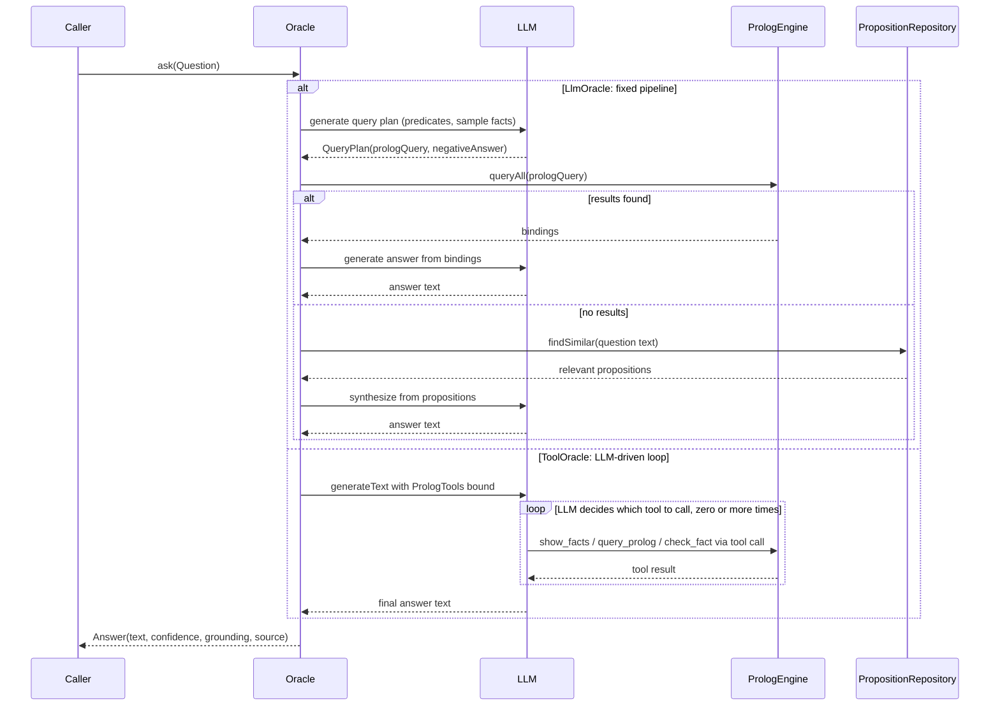
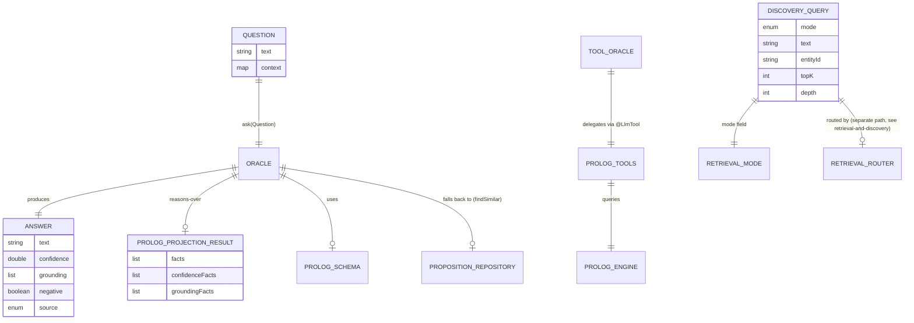

# Oracle and query: answering questions, not just retrieving facts

[retrieval-and-discovery](retrieval-and-discovery.md) covers how DICE finds propositions —
vector search, graph walks, temporal windows, routed through `RetrievalRouter` and `GraphQuery`.
This note covers the layer above that: **answering a natural-language question**. Retrieval gets
you a bag of relevant propositions or graph edges; an `Oracle` turns "who knows Kubernetes?" into
"Alice, based on 2 propositions" — with grounding, confidence, and (where possible) a negative
answer when the knowledge base genuinely has nothing.

The two concerns are deliberately separate types. Retrieval is a search problem: which
propositions match, ranked how. Q&A is a synthesis problem: given some facts, produce a sentence
and say how sure you are. An `Oracle` is free to call into retrieval, Prolog, or both to get its
facts — but its contract is "answer a question," not "find some records."

## The `Oracle` abstraction

```kotlin
interface Oracle {
    fun ask(question: Question): Answer
    fun ask(questionText: String): Answer = ask(Question(questionText))
}
```

`Question` is `text` plus an optional free-form `context` map — nothing DICE-specific, so an
`Oracle` never forces a caller to know about propositions or contexts. `Answer` carries the
synthesized `text`, a `confidence` (0.0–1.0), `grounding` (source proposition IDs — always trace
an answer back to what produced it), a `negative` flag for "no, X isn't true" answers, and an
`AnswerSource` (`PROLOG`, `PROPOSITIONS`, or `NONE`) recording which path produced it.

Grounding and `AnswerSource` exist so a caller can decide how much to trust an answer without
re-deriving it — a UI can show "via reasoning over 3 facts" differently from "no matching facts
found." `Answer.unknown(question)` is the canonical empty answer: confidence 0, negative, source
`NONE`. Prefer it over throwing — asking a question the knowledge base can't answer is a normal
outcome, not an error, matching the "empty over exception" convention already established by
`GraphQuery` and `RetrievalRouter`.

## Two implementations, two strategies

Both oracles work over the same substrate — a `PrologProjectionResult` (facts + grounding,
projected from propositions per [extraction-pipeline](extraction-pipeline.md) and
[architecture](architecture.md#projection)) and a `PrologSchema` (predicate mappings) — but they
differ in *who* controls the reasoning loop.



### `LlmOracle` — fixed plan-then-execute pipeline

`LlmOracle` runs a scripted three-step strategy: ask the LLM once for a Prolog query plan, run it,
and fall back to proposition similarity search if Prolog comes up empty. One extra LLM call
formats the final answer in natural language.

```kotlin
val oracle = LlmOracle(
    ai = ai,
    prologResult = prologProjectionResult,
    prologSchema = PrologSchema.withDefaults(),
    propositionRepository = repository,   // optional: enables the fallback path
    entityNames = entityIdToName,          // optional: humanizes bindings in the answer
)
val answer = oracle.ask("Who is an expert in Kubernetes?")
// answer.source == AnswerSource.PROLOG, grounding == ["prop-1", "prop-2"]
```

Use `LlmOracle` when you want **predictable cost and latency** — at most three LLM calls per
question (query plan, then either a Prolog-answer or a proposition-synthesis call) — and when the
questions are the kind Prolog reasoning answers well: "who is X", "does A know B", "which experts
work at C". The negative path is explicit: if the generated query returns no rows, `Answer` comes
back `negative = true` with `AnswerSource.PROLOG`, not a guess.

### `ToolOracle` — LLM drives its own reasoning loop

`ToolOracle` hands the LLM a small tool belt (`PrologTools`, wrapped via `Tool.fromInstance`) and
lets it decide how many queries to run and in what order — `show_facts` to orient itself, then
zero or more `query_prolog` / `check_fact` / `list_entities` calls, then a final answer.

```kotlin
val oracle = ToolOracle(
    ai = ai,
    prologResult = prologProjectionResult,
    prologSchema = PrologSchema.withDefaults(),
    propositionRepository = repository,
    entityNames = entityIdToName,
)
val answer = oracle.ask("Does Alice know anyone who works at TechCorp besides Bob?")
```

Use `ToolOracle` for **multi-hop or exploratory questions** where the right query isn't obvious
up front and the LLM benefits from seeing intermediate results before deciding the next step.
The tradeoff is variable cost (the LLM can call tools any number of times) and a coarser
`AnswerSource` — it's inferred by scanning the response text for tool-call markers, not tracked
structurally, so treat `ToolOracle`'s `source`/`grounding` as advisory rather than precise.

**Choosing between them:** start with `LlmOracle` — it's cheaper, deterministic in call count, and
gives precise grounding. Reach for `ToolOracle` only when questions genuinely need multiple,
data-dependent lookups that a single generated query plan can't express.

## `PrologTools` — the tool surface both paths sit on

`PrologTools` is the tool surface that makes Prolog queryable by an LLM tool-calling loop. It wraps a
`PrologEngine` (built once via `PrologEngine.fromProjection(result, schema)`) and exposes five
`@LlmTool`-annotated methods: `show_facts`, `list_predicates`, `list_entities`, `query_prolog`,
`check_fact`. `ToolOracle` uses it directly as its tool belt; nothing stops a caller from wiring
`PrologTools` into a different agent or tool-calling context — it depends on nothing from
`ToolOracle` itself.

Two details matter for correctness, both defensive against an LLM's imprecise Prolog:

- **Name ↔ ID translation.** Prolog facts store resolved entity IDs, not human names, but an LLM
  naturally writes queries with names (`works_at('Alice', X)`). `translateNamesToIds` rewrites
  quoted names to IDs before querying; `resolveEntityName` reverses that when formatting results
  back out, with a truncated-UUID prefix match as a last resort (Prolog identifiers get shortened
  in some engines).
- **Query generalization fallback.** If a specific query returns nothing, `makeQueryGeneral`
  retries with quoted literal names replaced by a variable — turning `expert_in('nonexistent',
  X)` into `expert_in(X, Y)` style broadening — before giving up. This is a best-effort recovery
  for an LLM getting an entity name slightly wrong, not a substitute for the name/ID translation
  above.

## Where Prolog facts come from

Both oracles are read-only consumers of `PrologProjectionResult` — they never write Prolog facts
themselves. Facts arrive via `PrologProjector`, one of the projection targets described in
[architecture](architecture.md#projection) and detailed in
[extraction-pipeline](extraction-pipeline.md): propositions remain the system of record, and the
Prolog fact base is a derived, disposable view rebuilt from them. If a projection is stale or
incomplete, re-run the projector — never hand-edit facts to patch an oracle's answer.

## Relationship to retrieval

Both oracles route to `PropositionRepository.findSimilar` for their fallback path — the same
kind of vector search `RetrievalRouter` performs for `RetrievalMode.VECTOR`, but called directly
rather than through the router. This is intentional scope-narrowing: an `Oracle` needs a handful
of relevant propositions to synthesize an answer, not a full paginated, mode-routed discovery
result with `topK`/`depth` clamping. If a future oracle needs graph-neighborhood or temporal
context to answer richer questions, prefer composing with `RetrievalRouter`/`GraphQuery` (passing
a `DiscoveryQuery`) over reimplementing retrieval logic inside the oracle.



## Best practice checklist

- Prefer `LlmOracle` by default; escalate to `ToolOracle` only for exploratory multi-hop questions.
- Always pass `entityNames` when you have them — without it, answers surface raw entity IDs
  instead of human-readable names, and `PrologTools`' name→ID translation has nothing to reverse.
- Pass `propositionRepository` unless you specifically want "Prolog or nothing" behavior — the
  fallback is what keeps an oracle from going straight to `Answer.unknown` on a question the
  Prolog schema doesn't model.
- Treat `Answer.negative == true` as a real, informative result, not a failure to handle — it
  means the knowledge base was queried and came back empty, which is worth showing a user as-is.
- Never bypass `Question`/`Answer` to call `PrologEngine` or `PropositionRepository` directly from
  a caller that wants an answer — that's exactly the synthesis-plus-grounding step the `Oracle`
  contract exists to centralize.
