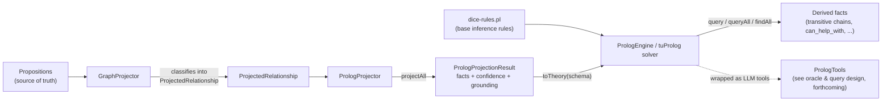

# Prolog projection: logical inference over propositions

DICE projects propositions into a typed graph so they can be queried as entities and
relationships (see [graph-projection](graph-projection.md)). Some questions are awkward to
answer with a graph query but natural to answer with a rule: "who can this person consult,
transitively, through friends of friends or reporting chains?" is a graph traversal you'd have
to hand-write and re-write every time the notion of "can consult" changes. A Horn-clause engine
lets you state that once, as a rule, and get every derived fact for free. That's what the Prolog
projection is for: a second, rule-driven view of the same propositions, optimized for transitive
closure and multi-hop derivation rather than for storage or visualization.

It is not a replacement for the graph projection — it's built on top of it. Classifying a
proposition into a typed relationship (`WORKS_AT`, `EXPERT_IN`, ...) is an LLM-inference step
that the graph projector already does; the Prolog projector reuses that classification rather
than re-deriving it, and adds a layer of *pure logical* inference on top: chains, transitive
closures, and derived predicates that follow deterministically from the classified facts.

## Where it sits



Each box on the left is a concrete type in
`dice/src/main/kotlin/com/embabel/dice/projection/prolog/`:

- **`GraphProjector`** (from `projection.graph`) classifies a `Proposition` into a
  `ProjectedRelationship` — a typed, directed edge (`sourceId`, `targetId`, `type`, confidence,
  grounding). The Prolog projector deliberately does not duplicate this classification; see
  `DefaultPrologProjector.project()` in `PrologProjector.kt`, which delegates straight to a
  configured `GraphProjector` and fails loudly if none is configured.
- **`PrologProjector`** turns a classified relationship into a `PrologFact` — a ground Prolog
  term with no variables (`PrologProjector.kt`, `PrologTypes.kt`).
- **`PrologSchema`** maps relationship types to predicate names (`WORKS_AT` → `works_at`) and
  carries the base rule set loaded from the classpath (`PrologTypes.kt`).
- **`PrologEngine`** wraps a tuProlog `Solver` over the combined theory (rules + facts) and
  exposes `query`, `queryAll`, `queryFirst`, `findAll` (`PrologEngine.kt`).
- **`dice-rules.pl`** (`dice/src/main/resources/prolog/dice-rules.pl`) is the base rule set:
  hand-written Horn clauses that define derived predicates in terms of the projected facts.

## From proposition to fact

A relationship becomes a fact by looking up its predicate name in the schema and quoting its
arguments as Prolog atoms:

```prolog
% ProjectedRelationship(sourceId="alice-1", targetId="acme-corp", type="WORKS_AT", confidence=0.92)
% becomes, via PrologSchema.getPredicate("WORKS_AT") -> "works_at":
works_at('alice_1', 'acme_corp').
confidence(works_at('alice_1', 'acme_corp'), 0.92).
grounded_by(works_at('alice_1', 'acme_corp'), 'prop-4471').
```

`PrologFact.quoteAtom` normalizes IDs into safe Prolog atoms (lowercase, non-alphanumeric
characters collapsed to `_`), which is why entity IDs with dashes show up with underscores in
the theory — `PrologTools` undoes this normalization when it needs to show a human a result (see
below).

The `confidence` and `grounded_by` facts are optional companions (`includeConfidence`,
`includeGrounding` on `DefaultPrologProjector`) — they let a rule or a query filter on how much to
trust a fact, or trace it back to the proposition that produced it, without polluting the base
predicate's arity. This mirrors the same provenance discipline the graph projection uses (see
[graph-projection § Edge lineage](graph-projection.md#edge-lineage)): a Prolog fact is never just
an assertion, it's an assertion plus a way to ask "why do we believe this."

`PrologProjectionResult.toTheory(schema)` assembles the complete theory that gets loaded into the
solver: the base rules from `dice-rules.pl`, then the projected facts, then the confidence facts,
then the grounding facts, each in its own commented section.

## The rule set: derived facts from ground facts

`dice-rules.pl` doesn't project anything by itself — it defines Horn clauses that only ever
succeed if enough ground facts exist to satisfy them. Two patterns recur:

**Transitive closure**, recursion over a direct relationship:

```prolog
% Transitive management: X manages Y directly or indirectly
manages_chain(X, Y) :- manages(X, Y).
manages_chain(X, Y) :- manages(X, Z), manages_chain(Z, Y).
```

**Composite derivation**, combining two predicates into a new one:

```prolog
% Coworkers: people who work at the same company
coworker(X, Y) :- works_at(X, Company), works_at(Y, Company), X \= Y.

% You can consult a coworker who is an expert
can_consult(Person, Expert, Topic) :-
    coworker(Person, Expert),
    expert_in(Expert, Topic).
```

Neither `manages_chain/2` nor `can_consult/3` is ever asserted as a fact — they only exist as
rule heads, and the solver proves them at query time by walking whatever `manages/2`,
`works_at/2`, and `expert_in/2` facts happen to be in the theory. That's the point of using
Prolog here rather than hand-rolling BFS/DFS in Kotlin: the rule is the whole implementation, and
it composes with other rules for free (`can_consult` reuses `coworker`, which reuses `works_at`).

## Adding a rule

To add a new derived relationship:

1. Add a clause to `dice/src/main/resources/prolog/dice-rules.pl`, in the section that matches
   its shape (transitive chain, composite derivation, or a new query family).
2. If it derives from a relationship type the schema doesn't already map, add a
   `PredicateMapping` to `PrologSchema.DEFAULT_MAPPINGS` (or pass `additionalMappings` to
   `PrologSchema.withDefaults()` at the call site) so the graph-classified relationship type
   turns into the predicate name your rule expects.
3. Add a test alongside `PrologEngineTest.kt` / `PrologProjectorTest.kt` that builds a schema with
   `PrologSchema.withRules(...)` (bypassing the classpath resource) and asserts the derived
   predicate holds for a small hand-built theory.

No code change is needed to make a new rule queryable — `PrologEngine` loads the whole
`dice-rules.pl` file as part of the theory, so a new clause is live the next time the schema is
built from `PrologSchema.withDefaults()`.

## Querying derived facts

`PrologEngine` exposes four query shapes, from simplest to richest:

- `query(goal)` — does at least one solution exist? (boolean)
- `queryFirst(goal)` — the first solution's variable bindings, or `QueryResult.FAILURE`
- `queryAll(goal)` — every solution's bindings
- `findAll(goal, "X")` — just the values bound to one variable, across all solutions

```kotlin
val schema = PrologSchema.withDefaults()
val engine = PrologEngine.fromProjection(projectionResult, schema)

// Is there any expert this person can consult on Kubernetes?
engine.query("can_consult('alice_1', X, 'kubernetes')")

// Who, exactly, and through what chain of coworker/friend/colleague?
val experts = engine.findAll("can_consult('alice_1', X, 'kubernetes')", "X")
```

Queries are plain Prolog syntax (no trailing period) — `Struct.parse` turns the string into a
goal, and the solver runs it against the loaded theory. A malformed query or a parse failure
degrades to an empty/failed result rather than throwing, which keeps a bad LLM-generated query
string from taking down a whole tool call.

## Relationship to the graph projection

The two projections are peers over the same source facts, not a pipeline where one replaces the
other:

| | Graph projection | Prolog projection |
|---|---|---|
| Optimized for | entity/relationship storage, visualization, durable lineage | transitive closure, multi-hop derivation, ad hoc logical queries |
| Backend | Neo4j (via `GraphProjector`), durable and reconciled against existing nodes | in-memory tuProlog theory, ephemeral and rebuilt per query session |
| Derived facts | none — a graph edge is exactly what was classified | `dice-rules.pl` rule heads, proved at query time |

Because the Prolog engine is rebuilt from a `PrologProjectionResult` rather than reconciled like
the graph, it has no equivalent to `ProjectionRecord` lineage or stale-cascade — the theory is
disposable and cheap to regenerate whenever the underlying propositions change. If you need
durable, queryable lineage for a derived fact, that's a graph-projection concern
(see [graph-projection § Edge lineage](graph-projection.md#edge-lineage)), not a Prolog one.

## LLM-facing access: PrologTools

An LLM oracle needs to query this knowledge base without knowing Prolog syntax rules by heart or
the internal ID normalization scheme. `PrologTools`
(`dice/src/main/kotlin/com/embabel/dice/query/oracle/PrologTools.kt`) wraps a `PrologEngine` as a
set of `@LlmTool`-annotated methods — `query_prolog`, `list_predicates`, `list_entities`,
`show_facts`, `check_fact` — that an LLM tool-caller can invoke directly. It also undoes the
`quoteAtom` normalization (`alice_1` → `Alice`) when it echoes results back, and translates
human-readable entity names in an incoming query into the underlying IDs before running it. The
full design of the query oracle that composes these tools is covered in a companion design doc,
forthcoming as `oracle-and-query.md` — this doc stops at the boundary of "how facts get from
propositions into a queryable theory."
