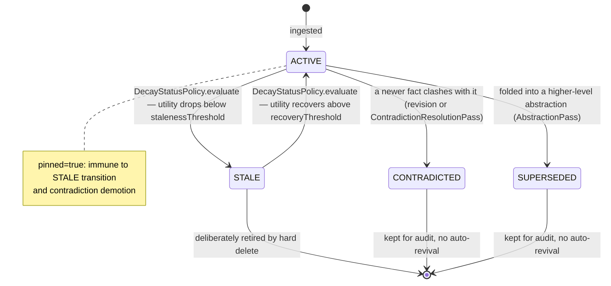
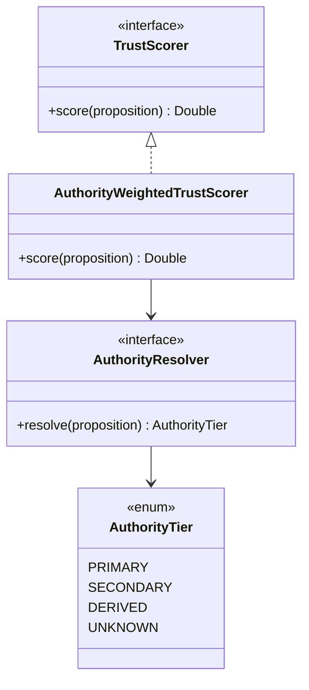
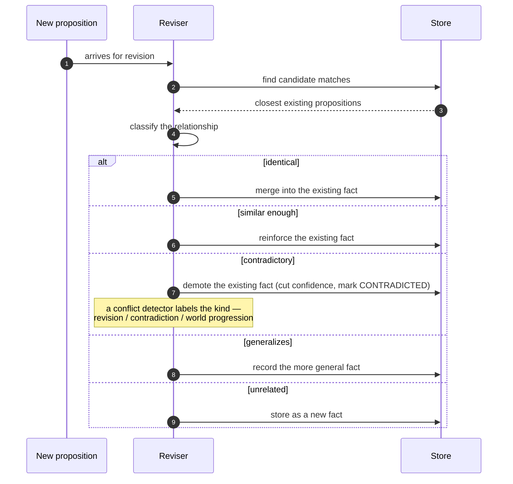
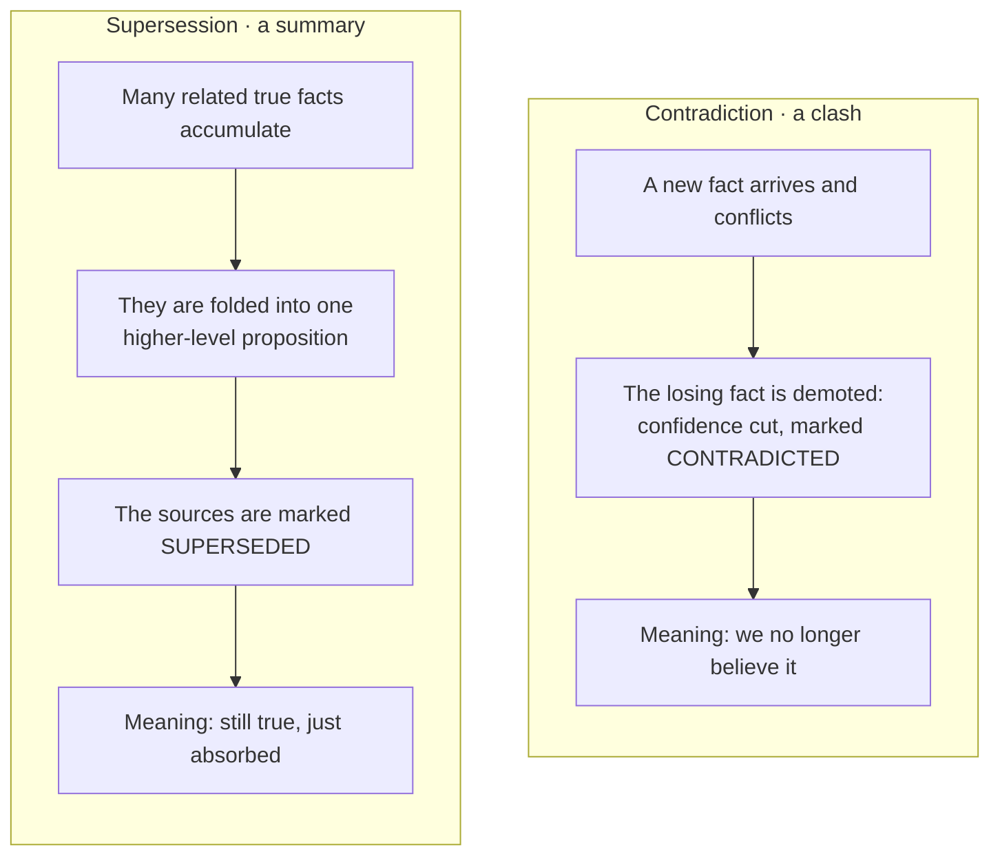
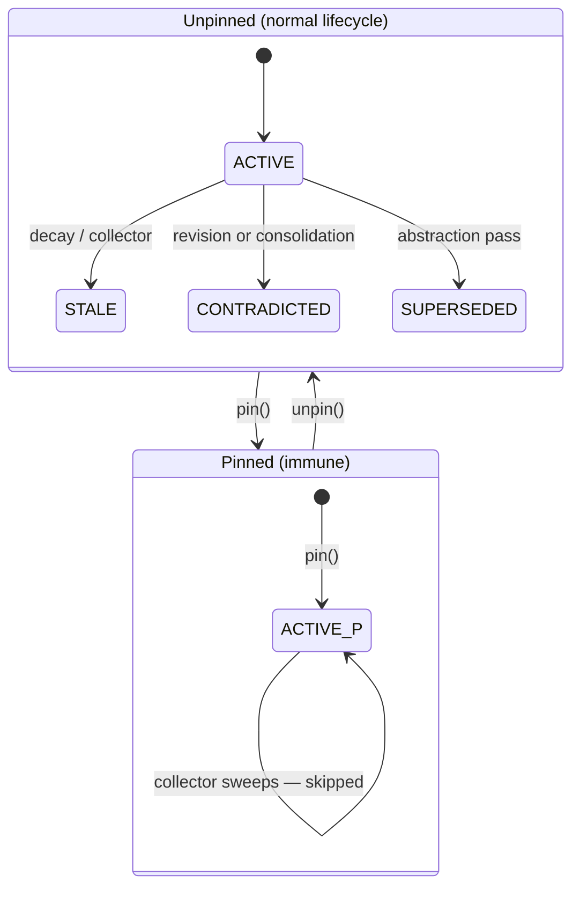

# Proposition lifecycle: trust, conflict, supersession, and decay

DICE keeps what it knows as **propositions** — small natural-language statements grounded in
source material, like "Alice works at Acme." This document isn't about the classes that store
them; you can read those. It's about the decisions behind how a proposition *behaves* over its
life: how it earns or loses trust, what happens when two of them disagree, when one quietly
replaces others, and why knowledge fades rather than being deleted. These are the choices you
can't recover by reading any single type.

## Lifecycle overview

A proposition is born **active** and stays that way for as long as it's believed and current.
From there a handful of things can happen to it, and the shape of those transitions is itself a
design decision — most exits are one-way, and almost none of them actually destroy the record.



What triggers each transition:
- **ACTIVE → CONTRADICTED**: `LlmPropositionReviser` at ingest time, or `ContradictionResolutionPass` during a dream-loop cycle.
- **ACTIVE → SUPERSEDED**: `AbstractionPass` during a dream-loop cycle, when a cluster of facts is folded into a higher-level proposition.
- **ACTIVE → STALE**: `StatusTransitionPolicy.evaluate` (default `DecayStatusPolicy`), run per-proposition by `DecayManager`/`DecaySweeper` (`sweep` / `sweepAll` / `tick`), or by a mark-and-sweep collector run.
- **STALE → ACTIVE**: the same `DecayStatusPolicy.evaluate` call, when a proposition's decayed utility recovers back above `recoveryThreshold`. The reviser itself never flips status — `reinforceProposition` only boosts confidence and resets the decay clock, which is what lets the next sweep's utility calculation cross back over the threshold.
A projected proposition keeps its ACTIVE status so it stays retrievable — projection records the
lineage on the graph side rather than moving the proposition off ACTIVE. `PROMOTED` is a reserved
status in the enum for a projected fact, and the decay sweep and collector already exclude it from
their ACTIVE candidate sets, but the lifecycle does not enter it; projection leaves status alone.

The rest of this document is the reasoning behind those transitions.

## Trust and authority SPIs



## Trust scoring is advisory

Every proposition can be scored for how much its *source* should be believed, but the score is
advisory — it never deletes, rewrites, or hides anything, it just ranks, and the consumer
decides what to do with the ranking. Destructive automation on a knowledge base is hard to undo,
so a confident-sounding extraction from a sketchy source shouldn't silently erase a quieter fact
from a good one; trust should just lose when something has to choose.

The shipped scorer, `NeutralTrustScorer`, is deliberately trivial — it returns `1.0` for every
proposition, so trust scoring is a no-op until a deployment opts in to a real model. `TrustScorer`
is a `fun interface`, so a custom scorer can be a lambda:

```kotlin
// Trust primary sources fully; halve everything else. Ignores conflictType.
val scorer = TrustScorer { proposition, authorityTier, _ ->
    if (authorityTier == AuthorityTier.PRIMARY) 1.0 else 0.5
}
```

## Source authority from provenance

When DICE does reason about trust, the dominant signal is **where a fact came from**, not how
confident the language model sounded. Sources fall into tiers: first-party records outrank named
external sources, which outrank derived or inferred material, which outranks "we don't know."
When a proposition has mixed grounding, the strongest source it can point to wins. This is a
deliberately optimistic default — one primary record among ten weak ones makes the whole proposition
primary — chosen because a single authoritative source genuinely does vouch for the fact; a
deployment that wants the opposite (weakest-link, or a blend) should expect to override the resolver.

Two things drove this. First, provenance is a more honest trust signal than self-reported
confidence — a primary record is trustworthy for reasons that have nothing to do with how a
sentence is phrased. Second, "unknown" has to be a real tier and the fail-safe default, because
plenty of propositions arrive with thin grounding and we'd rather treat those cautiously than
flatter them.

## Conflict classification

DICE separates two things: working out how a new proposition relates to what's already stored, and
naming *what kind* of clash it is when they conflict.

The reviser does the first. When a proposition arrives, it classifies the relationship to the
existing facts and acts on it — merging an identical fact, reinforcing a similar one, demoting the
existing fact when the two contradict (its confidence is cut and its status set to contradicted),
recording a generalization, or storing an unrelated fact as new.



A conflict detector does the second, and only for the contradictory case — it labels *why* the two
clash:

- **Revision** — the new statement is a more accurate version of the same fact (a correction).
- **Contradiction** — the two are mutually exclusive; one of them is wrong.
- **World progression** — both were true at different times; the world moved on (Alice changed
  employers).
- a **custom** kind, for domain-specific clashes the first three don't cover.

The label is recorded on the result for downstream consumers to use; the existing fact is demoted
either way. Capturing the kind matters because treating every disagreement as a flat contradiction
throws away the difference between a correction, a real conflict, and a fact that's simply newer.
The shipped detector is conservative — it labels every clash a contradiction — until a richer one
is wired in.

## Supersession vs. contradiction

These two look similar — both end with an older proposition stepping aside — but they mean
opposite things, and collapsing them would either lose nuance or wrongly discredit good facts.



**Contradiction** says "this is no longer believed" — a new proposition arrives and clashes, so
the loser is demoted on the spot. **Supersession** says "there's now a better way to say all of
this at once" — during background consolidation a cluster of true, low-level facts is folded into
one higher-level proposition, and the originals are marked superseded because they've been
*absorbed*, not disproven. Keeping the two distinct means each transition answers a different
question ("was this wrong?" vs. "is there a better summary now?"), and either way the original
record is kept for audit — we don't pretend we never believed something.

## Decay instead of deletion

A proposition's believability falls off over time, but the clock is anchored to the last time its
**content** changed — not to housekeeping touches like re-scoring trust or flipping a flag.
Re-deriving an old conclusion shouldn't look fresh, and re-scoring a fact shouldn't make it look
stale. So administrative edits leave the decay clock alone.

Decay moves a proposition toward **stale**, not toward the trash. The boundary uses two thresholds
— a fact has to fall well below the line to go stale and climb well above it to come back — so it
doesn't flap back and forth near the edge. And the only thing that genuinely revives a stale fact
is seeing it again (reinforcement), not the passage of time. Hard removal exists, but it's a
separate, deliberate step: the default preference is "cold" over "gone," because a knowledge base
that quietly deletes things is one you stop trusting.

`Proposition.effectiveConfidence()` is what a sweep's utility calculation actually reads — raw
`confidence` never changes on its own, only the decayed view of it does:

```kotlin
// Same proposition, decay applied against "now" vs. against a fixed past instant.
val nowConfidence = proposition.effectiveConfidence()
val lastWeekConfidence = proposition.effectiveConfidenceAt(Instant.now().minus(7, ChronoUnit.DAYS))

// Pinning doesn't change the math above — effectiveConfidence keeps decaying either way.
// What pinning does is stop DecayStatusPolicy from acting on the result:
val pinned = proposition.withPinned(true)
check(DecayStatusPolicy().evaluate(pinned) == null) // sweep-exempt regardless of utility
```

## Pinning: permanent protection from the lifecycle

Some propositions should never be retired by automated maintenance — a baseline identity claim, a
manually curated anchor, a regulatory record. Pinning is how you express that: a pinned
proposition is immune to every automated lifecycle transition.

Concretely, the `pinned` field on `Proposition` is a boolean flag you set via `PropositionStore.pin(id)` and clear via `unpin(id)`. When it is true, three things change:

- The decay collector's default sweep policy (`StatusTransitionSweepPolicy`) skips the proposition unconditionally, regardless of what marks it carries — pinned means exempt from reclamation.
- The contradiction path in `LlmPropositionReviser` does not demote it when a conflicting fact arrives; instead, the new fact is stored alongside and the conflict is left for explicit resolution.
- The dream-loop's contradiction resolution pass (`ContradictionResolutionPass`) inherits the same skip-if-pinned behavior, so background consolidation also respects the pin.

Pinning is an *administrative* operation — it touches only `metadataRevised` and never resets the decay clock (`contentRevised` stays untouched).

```kotlin
val proposition = Proposition(
    contextId = contextId,
    text = "Alice's employee id is E-4471",
    mentions = listOf(subjectMention, objectMention),
    confidence = 0.95,
)

// Pin in place (no store round-trip yet)...
val pinnedLocally = proposition.withPinned(true)

// ...or pin the persisted record by id.
propositionStore.save(proposition)
propositionStore.pin(proposition.id)
```



Use `PropositionQuery.withPinned(true)` to list all pinned propositions in a context
(`PropositionStore.findPinned(contextId)` wraps that). Unpin when you're ready to let the
lifecycle resume.

## Configurable behavior

Trust scoring, authority resolution,
conflict characterization, and the rules for status transitions are all pluggable. The defaults
that ship are intentionally conservative — neutral trust, provenance-based authority,
assume-contradiction, gentle decay — so the safe behaviour is the one you get out of the box, and a
real deployment is expected to swap in the judgment that fits its domain.
