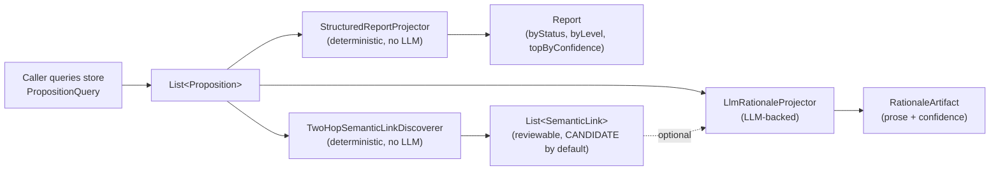
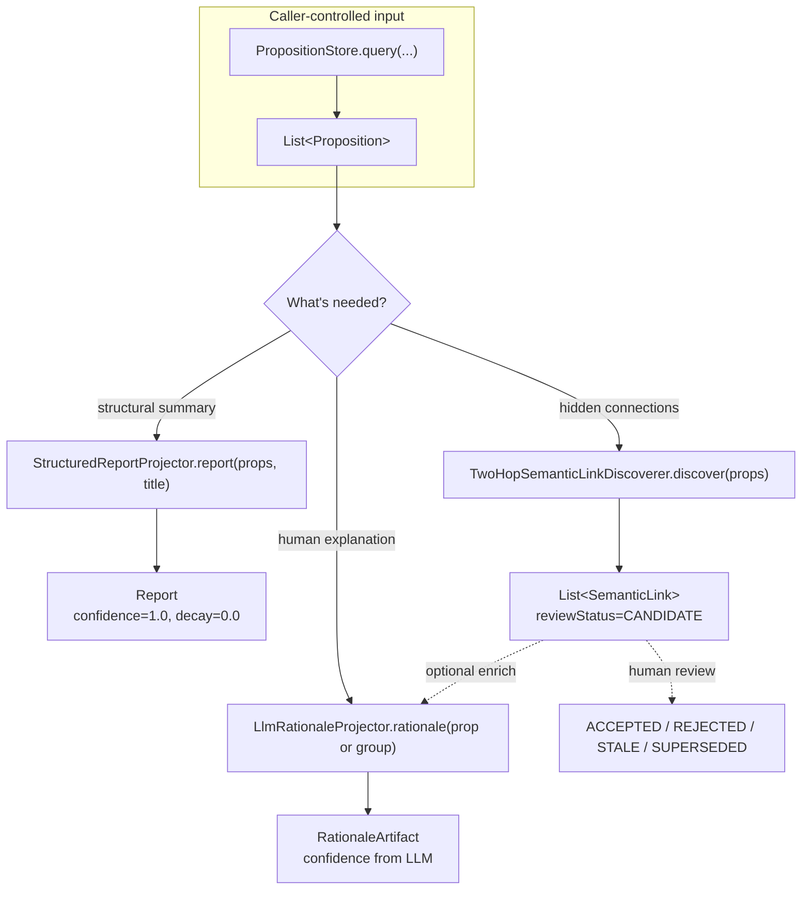

# Report: projecting propositions into human-facing artifacts

`dice-report` turns a set of propositions the caller has already queried into something a person
reads: a structured breakdown, a discovered link between entities that aren't directly connected,
or LLM-generated prose explaining why something is believed. Every projector here is a pure
function over the propositions it's handed — none of them query the store, and none of them
decide *which* propositions to include. That's always the caller's job (typically via
`PropositionQuery` against `PropositionStore` — see [architecture](architecture.md)).



Two of the three projectors are deliberately LLM-free: `StructuredReportProjector` and
`TwoHopSemanticLinkDiscoverer` are pure structural aggregation, so they're deterministic,
reproducible, and safe to run in a demo or a test without mocking a model. `LlmRationaleProjector`
is the one place in this module that calls out to an LLM, and it's opt-in — a report or a set of
discovered links is useful on its own without rationale prose.

## Core types

| Type | Role |
|---|---|
| `ReportProjector` | `report(propositions, title) -> Report`. Single method, deterministic contract. |
| `StructuredReportProjector` | The shipped `ReportProjector`: groups by status and level, takes top-N by effective confidence. |
| `Report` | A `Projection` — groups plus `sourcePropositionIds` tracing back to every input proposition. Has `.summary()` for a plain-text breakdown. |
| `SemanticLinkDiscoverer` | `discover(propositions) -> List<SemanticLink>`. Finds indirect connections between entities. |
| `TwoHopSemanticLinkDiscoverer` | The shipped discoverer: two entities never directly co-mentioned but sharing a common neighbor get linked, with that neighbor as evidence. |
| `SemanticLink` | A reviewable, `Projection`-backed link: endpoints, connecting entities, `LinkKind` (EXPLICIT/INFERRED/AMBIGUOUS), `ReviewStatus` (CANDIDATE → ACCEPTED/REJECTED/STALE/SUPERSEDED), plain evidence `confidence`, optional `rationale`. |
| `RationaleProjector` | `rationale(proposition)` / `rationale(group)` -> `RationaleArtifact`. Interpretive, expected to be LLM-backed. |
| `LlmRationaleProjector` | The shipped `RationaleProjector`, built via `withLlm(options).withAi(ai)`. |
| `RationaleArtifact` | A `Projection`: generated prose, `sourcePropositionIds`, self-reported `confidence`. |

## Projection pipeline



All three outputs implement `Projection`, so every one traces back to the propositions that
produced it via `sourcePropositionIds` — the same grounding discipline used throughout DICE (see
[architecture: store and trust/authority](architecture.md#store-and-trustauthority)).
`Report` and `SemanticLink` fix `confidence=1.0`/`decay=0.0` or plain evidence confidence
respectively — neither carries a surprise or ranking score; that's an explicitly separate,
later concern for `SemanticLink`.

## StructuredReportProjector: grouping and ranking

Given a non-empty list, it groups by `PropositionStatus` and by abstraction `level` (both
preserving encounter order within a group), and separately ranks the *whole* input by effective
confidence descending, ties broken by id, taking the top N (default 5). An empty input short
circuits to `Report.EMPTY` with the title substituted. No LLM, vector store, or graph call is
involved — same input always yields the same report.

## TwoHopSemanticLinkDiscoverer: indirect links only

Only `ACTIVE` propositions participate. It builds direct co-mention edges (canonical
`min <= max` id ordering) and per-entity neighbor sets, then for every entity pair *not* directly
connected, checks whether their neighbor sets intersect. A shared neighbor becomes a connecting
entity on an `INFERRED` link; evidence is the union of the two edges' backing proposition ids.
Multiple intermediaries for the same pair merge into one link (sorted connecting-id list) rather
than emitting duplicates. Path length is fixed at two hops — multi-hop discovery is out of scope
here. Output is sorted by `(sourceEntityId, targetEntityId, connectingEntityIds)` for a stable,
reproducible order.

## LlmRationaleProjector: the one interpretive projector

Turns a proposition or a `PropositionGroup` into prose via a templated LLM call
(`dice/explain_rationale`), returning a self-reported confidence clamped to `[0.0, 1.0]`.

**Security note.** Proposition text is embedded directly in the prompt. Since that text
typically originates from ingested source documents (see [ingestion](ingestion.md)), it must be
treated as untrusted — a crafted document could embed instructions the rationale model might
follow. The template wraps proposition data in a labelled block as a mitigation, not a guarantee;
sanitizing ingested content and not granting rationale output undue authority downstream is the
caller's responsibility.

## Common use case: generating a report

```kotlin
val props = repository.query(PropositionQuery.forContextId(ctxId))

val report = StructuredReportProjector().report(props, "Context Overview")
println(report.summary())

val links = TwoHopSemanticLinkDiscoverer().discover(props)

val rationaleProjector = LlmRationaleProjector.withLlm(llmOptions).withAi(ai)
links.firstOrNull()?.let { link ->
    val group = PropositionGroup(label = "shared context", propositions = props.filter {
        it.id in link.sourcePropositionIds
    })
    val explained = link.withRationale(rationaleProjector.rationale(group).text)
}
```

## Design notes

- **Determinism where it's free, LLM only where it's the point** (see the intro above) — rationale
  generation is kept behind its own interface so a caller can skip it entirely.
- **Query is always upstream.** None of these types touch `PropositionStore` — that keeps report
  projection reusable across whatever query shape a caller needs, and keeps this module testable
  with plain in-memory proposition lists.
- **Review lifecycle lives on the link, not the discoverer.** `SemanticLink.reviewStatus`
  defaults to `CANDIDATE`; `TwoHopSemanticLinkDiscoverer` never mutates it further — moving a
  link to `ACCEPTED`/`REJECTED`/etc. is a downstream human-review concern, not discovery's.
