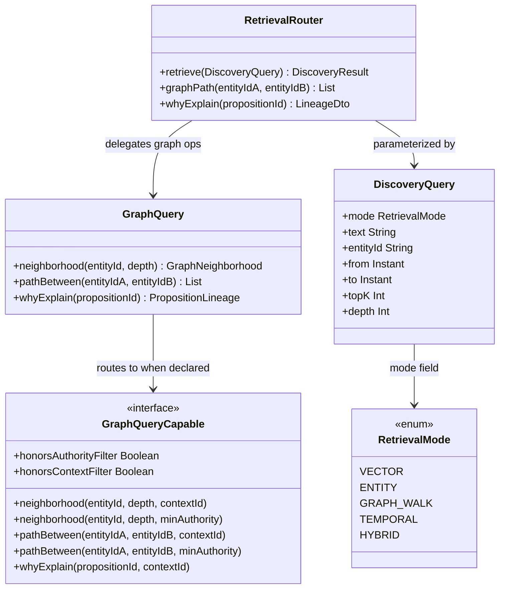
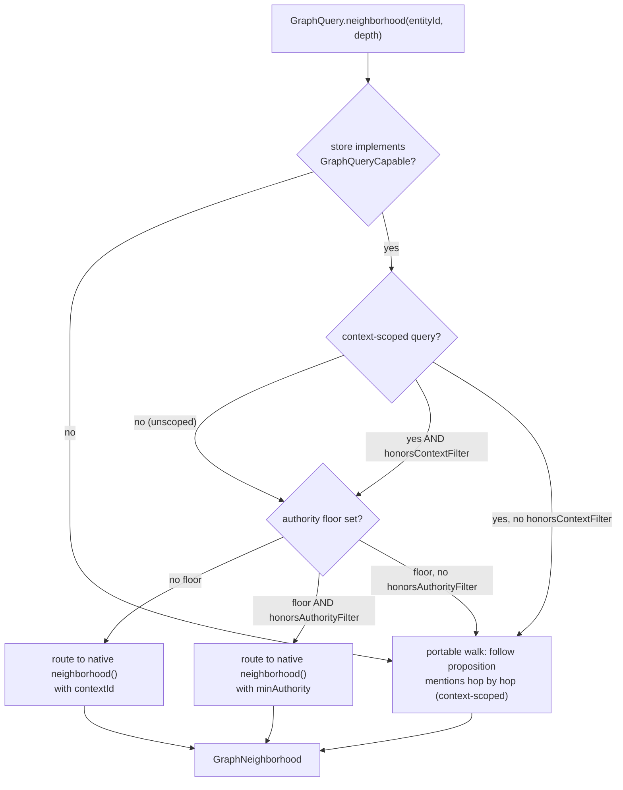
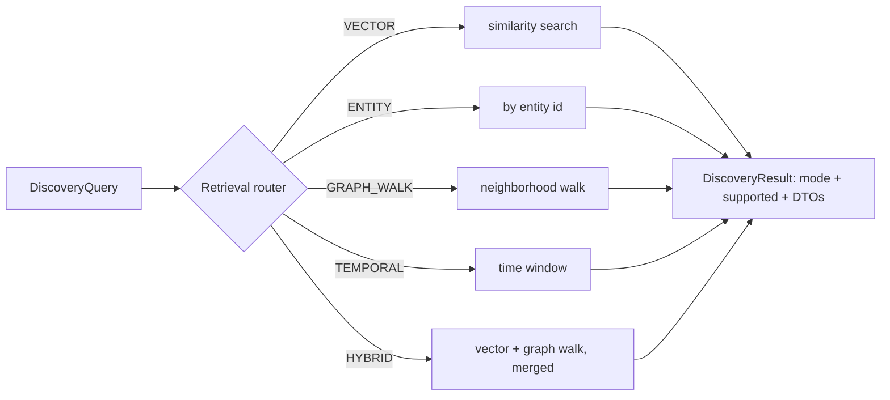
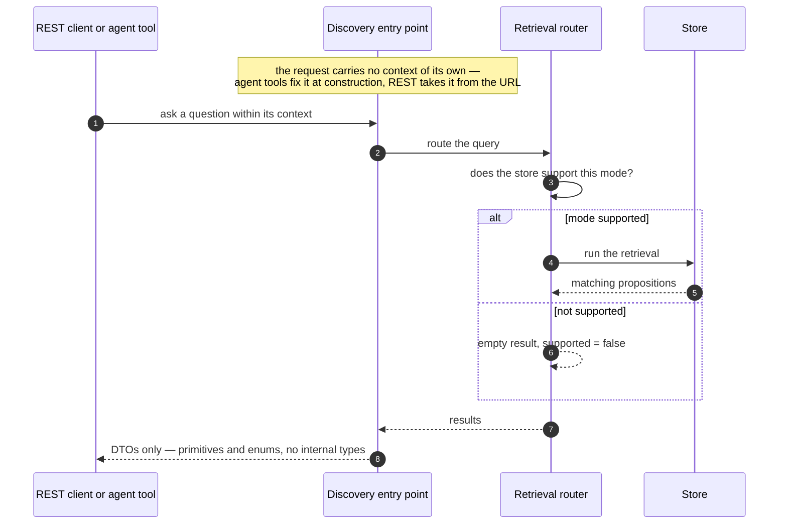
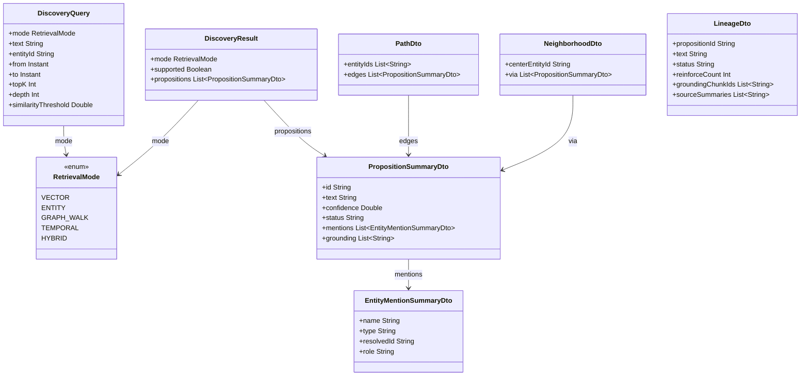
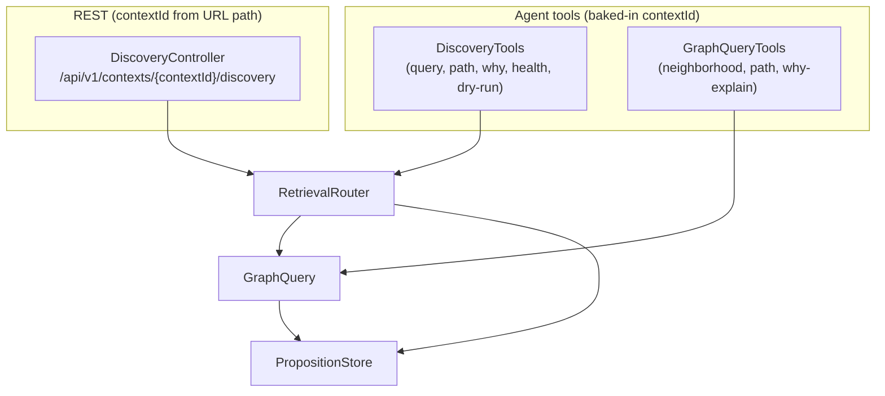
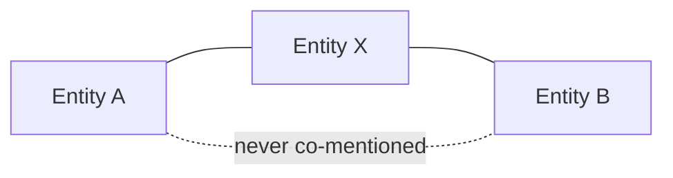

# Retrieval and discovery

Once DICE holds a body of propositions, the interesting question is how you get knowledge back out.
Direct lookup ("what do I know about Alice?") is the easy part. The decisions worth explaining are
the ones around *how* retrieval stays honest across different backends, why trust filtering happens
when you read rather than when you write, how the system surfaces connections nobody queried for,
and why it can explain itself. This note is about those choices.

## The query surface: SPIs and entry points

Three things give callers access to propositions: the `GraphQuery` facade (portable entity-graph
operations), the `RetrievalRouter` (mode-routed multi-modal retrieval), and the agent tools and
REST controller that wrap both.



`RetrievalRouter` is the single entry point for mode-routed queries. `GraphQuery` is the portable
graph facade — it walks propositions hop-by-hop over whatever store is underneath, routing to a
native `GraphQueryCapable` backend when one declares the capability. Agent tools (`DiscoveryTools`,
`GraphQueryTools`) and the REST surface (`DiscoveryController`) wrap these from the outside,
baking in the `contextId` so a caller can't cross context boundaries.

## Store-agnostic graph queries

Neighborhood, path, and lineage queries don't require a graph database. A proposition that mentions
two resolved entities already *is* an edge between them, so the portable query surface answers
graph-shaped questions by walking propositions one hop at a time over whatever store is underneath.
A native graph backend gets routed to first when it can do the traversal faster, but the portable
walk is always there as the floor — graph-shaped *reasoning* shouldn't be chained to graph
*infrastructure*. A lightweight in-memory setup should still answer "how is A connected to B?"
without standing up Neo4j.

The durable Neo4j backend implements `GraphQueryCapable`, so graph queries there run as native
Cypher — for both unscoped and context-scoped queries. The context is pushed straight into the
traversal (a `contextId` predicate on every hop), so the production callers, which are all
context-scoped (`DiscoveryController`, `GraphQueryTools`, and downstream consumers), still get the
native Cypher rather than dropping to the portable walk. A store without the capability, or one that
doesn't confine a walk to a context itself, falls back to the portable walk below.



Graph queries also take an optional authority floor. Edges below it are dropped *during* the
traversal, with authority re-resolved from each proposition's provenance as the walk proceeds —
nothing is filtered out at write time. Trust policy changes more often than data does, and different
callers want different floors over the same facts; baking a trust cutoff into stored edges would
mean re-ingesting everything whenever the policy moved, and would force one global standard on every
consumer. A proposition with no provenance resolves to the weakest tier, so any non-trivial floor
drops it — unknown provenance is treated as low trust, not waved through. And when a capability
genuinely isn't there, these operations return empty or null rather than throwing — asking a
question the backend can't fully answer gives you "nothing found," not an error.

The `GraphQueryCapable.honorsAuthorityFilter` flag is how a native backend opts in to handling the
filtering itself. When it is false (the default), the portable facade applies authority filtering
on its own proposition-walk, so the correct result comes back either way. A backend sets it to true
only after it genuinely honours the `minAuthority` argument in its `neighborhood` and `pathBetween`
overloads — and if it sets the flag without overriding those overloads, the default bodies throw
rather than silently returning unfiltered results.

`GraphQueryCapable.honorsContextFilter` works the same way for context scoping. When it is false (the
default), the facade keeps a context-scoped query on its own proposition-walk, which already confines
the walk to the context — so a backend that ignores context never receives a scoped query and can't
leak another context's edges. A backend sets it to true only once its context-aware `neighborhood`,
`pathBetween`, and `whyExplain` overloads genuinely confine the walk to the supplied `contextId`; the
Neo4j backend does exactly that, adding a `contextId` predicate to every hop. An unscoped query (null
context) behaves identically down either path.

## Single retrieval entry point

There are several ways to find propositions — by vector similarity, by entity, by walking the graph,
by time window, or a hybrid that blends similarity with graph neighborhood. Rather than make callers
know which of these the backing store can do and how to combine them, DICE puts a single router in
front of all of them.



The router checks whether the backing store actually supports a mode and, if not, returns an empty
result that *says so* (`supported = false`) rather than silently falling back to a full scan. It also
clamps result size and traversal depth before doing any work. The reason for one entry point is that
the caller — a REST client, an agent tool, internal code — shouldn't have to reason about the store's
capabilities; that's exactly the knowledge the router is there to hold.

## DTO boundary and context isolation

Everything that crosses out to a caller is a DTO of primitives and enums — never an internal type
like a proposition or a store handle. And the request itself never carries a context of its own: the
agent tools fix the context when they're constructed, the REST layer takes it from the URL path, and
the request body has no context field, so a caller *cannot* ask one context's endpoint for another
context's data. Cross-context reads aren't forbidden by a check; they're structurally impossible, and
an LLM given the agent tools can't wander across context boundaries either.

Two concerns drive this: a stable external contract (internal types can evolve without breaking the
wire, and a leak-check guards against a domain type sneaking into a DTO by accident) and that
structural isolation.



## The discovery DTO shapes

The request/result DTOs (`com.embabel.dice.query.discovery.DiscoveryDtos`, plus `DiscoveryQuery`
and `RetrievalMode` alongside them) are the concrete shapes that make the "DTO boundary" above real.
Every one of them is primitives, `String`, `Instant`, enums, or another DTO in this same file — the
`from()` factory on each one is the only place a domain type (`Proposition`, `GraphPath`,
`GraphNeighborhood`, `PropositionLineage`) is read, and a reflection-based leak-check test
(`DiscoveryDtoLeakTest`) fails the build if a future field reintroduces one.



`DiscoveryQuery` is the one request shape for every mode in `RetrievalMode` — the router reads only
the fields the mode needs (see the retrieval-router flowchart above for which) and clamps
`topK`/`depth`/`similarityThreshold` before doing any work, so a caller can't force an unbounded scan
or traversal. `PropositionSummaryDto` is the leaf every
discovery result bottoms out to — `DiscoveryResult.propositions`, `PathDto.edges`, and
`NeighborhoodDto.via` are all lists of it, each entry carrying its own leak-free
`EntityMentionSummaryDto` mentions. `LineageDto` is the odd one out: it flattens a
`PropositionLineage` (proposition + status + reinforcement count + grounding + abstraction sources)
into one record rather than nesting further DTOs, because "why is this held" is meant to read as a
flat explanation, not a graph to walk.

A minimal discovery query, issued through `RetrievalRouter` directly (the same call an agent tool or
the REST controller makes underneath):

```kotlin
val router = RetrievalRouter(store, graphQuery, contextId)

val result = router.retrieve(
    DiscoveryQuery(
        mode = RetrievalMode.HYBRID,
        text = "who reviewed the Q3 budget",
        entityId = "entity:alice",
        depth = 2,
        topK = 5,
    ),
)

if (!result.supported) {
    // store has no VectorSearchCapable fragment — HYBRID degraded to the graph-only arm
}
result.propositions.forEach { println("${it.text} (confidence=${it.confidence})") }
```

## Agent tools and REST surface

Both the agent tools and the REST controller wrap exactly the same router and record stores,
so behavior is identical whether the caller is an LLM agent or a REST client.



`DiscoveryTools` and `GraphQueryTools` are registered as `List<Tool>` via their `asTools()` factory
and added to an agent's tool set alongside `Memory`. `DiscoveryController` activates only when beans
for `PropositionStore`, `ProjectionRecordStore`, and `CollectorRunner` are all present
(`@ConditionalOnBean(value = [...])`); it is not component-scanned and must be imported via
`DiceRestConfiguration`.

## Serendipitous link discovery

A direct query needs an anchor — you have to name the thing you're curious about. But some of the most
valuable knowledge is the connection you didn't know to look for. DICE surfaces these: it scans a set
of propositions, builds the co-mention graph, and reports pairs of entities that are never mentioned
together yet are both linked to a shared third entity.



The design decision is that this is *proactive* rather than reactive — anchorless discovery instead of
anchored lookup. It's kept purely structural and deterministic (two hops over co-mention edges, over
active propositions only), which makes it cheap and reproducible. And it deliberately doesn't try to
rank links by "surprise" — that judgement is left to the consumer. `TwoHopSemanticLinkDiscoverer`
gives every discovered link a neutral `confidence = 0.5`: a starting point for review, not an
evidence-strength score. Each link starts as a candidate and carries a review state, because
suggesting a connection and accepting it as known are different acts.

## Explainability: rationale and reports

DICE can produce a rationale for a proposition — an explanation of *why* it's held, citing the
evidence behind it — and a structured report that aggregates a set of propositions by status, level,
and confidence. The rationale is interpretive, so it's generated by a language model behind an
interface that isolates that dependency (and treats the proposition text it embeds as untrusted
input, since it originally came from ingested documents). The structured report is the opposite: pure,
deterministic aggregation with no model in the loop, so it's reproducible and safe to build on.

The reason both exist is that a knowledge system you can interrogate is one you can trust. "Why do you
believe this?" should have an answer that points at evidence, and "summarize what you know here"
should give the same result every time.

## Configurable behavior

The store capabilities behind the retrieval modes, the authority resolver behind query-time
filtering, the link discoverer, and the rationale generator are all pluggable. The defaults are
conservative and honest — degrade rather than guess, treat unknown provenance as low trust, report
evidence rather than a ranking — and a deployment swaps in sharper judgment where it needs it.

## The embedding model is a latency decision, not just a quality one

Every vector retrieval embeds the query text before it can search. When the query is a user's
message and the answer is needed to build a prompt, that embedding call sits directly on the
critical path: nothing can be sent to the model until the retrieval returns.

With a hosted embedding model, that is a network round trip per retrieval. Measured in a
deployment using `text-embedding-3-small` against a store of ~3000 propositions:

| | |
|---|---|
| embed + vector search | **300–355ms** (occasional ~1.3s outlier) |
| propositions returned for a greeting | **0** |
| projection + provenance | ~0ms |

Two things are worth reading carefully there. The cost is almost entirely the embedding round
trip, not the vector search — the graph side is fast, and with no hits there is nothing to
project. And the retrieval was *correct*: a greeting genuinely matches no propositions. The
expense is not in retrieving; it is in **finding out that there is nothing to retrieve**, which is
a cost paid on every turn regardless of whether the query has any use for memory.

This is a bad trade in an interactive loop. A third of a second is the difference between a reply
that starts arriving conversationally and one that reads as broken — sharply so for voice, where a
pause has none of the "it's thinking" affordance that a typing indicator gives.

### A local embedding model is usually the right answer here

For retrieval-side embedding, a local model (ONNX, via `embabel-agent-onnx` or equivalent) turns
that 300ms round trip into single-digit milliseconds, with no change to the retrieval semantics
and no quality tradeoff worth the latency it buys back. The asymmetry is what makes this easy:

- **Ingestion-side embedding is throughput-bound and off the critical path.** It happens in
  batches, in the background, and nobody is waiting. A hosted model's quality is worth having.
- **Retrieval-side embedding is latency-bound and on the critical path.** One short string, needed
  now, blocking a user. This is where local wins.

Nothing in the retrieval design assumes the two use the same model — the embedding service is
injected. But note the constraint from [durable storage](durable-storage.md): query and stored
vectors must come from the same model and dimension, so "local for retrieval, hosted for
ingestion" only works if it is the *same* model served locally, not a different one.

### What does not fix it

Worth recording, because both are the intuitive first answers and neither survives measurement:

- **Making retrieval async or parallel.** The result is required to build the prompt, so it is on
  the critical path by construction. Parallelising helps only if there is other work of similar
  duration to overlap with, and in the measured case there was ~80ms of it against a 330ms
  retrieval.
- **Bounding it with a deadline.** It caps the worst case, but makes prompt content depend on
  timing — the same question can retrieve memory or not depending on network jitter. That trades
  determinism, and any eval suite covering memory-dependent behaviour, for latency.

The honest options are to make the hop cheap or not take it: a local model, or not retrieving
eagerly at all and letting the caller retrieve on demand when the question warrants it.
