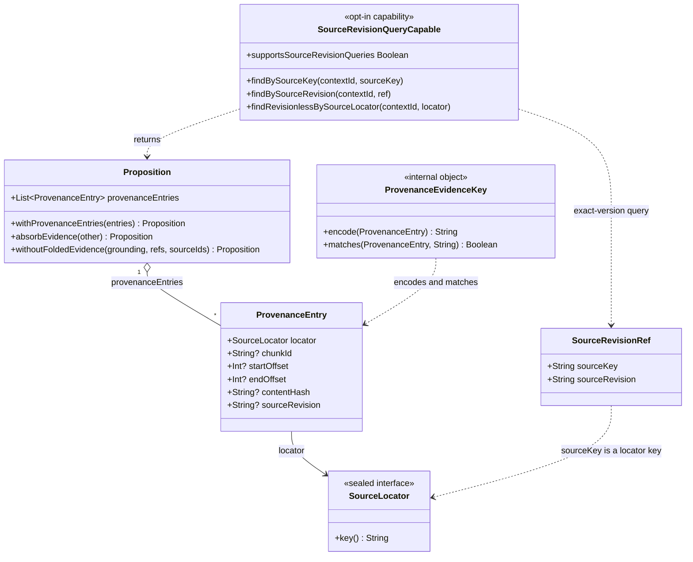
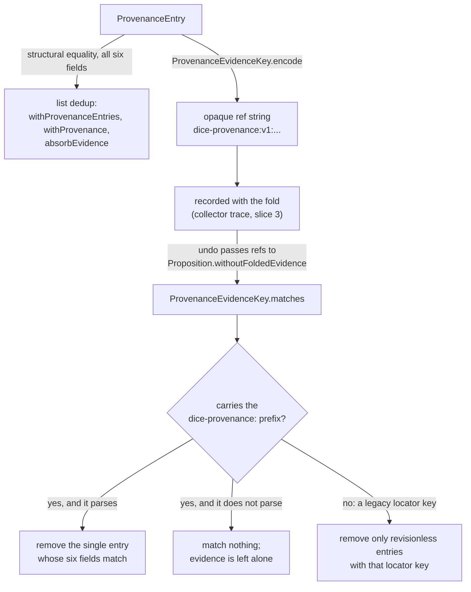

# Source revisions: an opaque version beside a stable locator

A source revision is an opaque, provider-defined string carried on each piece of evidence, beside
the locator that identifies the source. It records which version of a source a claim was read
from — the note edited between Monday and Friday, the Notion page with a new `last_edited_time`,
the S3 object with a new version id. DICE already records *where* a claim came from, a
`SourceLocator` and the span within it; the revision says *when in that source's life*.

The locator keeps its current identity. `SourceLocator.key()` is unchanged, so a document read at
`r1` and the same document read at `r7` are still one source, cited by one graph node, reachable by
one query.

This note covers the whole of Wave A at overview level and the core contract — the types in the
`dice` module — in depth. The storage mapping, collector hardening, and entry-point carriage each
have their own slice; see [Wave A map](#wave-a-map) at the end.

## What the model could not say

`ProvenanceEntry` on `main` is five fields:

```kotlin
data class ProvenanceEntry @JvmOverloads constructor(
    val locator: SourceLocator,
    val chunkId: String? = null,
    val startOffset: Int? = null,
    val endOffset: Int? = null,
    val contentHash: String? = null,
)
```

`contentHash` gets close. If you hash the source content and store it, a later mismatch tells you
the source changed. What it cannot tell you is *which* version you read, in the vocabulary the
source system itself uses. A hash is DICE's own summary of the bytes; a revision is the provider's
identifier, the one you can hand back to that provider to fetch exactly what was extracted. Two
extractions of one document at two revisions were, before this change, indistinguishable evidence
pointing at the same locator.

## Stable key, opaque version

S3 and W3C PROV both split identity this way. S3 names an object by bucket and key; enabling
versioning leaves the key alone and adds a version id per PUT, and a GET without one resolves to
the current version. W3C PROV keeps a general entity referable while a specialization of it — the
entity as it stood at some point — is a distinct thing linked back by `prov:specializationOf`, so a statement
about the general entity survives the arrival of new specializations. Both keep the *name* of the
thing stable and put the version somewhere the name does not reach.

DICE follows that split with a scalar rather than a second entity, because DICE's evidence already
lives on a relationship: a proposition cites a source through a `ProvenanceEntry`, and the entry is
the natural place for a per-citation qualifier. Adding a revision-bearing `SourceLocator` subtype
would have forked source identity, so `uri:https://example.com/doc` at `r1` and at `r7` would
MERGE as two `:Source` nodes, "all propositions from this document" would need a prefix scan, and
every consumer that persisted a locator key would see its keys change meaning. Two constraints
follow from that, and both are load-bearing:

- **`SourceLocator.key()` never contains the revision.** `UriLocator.key()` stays `"uri:$uri"`,
  `FileLocator.key()` stays `"file:$path"`, `ContentAddressedLocator.key()` stays
  `"content:$contentHash"`, `ConnectorRef.key()` stays `"connector:$connectorId:$externalId"`.
  Nothing in this train touches those.
- **The revision is opaque to DICE.** It is a non-blank string that DICE stores, compares for exact
  equality, and hands back. No ordering, no parsing, no "latest" inference. `"r1"` and `"r10"` have
  no relationship DICE knows about, and the literal string `"null"` is a perfectly good revision
  value — the tests pin that, because a codec that confused it with absence would be a silent
  evidence-deletion bug.

`SourceRevisionRef` pairs the two halves for callers who need to name one version of one source:

```kotlin
data class SourceRevisionRef(
    val sourceKey: String,
    val sourceRevision: String,
)
```

Both components are required and non-blank. It is the query and carriage value; stored evidence
keeps only the scalar beside its existing locator, so nothing on the write path has to keep a
denormalized copy of the key in step.

## The types



`sourceRevision` is the sixth field of `ProvenanceEntry`, defaulted to null and validated non-blank
when present. `@JvmOverloads` already sat on the constructor, so every concrete Java constructor
descriptor a caller could have compiled against survives and the revision arrives as one more
descriptor on the end.

## Two identities: equality and dedup

The change touches identity in two places, and they answer different questions.

**Data-class equality** answers "are these the same piece of evidence?" `ProvenanceEntry` is a
Kotlin `data class` with no custom `equals`, so adding `sourceRevision` puts it into structural
equality with the other five fields. That is the whole mechanism behind in-memory dedup:
`withProvenanceEntries` and `withProvenance` both end in `.distinct()`, and `absorbEvidence` folds
a collapsed proposition's evidence the same way. So evidence at `r1` and evidence at `r2` over the
same span of the same document are two entries, and both survive a fold. Before this change they
collapsed into one and the second revision's reading was lost.

**The evidence-key codec** answers "which stored entry does this recorded reference name?" A
collapse writes down what it folded so an undo can subtract exactly that contribution later. On
`main` those references were locator keys, which stopped being precise the moment one locator could
appear on several entries at different revisions. `ProvenanceEvidenceKey` owns the replacement:

```kotlin
internal object ProvenanceEvidenceKey {
    fun encode(entry: ProvenanceEntry): String
    fun matches(entry: ProvenanceEntry, encoded: String): Boolean
}
```

The encoding is length-framed — each field is written as `<length>:<value>`, in the fixed order
locator key, revision, chunk id, start offset, end offset, content hash, behind a
`dice-provenance:v1:` prefix. Framing by length means no value needs escaping however many colons
it contains, and a length of `-1` stands for null, so absence stays distinct from every string
value including `"null"`. An entry over `https://a` at revision `r1`, chunk `c`, offsets 1–2, hash
`h` encodes as:

```
dice-provenance:v1:13:uri:https://a2:r11:c1:11:21:h
```

`matches` runs one way only: it walks the candidate entry's fields against the string and compares
regions in place, so there is no decode step that could produce a half-trusted entry. A reference
that is truncated, has a bad length, carries a non-ASCII digit, or has trailing bytes matches
nothing at all, so an undo driven by a corrupt reference removes no evidence.



### The interim gap, until the collector slice lands

`encode` has no production caller yet. Until slice 3 rewires `MultiSignalCollectorStrategy`, a
collapse still records fold refs as plain locator keys, so undoing a collapse that folded revisioned
evidence takes the legacy path and leaves those entries on the survivor. The direction of the gap is
safe — evidence is retained, never wrongly deleted — and it closes when slice 3 starts recording
encoded refs.

### Legacy evidence is unchanged, by construction

A revisionless entry is one whose `sourceRevision` is null, which is every entry written before
this change and every entry written after it by a caller that supplies no revision. Three
properties hold for those, and slice 1's tests pin each one:

- **Equality is unchanged.** Two revisionless entries over the same locator and span are equal, and
  a list of them dedups to the same result as before. `SourceRevisionContractTest` asserts the
  equality and `.distinct()` behaviour side by side with the revisioned case.
- **Stored JSON still loads.** Old JSON with no `sourceRevision` key deserializes to a null
  revision and compares equal to a freshly built revisionless entry. New writes carry
  `"sourceRevision": null` for those entries, which reads back to the same value.
  `ProvenanceJsonCompatibilityTest` reads a checked-in revisionless fixture and a revisioned one
  and asserts a full round trip through both; `JsonFilePropositionRepositoryTest` strips the field
  back out of a written store file, reloads it, and reruns the source queries against the result.
- **Legacy refs still work, conservatively.** A reference with no `dice-provenance:` prefix is read
  as a plain locator key and matches revisionless evidence only. So an undo recorded before
  revisions existed removes exactly what it used to remove, and can never reach evidence from a
  revision it never saw. `PropositionFoldEvidenceTest` and `ProvenanceEvidenceKeyTest` both pin
  this. A locator key cannot be mistaken for a codec ref in either direction: the sealed hierarchy
  makes every key kind-prefixed (`uri:`, `file:`, `content:`, `connector:`), so none can begin with
  `dice-provenance:`, and a ref that does carry the prefix but names an unknown version — the
  `dice-provenance:v2:` case in `ProvenanceEvidenceKeyTest` — fails closed and matches nothing.

## Querying by source

Three finders land on `SourceRevisionQueryCapable`, all context-scoped:

| Method | Matches |
| --- | --- |
| `findBySourceKey(contextId, sourceKey)` | any revision of that source, including revisionless |
| `findBySourceRevision(contextId, ref)` | exactly that source key and that revision |
| `findRevisionlessBySourceLocator(contextId, locator)` | that source key with no revision |

### Why this is a capability the base repository leaves out

An earlier draft put these three finders on `PropositionRepository` with default bodies that read
the context and filtered loaded provenance in memory. That is safe only for a backend whose context
read carries provenance. On a backend that stores evidence and never projects it through an ordinary
read — which describes the graph store — the default returns an empty list, and an empty list here
already means something: nothing in this context cites that source. An unsupported operation would
have been indistinguishable from a genuine negative answer, which is the worst shape a query contract
can take.

So the surface lives on its own opt-in interface, following the house pattern of `GraphQueryCapable`
and `VectorSearchCapable`. The three plain-String finders are **abstract**: implementing
`SourceRevisionQueryCapable` is a promise to answer correctly for your own storage, and there is no
body to inherit that could quietly answer wrongly. A backend that cannot answer does not implement
it, and is therefore absent from the type. A caller asks for the capability and treats its absence as
its own case:

```kotlin
val revisionQueries = repository as? SourceRevisionQueryCapable
    ?: error("this backend cannot answer source-revision queries")
```

`supportsSourceRevisionQueries` is the runtime half of the same signal, mirroring
`VectorSearchCapable.supportsVector`. A type can promise what a particular instance cannot deliver:
`EventEmittingPropositionRepository` decorates a plain `PropositionRepository`, so whether it can
answer depends on the delegate it was handed. It carries the capability type, reports `false` from
the flag when its delegate lacks the capability, and throws an `UnsupportedOperationException` naming
that delegate if a call gets through anyway. Two ways to find out, no empty list.

`ProvenanceScanningSourceRevisionQueries` carries the in-memory scan as default bodies, for the
stores whose reads genuinely do hold every entry — `InMemoryPropositionRepository` and
`JsonFilePropositionRepository` implement that, and get all three for free. Naming the condition
keeps it visible: a store may only mix that in when its context read carries provenance.

### The typed and String forms

Each finder exists twice: the `ContextId`-typed form above, and a plain-String form that carries the
work. The typed one forwards to the String one, following `findByContextId` →
`findByContextIdValue` in `PropositionStore`. The direction is load-bearing. `ContextId` is a Kotlin
value class, so the typed method's JVM name is mangled and a Java class cannot implement it; an
implementation placed there would be unreachable from Java, and if the delegation ran the other way a
Java backend's implementation would be unreachable from Kotlin. With the String form as the single
implementation point, every call from either language passes through it.
`PropositionRepositoryDelegationTest` calls the typed entry points against a backend that implemented
only the String forms and counts the dispatches, so the test fails if a typed call ever skips them.
The same test pins the split itself: a store implementing only `PropositionRepository` yields null
from the `as?` probe, while a capability-declaring store does not.

`DrivinePropositionRepository` implements `SourceRevisionQueryCapable` directly, because its context
read loads a view with no provenance at all. Each finder pushes its predicate into Cypher, scoping to
the tenant first and then testing for a matching `DERIVED_FROM` edge, with the revision compared as
an edge property (`IS NULL` for the revisionless query).
`DrivinePropositionStoreIntegrationTest` runs all three against a real Neo4j through both the typed
and the String entry points.

Inside the `dice` module a shared fixture, `PortableSourceQueryFixture` with
`assertPortableSourceQueries`, states what the three finders mean once; the in-memory and JSON-file
repository tests both run it, so "all versions", "exact version", and "revisionless only" cannot
drift apart between the two portable backends — including across a write, reload, and re-query cycle
on the JSON one.

### Why the graph write had to change too

Making the finders correct on Neo4j forced two changes to how evidence is stored, because both
defects lose a revision before any query runs.

**One proposition, two revisions of one source.** Relationship-fragment mapping identifies a
`DERIVED_FROM` edge by its endpoints, so a proposition citing one source at `r1` and `r2` stored a
single row and the second revision vanished. Every edge now carries `entryKey`, a length-framed
encoding of the whole evidence tuple, and writes `MERGE` on it, so parallel revisions are separate
rows that stay idempotent under replay. Edges written before `entryKey` existed have none; an exactly
matching revisionless entry adopts one on first touch, and revisioned evidence never adopts a legacy
edge, because nothing records which revision that edge was read from.

The collapse is a write-side fact, and only that. Reverting the write path to relationship-fragment
mapping drops the stored edge count from two to one; the same test passed with reads still going
through the object view, so the read side was never shown to lose parallel edges. Provenance is read
as raw Cypher rows anyway, so that every provenance read — `findById`, `provenanceOf`,
`query(withProvenance = true)`, `findAll(withProvenance = true)`, and the three finders — goes
through one path with one set of guarantees.

**A second revision of an already-extracted fact.** Exact-text dedup answers a save with the
existing proposition when the text matches. It used to return that proposition and drop the incoming
evidence, so re-extracting one sentence from a newer revision of its source left the new revision
unqueryable. Both dedup paths — the in-process one and the cross-instance uniqueness-race recovery —
now union incoming evidence into the winner. An exact replay finds nothing novel and stays a no-op,
issuing no write statements at all.

Two details make that union safe. **Structural source identity is validated before the no-op check,
not after.** A locator's equality is its key, and `ConnectorRef` builds its key by joining on colons,
so `("a:b", "c")` and `("a", "b:c")` produce one key and their entries compare equal. An entry can
therefore look like one the winner already holds while naming a different connector. Validating
first — with a read, so the replay stays write-free — rejects that instead of filing the evidence
under the wrong source. **Recovery from a uniqueness race runs in its own transaction.** A losing
writer learns it lost by having the database reject its insert, which leaves that transaction dead;
any union attempted inside it cannot commit. When the repository owns the transaction it starts a
fresh one for the recovery. When a caller owns it, the violation propagates untouched and recovery
is the caller's to retry, because opening a nested transaction to force a write out would break the
atomicity the caller asked for.

Both are pinned by integration tests that were confirmed to fail against the previous write path:
the parallel-revision one saw one edge where it needed two, and the dedup one saw an empty result
for the second revision.

`PropositionStore` also grows the provenance-management operations — `provenanceOf`,
`addProvenance`, `setProvenance`, `clearProvenance` — which previously sat only on the richer
`PropositionRepository`. They move down so evidence-sensitive callers such as collector undo can
depend on the capability directly, without probing for a repository type at runtime.
`PropositionRepository` keeps its declarations as overrides that delegate to the store defaults, so
existing implementors see no behaviour change.

### A shared `:Source` node needs an unshared label

`:Source` is deliberately global: one locator key is one node, whichever context cites it. That is
what makes "everything from this document" a single graph question. Presentation was following the
same rule by accident. `display` was refreshed on every write, so a second context citing the same
document repainted the label the first context reads — one tenant's wording leaking into everybody
else's UI, with no way to tell where it came from.

Identity and presentation now part company. The key stays global, and `display` becomes write-once:
it is set in the `ON CREATE SET` block alongside the identity fields and left alone thereafter. Each
writer's own evidence still lands on its own `DERIVED_FROM` edge, so nothing about what a context can
see or query changes. `display` has never participated in `SourceLocator.key()`, so identity is
untouched either way. `DrivinePropositionStoreIntegrationTest` writes the same locator from two
contexts with different labels and asserts the first label survives while both writers' evidence
arrives; reverting the write-once change turns it red.

### Bounding what comes in from outside

Two strings reaching this model come from outside DICE and end up inside stored identity: the
canonical source key, and the provider-defined revision. Both get hashed into an evidence key and
written to indexed graph properties, so an unbounded value inflates every index entry mentioning it
and can trip a graph store's own ceiling deep inside a write, where it surfaces as an opaque database
error.

`SourceIdentityBounds` states the two limits as public constants — `MAX_SOURCE_KEY_LENGTH` at 2048
and `MAX_SOURCE_REVISION_LENGTH` at 1024 — and both are enforced while the value object is being
built, in `ProvenanceEntry`'s and `SourceRevisionRef`'s `init` blocks. That placement is the point:
construction happens before anything is hashed and before any store call, so an over-long value is
refused with an `IllegalArgumentException` naming the limit it broke while the store is still
untouched. `SourceIdentityBoundsTest` pins all of it — a value exactly at each limit is accepted, a
value one character over is refused, the message names the limit, and a counting store records zero
interactions across the rejected write.

The numbers are generous by design. 2048 is the practical ceiling browsers and proxies settled on for
a URL, which is the longest thing a locator wraps. 1024 is the longest real revision token we know
of, an S3 object version id; a git SHA is 40 or 64 characters, an HTTP ETag a few dozen, a Slack or
Notion timestamp about 20. Nothing a real connector emits comes near either limit; they exist to stop
a runaway or hostile value.

## Compatibility boundary

Stated with the same scope on every Wave A slice:

- **Source compatibility: claimed.** Existing Kotlin and Java call sites compile unchanged.
- **JSON compatibility: claimed.** Stored propositions written before this change load, and
  round-trip, with a null revision.
- **Java constructor-descriptor compatibility: claimed.** `@JvmOverloads` preserves every concrete
  `ProvenanceEntry` constructor descriptor; the revision adds one.
- **Full Kotlin synthetic constructor and `copy` ABI: not claimed.** Adding a field to a data class
  changes the synthetic `$default` constructor and the `copy`/`componentN` descriptors. Kotlin code
  compiled against the previous jar and run against this one without recompiling can fail to link.
  `SourceRevisionCompatibilityTest` asserts the old descriptors are gone, so the boundary is
  pinned by a test.

## Wave A map

Four slices, each green on its own, together equal to the reviewed
`feat/source-revision-provenance` branch:

1. **Source revision contract** (this note's subject) — the `dice` core model: `SourceRevisionRef`,
   `ProvenanceEvidenceKey`, `ProvenanceEntry.sourceRevision`, the `Proposition`,
   `PropositionStore`, and `PropositionRepository` additions, their unit tests, and the JSON
   fixtures. It reaches into `dice-storage` for everything the three finders need to be correct on
   the default production backend: the revision and `entryKey` on the `DERIVED_FROM` edge, the
   raw-Cypher write and read paths that keep parallel revisions apart, evidence union on both dedup
   paths, and the three Cypher push-down overrides with integration tests.
2. **Storage** — what remains on the `dice-storage` proposition side: the query-plan assertions that
   couple each statement to the plan Neo4j actually runs, the DERIVED_FROM edge-count proofs for
   repeated and concurrent writes of one revision, and the connector-collision and legacy-adoption
   cases around `:Source` identity.
3. **Collector hardening** — the trace and undo half: `CollectorSignals` carrying evidence keys,
   undo routed through the store SPI, `DrivineCollectorTraceStore`, and
   `MultiSignalCollectorStrategy`.
4. **Entry points** — `IncrementalPropositionExtraction`, pipeline wiring, the REST surface, and
   the executed binary-compatibility fixture. The async `SourceAnalysisRequestEvent` path carries a
   revision the same way `rememberText` does, since both build `SourceAnalysisContext` through
   `buildContext`.

Two things stay out of this train. Bundle round-trips for source revision depend on external issue
#46, so DICE issue #64 stays open after Wave A lands and its follow-up is separate work. Extraction
run lineage — which *execution* produced a claim — is a different axis, delivered by Waves B and C;
`SourceRevisionRef` names one version of one source and never identifies a run.
