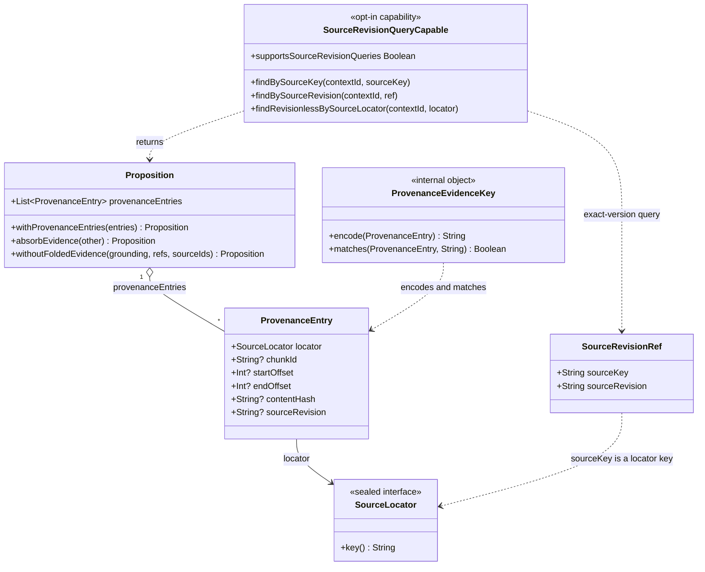
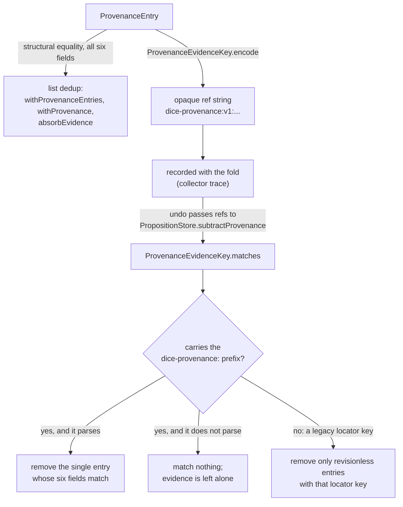
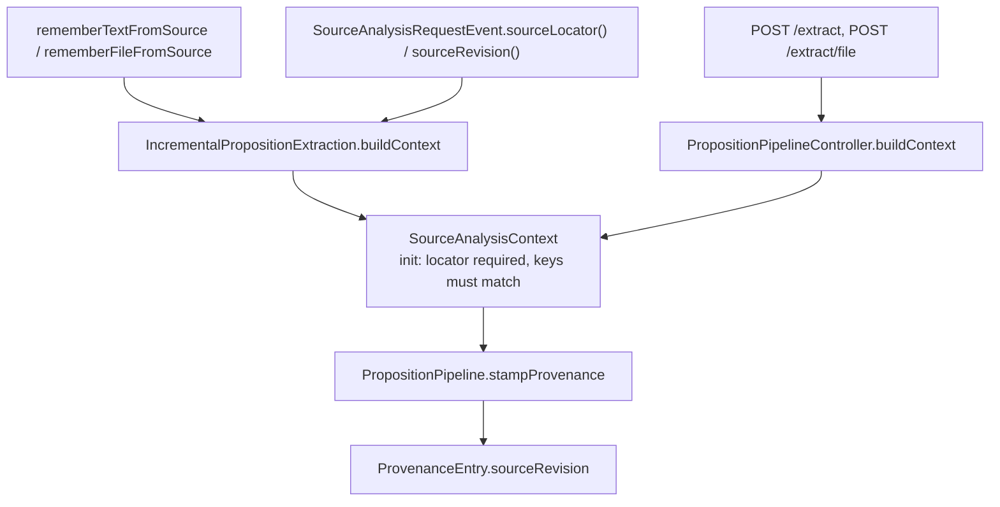

# Source revisions: an opaque version beside a stable locator

A source revision is an opaque, provider-defined string carried on each piece of evidence, beside
the locator that identifies the source. It records which version of a source a claim was read
from — the note edited between Monday and Friday, the Notion page with a new `last_edited_time`,
the S3 object with a new version id. DICE already records *where* a claim came from, a
`SourceLocator` and the span within it; the revision says *when in that source's life*.

The locator keeps its current identity. `SourceLocator.key()` is unchanged, so a document read at
`r1` and the same document read at `r7` are still one source, cited by one graph node, reachable by
one query.

This note covers the whole of Wave A at overview level and the core contract — the types in the
`dice` module — in depth. The storage mapping, collector hardening, and entry-point carriage each
have their own slice; see [Wave A map](#wave-a-map) at the end.

## What the model could not say

`ProvenanceEntry` on `main` is five fields:

```kotlin
data class ProvenanceEntry @JvmOverloads constructor(
    val locator: SourceLocator,
    val chunkId: String? = null,
    val startOffset: Int? = null,
    val endOffset: Int? = null,
    val contentHash: String? = null,
)
```

`contentHash` gets close. If you hash the source content and store it, a later mismatch tells you
the source changed. What it cannot tell you is *which* version you read, in the vocabulary the
source system itself uses. A hash is DICE's own summary of the bytes; a revision is the provider's
identifier, the one you can hand back to that provider to fetch exactly what was extracted. Two
extractions of one document at two revisions were, before this change, indistinguishable evidence
pointing at the same locator.

## Stable key, opaque version

S3 and W3C PROV both split identity this way. S3 names an object by bucket and key; enabling
versioning leaves the key alone and adds a version id per PUT, and a GET without one resolves to
the current version. W3C PROV keeps a general entity referable while a specialization of it — the
entity as it stood at some point — is a distinct thing linked back by `prov:specializationOf`, so a statement
about the general entity survives the arrival of new specializations. Both keep the *name* of the
thing stable and put the version somewhere the name does not reach.

DICE follows that split with a scalar rather than a second entity, because DICE's evidence already
lives on a relationship: a proposition cites a source through a `ProvenanceEntry`, and the entry is
the natural place for a per-citation qualifier. Adding a revision-bearing `SourceLocator` subtype
would have forked source identity, so `uri:https://example.com/doc` at `r1` and at `r7` would
MERGE as two `:Source` nodes, "all propositions from this document" would need a prefix scan, and
every consumer that persisted a locator key would see its keys change meaning. Two constraints
follow from that, and both are load-bearing:

- **`SourceLocator.key()` never contains the revision.** `UriLocator.key()` stays `"uri:$uri"`,
  `FileLocator.key()` stays `"file:$path"`, `ContentAddressedLocator.key()` stays
  `"content:$contentHash"`, `ConnectorRef.key()` stays `"connector:$connectorId:$externalId"`.
  Nothing in this train touches those.
- **The revision is opaque to DICE.** It is a non-blank string that DICE stores, compares for exact
  equality, and hands back. No ordering, no parsing, no "latest" inference. `"r1"` and `"r10"` have
  no relationship DICE knows about, and the literal string `"null"` is a perfectly good revision
  value — the tests pin that, because a codec that confused it with absence would be a silent
  evidence-deletion bug.

`SourceRevisionRef` pairs the two halves for callers who need to name one version of one source:

```kotlin
data class SourceRevisionRef(
    val sourceKey: String,
    val sourceRevision: String,
)
```

Both components are required and non-blank. It is the query and carriage value; stored evidence
keeps only the scalar beside its existing locator, so nothing on the write path has to keep a
denormalized copy of the key in step.

## The types



`sourceRevision` is the sixth field of `ProvenanceEntry`, defaulted to null and validated non-blank
when present. `@JvmOverloads` already sat on the constructor, so every concrete Java constructor
descriptor a caller could have compiled against survives and the revision arrives as one more
descriptor on the end.

## Two identities: equality and dedup

The change touches identity in two places, and they answer different questions.

**Data-class equality** answers "are these the same piece of evidence?" `ProvenanceEntry` is a
Kotlin `data class` with no custom `equals`, so adding `sourceRevision` puts it into structural
equality with the other five fields. That is the whole mechanism behind in-memory dedup:
`withProvenanceEntries` and `withProvenance` both end in `.distinct()`, and `absorbEvidence` folds
a collapsed proposition's evidence the same way. So evidence at `r1` and evidence at `r2` over the
same span of the same document are two entries, and both survive a fold. Before this change they
collapsed into one and the second revision's reading was lost.

**The evidence-key codec** answers "which stored entry does this recorded reference name?" A
collapse writes down what it folded so an undo can subtract exactly that contribution later. On
`main` those references were locator keys, which stopped being precise the moment one locator could
appear on several entries at different revisions. `ProvenanceEvidenceKey` owns the replacement:

```kotlin
object ProvenanceEvidenceKey {
    fun encode(entry: ProvenanceEntry): String
    fun matches(entry: ProvenanceEntry, encoded: String): Boolean
}
```

The encoding is length-framed — each field is written as `<length>:<value>`, in the fixed order
locator key, revision, chunk id, start offset, end offset, content hash, behind a
`dice-provenance:v1:` prefix. Framing by length means no value needs escaping however many colons
it contains, and a length of `-1` stands for null, so absence stays distinct from every string
value including `"null"`. An entry over `https://a` at revision `r1`, chunk `c`, offsets 1–2, hash
`h` encodes as:

```
dice-provenance:v1:13:uri:https://a2:r11:c1:11:21:h
```

`matches` runs one way only: it walks the candidate entry's fields against the string and compares
regions in place, so there is no decode step that could produce a half-trusted entry. A reference
that is truncated, has a bad length, carries a non-ASCII digit, or has trailing bytes matches
nothing at all, so an undo driven by a corrupt reference removes no evidence.

### One codec, and why it is public

This is the only evidence-key codec in DICE, and the graph uses it too: a `DERIVED_FROM` edge is
keyed by the string `encode` returns for the entry it was written from, so a stored row and a
recorded fold reference are the same string for the same piece of evidence.

They started out as two. Storage had a `provenanceStorageEntryKey` of its own, on the argument that a
graph row and a fold record have different lifetimes and pinning one to the other would make a change
to either a migration of both. The two encodings turned out to frame the same six components in the
same order with the same `-1` for null, differing only in that the storage copy omitted the
`dice-provenance:v1:` prefix — one format maintained in two places. Worse, neither module could see
the other's copy: each was `internal` to itself, so even a conformance test tying them together was
impossible to write without widening one of them. The escape hatch cost the same visibility change as
the fix.

So the fix. `ProvenanceEvidenceKey` is public, `dice-storage` calls `encode`, and
`PropositionGraphMapperRevisionTest` asserts that a stored edge key both equals `encode` for its
entry and satisfies `matches` against it — and fails `matches` against a different revision of the
same evidence.

**Adopting the prefix changed the bytes stored on an edge**, and that is worth stating plainly rather
than leaving as an implication of "one codec". It is safe only because of when it happened:
`entryKey` is itself unreleased, arriving in this same train, so no released DICE ever wrote one. A
graph written by an intermediate build of this train holds prefix-less keys that this build does not
recognise, and re-saving that evidence adds a second edge; clearing such a development store is the
whole of the fix, and the CHANGELOG says so. After release the same change would be a migration.

The reason a released format change would be expensive is the reason `v1` is now pinned by a literal.
Every other test compares `encode` against `matches` from the same build, so a coordinated edit to
both would stay green while orphaning every stored key and every recorded fold reference.
`ProvenanceEvidenceKeyTest.v1 encodes to exactly these bytes` asserts the worked example above
character for character, so moving the format under a `v1` label fails the build.

Public is the honest declaration rather than a new commitment. The format was already durable in two
places before this: recorded in collector traces and stored on every edge. What being public adds is
a stated contract — a version prefix leads every string, a reader that meets a version it does not
know matches nothing rather than guessing, and the format is the thing that must not change under
either reader, not an implementation detail either module owns. The lifetime argument survives as a
constraint on future versions: a `v2` would have to be introduced the way this note describes for
legacy locator keys, since `entryKey` values already stored cannot be rewritten by a redeploy.



### Recording a fold, and undoing it

A collapse records what each loser actually added to the survivor, and names that evidence by its
evidence key. `MultiSignalCollectorStrategy` encodes every entry on both sides and subtracts; what
is left is the evidence the fold introduced. `RetiredProposition.foldedProvenanceEvidenceKeys`
carries it, and `undoSingleCollapse` hands those refs to `PropositionStore.subtractProvenance`,
where each one matches a single full entry. (`Proposition.withoutFoldedEvidence` still runs on the
survivor for grounding and source ids, and is given no provenance refs — the store removes evidence
now. **Subtracting evidence by name** below says why the move was needed.)

Locator keys alone could not do this, and failed in two ways. A loser citing `r2` of a document the
survivor already cites at `r1` shares its locator key with the survivor, so the recorded fold
subtracted to nothing and undo left `r2` behind. And a bare locator key matches revisionless
evidence only, so even a ref that did get recorded could not reach a revisioned entry. Both are now
pinned: `MultiSignalCollectorStrategyTest.records only the distinct evidence a fold actually adds`
covers what gets written down, and `folding a revisioned loser and undoing leaves the survivor's
evidence as it was` runs the whole round trip — in memory in `CollectorUndoCapabilityTest`, and
against Neo4j in `DrivineCollectorTraceStoreIntegrationTest`, where the survivor's `DERIVED_FROM`
edge count goes from one to two across the fold and back to one after the undo.

`foldedProvenanceRefs` stays beside the evidence keys with its meaning unchanged: the locator keys
of sources the survivor was not already citing. Trace readers display those, and an undo of a trace
recorded before evidence keys existed falls back to them, matching revisionless evidence only — so
an old trace removes exactly what it always removed. The two fields are the same fold stated at two
granularities, and the finer one wins wherever it exists.

Evidence keys are left out of the JSON view of a trace. A `RetiredProposition` written to JSON and
read back carries its locator refs and no evidence keys, so it undoes at locator granularity;
`SourceRevisionCompatibilityTest` asserts both halves of that. JSON is a readable projection of a
trace, not a transport for one you intend to undo from.

### Undo goes through the store, and writes nothing on a broken collapse

`undoSingleCollapse` takes evidence off the survivor with
`ProvenanceSubtractionCapable.subtractProvenance`, which names the refs to delete. Saving the
reduced survivor is not enough on a persistent backend: `DrivinePropositionRepository.save` appends
provenance and deletes no edge, so the folded rows would outlive the undo. The subtraction runs
first and the save follows it, carrying grounding and source ids; **The order the writes go in**
below says why that order is load-bearing in both directions. **Subtracting evidence by name**
below says why the operation lives on its own capability and what implementing it promises;
`CollectorUndoCapabilityTest` pins the undo against a store that models the append-only save.

Both participants are read before anything is written. A survivor whose retired member has since
been deleted would otherwise end up with the member's evidence already subtracted and no member to
restore it to. Four tests count the writes an undo attempts against a missing survivor and a missing
retired member, in memory and on Neo4j, and assert the count is zero.

### Proving a collapse was applied before reversing it

A retirement record says a collapse was *proposed*. `MultiSignalCollectorStrategy` writes it during
the mark phase, and `DefaultCollectorRunner` only decides what to do afterwards, so a dry run, a
skipped merge, or a merge the runner declines all leave a trace that reads exactly like an applied
fold. Reversing one of those subtracts evidence the survivor holds for its own reasons. The record
also survives its own undo — nothing consumes it — so a second undo has to be recognised too.

So authorization is two conditions, and both have to hold.

**Was the merge applied, into this survivor?** The trace cannot say, and neither could the audit
records until this slice: they described *marks* and status changes, not the action the sweep took.
Three different things produced the same record. `MergingSweepPolicy` merges into the first mark
naming a survivor that is neither blank nor the member itself, while `DefaultCollectorRunner` writes
a record for *every* mark, so a member marked duplicate by two strategies left two records naming
two survivors with nothing to say which merge ran. `StatusTransitionSweepPolicy` retires a
duplicate-marked member and folds nothing. And the runner itself retires a loser without merging
when the target has vanished or is no longer ACTIVE. All three looked like an applied merge.

Worse, the two record stores disagree about how many records survive. `DrivineCollectorRecordStore`
MERGEs on the natural key (`propositionId`, `runId`), so a member marked by several strategies keeps
**one** row and the last write wins; `InMemoryCollectorRecordStore` keeps one per mark. Any rule
that reads the merge target off a mark therefore gives a different answer on the two stores, and on
the production one it reports whichever mark was written last.

So `CollectorRecord` gains `mergedIntoId`: the survivor the sweep actually folded this proposition
into. `DefaultCollectorRunner` sets it only after the merge is saved, and sets the same value on
every record it writes for that member — which is what makes the field survive the overwrite. One
row or five, the answer is the same. A plain status transition, a skip, and a fallback retirement
all leave it null, so none of them can authorize an undo. A dry run's preview records the target it
would have used, and the run header's `dryRun` flag is what says nothing happened.

`undoSingleCollapse` requires a `CollectorRecordStore`, a non-dry run and a `TRANSITIONED` record
whose `mergedIntoId` names this survivor. No inference from marks remains, and the multi-survivor
ambiguity that forced a conservative refusal is gone by construction. A defensive check for records
that disagree about the applied target stays in place and logs, because the alternative on a broken
invariant is silently picking one. **What undo refuses before it starts** below covers the case
where the caller supplies no records at all.

**Has the undo already run?** Audit records never expire, so nothing in them says a collapse has been
reversed — and that is a false *accept* waiting to happen, not just a missing convenience. Judge
completion by status alone and this sequence bites: run 1 merges the member into S1, the undo
succeeds, and later anything at all retires the member again — a decay sweep, a second collector run
folding it into S2. Run 1's records still say "applied" and the member is off its prior status
again, so a retry of run 1's undo proceeds: it subtracts run 1's evidence from S1 a second time,
deleting whatever S1 has legitimately re-gained since, and restores the member, clobbering the newer
retirement.

So `CollectorRecord` gains `undoneAt`, stamped by `undoSingleCollapse`. A store keyed by
(proposition, run) updates that row in place; one that appends leaves the original beside the
stamped copy, so a reader treats *any* stamped record for the pair as the whole collapse being
undone. A stamped record never authorizes again, however the member's status has moved since.

Two details make the stamp trustworthy rather than decorative.

**Replay must not erase it.** Re-recording a collector outcome is supported, and a replayed record
carries no stamp, so a plain `SET n.undoneAt = $undoneAt` would clear a stored one and re-authorize
the collapse. `DrivineCollectorRecordStore` writes it through `coalesce($undoneAt, n.undoneAt)`
instead: an arriving stamp wins, a replay preserves. The append-only in-memory store has the
property for free, and `CollectorRecordStore.record` now states it as a contract on implementors.

**Where the stamp sits in the write order is what makes a crash recoverable.** Undo writes in four
steps — subtract the evidence, save the survivor, stamp, restore the member — and the stamp is
deliberately third rather than last. Put it after the restore and a process that dies in between
leaves a finished undo still authorized, which no retry can repair: the member is already back at
its prior status, so the retry declines and the stamp is never written; a later re-retirement then
re-arms the whole thing destructively. Third, every interruption is recoverable:

| Interrupted after | State | What a retry does |
| --- | --- | --- |
| nothing | untouched | the whole undo |
| subtract | evidence off, grounding on | re-derives against current evidence, so the subtraction is a no-op, then finishes |
| save | survivor final, member retired, no stamp | same — re-subtracts nothing, stamps, restores |
| stamp | stamped, member still retired | restores only, touching no evidence |
| restore | complete | nothing; the stamp refuses |

The subtraction is safe to repeat because it is recomputed from the survivor's *current* evidence by
key, so a ref that is already gone removes nothing.

That fourth row needs one more thing to be sound, because "stamped and still retired" also describes
a collapse undone long ago whose member something has retired again since. Two signals separate
them.

The member must sit exactly where this collapse left it, per the record's `newStatus`. A record
without one predates the mechanism and cannot say where that was, so it fails the signal instead of
passing it vacuously — otherwise a stamped legacy record would resume against a re-retirement to any
status at all.

And no other run may have **written** the member at or after the stamp. That counts `TRANSITIONED`
and `HARD_DELETED` records from non-dry runs only. The filter is load-bearing in the other
direction: a `SKIPPED` record is the literal statement that a run left the member alone, and a dry
run changes nothing, so counting either as action would refuse the resumption forever and strand a
member whose undo is genuinely half-finished — evidence off the survivor, member retired, every
retry declining. `a later run that skipped the member does not strand an interrupted undo` pins it.

Both timestamps are written by whichever host produced them, so the comparison assumes roughly
synchronized clocks. Several hosts sharing one store can order them wrongly: a re-retirement whose
clock runs behind stamps `at` before `undoneAt` and slips past the check.

What defeats both signals is a re-retirement that leaves no record and lands on the same status.
Two deployments produce that: host code changing a proposition's status directly, and a collector
runner wired without a record store at all, where `persistRun` no-ops and a whole re-retirement —
or a re-*merge* into a different survivor — passes unrecorded. The consequence is bounded but wider
than a status flip: the stamp gate still makes the full re-subtraction unreachable, so no evidence
is lost, but a false resume can leave the member live while the newer survivor keeps the copy it
folded, which is a merge-state desync someone has to reconcile.

**Is the merge still in force?** The member's own status — and it is all a caller without records
has for any of the three questions. Note what it does not say: "still retired *by this collapse*". A
later unrelated retirement satisfies it just as well, which is exactly why the `undoneAt` stamp
rather than status is what closes the retry.

Leaning on status costs one false refusal, deliberately. A member that was genuinely retired, whose
undo has not run, and which has since revived to its prior status reads as never retired. Refusing
loses a legitimate undo and touches nothing; accepting would subtract evidence for a collapse that
may never have been applied. Silent data loss is the worse outcome, so refusal wins the tie, and a
caller that needs the undo can reinstate the fold or remove the evidence directly.

Without the records only the status condition is checked, which is the older, weaker behaviour kept
for existing callers: it accepts a dry run's trace followed by an unrelated decay transition, and it
has nothing stopping the re-arm sequence above. The four-argument overload keeps that behaviour with
the limitation stated in its KDoc; anything holding the records should pass them.

Two further refusals are correct rather than conservative, and worth naming so they are not mistaken
for defects. A **chain-resolved merge** — stacked strategies mark A into B while B is itself merged
into C, so the runner folds A onto the terminal survivor C and records C while the trace decision
still names B — can never be undone through the records: undoing against B fails the record check,
and against C fails the caller-error `require`. That is right, because the folded evidence keys were
computed against B's evidence, and subtracting them from C would remove the wrong set. And
`findDecisionForProposition` returns an arbitrary first match on both shipped stores, so a dry-run
preview of a collapse recorded before the real one can **shadow** the applied decision; the undo
then evaluates the preview's run, meets a dry-run header, and declines.

A sibling's folded refs are held on the survivor only until that sibling's own undo has run; after
that it holds its own copy again, so the last member of a shared fold to be undone takes the shared
evidence with it and the survivor lands back on its pre-collapse evidence. With records that is read
off the sibling's `undoneAt` for this run, and it has to be: judged by status, a sibling that was
undone and then retired again by a later run reads as still participating, so the shared evidence
would be retained forever even though both original folds are reversed. Without records the fallback
is status, which is what a legacy caller gets. A sibling that has been deleted counts as still
holding its claim either way, since the survivor's copy is then the only one left.

One limit remains, and it is inherent rather than missing data: an entry the survivor independently
re-gains after a fold is indistinguishable from the folded one under structural dedup, so undo
removes it. Grounding refs and source ids have always behaved that way and evidence now matches
them. A different revision of the same source is a different key and is untouched.

### What undo refuses before it starts

Undo is destructive and takes ids from whatever handed them to it — a URL path, a card in a drawer,
a script. Three preconditions are checked ahead of any write, and each missing one refuses.

**The context that owns the collapse.** The parameters are a
`CollapseUndoCommand(contextId, survivorId, retiredId)`, and both the survivor and the retired
member have to live in that context. One that does not throws
`CollapseUndoContextMismatchException`, carrying the commanded context, the offending proposition
and the context that really owns it. Without this the ownership check was every caller's own
problem: the assistant's `MemoryUnmergeService` resolves the user's context and compares both
propositions against it before calling in, and a caller that forgot had a destructive operation
reachable across contexts with two string ids. `an undo issued for one context refuses ids belonging
to another, and leaves it untouched` sets a whole collapse up in a second context — trace, live
records, retired member and all — issues the undo in the first, and asserts the refusal plus the
second context's evidence, member status and absent stamp; it then undoes the same collapse cleanly
under the right context, so the refusal is about ownership alone. `a member from another context
cannot be restored into this context's survivor` covers the mixed case.

**The run's audit records.** A null `CollectorRecordStore` throws
`CollapseUndoConfigurationException` naming the missing store, before any read. This used to be
optional, and omitting it dropped the "did the collector really apply this merge" question and fell
back on the member's status — which a later unrelated retirement satisfies just as well. A dry-run
preview followed by a decay sweep moving the member ACTIVE to STALE was enough to arm an undo that
then stripped a revision the survivor held for its own reasons.

**A live record, with previews excluded.** `CollectorRun.dryRun` on the run header is how a preview is
marked, and a dry-run header refuses whatever its records say — a dry run writes records carrying
`mergedIntoId` and a `newStatus` exactly like a merge that happened, so the header is the only
signal that separates them. Three tests share one world state and vary only the audit trail: no
store refuses, a dry-run record refuses, a live record proceeds. Each refusal asserts the survivor's
evidence, the member's status and the absence of an `undoneAt` stamp, so "refused" means "wrote
nothing" and never "wrote half of it".

### Subtracting evidence by name, not by remainder

Undo removes evidence through `ProvenanceSubtractionCapable.subtractProvenance`, which names the
refs to delete. The obvious alternative — `setProvenance` with the entries that should remain — has
a window that loses data: naming what stays means reading the entries first, and any evidence
another extraction adds between that read and the write is replaced away. Nothing recovers it,
because the `save` that follows is append-only.

The operation lives on its own opt-in capability, beside `SourceRevisionQueryCapable`, for the very
reason that window exists. A default body on `PropositionStore` would have to *be* that
read-modify-write, and it would compile on every backend while quietly carrying the data loss the
operation is there to prevent; a store with no way to delete by name would then look identical to
one that can. The capability states the promise directly: the read of the current entries and the
write of what survives land as one step, an entry another writer adds while a subtraction is in
flight is still there when it finishes, and subtracting the last entry from a proposition somebody
already deleted answers null and writes nothing. `supportsProvenanceSubtraction` carries the runtime
half of that for a decorator that forwards to a delegate it discovers at construction. Undo probes
for the capability and refuses with `CollapseUndoConfigurationException` when the store has none.

`InMemoryPropositionRepository` implements it over `ConcurrentHashMap.compute`, which holds the key
for the whole remapping function, and takes an `addProvenance` override on the same primitive so the
two operations serialize against each other. `DrivinePropositionRepository` deletes `DERIVED_FROM`
edges by ref in one statement and prunes only the sources those edges pointed at, reading nothing
first. Refs come in the same two forms the codec defines: a minted key is matched against the edge's
`entryKey`, and a bare locator key matches revisionless edges for that source only — which also
reaches edges written before `entryKey` existed. `EventEmittingPropositionRepository` carries the
capability type and forwards to its delegate, because Kotlin's interface delegation covers
`PropositionRepository` alone: a decorator that stayed silent would hide a capable delegate and turn
every undo behind it into a refusal.

`evidence added while a subtraction is running survives it` races an addition against a subtraction
on one proposition over 200 rounds, with two real threads released together on a latch, and asserts
both effects are on the proposition at the end. The read-modify-write shape this replaced loses the
addition on the first round. `evidence the subtraction does not name survives it on the graph
backend` asserts the same property for the Drivine statement, with the add completing before the
subtraction starts.

A subtraction can also answer null, which is the store saying it holds no such proposition. Undo
reads that as the survivor having been deleted between its own read and this call, and stops there
having written nothing. Continuing from the copy it read would save that copy back and recreate the
proposition another writer deleted, folded evidence and all — the `save` that follows the
subtraction is an upsert on every backend here. The member stays retired, no stamp is written, and
the null the undo returns says truthfully that no restore happened. What becomes of a member left
retired into a survivor that no longer exists is the caller's decision; undo does not guess at it.
`a survivor deleted before the subtraction is not recreated by the undo` pins that in memory, and
`subtractProvenance answers null for a proposition that is not there` pins the graph backend's half.

**A deletion can still arrive too late to be seen**, and this is a residual the capability leaves
open. Every deletion up to the subtraction's own last look is caught, because no implementation may
recreate what it is subtracting from: the in-memory `compute` finds no entry and writes none, and
the Drivine override reads once after its delete statement. The window that stays open is between
that answer and the survivor's `save`.

The upsert is what does it. `PropositionStore.save` writes the proposition whether or not a row for
it still exists, and nothing on the contract says "save only if it is still there". Closing the
window needs a conditional write — a compare-and-set, or an existence-guarded save on the store
contract that every backend then has to implement — and it would have to reach every save in the
chain. That is more than an amendment to this slice should take on. It belongs with the other
untransactional residuals here: no transaction spans the undo's four writes, and a caller needing
strict exclusion against concurrent deletion needs a boundary the SPI does not offer yet.

### The order the writes go in

Evidence comes off first, and the survivor's `save` runs last. Both halves of that order are
load-bearing. A persistent backend's `save` appends provenance and deletes nothing, so the
subtraction is the only write that removes the folded evidence. And `save` is the write a decorator
instruments — `EventEmittingPropositionRepository` publishes `PropositionPersisted` from it, while
the provenance operations forward to the delegate unannounced. Saving first would fire the event
while the folded evidence was still in the graph, handing a synchronous listener a survivor that no
longer exists a moment later. `the survivor's persistence event carries its post-undo evidence` pins
the ordering against the real decorator.

### Legacy evidence is unchanged, by construction

A revisionless entry is one whose `sourceRevision` is null, which is every entry written before
this change and every entry written after it by a caller that supplies no revision. Three
properties hold for those, and slice 1's tests pin each one:

- **Equality is unchanged.** Two revisionless entries over the same locator and span are equal, and
  a list of them dedups to the same result as before. `SourceRevisionContractTest` asserts the
  equality and `.distinct()` behaviour side by side with the revisioned case.
- **Stored JSON still loads.** Old JSON with no `sourceRevision` key deserializes to a null
  revision and compares equal to a freshly built revisionless entry. New writes carry
  `"sourceRevision": null` for those entries, which reads back to the same value.
  `ProvenanceJsonCompatibilityTest` reads a checked-in revisionless fixture and a revisioned one
  and asserts a full round trip through both; `JsonFilePropositionRepositoryTest` strips the field
  back out of a written store file, reloads it, and reruns the source queries against the result.
- **Legacy refs still work, conservatively.** A reference with no `dice-provenance:` prefix is read
  as a plain locator key and matches revisionless evidence only. So an undo recorded before
  revisions existed removes exactly what it used to remove, and can never reach evidence from a
  revision it never saw. `PropositionFoldEvidenceTest` and `ProvenanceEvidenceKeyTest` both pin
  this. A locator key cannot be mistaken for a codec ref in either direction: the sealed hierarchy
  makes every key kind-prefixed (`uri:`, `file:`, `content:`, `connector:`), so none can begin with
  `dice-provenance:`, and a ref that does carry the prefix but names an unknown version — the
  `dice-provenance:v2:` case in `ProvenanceEvidenceKeyTest` — fails closed and matches nothing.

## Getting a revision in

`SourceAnalysisContext.sourceRevision` is the only way a revision reaches provenance. Every entry
point builds a context, the pipeline reads the revision off the context when it stamps evidence,
and there is no other channel. That makes one check enough: the context's `init` block requires a
`sourceLocator` whenever a `sourceRevision` is set, and requires the revision's `sourceKey` to equal
that locator's key. A revision therefore cannot name a source the run is not reading, and the
fallback `ContentAddressedLocator` the pipeline uses when no locator was supplied can never pick up
somebody else's revision — there is no revision to pick up.



### The three entry points

**Direct calls.** `rememberTextFromSource` and `rememberFileFromSource` sit beside `rememberText`
and `rememberFile` as separate methods. A locator is required on the source-aware pair and absent
from the legacy pair, so the two have genuinely different contracts and every Kotlin and Java call
site resolves to one of them without ambiguity. `IncrementalPropositionExtractionTest` enumerates
the exact JVM descriptors of all four names and asserts the sets, so a legacy descriptor cannot
quietly move and a source-aware call cannot collapse onto a legacy one; the same file exercises
Kotlin callable references, named arguments, and Mockito-shaped call sites for the same reason.
Both source-aware calls run through one private `rememberTextInternal`, and the file variants share
one `withRememberedFileText` reader, so parsing and grounding behave identically with or without a
revision.

Passing a revision on either call is an assertion by the host that the locator's revision covers the
whole aggregate being extracted — the whole text, or the whole file as Tika read it. DICE has no way
to derive that: `sourceId` and `additionalGrounding` are untyped strings, and a file is read as one
document. The KDoc on both methods says so.

**The async event path.** `SourceAnalysisRequestEvent` gains two open methods, `sourceLocator()` and
`sourceRevision()`, both returning null by default, so an existing subclass carries no provenance and
behaves as it did. `ConversationAnalysisRequestEvent` gains a constructor that takes a locator and an
optional revision. The listener passes whatever the event returns into the same `buildContext` call
`rememberTextFromSource` uses, which is what makes the two paths carry a revision identically rather
than similarly. Three tests pin it: `SourceAnalysisRequestEventRevisionTest` asserts the defaults, the
exact values a provenance-aware event carries, and that a mismatched key is rejected when the context
is built; `IncrementalPropositionExtractionTest.event provenance reaches the context observed by the
pipeline` runs a real event through `extractPropositions` and captures the context the pipeline was
handed; and `SourceRevisionJavaInteropTest` subclasses the event from Java in both shapes and asserts
the base constructor descriptor is still `(Object, NamedEntity)`.

**REST.** Covered below.

### The REST surface

`POST /extract` takes two new optional fields, and `POST /extract/file` takes the same two as
multipart parts:

| Field | Meaning |
| --- | --- |
| `sourceLocator` | `{kind, value, connectorId?, display?}`, where `kind` is `uri`, `file`, `content`, or `connector` |
| `sourceRevision` | the provider's opaque revision string |

Field combinations that would mean something other than what they look like are rejected with 400,
before the pipeline runs and before Tika reads the upload:

| Rejected | Reason |
| --- | --- |
| `sourceRevision` with no `sourceLocator` | there is nothing for the revision to be a revision of |
| unknown `kind` | the union is closed |
| `connectorId` on a `uri`, `file`, or `content` locator | those kinds have no connector, so the field would be silently dropped |
| `connector` with no `connectorId` | `ConnectorRef` needs both halves |
| blank `value` | a locator with no identifier identifies nothing |
| a source key over `MAX_SOURCE_KEY_LENGTH`, or a `sourceRevision` over `MAX_SOURCE_REVISION_LENGTH` | both strings are hashed into evidence and written to an indexed property, and `ProvenanceEntry` refuses them anyway; measuring here answers the caller at the edge |

A `connectorId` holding a colon is accepted. `ConnectorRef` escapes its own connector id when it
renders a key, so `ConnectorRef("gmail:eu-west", "message-42")` keys as
`connector:gmail\:eu-west:message-42` and stays distinct from
`ConnectorRef("gmail", "eu-west:message-42")`. Screening colons out at the REST edge would refuse
connector ids the domain type handles perfectly well, a region-qualified one among them, so the
controller carries no such check.

Every 400 from these checks carries a body, `{"error": "<what the check said>"}`. That is what makes
a length rejection actionable: the message names the ceiling that was broken and the length that
broke it. Without it an over-long value surfaced as an `IllegalArgumentException` deep inside
extraction, which the caller met as a 500.

`PropositionPipelineControllerTest` posts all five field-combination cases in one batch and asserts
400 with zero pipeline invocations. A separate multipart test asserts the file endpoint rejects a
revision with no locator without calling the reader. The ceilings have tests of their own on both
endpoints, each asserting the body names the bound; a paired test posts a source key of exactly 2048
characters with a revision of exactly 1024 and follows both through to the stored `ProvenanceEntry`.
Another posts both readings of the same colons — `gmail:eu-west` + `message-42`, and `gmail` +
`eu-west:message-42` — and asserts the connector id survives the wire, the keys differ, and the
stored key is the one `ConnectorRef` renders.

The happy path posts all four locator kinds with a revision containing
both a colon and a non-ASCII character (`rev:opaque|雪`) and asserts the value comes back on the
response byte for byte, with the locator's `sourceKey` absent from the wire — the key is derived
from the locator, so sending it back would be a second, forgeable copy of the same fact.

**Revision-stable chunk ids.** When a request carries a revision, the controller derives each chunk's
id from the context id, the source key, the revision, the chunk's ordinal in the document, and the
chunk text, framed by length and hashed. Re-posting the same revision then produces the same chunk ids
and grounds onto the same rows; posting a different revision of the same source produces different
ids, which is what keeps two versions separately traceable. A request with no revision keeps whatever
id the chunk arrived with, so old callers see no change. Three tests cover it: one posts `r1` twice
then `r2` and asserts two propositions with one grounding row and one evidence row each; the file test
posts the same revisioned upload twice and asserts identical chunk ids both times; and a third posts
identical text, locator, and revision into two contexts and asserts the ids differ.

The context id is in the identity because a chunk id is what grounding is looked up by, and
`findByGrounding` is not context-scoped. Without the tenant in the hash, two contexts ingesting the
same document at the same revision would mint the same chunk id, and a grounding lookup in one
context would reach the other's propositions.

Two limits worth stating. The ids hold only as long as the chunker keeps producing the same chunks
for the same input — the chunk text and its ordinal are both in the identity, so re-posting one
revision after a chunker configuration change re-mints the ids and grounds onto fresh rows beside the
old ones. And the id is derived from the request, so it says nothing about whether the bytes behind a
revision changed: a provider that reuses one revision string for different content gets one id for
both.

**What the extract response names.** `POST /extract` answers with the propositions the store holds
once the writes have run. `save` is the authority on that, and it can answer with a different row
from the one it was offered: exact-text dedup hands back the existing canonical proposition under
its own id. Revision does the same thing a layer up — a merge or a reinforcement writes the revised
proposition and leaves the freshly extracted one unwritten, so the extracted id names nothing. The
controller keeps what each `save` returned, keyed by the id it offered, and every proposition the
response names goes through that map. The property is simple to state and simple to test: every
proposition id in an extract response resolves through `findById`.

`PropositionPipelineControllerTest` pins it with a store double that collapses a second save of the
same text onto the row already there, the way the graph store's exact-text dedup does. Posting one
sentence twice makes the pipeline mint two ids while the store keeps one row, and the second
response must name the row that survived. A second test drives the merge path and asserts the
response carries the merged row's id with the extracted id absent from the store; a third runs a
contradiction and a reinforcement together and asserts every id in the answer resolves.

**On the way out.** `ProvenanceEntryDto` gains `sourceRevision`, and the discovery `/why` response
grows a `provenance` array of `DiscoveryProvenanceDto` — locator key, revision, chunk id, offsets,
content hash, all primitives. Both DTOs are `NON_NULL`, so a revisionless entry serializes exactly
as it did before: the field is absent, not null. `DiscoveryControllerTest` asserts the empty case,
the revisionless case with the field absent, and two revisions of one locator arriving in order.
`LineageDto.from` reads the lineage's own entries rather than the nested proposition's, because a
lean read can return a proposition with no evidence attached while the lineage carries the full set;
`DiscoveryDtoLeakTest` pins that and pins the DTO's primitive-only shape.

The array is sorted by evidence key before serialization. Nothing upstream orders it: provenance is
read as raw Cypher over `DERIVED_FROM` edges and comes back in whatever order the planner produced,
so the same proposition could serialize its evidence differently from one read to the next. Sorting
in `LineageDto.from` rather than adding an `ORDER BY` fixes it once for every backend, including the
in-memory and JSON-file repositories, and costs one encode per entry on a list that is already
bounded by how much evidence one proposition carries. The evidence key is the right sort key because
it is the entry's durable identity — the same string the graph rows and collector traces are keyed
by — so the order is stable across reads and across backends, and one source's revisions sort among
themselves once their shared locator prefix matches. `DiscoveryDtoLeakTest` feeds one entry set in
three arrival orders and asserts all three serialize identically.

**This moved the `/why` baseline.** On `main`, `/why` returned six fields and dropped provenance
entirely. It now carries a seventh, so any later promise that the `/why` response stays byte-for-byte
identical re-baselines to the post-Wave-A shape rather than to `main`'s — the extraction-run train's
audit work makes exactly that promise, and its golden test has to be written against what ships here.
Nothing pins `/why` as a whole document today; `DiscoveryControllerTest` asserts individual JSON
paths.

### The binary-compatibility fixture, executed

`SourceRevisionBinaryCompatibilityTest` runs a client jar compiled against `main` before any of this
landed. It pins the jar and its source by SHA-256, checks the jar's manifest records the base commit
it was built against, loads it in a child classloader over the candidate classes, and asserts the
exact link outcome of eight probes:

Every probe passes fully specified arguments, so what each one measures is a concrete JVM descriptor.
None of them exercises Kotlin's synthetic defaulted constructor, and the fixture makes no claim about
it.

| Probe | What it calls | Outcome |
| --- | --- | --- |
| `ProvenanceEntry.constructor.full` / `.nullable` | the 5-argument descriptor, twice — once with values, once with nulls in the boxed positions | LINKED |
| `ProvenanceEntry.copy`, direct and defaulted | the 5-argument `copy` and its `copy$default` synthetic | `NoSuchMethodError` |
| `SourceAnalysisContext.constructor.full` / `.alternate` | the 10-argument descriptor, twice with different values | LINKED |
| `SourceAnalysisContext.copy`, direct and defaulted | the 10-argument `copy` and its `copy$default` synthetic | `NoSuchMethodError` |

That is the compatibility boundary below, measured rather than asserted. The fully specified
constructor descriptors survive because `@JvmOverloads` keeps every concrete one and adds the new
argument as one more descriptor on the end; the `copy` descriptors change because adding a field to a
data class changes them, which is the part this note declines to claim.

Two negative controls, one per probed type, keep the LINKED results honest. Each uses a classloader
that redefines a single class with the approved constructor stripped out by ASM, then asserts that
type's probe flips to `NoSuchMethodError` while the other type's stays LINKED. So a green run means
each probe is measuring the constructor it names rather than merely finding the class.

The context control reads its target descriptor out of the client jar's own bytecode. `ContextId` is
a value class, so the constructor the fixture writes with ten arguments compiles to an eleven-parameter
descriptor: the context id erases to `String`, and a trailing `DefaultConstructorMarker` separates
this constructor from the one erasure would otherwise collide with. Neither fact is visible in the
Kotlin signature, and reflection reports a *different* ten-parameter constructor the client never
calls — a control built from reflection strips a constructor nobody uses, and passes while proving
nothing. That was the first version of this control, and it is why the descriptor now comes from the
call site rather than from the class.

## Querying by source

Three finders land on `SourceRevisionQueryCapable`, all context-scoped:

| Method | Matches |
| --- | --- |
| `findBySourceKey(contextId, sourceKey)` | any revision of that source, including revisionless |
| `findBySourceRevision(contextId, ref)` | exactly that source key and that revision |
| `findRevisionlessBySourceLocator(contextId, locator)` | that source key with no revision |

### Why this is a capability the base repository leaves out

An earlier draft put these three finders on `PropositionRepository` with default bodies that read
the context and filtered loaded provenance in memory. That is safe only for a backend whose context
read carries provenance. On a backend that stores evidence and never projects it through an ordinary
read — which describes the graph store — the default returns an empty list, and an empty list here
already means something: nothing in this context cites that source. An unsupported operation would
have been indistinguishable from a genuine negative answer, which is the worst shape a query contract
can take.

So the surface lives on its own opt-in interface, following the house pattern of `GraphQueryCapable`
and `VectorSearchCapable`. The three plain-String finders are **abstract**: implementing
`SourceRevisionQueryCapable` is a promise to answer correctly for your own storage, and there is no
body to inherit that could quietly answer wrongly. A backend that cannot answer does not implement
it, and is therefore absent from the type. A caller asks for the capability and treats its absence as
its own case:

```kotlin
val revisionQueries = repository as? SourceRevisionQueryCapable
    ?: error("this backend cannot answer source-revision queries")
```

`supportsSourceRevisionQueries` is the runtime half of the same signal, mirroring
`VectorSearchCapable.supportsVector`. A type can promise what a particular instance cannot deliver:
`EventEmittingPropositionRepository` decorates a plain `PropositionRepository`, so whether it can
answer depends on the delegate it was handed. It carries the capability type, reports `false` from
the flag when its delegate lacks the capability, and throws an `UnsupportedOperationException` naming
that delegate if a call gets through anyway. Two ways to find out, no empty list.

`ProvenanceScanningSourceRevisionQueries` carries the in-memory scan as default bodies, for the
stores whose reads genuinely do hold every entry — `InMemoryPropositionRepository` and
`JsonFilePropositionRepository` implement that, and get all three for free. Naming the condition
keeps it visible: a store may only mix that in when its context read carries provenance.

### The typed and String forms

Each finder exists twice: the `ContextId`-typed form above, and a plain-String form that carries the
work. The typed one forwards to the String one, following `findByContextId` →
`findByContextIdValue` in `PropositionStore`. The direction is load-bearing. `ContextId` is a Kotlin
value class, so the typed method's JVM name is mangled and a Java class cannot implement it; an
implementation placed there would be unreachable from Java, and if the delegation ran the other way a
Java backend's implementation would be unreachable from Kotlin. With the String form as the single
implementation point, every call from either language passes through it.
`PropositionRepositoryDelegationTest` calls the typed entry points against a backend that implemented
only the String forms and counts the dispatches, so the test fails if a typed call ever skips them.
The same test pins the split itself: a store implementing only `PropositionRepository` yields null
from the `as?` probe, while a capability-declaring store does not.

`DrivinePropositionRepository` implements `SourceRevisionQueryCapable` directly, because its context
read loads a view with no provenance at all. Each finder pushes its predicate into Cypher, scoping to
the tenant first and then testing for a matching `DERIVED_FROM` edge, with the revision compared as
an edge property (`IS NULL` for the revisionless query).
`DrivinePropositionStoreIntegrationTest` runs all three against a real Neo4j through both the typed
and the String entry points.

Inside the `dice` module a shared fixture, `PortableSourceQueryFixture` with
`assertPortableSourceQueries`, states what the three finders mean once; the in-memory and JSON-file
repository tests both run it, so "all versions", "exact version", and "revisionless only" cannot
drift apart between the two portable backends — including across a write, reload, and re-query cycle
on the JSON one.

### Why the graph write had to change too

Making the finders correct on Neo4j forced two changes to how evidence is stored, because both
defects lose a revision before any query runs.

**One proposition, two revisions of one source.** Relationship-fragment mapping identifies a
`DERIVED_FROM` edge by its endpoints, so a proposition citing one source at `r1` and `r2` stored a
single row and the second revision vanished. Every edge now carries `entryKey`, a length-framed
encoding of the whole evidence tuple, and writes `MERGE` on it, so parallel revisions are separate
rows that stay idempotent under replay. Edges written before `entryKey` existed have none; an exactly
matching revisionless entry adopts one on first touch, and revisioned evidence never adopts a legacy
edge, because nothing records which revision that edge was read from.

The collapse is a write-side fact, and only that. Reverting the write path to relationship-fragment
mapping drops the stored edge count from two to one; the same test passed with reads still going
through the object view, so the read side was never shown to lose parallel edges. Provenance is read
as raw Cypher rows anyway, so that every provenance read — `findById`, `provenanceOf`,
`query(withProvenance = true)`, `findAll(withProvenance = true)`, and the three finders — goes
through one path with one set of guarantees.

**A second revision of an already-extracted fact.** Exact-text dedup answers a save with the
existing proposition when the text matches. It used to return that proposition and drop the incoming
evidence, so re-extracting one sentence from a newer revision of its source left the new revision
unqueryable. Both dedup paths — the in-process one and the cross-instance uniqueness-race recovery —
now union incoming evidence into the winner. An exact replay finds nothing novel and stays a no-op,
issuing no write statements at all.

Two details make that union safe. **Structural source identity is validated before the no-op check,
not after.** A locator's equality is its key, and `ConnectorRef` builds its key by joining on colons,
escaping `:` and `\` in the connector id first, so `("a:b", "c")` keys as `connector:a\:b:c` and
stays distinct from `("a", "b:c")` — a segment holding a colon round-trips without collision. That
escaping is what closes the hole; while the key was a plain join those two pairs shared one key and
their entries compared equal, so an entry could look like one the winner already held while naming a
different connector. Validating
first — with a read, so the replay stays write-free — rejects that instead of filing the evidence
under the wrong source. **Recovery from a uniqueness race runs in its own transaction.** A losing
writer learns it lost by having the database reject its insert, which leaves that transaction dead;
any union attempted inside it cannot commit. When the repository owns the transaction it starts a
fresh one for the recovery. When a caller owns it, the violation propagates untouched and recovery
is the caller's to retry, because opening a nested transaction to force a write out would break the
atomicity the caller asked for.

Both are pinned by integration tests that were confirmed to fail against the previous write path:
the parallel-revision one saw one edge where it needed two, and the dedup one saw an empty result
for the second revision.

Source identity is guarded in two places, and they do different jobs.

The **check under the `MERGE`** is the one that makes it sound. `upsertSource` merges the `:Source`
node, returns the identity fields of whatever node it settled on, and compares. `ON CREATE SET`
leaves an existing node's identity alone, so the row that comes back is whichever identity won, and a
writer holding a different one fails. The `MERGE` serialises on the `:Source(key)` uniqueness
constraint, so this is the only check that can separate two writers introducing the same key at once.

The **preflight before the first write** is an ordering guarantee. It reads the store for each
distinct source key the batch names, and additionally rejects a batch that carries two structurally
different locators under one key. It buys two things: an ordinary rejected write leaves the graph
exactly as it found it, and the dedup no-op path — which writes nothing, and so would reach no check
at all — has something to reject a colliding locator with.

Relying on the preflight alone does not work, and the reason is worth recording because the obvious
tidy-up is to delete one of the two. A read-then-write check has a window: two writers introducing a
colliding key can both read an empty store and both pass, and one batch carrying both locators has no
stored node to disagree with either. `one write carrying two colliding connector locators is
rejected` and `concurrent writers introducing one colliding source key cannot corrupt it` pin those
two cases — the second holds both writers at the preflight until each has read nothing, so only the
`MERGE`-time comparison can tell them apart. `colliding connector tuples cannot overwrite a shared
source`, `dedup rejects a colliding connector source even when the entry looks already known`, and
`cross-instance recovery rejects a colliding connector source and preserves its winner` cover the
three ways a collision with an *already stored* source arrives.

On the dedup path only the novel entries are preflighted. The winner's own entries came out of the
graph, so there is nothing about them left to disagree with, and reading them back would cost one
query per stored entry per merge.

### Deleting a proposition that cites one source at several revisions

`delete` is the last provenance path still going through the Drivine object view: it cascades
`PropositionWithProvenanceView` with `DELETE_ORPHAN`. The write and read paths had to leave that
mapping because it identifies an edge by its endpoints, which raised the obvious question for delete
— does a proposition holding two revisions of one source lose an edge, or strand one?

Neither. `deleting a proposition takes its parallel revision edges and only its own orphaned source`
puts a subject with two revisions of a shared source plus one exclusive source, and a bystander citing
the shared source, against a real Neo4j. Deleting the subject removes all three of its edges, prunes
the exclusive source, leaves the shared one standing, and leaves the bystander's own evidence intact.
Delete asks a different question from a write: it wants every edge gone rather than one particular
row, so endpoint-level identity is enough. The view and the two mapper functions that build and read
it stay, with documentation that says what each is for.

### The plans the finders actually run

`public source queries execute their production statements on tenant-first plans` couples each finder
to the Cypher it sends: a recording persistence manager captures the statement and parameters the
repository binds, asserts they are the production constants, and EXPLAINs exactly what it captured.
Nothing under assertion is retyped, so a statement edited without a matching plan change fails here.

The statements carry no `USING INDEX` hint. Neo4j resolves a hint at planning time and fails the whole
query when the named index is absent, and `dice-storage`'s schema is adopter-supplied. What the plans
show:

- With an index on `Proposition.contextId` — the range index `dice-storage-autoconfigure` ships — the
  plan seeks it to produce `p`, and the `DERIVED_FROM` expansion runs under a `SemiApply` above that
  seek. No `Filter` on `p.contextId` survives, so only that tenant's propositions are ever expanded.
  Tenant-first is a measured property, not a reading of the Cypher.
- With no index on `contextId` at all, the leaf is a label scan and the tenant becomes a filter. The
  finders still plan and still answer, which a hinted statement would not.

The `(contextId, text)` uniqueness constraint does not stand in for the range index: Neo4j will not
use a composite index for a predicate on only its first property, so a store carrying the dedup
constraint alone scans. `source queries plan and answer with no index on contextId` pins the second
plan shape by dropping both.

`PropositionStore` also grows the provenance-management operations — `provenanceOf`,
`addProvenance`, `setProvenance`, `clearProvenance` — which previously sat only on the richer
`PropositionRepository`. They move down so evidence-sensitive callers such as collector undo can
depend on the capability directly, without probing for a repository type at runtime.
`PropositionRepository` keeps its declarations as overrides that delegate to the store defaults, so
existing implementors see no behaviour change.

### A shared `:Source` node needs an unshared label

`:Source` is deliberately global: one locator key is one node, whichever context cites it. That is
what makes "everything from this document" a single graph question. Presentation was following the
same rule by accident. `display` was refreshed on every write, so a second context citing the same
document repainted the label the first context reads — one tenant's wording leaking into everybody
else's UI, with no way to tell where it came from.

Identity and presentation now part company. The key stays global, and `display` becomes write-once:
it is set in the `ON CREATE SET` block alongside the identity fields and left alone thereafter. Each
writer's own evidence still lands on its own `DERIVED_FROM` edge, so nothing about what a context can
see or query changes. `display` has never participated in `SourceLocator.key()`, so identity is
untouched either way. `DrivinePropositionStoreIntegrationTest` writes the same locator from two
contexts with different labels and asserts the first label survives while both writers' evidence
arrives; reverting the write-once change turns it red.

### Bounding what comes in from outside

Two strings reaching this model come from outside DICE and end up inside stored identity: the
canonical source key, and the provider-defined revision. Both get hashed into an evidence key and
written to indexed graph properties, so an unbounded value inflates every index entry mentioning it
and can trip a graph store's own ceiling deep inside a write, where it surfaces as an opaque database
error.

`SourceIdentityBounds` states the two limits as public constants — `MAX_SOURCE_KEY_LENGTH` at 2048
and `MAX_SOURCE_REVISION_LENGTH` at 1024 — and both are enforced while the value object is being
built, in `ProvenanceEntry`'s and `SourceRevisionRef`'s `init` blocks. That placement is the point:
construction happens before anything is hashed and before any store call, so an over-long value is
refused with an `IllegalArgumentException` naming the limit it broke while the store is still
untouched. `SourceIdentityBoundsTest` pins all of it — a value exactly at each limit is accepted, a
value one character over is refused, the message names the limit, and a counting store records zero
interactions across the rejected write.

The numbers are generous by design. 2048 is the practical ceiling browsers and proxies settled on for
a URL, which is the longest thing a locator wraps. 1024 is the longest real revision token we know
of, an S3 object version id; a git SHA is 40 or 64 characters, an HTTP ETag a few dozen, a Slack or
Notion timestamp about 20. Nothing a real connector emits comes near either limit; they exist to stop
a runaway or hostile value.

## Compatibility boundary

Stated with the same scope on every Wave A slice:

- **Source compatibility: claimed, with two carve-outs on the undo slice.** Existing Kotlin and
  Java call sites compile unchanged, apart from these: `undoSingleCollapse`'s parameter list becomes
  `(CollapseUndoCommand, CollectorTraceQuery, PropositionStore, CollectorRecordStore?)`, so each
  call site needs a one-line edit, and `PropositionStore.subtractProvenance` is gone, so a store
  that declared `override fun subtractProvenance` has to declare `ProvenanceSubtractionCapable` and
  drop the `override`. Both are deliberate: the first is what makes the context and the audit records required,
  and the second is what makes atomicity a promise a backend has to make. A store that never
  mentioned the operation compiles unchanged, and calls nothing new.
- **JSON compatibility: claimed.** Stored propositions written before this change load, and
  round-trip, with a null revision.
- **Java constructor-descriptor compatibility: claimed.** `@JvmOverloads` preserves every concrete
  `ProvenanceEntry` constructor descriptor; the revision adds one.
- **Full Kotlin synthetic constructor and `copy` ABI: not claimed.** Adding a field to a data class
  changes the synthetic `$default` constructor and the `copy`/`componentN` descriptors. Kotlin code
  compiled against the previous jar and run against this one without recompiling can fail to link.
  `SourceRevisionCompatibilityTest` asserts the old descriptors are gone, so the boundary is
  pinned by a test.

## Wave A map

Four slices, each green on its own, together equal to the reviewed
`feat/source-revision-provenance` branch:

1. **Source revision contract** (this note's subject) — the `dice` core model: `SourceRevisionRef`,
   `ProvenanceEvidenceKey`, `ProvenanceEntry.sourceRevision`, the `Proposition`,
   `PropositionStore`, and `PropositionRepository` additions, their unit tests, and the JSON
   fixtures. It reaches into `dice-storage` for everything the three finders need to be correct on
   the default production backend: the revision and `entryKey` on the `DERIVED_FROM` edge, the
   raw-Cypher write and read paths that keep parallel revisions apart, evidence union on both dedup
   paths, and the three Cypher push-down overrides with integration tests.
2. **Storage** — what remains on the `dice-storage` proposition side: one evidence-key codec shared
   by the domain and the graph, the query-plan assertions that couple each statement to the plan
   Neo4j actually runs, the DERIVED_FROM edge-count proofs for repeated and concurrent writes of one
   revision, the delete cascade over parallel revisions, and the connector-collision and
   legacy-adoption cases around `:Source` identity.
3. **Collector hardening** — the trace and undo half: a collapse records the evidence keys of what
   it folded, undo subtracts them through `PropositionStore.subtractProvenance` and refuses to write
   when a participant has gone, and `DrivineCollectorTraceStore` persists and reads the new field
   with rows written before it still readable.
4. **Entry points** — the whole write side above: `SourceAnalysisContext.sourceRevision` with its
   locator-and-key invariant, `rememberTextFromSource` and `rememberFileFromSource`, the async
   `SourceAnalysisRequestEvent` path through the same `buildContext` call, the pipeline stamp, the
   REST request and response shapes with revision-stable chunk ids, and the binary-compatibility
   fixture running as a test rather than sitting in the tree.

Two things stay out of this train. Bundle round-trips for source revision depend on external issue
#46, so DICE issue #64 stays open after Wave A lands and its follow-up is separate work. Extraction
run lineage — which *execution* produced a claim — is a different axis, delivered by Waves B and C;
`SourceRevisionRef` names one version of one source and never identifies a run.
