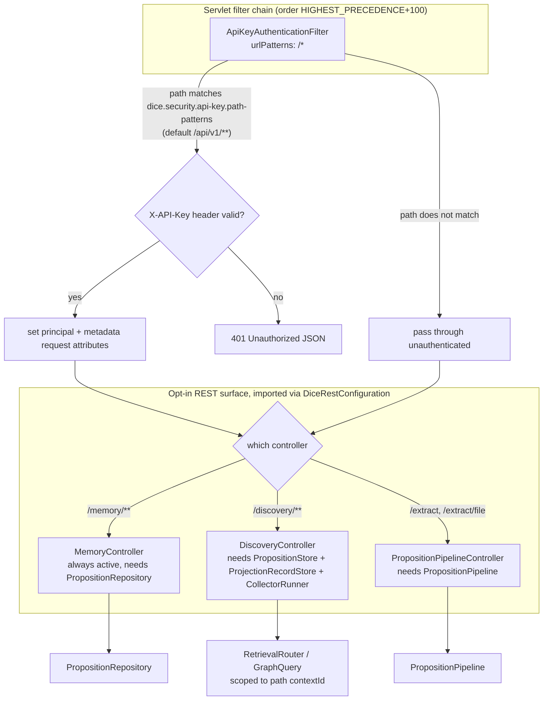
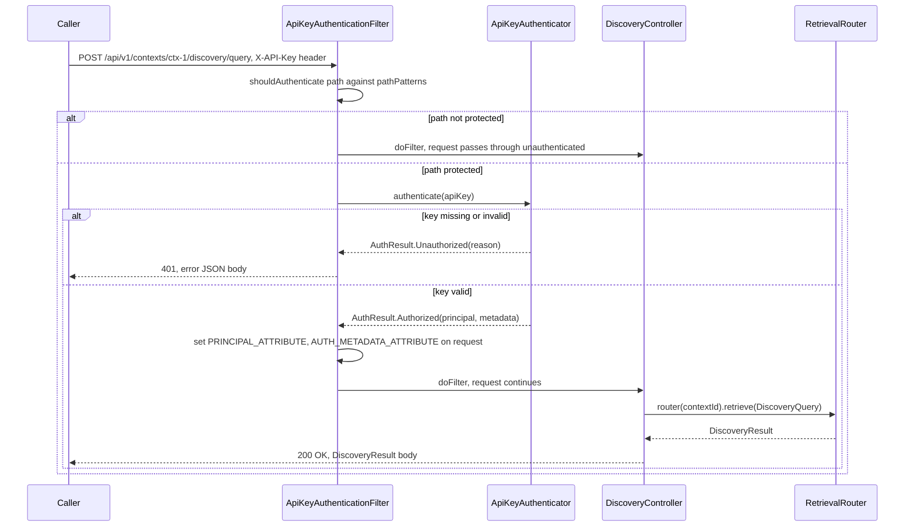

# Web API surface

DICE is a library, not a service — everything so far (extraction, storage, retrieval) is a Kotlin
API meant to be embedded. This note covers the one part that's meant to be called over HTTP: an
opt-in REST surface over the pipeline, memory, and discovery layers, gated by a single API-key
filter. The design goal is the same "opt-in, nothing by default" posture the rest of DICE uses —
a consuming app decides whether to expose HTTP at all, and decides how to authenticate it.

## Opt-in by import, not by classpath

None of the three controllers are component-scanned. They activate only when a consumer imports
`DiceRestConfiguration`, and even then each controller only registers if its required beans are
present — `@ConditionalOnBean` on `PropositionStore`/`ProjectionRecordStore`/`CollectorRunner` for
discovery, `PropositionPipeline` for extraction. `MemoryController` is the one exception: it has no
`@ConditionalOnBean` guard, so it activates whenever `DiceRestConfiguration` is imported and a
`PropositionRepository` bean exists (which any DICE consumer will have).

```java
@Configuration
@Import(DiceRestConfiguration.class)
public class MyAppConfiguration { }
```

The same pattern the agent-tools layer uses for opt-in tool registration — the controllers exist
in the jar but never intercept a request unless a consumer explicitly wires them in.



All three controllers hang off `com.embabel.dice.web.rest`. Every path starts with
`/api/v1/contexts/{contextId}/...` — the context always comes from the path variable, never from
the request body, so a caller can't smuggle a different context in through JSON and read or write
across a boundary they weren't given.

## API-key authentication

Auth is a plain servlet filter, not Spring Security — `ApiKeyAuthenticationFilter` extends
`OncePerRequestFilter` and is registered directly as a `FilterRegistrationBean`, so it works whether
or not the consumer has Spring Security on the classpath at all.



Key points:

- **Off by default.** `ApiKeySecurityAutoConfiguration` only activates on
  `dice.security.api-key.enabled=true`. With it off, none of the REST endpoints check anything —
  auth is the consuming app's responsibility if it doesn't opt in here.
- **Pluggable validator.** `ApiKeyAuthenticator` is an interface; `InMemoryApiKeyAuthenticator`
  (a `Set<String>` lookup) is the default and is meant for dev/test. Production should supply its
  own `ApiKeyAuthenticator` bean (`@ConditionalOnMissingBean` lets a consumer override it) backed
  by a real key store:

  ```kotlin
  @Configuration
  class MyApiKeyConfiguration {
      @Bean
      fun apiKeyAuthenticator(vaultClient: VaultClient): ApiKeyAuthenticator =
          object : ApiKeyAuthenticator {
              override fun authenticate(apiKey: String): AuthResult =
                  if (vaultClient.isValid(apiKey)) {
                      AuthResult.Authorized(principal = vaultClient.principalFor(apiKey))
                  } else {
                      AuthResult.Unauthorized("Invalid API key")
                  }
          }
  }
  ```

  A missing or invalid key gets back:

  ```json
  {"error": "Unauthorized", "message": "Missing API key header: X-API-Key"}
  ```
- **Path-scoped, not endpoint-scoped.** `pathPatterns` (default `["/api/v1/**"]`) decides which
  requests need a key at all; everything outside that prefix — actuator endpoints, a consumer's
  own controllers — passes straight through the filter untouched.
- **Principal flows via request attributes, not a `SecurityContext`.** A validated key sets
  `dice.auth.principal` and `dice.auth.metadata` as servlet request attributes
  (`ApiKeyAuthenticationFilter.PRINCIPAL_ATTRIBUTE` / `AUTH_METADATA_ATTRIBUTE`). Controllers don't
  currently read these — there's no per-key authorization narrowing (e.g. restricting a key to
  certain contexts) yet, just presence/absence of a valid key.
- **Config shape:**

  ```yaml
  dice:
    security:
      api-key:
        enabled: true
        keys: ["dev-key-123"]
        header-name: X-API-Key   # default
        path-patterns: ["/api/v1/**"]  # default
  ```

## Controllers

### `PropositionPipelineController` — run extraction over HTTP

`@RequestMapping("/api/v1/contexts/{contextId}")`, gated on a `PropositionPipeline` bean.

| Method | Path | Purpose |
|---|---|---|
| POST | `/extract` | Run the pipeline on raw text, persist and return propositions + entity/revision summary |
| POST | `/extract/file` (multipart) | Parse a file with Tika, chunk it, run each chunk through the pipeline, persist, return an aggregated summary |

`/extract/file` calls `propositionPipeline.process(chunks, context)` — the batch entry point, not
`processChunk()` per chunk — specifically because `process()` isolates a failing chunk into a typed
`Failed` result instead of letting one bad chunk 500 the whole upload, and it's the only path that
honors the configured extraction execution strategy (Serial/Parallel/Batched).

```bash
curl -X POST http://localhost:8080/api/v1/contexts/acme-corp/extract \
  -H "X-API-Key: dev-key-123" -H "Content-Type: application/json" \
  -d '{"text": "Acme acquired Globex in March.", "sourceId": "press-release-1"}'
```

```bash
curl -X POST http://localhost:8080/api/v1/contexts/acme-corp/extract/file \
  -H "X-API-Key: dev-key-123" \
  -F "file=@press-release.pdf" \
  -F "sourceId=press-release-1"
```

### `MemoryController` — read/write stored propositions directly

`@RequestMapping("/api/v1/contexts/{contextId}/memory")`, always active once
`DiceRestConfiguration` is imported (no `@ConditionalOnBean` guard beyond needing the repository).

| Method | Path | Purpose |
|---|---|---|
| GET | `/memory` | List propositions for a context, filterable by status/minConfidence/limit |
| POST | `/memory/search` | Similarity search, filtered post-hoc by context/status/confidence/mention type |
| GET | `/memory/entity/{entityType}/{entityId}` | Propositions mentioning a specific entity |
| POST | `/memory` | Create a proposition directly, bypassing extraction |
| GET | `/memory/{propositionId}` | Fetch one proposition (404 if it belongs to a different context) |
| DELETE | `/memory/{propositionId}` | Retract a proposition (marks `CONTRADICTED`, doesn't hard-delete) |

Every read that takes a `propositionId` checks `contextIdValue != contextId` and returns 404 rather
than 403 — the same "don't confirm existence of things outside your context" posture used
elsewhere in DICE.

```bash
curl http://localhost:8080/api/v1/contexts/acme-corp/memory?status=ACTIVE&limit=20 \
  -H "X-API-Key: dev-key-123"
```

### `DiscoveryController` — the retrieval and maintenance surface

`@RequestMapping("/api/v1/contexts/{contextId}/discovery")`, gated on
`PropositionStore` + `ProjectionRecordStore` + `CollectorRunner` beans. See
[retrieval-and-discovery.md](retrieval-and-discovery.md) for what `RetrievalRouter` and
`GraphQuery` do underneath — this controller is a thin, context-scoped wrapper over both.

| Method | Path | Purpose |
|---|---|---|
| POST | `/discovery/query` | Mode-routed retrieval (`DiscoveryQuery` body: mode/text/entity/window/topK/depth) |
| GET | `/discovery/path?from=&to=` | Leak-free path summary between two entities |
| GET | `/discovery/why/{propositionId}` | Lineage explanation for a stored fact (404 if unknown) |
| GET | `/discovery/projection-health` | Per-target projection lifecycle counts for this context |
| POST | `/discovery/collector/dry-run` | Preview what mark-and-sweep would do, without mutating anything |

Every operation builds its own `RetrievalRouter`/`GraphQuery` scoped to the path `contextId` — there
is no shared, unscoped router a handler could accidentally reuse across contexts. A blanket
`@ExceptionHandler(Exception::class)` turns any store/driver failure (timeouts, query errors) into
a fixed-message 500; the real cause is logged server-side only, so internal detail never reaches
the caller regardless of a consumer's own global error handling.

```bash
curl -X POST http://localhost:8080/api/v1/contexts/acme-corp/discovery/query \
  -H "X-API-Key: dev-key-123" -H "Content-Type: application/json" \
  -d '{"mode": "HYBRID", "text": "Globex acquisition", "topK": 10}'
```

## Design choices

- **Leak-free DTOs, not domain objects.** The discovery layer returns `*Dto` types
  (`DiscoveryResult`, `PathDto`, `LineageDto`, `ProjectionHealthDto`) rather than the internal
  `GraphNeighborhood`/`PropositionLineage` types — the REST boundary is a translation layer, same
  as the agent tools layer.
- **Auth is orthogonal to controller activation.** A controller can be active with the API-key
  filter disabled (open endpoints) or the filter can be enabled while a controller's own
  `@ConditionalOnBean` guard keeps it dark (404, not 401). The two opt-ins are independent knobs —
  check both when an endpoint doesn't behave as expected.
- Context scoping (path-only, never the body) is covered above under "Opt-in by import, not by
  classpath" and doesn't need repeating here.
