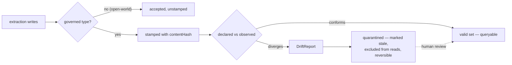

# DICE competitive positioning

Where DICE sits against the agent-memory field (Zep/Graphiti, Mem0, Letta, Cognee, Hindsight,
LangMem, Neo4j Agent Memory, and the three hyperscaler memory services), and which vocabulary to
borrow from enterprise data-governance tooling.

DICE differs from that field in one place: governance of the schema extraction runs against. No
surveyed competitor versions its extraction schema, compares a declaration against what a live
graph holds, or quarantines divergent records, and none has that work on a public roadmap.

Surveyed mid-2026. Several competitors publish roadmap posts in the register of release notes, so
re-verify anything here before it goes into a bakeoff or a deck.

## Delivery status

On main: the proposition model with confidence and decay, multi-strategy entity resolution, source
provenance (`ProvenanceEntry`), collector decision traces (`CollectorTraceStore`), the
`ConflictDetector` SPI, `SchemaAdherence` (STRICT/DEFAULT/RELAXED), declared types via
`SchemaRegistry`/`DataDictionary`, integer re-indexing of proposition IDs across LLM calls (GAP-6),
and the pluggable store family.

In the open PR train, unmerged as of this writing:

| PR | Contents |
|---|---|
| #83 | `dice-metamodel` core: `MetamodelVersion` (content-addressed stamp), `GovernedTypeSelector`, `DeclaredSchema`/`DeclaredSchemaSource`, `MetamodelVersionStore`, and `docs/design/metamodel-versioning.md` with the tier ladder |
| #84 | `DrivineMetamodelVersionStore`: Neo4j persistence, MERGE on natural key, per-schema monotonic sequence for write order |
| #85 | `ObservedSchema`/`ObservedSchemaSource`, `MetamodelDiff`/`MetamodelChange`, declared-vs-declared and declared-vs-observed differs |
| #86 | `DriftReport`/`DriftReportStore`, `DriftCheckRunner` (`dryRun` defaults true), quarantine contracts and `MentionTypeDriftQuarantinePolicy` |
| #87 | `DrivineDriftReportStore` and `DrivineObservedSchemaSource`, plus the end-to-end governance loop against a live Neo4j |
| #88 | `MetamodelAutoConfiguration`, activated by the presence of a `DeclaredSchemaSource` bean; `embabel.dice.metamodel.enabled` kill switch and `drift.mode` = `off` \| `observe` (default) \| `quarantine` |

Not built: an extraction-run identifier linking a stored claim to the run that produced it (issue
#67), versioned and audited conflict policies, incident routing for `DriftReport`, a bi-temporal
fact model, and temporal anchoring of relative dates.

The rest of this document describes the design across main and that train. This section is the
reference for where a given capability currently lives.

## What each competitor has

| System | Capabilities |
|---|---|
| **Zep / Graphiti** | Bi-temporal edges (`valid_from`/`valid_until` plus ingestion time), cross-session entity dedup, Leiden community clustering with summaries, custom entity types via Pydantic, five reranking strategies, SOC 2 on the managed offering. |
| **Mem0** | Single-pass ingestion (v3, April 2026, dropped the UPDATE/DELETE phases to cut latency), hybrid semantic + BM25 + entity-match retrieval, graph memory across Neo4j/Memgraph/Neptune/Kuzu, full SQLite change history, mentions counting. |
| **Letta (MemGPT)** | Agent-managed context with archival memory in Postgres/pgvector. The agent decides what to promote and how to resolve conflicts, via tool calls. No declared structure. |
| **Cognee** | LLM extraction into RDF triples with Pydantic validation, auto-generated ontology, custom-schema override. Validates shape per run; no stored version to compare a later run against. |
| **Hindsight** | Structured facts into a knowledge graph with entity resolution that links "Alice" to "my coworker Alice", and quality that compounds across sessions. |
| **LangMem** | Confidence-qualified, surprise-prioritised, SNR-shaped extraction prompts, gradient-style prompt optimisation, dilated-window retrieval. |
| **Google / AWS / Microsoft** | Fully managed, zero-infrastructure, IAM-scoped, framework-integrated. Flat fact strings underneath. |

Two of these exceed DICE's equivalents: Zep's bi-temporal model against DICE's system timestamps,
and Cognee's Pydantic validation, which is a declared-shape check at write time.

## Governance capabilities

| Capability | Zep | Mem0 | Letta | Cognee | Hindsight | DICE |
|---|---|---|---|---|---|---|
| Schema versioning | — | — | — | Pydantic override, unversioned | — | Content-hashed `MetamodelVersion` (#83) |
| Type hierarchy / ontology | Implicit (clustering) | — | — | RDF/RDFS, auto-generated | — | Declared `DataDictionary`, per-type governed (main + #83) |
| Source provenance | Bi-temporal timestamps only | — | — | — | — | `ProvenanceEntry` edges, append-only (main) |
| Extraction-run trace | — | — | — | — | — | None (issue #67) |
| Collector decision audit | — | Full SQLite change history | — | — | — | `CollectorTraceStore` (main) |
| Contradiction handling | Temporal windows, manual | ADD-only | Manual, agent-driven | Unclear | Unclear | `ConflictDetector` SPI, both claims retained (main) |
| Versioned / audited conflict policy | — | — | — | — | — | None |
| Drift detection (declared vs observed) | — | — | — | — | — | `DeclaredObservedDiffer`, `DriftCheckRunner` (#85, #86) |
| Drift quarantine | — | — | — | — | — | `DriftQuarantinePolicy`, STALE marking (#86) |

Caveats on that table. It is built from public documentation, so Zep and Cognee may have
unpublished lineage APIs. Mem0's change history records old value, new value, event and actor,
which is more than DICE records, and omits the schema the change was valid under. DICE's audit
trail is two separate mechanisms: `ProvenanceEntry` links a proposition to the source chunks it
came from, and `CollectorTraceStore` records why a collapse or merge decision was made. Neither
carries an extraction-run identifier, so there is no end-to-end "this claim came from that run
under that schema" trace (issue #67); the metamodel stamp is the piece that would complete it.

## Metamodel identity: content-addressed

Confluent Schema Registry and AWS Glue assign sequential version identity. Confluent uses a global
immutable integer schema ID plus a per-subject version number, Glue a per-schema version number
plus an opaque version ID. Registration is a stateful event: the same schema posted twice gets one
ID and one version because the registry remembers it.

DICE derives identity from content. `MetamodelVersion.contentHash` is a SHA-256 over the structural
fields (sorted type names, per-type labels and property signatures, sorted relationship
descriptors) with every token length-prefixed, so `["a;b"]` cannot collide with `["a", "b"]`. Three
consequences:

- **Registration is idempotent by construction.** `saveVersion` upserts on `(schemaName,
  contentHash)`, and a re-save of identical content lands on the same row. There is no sequence
  counter to get out of step across environments.
- **Schema is data.** A dev and a prod schema of identical shape hash identically and compare
  directly. In the registries the same schema under a different subject gets a different version
  number.
- **Stamps are portable.** A proposition carries `dice.metamodel.version` as metadata, so the
  schema a claim was extracted under travels with the claim and needs no registry lookup.

The second divergence is granularity. Both registries configure compatibility per subject: one mode
for the whole schema. DICE governs per type via `GovernedTypeSelector`, which lets one domain be
closed-world where it matters (`Person`, `Company`) and open-world elsewhere, so an exploratory type
the LLM invented leaves the version history unchanged.

DICE adopts the registries' compatibility vocabulary: BACKWARD, FORWARD, FULL and the transitive
variants are well-understood terms for what a compatibility check means. Glue's *checkpoint*, a
selectable reference point to compare against, is more expressive than transitive yes/no and is the
right model if governed types get release windows.

Both registries hard-reject an incompatible registration with HTTP 409 and no warn mode. DICE
accepts the write and records the divergence. Extraction is LLM-driven, and a type nobody declared
is often a real finding. A write-time rejection discards it with no review path; re-extraction
costs another LLM pass and does not reliably reproduce the same proposition. Quarantine keeps the
proposition out of reads and keeps it reviewable.

## Opt-in and drift: prior art from migration tooling

Patterns developers adopt:

- **`liquibase diff` / `diff-changelog`** compares declared (reference) against observed (target)
  and generates the changesets that would close the gap. A human decides whether to apply them or
  mark them as run.
- **`flyway validate`** checksums applied migrations against local ones and fails loudly on
  mismatch. It is bound to a build phase.
- **Hibernate `hbm2ddl.auto=validate`** checks only: fail on mismatch, change nothing.
  `hbm2ddl.auto=none` is the shipped default, so no schema management happens unasked.
- **`@Version` per entity** makes versioning an annotation on the entities you chose. Nothing is
  versioned by inference.

The pattern developers warn against is `hbm2ddl.auto=update`: uncontrolled schema evolution at
startup, silently creating columns and leaving zombies behind when a `@Column(name=...)` changes.

DICE follows the first set:

- Versioning activates on an application-supplied `DeclaredSchemaSource` bean. With no declared
  schema there is no versioning.
- Governance is per governed type via `GovernedTypeSelector`.
- The drift check reports the declared-vs-observed gap and leaves closing it to a human act, the
  way Liquibase generates changesets and applies none of them.
- Quarantine marks affected propositions STALE and leaves them stored and recoverable. `drift.mode`
  defaults to `observe`.

The failure mode all three tools share is opt-in fatigue: they require explicit configuration,
teams ship with defaults, and later have no drift visibility. DICE's mitigation is a one-bean
switch and an activation condition stated in the first paragraph of every governance doc page.

## Escalation vocabulary

OpenMetadata, DataHub, Great Expectations, Soda and the Open Data Contract Standard have converged
on one vocabulary. DICE uses these terms with their existing meanings.

| Term | Their meaning | DICE |
|---|---|---|
| **Drift** | Structural or statistical divergence over time | Declared metamodel versus what the graph holds |
| **Contract** | Declared structure + quality + ownership | `DeclaredSchema`: the governed types and their shape |
| **Assertion** | A comparison check fired on change | The declared-vs-observed comparison in the detect tier |
| **Policy** | Enforcement rule, configurable strictness | `SchemaAdherence` (STRICT/DEFAULT/RELAXED) and the `ConflictDetector` SPI |
| **Incident** | Raised on assertion failure, routed to an owner | `DriftReport`: the record a detection produces |
| **Quarantine** | Invalid records split off, the valid stream continues | Affected propositions marked STALE |

Their escalation ladder is observe → alert → block. DICE's three tiers map onto it:

| DICE tier | Their stage | What happens |
|---|---|---|
| Stamp and observe | Observe | Schema gets an identity; propositions carry the stamp |
| Detect and report | Alert | Compare declaration against declaration, and declaration against live graph; emit a `DriftReport` |
| Quarantine | Block (soft) | Mark affected propositions STALE. The valid set stays queryable; the suspect set is excluded and recoverable |

Quarantine partitions the write stream into a valid and a suspect set, and the pipeline continues,
which is the hybrid default the Spark and Soda world settled on. Fail-fast is the escalation for
when quality drops below a threshold.

Two decisions this vocabulary forces, both open:

- **Is quarantine a metadata flag or physical routing?** Enterprise tools do both. DICE's
  STALE-marking is a flag; whether reads exclude it by default is the open question.
- **Do we route incidents?** Their incident model assumes metadata ownership drives notification.
  DICE emits events and has no owner model, so a `DriftReport` has no routing destination today.

## Graph-native convergence: Neo4j GRAPH TYPE

Neo4j's GRAPH TYPE (preview, 2025) declares a schema once in Cypher DDL and enforces it at write
time, with SET/ADD/ALTER/DROP lifecycle commands and an Open variant that requires declared fields
while tolerating extras. TypeDB is stricter: nothing that fails to conform can be written, and
`redefine` checks existing instances before a migration commits. Store vendors are independently
concluding that a property graph needs a declared schema coupled to enforcement. The divergence is
where the governance sits.

DICE governs above the store:

- **Per context.** Governance scopes to a `contextId`, so one deployment can hold a governed tenant
  and an exploratory one. GRAPH TYPE is a property of the graph.
- **Open-world by default.** GRAPH TYPE and TypeDB reject undeclared types. DICE stores them as
  findings, and per-type governance is what keeps that safe. `SchemaAdherence` already takes this
  side of the trade at extraction time.
- **Quarantine on divergence.** Write-time enforcement loses a non-conforming extraction. DICE
  stores it, flags it, and leaves it reviewable.
- **Backend-independent.** DICE's schema lives in `SchemaRegistry`/`DataDictionary`, outside the
  database, so the same governance applies across in-memory, Neo4j, or a later backend. Adopting
  GRAPH TYPE would move it into the store.

The cost of governing above the store is that the schema is application-enforced, so it can drift
if some entry point skips validation. Neo4j's is enforced by the database.

SHACL validation reports are the prior art for `DriftReport`, and the only standardised
violation-report format in this space: a conformance flag at the root, one result node per
violation, each carrying the focus node, the failed constraint, severity, and a human-readable
message. `DriftReport` follows that structure. SHACL serialises as RDF graphs, which
`DriftReport` does not adopt, so its consumers need no RDF parser. PG-Schema and ProGS are the
property-graph analogues and are worth watching; neither has a canonical report format to borrow.

## Adopted, rejected, unique

| | Adopt | Reject | Unique to DICE |
|---|---|---|---|
| **Schema registries** (Confluent, Glue) | BACKWARD/FORWARD/FULL vocabulary; Glue's checkpoint; idempotent registration | Sequential version IDs; flat per-subject compatibility; hard-reject on incompatible registration | Content-addressed identity; per-type governed selection; the stamp travelling with the data |
| **Migration & ORM** (Liquibase, Flyway, Hibernate) | Declared-vs-observed diff that reports; validate-mode; per-entity `@Version` opt-in | `hbm2ddl.auto=update` auto-mutation; anything that changes a schema at startup | Drift detection over LLM-extracted knowledge, where the observed side is a graph nobody wrote by hand |
| **Data governance** (DataHub, Soda, ODCS) | drift / contract / assertion / policy / incident / quarantine, verbatim; observe→alert→block; valid/invalid split | Blocking at the producer boundary by default; contract YAML as the primary authoring surface | Governance over probabilistic extraction: confidence-weighted claims |
| **Graph schema** (Neo4j GRAPH TYPE, TypeDB, SHACL) | SHACL's validation-report structure; GRAPH TYPE's Open variant semantics | Write-time rejection; RDF as a wire format; store-coupled schema declaration | Governance that is per context, tolerates open-world types, and is backend-independent |
| **Agent memory** (Zep, Mem0, Cognee, LangMem) | Zep's bi-temporal model (GAP-4B), ahead of DICE's system timestamps; Mem0's change-history record of old value / new value / event / actor; Cognee's declared-shape validation | ADD-only ingestion; hard delete on contradiction; opaque LLM consolidation | Source provenance, collector traces, governed metamodel versioning, drift quarantine, versioned conflict policy |

## Per-competitor detail

### vs Zep/Graphiti

| Dimension | DICE | Zep |
|---|---|---|
| Ingestion | Batch classify + auto-merge + canonical dedup | Sequential only ("must be awaited") |
| Classification | 5-way with edge cases + few-shot | Duplicate vs contradicted (binary) |
| Confidence model | Exponential decay + outcome-dependent adjustment + reinforceCount | No decay, no confidence scoring |
| Extraction quality | SNR, confidence-qualified, role-aware, schema-bound | Custom entity types via Pydantic, entity validation |
| Temporal model | System timestamps only (created/revised) | Bi-temporal (valid_at/invalid_at/expired_at) |
| Graph structure | Propositions + entity mentions, no graph DB required | Full knowledge graph in Neo4j with community detection |
| Retrieval | Vector similarity + canonical match | Cosine + BM25 + BFS + 5 rerankers |
| Schema governance | Content-hashed metamodel versions, per-type opt-in | Entity types are code, unversioned |
| Infrastructure | Embeddable, JVM-native, no external deps | Neo4j + embedding service + LLM |

Zep is Python and Go only. Its audit story is SOC 2 on the managed service, an org-level control
with no data-lineage API. The temporal difference is GAP-4B.

### vs Mem0

| Dimension | DICE | Mem0 |
|---|---|---|
| Classification | 5-way taxonomy with edge-case guidance | v3 is ADD-only; supersession and contradiction are inexpressible |
| Dedup pipeline | Canonical + auto-merge + batch LLM | Entity linking at retrieval time |
| Ingestion latency | Batch LLM call per chunk | Single-pass, deliberately minimal |
| Confidence model | Decay + outcome adjustment + qualification at extraction | None |
| ID safety | Integer re-indexing prevents hallucination | Integer re-indexing prevents hallucination |
| Graph memory | Entity mentions + Neo4j projection | Neo4j/Memgraph/Neptune/Kuzu |
| Audit trail | Source provenance + collector decision traces, no run-level trace | Full SQLite history (old/new/event/actor) |
| Schema governance | Governed metamodel versions | None |

Mem0 also has vision and procedural memory for agent traces, and the lowest ingestion latency in
the field. Its v3 traded expressiveness for speed: ADD-only means contradictions accumulate
unresolved with no supersession semantics. Its change history records what changed and omits the
schema the change was valid under.

### vs Cognee

| Dimension | DICE | Cognee |
|---|---|---|
| Declared shape | `DataDictionary` + `SchemaAdherence` (STRICT/DEFAULT/RELAXED) | Pydantic models, optionally overriding an auto-generated ontology |
| Schema versioning | Content-hashed, stored, comparable | Validation is per-run |
| Ontology | Declared types and relationships | RDF/RDFS triples, auto-generated from the corpus |
| Validation failure handling | Adherence policy; non-conforming extraction retained and flaggable | Pydantic rejects the shape; no error feedback loop |
| Provenance | `ProvenanceEntry` edges to source chunks | Not documented |

Cognee is the only surveyed competitor with a declared-schema check at write time, and its
auto-generated ontology lowers setup cost. Changing the Pydantic model tells you nothing about
which previously-stored data no longer conforms, which is what the detect tier addresses.

### vs Letta (MemGPT) and Hindsight

Letta has no schema: core memory managed by the LLM, archival memory as pgvector passages,
conflicts resolved by the agent through tool calls, consolidation agent-driven. There is no
governance surface to compare against.

Hindsight structures facts into a graph with entity resolution good enough to link "Alice" to "my
coworker Alice", and improves across sessions. Smaller product surface than the incumbents, with no
documented temporal invalidation or contradiction framework. The entity-resolution quality is the
part worth re-checking.

### vs the managed services (Google, AWS, Microsoft)

All three share a shape: a flat fact string, opaque LLM consolidation, hard delete on
contradiction, no entity model, no confidence, no provenance, vendor lock-in, zero infrastructure,
native IAM.

| Dimension | DICE | Google Memory Bank | AWS AgentCore | Microsoft Foundry |
|---|---|---|---|---|
| Data model | Structured `Proposition` | Flat `fact` string | Flat `{"fact": "..."}` | Flat memory "items" |
| Memory types | `KnowledgeType` classifier | Managed + custom topics | Strategy-scoped | Profile + chat summary only |
| Confidence/decay | Decay + outcome adjustment | None | None | None |
| Entity resolution | Multi-strategy + LLM disambiguation | None | None | None |
| Contradiction | Both retained, reduced confidence | Old deleted | New entry, no detection | Old value discarded |
| Provenance | `ProvenanceEntry` to source chunks | None | None | None |
| Governance | Metamodel versioning, drift checking | None | None | None |
| Hosting | Self-hosted | Fully managed | Fully managed | Fully managed |
| Scale limits | Application-determined | Not published | Not published | 100 scopes, 10K memories/scope |

The open question these raise is whether DICE eventually wants a managed offering.

### vs Neo4j Agent Memory

| Dimension | DICE | Neo4j Agent Memory |
|---|---|---|
| Classification | 5-way with edge cases + few-shot | No taxonomy; entity resolution handles dedup |
| Batch processing | N propositions in 1 LLM call | Sequential cascade stages |
| Confidence/decay | Decay + outcome adjustment + reinforceCount | None |
| Contradiction | Both retained with reduced confidence | Merged or left distinct |
| Extraction pipeline | Single LLM call, SNR-maximising | spaCy → GLiNER → LLM cascade |
| Graph structure | Propositions + mentions, Neo4j as projection | Native graph with POLE+O ontology |
| Temporal model | System timestamps only | valid_from/valid_until + geospatial |
| Retrieval | Vector + canonical + entity + composable query | Hybrid vector + up to 3-hop traversal |
| Schema enforcement | Application-layer, per context, with quarantine | Store-level GRAPH TYPE enforcement |
| Infrastructure | Embeddable, no external deps | Neo4j 5.11+ plus spaCy/GLiNER models |

The division is proposition-centric against entity-centric: DICE manages the lifecycle of claims,
Neo4j builds a graph of entities. Their store-level schema bet is enforced by the database and
scoped to it; DICE's substrate-level bet applies across backends.

## Convergent mechanisms

Places where DICE and a surveyed system reached the same solution to the same problem. They are
tracked here so the gaps section stays about capabilities DICE lacks.

- **LLM extraction into a structured store.** All four surveyed memory services take a conversation
  turn, run an LLM extraction, and persist the result into a vector, graph or relational store
  (brief 15, from https://rywalker.com/research/langmem,
  https://cloud.google.com/blog/products/ai-machine-learning/vertex-ai-memory-bank-in-public-preview
  2025-07-08, https://docs.aws.amazon.com/bedrock-agentcore/latest/devguide/memory.html,
  https://neo4j.com/labs/agent-memory/). DICE's pipeline has the same shape with the proposition as
  the stored unit.
- **Decay and consolidation ahead of hard deletion.** DICE decays effective confidence over time
  and retires softly to STALE (`DecaySweepPass`, dual-threshold hysteresis 0.1/0.25). AWS and
  Google merge or supersede through consolidation, Neo4j tracks temporal fact validity, LangMem
  consolidates to suppress duplication. No surveyed system documents a hard TTL delete.
- **Integer re-indexing of proposition IDs across LLM calls.** DICE (GAP-6, on main) and Mem0 both
  renumber IDs per call so the model cannot invent one.
- **Confidence-qualified, SNR-shaped extraction prompts.** DICE and LangMem settled on the same
  prompt controls independently (https://rywalker.com/research/langmem).
- **A declared schema coupled to enforcement.** Neo4j GRAPH TYPE, TypeDB and DICE's metamodel work
  are three independent arrivals at the same conclusion; the divergence is where the governance
  sits, covered above.

Where a converged mechanism is implemented better elsewhere: Zep's bi-temporal edges against DICE's
system timestamps, Mem0's change history (old value, new value, event, actor) against DICE's
collector traces, and Cognee's Pydantic check as a write-time declared-shape validation. Each is
cited in the section that covers that competitor.

## Remaining gaps

The focus-first items, ranked by prevalence across the four surveyed memory services (LangMem,
Vertex AI Memory Bank, Bedrock AgentCore Memory, Neo4j Agent Memory) — a capability all four ship
outranks one vendor's experiment.

**1. Operational tooling and memory inspection.** All four ship an inspection surface; DICE has
none. Bedrock AgentCore emits CloudWatch metrics for latency, invocations, errors and memory
creation count, with spans over CreateEvent, GetEvent, ListEvents, DeleteEvent and
RetrieveMemoryRecords, plus extraction and consolidation logs
(https://docs.aws.amazon.com/bedrock-agentcore/latest/devguide/observability-memory-metrics.html).
Vertex AI Memory Bank lists stored memories in the Cloud Console (Memory Bank UI announcement,
Google Developer Forums; brief 15 records the citation without a URL). Neo4j's NAMS dashboard shows
health, entity count and queue lag with interactive graph visualisation and Cypher queryability
(https://medium.com/neo4j/a-tour-of-the-neo4j-agent-memory-service-nams-0f2d535a4fdb, 2026-06;
brief 15 lists GA status as unconfirmed). LangSmith traces execution paths and state transitions
with cost/latency/error dashboards and human-in-the-loop inspection
(langchain.com/resources/llm-observability-tools, cited by brief 15). In DICE, "why was this
proposition formed" needs custom logging over `CollectorTraceStore`.

**2. Background memory formation and consolidation pipelines.** All four run formation off the
request path. AWS runs extraction then consolidation as background processes with start/completion
and success counts in the logs (observability-memory-metrics.html). Google's extraction is
asynchronous, ingested via `add_memory()` or an end-of-conversation callback
(https://cloud.google.com/blog/products/ai-machine-learning/vertex-ai-memory-bank-in-public-preview,
2025-07-08). LangMem offers hot-path tools or background managers
(https://rywalker.com/research/langmem). Neo4j runs background enrichment (Wikipedia, Diffbot) and
a multi-stage extraction cascade (https://neo4j.com/labs/agent-memory/). DICE has an async
`@EventListener` on conversation analysis and a non-blocking `PropositionIncrementalAnalyzer`, with
consolidation available as passes an application invokes. The managed pipeline that schedules them
is missing.

**3. TTL and eviction controls.** Decay itself is convergent (above); the gap is a retention policy
an operator can set, where DICE's decay constant and sweep thresholds are code-level configuration
(README:103-108). No surveyed system publishes a TTL API either: AWS and Google document no
expiration policy, Neo4j relies on temporal validity, LangMem on consolidation. Brief 15 lists the
AWS TTL knob and the Google retention policy as unverified, so this item rests on weaker evidence
than the two above it.

**4. Procedural memory.** Two of the four ship it. LangMem has a `procedural` memory type where
agents update their own prompt rules from feedback (https://rywalker.com/research/langmem). Neo4j
stores tool usage and reasoning traces with similarity search over trace lineage
(https://neo4j.com/labs/agent-memory/). AWS and Google extract facts only. DICE projects
propositions into Prolog as a view layer and has no rule-formation path.

**5. Namespacing and scoping APIs.** Two of the four expose one. AWS uses hierarchical namespaces
for fine-grained access control plus protocol session headers (`Mcp-Session-Id`,
`X-Amzn-Bedrock-AgentCore-Runtime-Session-Id`)
(https://docs.aws.amazon.com/bedrock-agentcore/latest/devguide/memory.html). Neo4j chains
`(Message)` nodes by `[:NEXT]` per session with entity and fact nodes shared across sessions
(https://neo4j.com/labs/agent-memory/). Google scopes by identity and LangMem by embedding space,
neither with a namespace API. DICE's `ContextId` is a query filter over shared storage
(README:1241-1270), so it isolates reads and not the storage layer.

**6. Cross-session profile modeling.** All four aggregate across sessions, none publishes a profile
schema. AWS extracts user preferences, facts and session summaries across sessions; Google
personalises long-term memories per user
(https://cloud.google.com/blog/products/ai-machine-learning/vertex-ai-memory-bank-in-public-preview,
2025-07-08); Neo4j persists preference and fact entities in a shared graph
(https://neo4j.com/labs/agent-memory/); LangMem keeps preferences in semantic memory with optional
typed Pydantic profiles (https://rywalker.com/research/langmem). DICE's `ContextId` scopes
knowledge and defines no profile structure or cross-session aggregation.

Gaps DICE already tracks:

- No extraction-run identifier, so a stored claim cannot be traced to the run and schema that
  produced it (issue #67).
- No bi-temporal model (GAP-4B): system timestamps only, so no point-in-time query and no temporal
  contradiction resolution.
- No temporal anchoring (GAP-4A): relative dates are stored as literal text.
- No surprise-prioritised retention (GAP-2): novel facts get no durability preference.
- No incident routing for `DriftReport`. DICE emits events and has no owner model.
- Conflict policy has no versioning or audit trail.

## Candidate modules

The capabilities the managed services hold over DICE sit above the proposition substrate and
consume it, so each is a module or add-on rather than a change to the substrate.

**Governed working memory.** ArcMem is an activation-ranked working-memory system built on DICE
APIs, and is the existing proof that this layer works over the substrate. It keeps a bounded active
set (20 units plus a token budget) in a protected prompt region, ranks units by an activation score blending recency,
reinforcement and decay, protects units by authority level (PROVISIONAL → UNRELIABLE → RELIABLE →
CANON) from automatic demotion, reinforces on access by anchoring decay at `max(contentRevised,
lastAccessed)`, and evicts into durable storage so evicted material stays queryable. Its gate order
is confidence → deduplication → conflict → trust → promotion → budget enforcement, and changing the
order changes the semantics. It consumes DICE's storage, extraction, decay and revision as
primitives (brief 17). A DICE-native module needs five SPIs ArcMem hand-rolls today:

- activation ranking as a pluggable policy — ArcMem uses hand-tuned parameters and a fixed rank
  clamp of [100, 900];
- authority and trust levels with the promotion gate;
- pinning and protection for the resident set;
- per-turn lifecycle events for reinforce, evict and reactivate;
- batched or concurrent extraction — `PropositionPipeline.process()` is serial and consumers batch
  by hand.

Which of these belong in DICE and which in the consuming application is unsettled (brief 17,
Risks), and entity resolution has to stay serial where shared identity is involved.

**Session memory management.** In DICE today: `MemoryProjector` classifies propositions by
knowledge type for prompt injection
(`dice/src/main/kotlin/com/embabel/dice/projection/memory/MemoryProjector.kt:46`), and the `Memory`
tool runs hybrid vector plus keyword retrieval over context-scoped propositions
(`dice/src/main/kotlin/com/embabel/dice/agent/Memory.kt:112`). A module would add session-scoped
active-context assembly and summarisation over those two.

**Background consolidation.** In DICE today: consolidation passes including
`ContradictionResolutionPass` and `DecaySweepPass`, plus async event listeners on analysis. A module
would add the scheduler, the extraction-then-consolidation staging AWS and Google run, and the
lifecycle logging that makes a run inspectable.

**Procedural memory.** In DICE today: Prolog projection over propositions as a view layer. A module
would add the formation path — turning agent feedback into stored rules that later runs read back.

## Orthogonal research

DICE's proposition extraction sits in the lineage of general user modeling: "Creating General User
Models from Computer Use" (Shaikh, Sapkota, Rizvi, Horvitz, Park, Yang, Bernstein; arXiv:2505.10831,
UIST 2025, ACM DOI 10.1145/3746059.3747722), cited in the README for the confidence-weighted
proposition and the exponential decay formula. That is user-modeling research rather than agent
memory. Scanning adjacent non-LLM fields for mechanisms is standing practice here, and these map
onto problems DICE already has:

| Field | Mechanism | DICE analog | Citation |
|---|---|---|---|
| Truth maintenance (TMS/ATMS) | Justifications record why a belief holds; retracting a premise un-derives its dependents; ATMS labels a node with the assumption sets that support it | `ContradictionResolutionPass` retires the weaker of a contradictory pair to CONTRADICTED by comparing `effectiveConfidence()`, with no dependency record | Doyle, "A Truth Maintenance System," *Artificial Intelligence* 12(3), 1979; de Kleer, "An Assumption-Based TMS," *Artificial Intelligence* 28, 1986 |
| AGM belief revision | Revision and contraction obey minimal-change postulates over a selection function | Confidence adjustments (contradicted +0.15, merged ×0.7, reinforced ×0.85) are hand-tuned constants | Alchourrón, Gärdenfors, Makinson, "On the Logic of Theory Change," *J. Symbolic Logic* 50, 1985 |
| Provenance semirings | Provenance of a derived fact is a semiring expression over source tokens, composed under the query's + and × operators | `ProvenanceEntry` is a flat per-proposition list with no algebra for merge or abstraction | Green, Karvounarakis, Tannen, "Provenance Semirings," PODS 2007, DOI 10.1145/1265530.1265535 |
| Bitemporal databases | Valid time and transaction time as orthogonal axes, with defined as-of and point-in-time queries | `TemporalMetadata` carries `observedAt`/`validFrom`/`validTo`/`invalidatedAt` and no transaction-time axis (GAP-4B) | Snodgrass, *Developing Time-Oriented Database Applications in SQL*, Morgan Kaufmann, 1999 |
| Record linkage | Fellegi-Sunter match decisions from per-field m/u agreement probabilities against a likelihood-ratio threshold | Entity resolution uses fuzzy, vector, exact, partial and agentic searchers with LLM disambiguation | Fellegi, Sunter, "A Theory for Record Linkage," *JASA* 64, 1969, DOI 10.1080/01621459.1969.10501049 |
| ACT-R declarative memory | Base-level activation `B_i = ln(Σ_j t_j^-d)` folds recency and frequency into one retrieval score | `effectiveConfidence()` decays on recency alone; `reinforceCount` sits outside the decay maths — the same two signals a working-memory module needs to rank on | Anderson & Schooler, "Reflections of the Environment in Memory," *Psychological Science* 2, 1991 |
| Argumentation frameworks | Arguments plus an attack relation; admissible, preferred and grounded semantics decide which sets survive collectively | `ContradictionResolutionPass` is pairwise strongest-wins, with pinned propositions branched out into a review event | Dung, "On the Acceptability of Arguments...," *Artificial Intelligence* 77(2), 1995 |

The three strongest borrowing opportunities, per brief 16:

- **ATMS justification tracking, to make CONTRADICTED reversible.** The status flip today is driven
  by a confidence comparison at classification time and records no reason for the loss. A
  justification set per proposition lets retracting the evidence un-derive the dependent status,
  without a fresh classification pass.
- **ACT-R base-level activation, to unify `reinforceCount` and decay.** Both signals exist and never
  combine. The activation equation is a closed form for the ranking score a working-memory module
  needs and for decay that counts frequency of use.
- **Semiring-formalised provenance composition.** Treating auto-merge as the union-like operator and
  abstraction synthesis (which requires all its sources) as the product-like one gives one queryable
  answer to "what composed this fact" across both, in place of per-pass list splicing.

AGM and Fellegi-Sunter are weaker fits: AGM's postulates are about logical theories rather than
graded beliefs and are useful as a checklist, and LLM disambiguation already covers what
Fellegi-Sunter scoring would buy. The first two opportunities touch `Proposition.kt` and
`ContradictionResolutionPass.kt`, which consolidation passes, storage projection and retrieval
ranking all depend on.

## Out of scope

- **Zep's 5-reranker retrieval.** Deep feature tied to Neo4j traversal. Bi-temporal is the better
  investment.
- **LangMem's prompt optimisation.** Orthogonal to memory quality.
- **Mem0's separate graph pipeline.** DICE has entity mentions plus Neo4j projection.
- **Google's multimodal extraction.** The proposition model is format-agnostic; add on demand.
- **AWS's episodic reflection.** The abstraction pipeline already synthesises across propositions.
- **Neo4j's POLE+O ontology.** Domain-specific subtypes; the proposition model is domain-agnostic.
- **Neo4j's spaCy → GLiNER → LLM cascade.** Cost-effective and operationally heavy (model
  downloads, dependency management).
- **Contract YAML as the authoring surface.** DICE's declared schema is a JVM type an application
  owns; a YAML dialect would be a second source of truth.
- **Write-time rejection of undeclared types.** It discards an extraction with no review path, and
  re-extraction costs another LLM pass without reliably reproducing the same proposition.
- **Managed hosting.** The embeddable library is the shipped distribution model.
