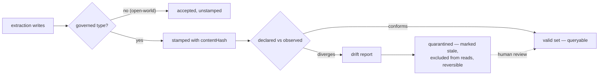

# DICE competitive positioning

What DICE is, and where that puts it against the agent-memory field: Zep/Graphiti, Mem0, Letta,
Cognee, Hindsight, LangMem, Neo4j's agent-memory offerings, and the three hyperscaler memory
services. The last sections cover vocabulary and mechanisms DICE takes from enterprise
data-governance and database tooling.

Surveyed mid-2026. Several of these systems publish roadmap posts in the register of release notes,
so re-verify anything here before it goes into a bakeoff or a deck.

## What DICE is

DICE is a proposition-first knowledge substrate. Heterogeneous artifacts — conversation, documents,
feeds, files — become durable propositions: confidence-weighted natural language statements with
typed entity mentions. Task-specific projections derive from them: a Neo4j graph, a Prolog fact
base, vector embeddings, agent working memory, reports. The proposition is the system of record.

A proposition is an epistemic object. It carries:

- **confidence** and **importance**, each a `ZeroToOne`;
- **decay** — effective confidence falls exponentially with age, anchored at
  `max(contentRevised, lastAccessed)`, so an unused claim loses standing without being deleted
  (`Proposition.kt:358-403`);
- **a status lifecycle** — ACTIVE, SUPERSEDED, CONTRADICTED, PROMOTED, STALE, with revival from
  STALE on reinforcement (`Proposition.kt:31-54`);
- **grounding** — `DerivedFrom` edges to the source chunks the claim was extracted from;
- **provenance entries** — typed source locator, chunk, offsets and content hash, append-only
  (`ProvenanceEntry.kt:18-52`);
- **reinforceCount** — how often the claim has been re-observed.

The confidence-weighted proposition and the exponential decay formula come from general user
modeling: "Creating General User Models from Computer Use" (Shaikh, Sapkota, Rizvi, Horvitz, Park,
Yang, Bernstein; arXiv:2505.10831, UIST 2025, ACM DOI 10.1145/3746059.3747722), cited in the README
beside the decay maths. That is user-modeling research rather than agent memory.

## The substrate compared

Each system's unit of knowledge, and what that unit carries.

| System | Unit of knowledge | What the unit carries |
|---|---|---|
| **Zep / Graphiti** | Episodes ingested into a temporal knowledge graph of entity nodes and edges | Bi-temporal edges: `valid_from`/`valid_until` for world time plus ingestion time; entity and edge attributes typed by Pydantic models; cross-session entity dedup |
| **Mem0** | Extracted facts — short natural language strings | Full SQLite change history (old value, new value, event, actor), mention counts. No confidence |
| **Letta (MemGPT)** | Memory blocks in core context (label, value, limit, description) and archival passages in Postgres/pgvector | Free text. The agent decides promotion and conflict resolution through tool calls |
| **Cognee** | LLM-extracted nodes and RDF triples | An `ontology_valid` flag from matching against a declared OWL/RDF ontology. No confidence or decay |
| **Neo4j agent-memory (labs SDK, NAMS)** | Entity and fact nodes, plus `(Message)` nodes chained by `[:NEXT]` per session | POLE+O typing, `valid_from`/`valid_until`, geospatial attributes |
| **LangMem** | Semantic, episodic and procedural memory items | Optional typed Pydantic profiles; consolidation state |
| **Hindsight** | Structured facts in a knowledge graph | Entity resolution that links "Alice" to "my coworker Alice" |
| **Google / AWS / Microsoft** | Extracted memories as flat fact strings or items | A strategy or topic label and an IAM scope |
| **DICE** | Proposition | Confidence, importance, decay, status lifecycle, grounding, provenance entries, reinforce count |

Three of these carry something DICE's proposition does not.

- **Zep's bi-temporal model** separates when a fact was true in the world from when the system
  learned it. DICE stores system timestamps only, so it cannot express that split.
- **Cognee's ontology grounding** resolves extracted entity and type names against a declared
  OWL/RDF ontology, with fuzzy matching, before any graph node is built
  (docs.cognee.ai/core-concepts/ontologies). DICE declares types in a `DataDictionary` and applies
  them at extraction, without resolution against a stored ontology.
- **Mem0's change history** records old value, new value, event and actor per change. DICE's
  `CollectorTraceStore` records why a collapse or merge decision was made and `ProvenanceEntry`
  records where a claim came from; neither carries an extraction-run identifier, so there is no
  end-to-end trace from a stored claim back to the run that produced it.

## Projections

DICE projects one proposition set into several representations: a Neo4j property graph and a Prolog
fact base (`dice-storage`), vector embeddings, agent working memory (`MemoryProjector`), rationale
and structured reports (`dice-report`), and lineage. Each derives from the propositions and can be
rebuilt from them; adding a representation means adding a projector, and the propositions are
unchanged.

Where the surveyed systems put their knowledge:

- **Zep / Graphiti** — a Neo4j property graph, with Leiden community clustering and summaries over
  it; retrieval is cosine plus BM25 plus BFS with five reranking strategies.
- **Mem0** — a vector store, plus a separate graph pipeline over Neo4j, Memgraph, Neptune or Kuzu
  fed by its own extraction path.
- **Letta** — pgvector passages, retrieved by the agent through tool calls.
- **Cognee** — an RDF-grounded graph plus embeddings; search returns nodes.
- **Neo4j agent-memory** — a native property graph; retrieval is hybrid vector plus up to 3-hop
  traversal.
- **LangMem** — embedding space, with dilated-window retrieval.
- **Google / AWS / Microsoft** — similarity search over stored memories, with no exposed
  intermediate model.

For each of those, the store is the knowledge model, so a new representation means a new extraction
path or a migration. Mem0's separate graph pipeline is the field's closest analogue to a second
projection, and it re-extracts rather than deriving from the facts already stored.

## Knowledge hygiene

DICE treats hygiene as three interventions at three moments — what is let in, what is reclaimed,
what is consolidated between sessions (`docs/design/knowledge-hygiene.md`).

- **Admission.** Gates run at extraction: confidence qualification, deduplication against canonical
  and stored propositions, conflict classification, trust scoring. The reason to gate at admission
  rather than clean up afterwards is cost and clarity.
- **Reclamation.** `DecaySweepPass` retires softly to STALE and never hard-deletes, with
  dual-threshold hysteresis — stale below 0.1 effective confidence, recovery edge at 0.25. Revival
  is never sweep-driven; it happens on reinforcement.
- **Consolidation.** Between-session passes: `ContradictionResolutionPass` retires the weaker of a
  contradictory pair to CONTRADICTED, auto-merge collapses duplicates, abstraction synthesises
  higher-level propositions from groups.

Background consolidation is convergent. Bedrock AgentCore runs extraction then consolidation as
background processes, with start and completion marks and success counts in the logs
(https://docs.aws.amazon.com/bedrock-agentcore/latest/devguide/observability-memory-metrics.html).
Vertex AI Memory Bank extracts asynchronously, ingested via `add_memory()` or an end-of-conversation
callback
(https://cloud.google.com/blog/products/ai-machine-learning/vertex-ai-memory-bank-in-public-preview,
2025-07-08). LangMem offers hot-path tools or background managers
(https://rywalker.com/research/langmem). Neo4j runs background enrichment and a multi-stage
extraction cascade (https://neo4j.com/labs/agent-memory/). No surveyed system documents a hard TTL
delete: decay, supersession and consolidation are the industry's answer as well as DICE's.

Two hygiene mechanisms are absent from the surveyed field: a lifecycle status on the stored unit,
and a retirement path that keeps the retired unit. Vertex AI Memory Bank deletes the superseded
memory on contradiction; Microsoft Foundry discards the old value; Bedrock AgentCore writes a new
entry with no contradiction detection; Mem0 v3 (April 2026) is ADD-only, so supersession and
contradiction are inexpressible in the model. Cognee keeps its non-conforming nodes, but they are
"stored, embedded, and returned by search exactly like grounded ones"
(docs.cognee.ai/core-concepts/ontologies), so the flag has no effect on reads.

## Schema governance

Declaring a schema for extraction is common in this field, and what happens to the declaration
varies.

- **Graphiti** takes Pydantic entity and edge models and a `set_ontology` API with a
  `strict_ontology` flag, and validates: "Each entity is validated against the appropriate Pydantic
  model" before graph construction
  (https://help.getzep.com/graphiti/core-concepts/custom-entity-and-edge-types).
- **Cognee** takes an OWL/RDF ontology file and checks extracted entities and types against it
  before any graph nodes are built, then keeps what does not match, tagged `ontology_valid=False`:
  "Nothing is rejected or discarded" (https://docs.cognee.ai/core-concepts/ontologies).
- **Neo4j's labs agent-memory SDK and NAMS** take a `DomainSchema` of entity types and descriptions.
  It steers GLiNER extraction; no validation, versioning or rejection is documented
  (https://neo4j.com/labs/agent-memory/faq/).
- **Bedrock AgentCore** gives full output-schema control only in the self-managed strategy;
  built-in and overridden strategies "do not let you change the final output schema"
  (https://docs.aws.amazon.com/bedrock-agentcore/latest/devguide/memory-custom-strategy.html).
- **Vertex AI Memory Bank's "custom topics"** and **Mem0's "custom categories"** are a label plus
  free-text instructions inserted into the extraction prompt, with few-shot examples recommended —
  prompt text rather than enforced types
  (https://cloud.google.com/agent-builder/agent-engine/memory-bank/generate-memories;
  https://docs.mem0.ai/open-source/features/custom-fact-extraction-prompt).
- **Letta** has no typed extraction schema: memory blocks are free-text segments.

The strongest enforcement in reach is a general-purpose database feature. Neo4j **GRAPH TYPE**, a
Cypher 25 preview in Neo4j 2026.02 across Enterprise Edition, Infinigraph Edition and all Aura
tiers, declares nodes, labels and relationship connections with `SET`/`ADD`/`ALTER`/`DROP`, and
hard-rejects a non-conforming write at write time
(https://neo4j.com/blog/developer/graph-type-schema-enforcement-made-easy-preview/). GRAPH TYPE is
not part of Neo4j's agent-memory product and is not wired into it; `DomainSchema` there remains
unenforced extraction guidance. `SHOW CURRENT GRAPH TYPE` returns the declaration, with no
comparison against what the graph holds.

Two capabilities are absent from every system surveyed. Neither gives an extraction schema a version
identity or history — Graphiti's docs describe evolution by adding attributes with no version
numbers, and GRAPH TYPE's `ADD`/`ALTER`/`DROP` are an evolution mechanism with no discrete version
record. And none compares a declaration against what a live store actually holds. No surveyed vendor
has published roadmap intent for either.

DICE's design puts both above the store:

- **Content-addressed version identity.** SHA-256 over the structural fields — sorted type names,
  per-type labels and property signatures, sorted relationship descriptors — with every token
  length-prefixed, so `["a;b"]` cannot collide with `["a", "b"]`. Registration is idempotent by
  construction, two environments holding the same shape hash identically, and a proposition carries
  the stamp as metadata, so the schema a claim was extracted under travels with the claim.
  Confluent Schema Registry and AWS Glue assign sequential identity per subject instead, which makes
  registration a stateful event and cross-environment comparison a lookup.
- **Per-type governance.** A governed-type selector decides which types are closed-world, so one
  domain can be governed (`Person`, `Company`) while an exploratory type the LLM invented leaves the
  version history unchanged. Both registries configure compatibility per subject: one mode for the
  whole schema.
- **Drift detection.** Declaration against declaration, and declaration against the live graph,
  producing a drift report.
- **Quarantine as the disposition.** Affected propositions are marked STALE — excluded from reads,
  stored, recoverable.

The version stamp, drift detection and quarantine are design-stage; what runs in the extraction path
today is the declared type dictionary (`SchemaRegistry`/`DataDictionary`) and the `SchemaAdherence`
policy (STRICT/DEFAULT/RELAXED).

DICE chose quarantine as the disposition for extracted data. GRAPH TYPE shows write-time rejection
is a real design, and a workable one for writes an application authors. DICE's writes come from an
LLM, and a type nobody declared is often a real finding: rejection discards it with no review path,
and re-extraction costs another LLM pass without reliably reproducing the same proposition.
Quarantine keeps the proposition out of reads and keeps it reviewable.

Three sets of prior art shape the surface. Drift, contract, assertion, policy, incident and
quarantine are used with the meanings OpenMetadata, DataHub, Great Expectations, Soda and the Open
Data Contract Standard converged on, and their observe → alert → block ladder maps onto stamp-and-
observe, detect-and-report, quarantine. Drift reports follow SHACL's validation-report structure — a
conformance flag at the root, one result per violation carrying focus node, failed constraint,
severity and message — without SHACL's RDF serialisation, so consumers need no RDF parser. The
opt-in model comes from migration tooling: versioning activates on an application-supplied declared
schema, the drift check reports and leaves closing the gap to a human act the way `liquibase diff`
generates changesets and applies none, and nothing mutates a schema at startup the way
`hbm2ddl.auto=update` does. Those tools share one failure mode, opt-in fatigue: teams ship with
defaults and later have no drift visibility.

Two questions the design leaves open: whether reads exclude quarantined propositions by default, and
where a drift report goes — DICE emits events and has no owner model, so there is no routing
destination.

## Convergent mechanisms

Places where DICE and a surveyed system reached the same solution to the same problem, beyond the
decay-and-consolidation convergence covered above.

- **LLM extraction into a structured store.** All four surveyed memory services take a conversation
  turn, run an LLM extraction, and persist the result into a vector, graph or relational store
  (https://rywalker.com/research/langmem;
  https://cloud.google.com/blog/products/ai-machine-learning/vertex-ai-memory-bank-in-public-preview,
  2025-07-08; https://docs.aws.amazon.com/bedrock-agentcore/latest/devguide/memory.html;
  https://neo4j.com/labs/agent-memory/). DICE's pipeline has the same shape with the proposition as
  the stored unit.
- **Integer re-indexing of proposition IDs across LLM calls.** DICE and Mem0 both renumber IDs per
  call so the model cannot invent one.
- **Confidence-qualified, SNR-shaped extraction prompts.** DICE and LangMem arrived at the same
  prompt controls independently (https://rywalker.com/research/langmem).

## Remaining gaps

The focus-first items, ranked by prevalence across the four surveyed memory services (LangMem,
Vertex AI Memory Bank, Bedrock AgentCore Memory, Neo4j Agent Memory) — a capability all four ship
outranks one vendor's experiment.

**1. Operational tooling and memory inspection.** All four ship an inspection surface; DICE has
none. Bedrock AgentCore emits CloudWatch metrics for latency, invocations, errors and memory
creation count, with spans over CreateEvent, GetEvent, ListEvents, DeleteEvent and
RetrieveMemoryRecords, plus extraction and consolidation logs
(https://docs.aws.amazon.com/bedrock-agentcore/latest/devguide/observability-memory-metrics.html).
Vertex AI Memory Bank lists stored memories in the Cloud Console (Memory Bank UI announcement,
Google Developer Forums; brief 15 records the citation without a URL). Neo4j's NAMS dashboard shows
health, entity count and queue lag with interactive graph visualisation and Cypher queryability
(https://medium.com/neo4j/a-tour-of-the-neo4j-agent-memory-service-nams-0f2d535a4fdb, 2026-06; GA
status unconfirmed). LangSmith traces execution paths and state transitions with cost, latency and
error dashboards and human-in-the-loop inspection (langchain.com/resources/llm-observability-tools).
In DICE, "why was this proposition formed" needs custom logging over `CollectorTraceStore`.

**2. Background memory formation pipelines.** All four run formation off the request path, cited
under knowledge hygiene above. DICE has an async `@EventListener` on conversation analysis and a
non-blocking `PropositionIncrementalAnalyzer`, with consolidation available as passes an application
invokes. The managed pipeline that schedules them is missing.

**3. TTL and eviction controls.** The gap is a retention policy an operator can set; DICE's decay
constant and sweep thresholds are code-level configuration (README:103-108). No surveyed system
publishes a TTL API either, so this item rests on weaker evidence than the two above it (brief 15
lists the AWS TTL knob and Google's retention policy as unverified).

**4. Procedural memory.** Two of the four ship it. LangMem has a `procedural` memory type where
agents update their own prompt rules from feedback (https://rywalker.com/research/langmem). Neo4j
stores tool usage and reasoning traces with similarity search over trace lineage
(https://neo4j.com/labs/agent-memory/). AWS and Google extract facts only. DICE projects
propositions into Prolog as a view layer and has no rule-formation path.

**5. Namespacing and scoping APIs.** Two of the four expose one. AWS uses hierarchical namespaces
for fine-grained access control plus protocol session headers (`Mcp-Session-Id`,
`X-Amzn-Bedrock-AgentCore-Runtime-Session-Id`)
(https://docs.aws.amazon.com/bedrock-agentcore/latest/devguide/memory.html). Neo4j chains
`(Message)` nodes by `[:NEXT]` per session with entity and fact nodes shared across sessions
(https://neo4j.com/labs/agent-memory/). Google scopes by identity and LangMem by embedding space,
neither with a namespace API. DICE's `ContextId` is a query filter over shared storage
(README:1241-1270), so it isolates reads and not the storage layer.

**6. Cross-session profile modeling.** All four aggregate across sessions, none publishes a profile
schema. AWS extracts user preferences, facts and session summaries across sessions; Google
personalises long-term memories per user
(https://cloud.google.com/blog/products/ai-machine-learning/vertex-ai-memory-bank-in-public-preview,
2025-07-08); Neo4j persists preference and fact entities in a shared graph
(https://neo4j.com/labs/agent-memory/); LangMem keeps preferences in semantic memory with optional
typed Pydantic profiles (https://rywalker.com/research/langmem). DICE's `ContextId` scopes knowledge
and defines no profile structure or cross-session aggregation.

Also missing, and not held by any surveyed system either: an extraction-run identifier linking a
stored claim to the run and schema that produced it; a bi-temporal fact model, so no point-in-time
query and no temporal contradiction resolution; temporal anchoring, so relative dates are stored as
literal text; surprise-prioritised retention, so novel facts get no durability preference; and
versioning or an audit trail on conflict policy.

## Candidate modules

The capabilities the managed services hold over DICE sit above the proposition substrate and consume
it, so each is a module or add-on rather than a change to the substrate.

**Governed working memory.** ArcMem is an activation-ranked working-memory system built on DICE
APIs, and the existing proof that this layer works over the substrate. It keeps a bounded active set
(20 units plus a token budget) in a protected prompt region, ranks units by an activation score
blending recency, reinforcement and decay, protects units by authority level (PROVISIONAL →
UNRELIABLE → RELIABLE → CANON) from automatic demotion, reinforces on access by anchoring decay at
`max(contentRevised, lastAccessed)`, and evicts into durable storage so evicted material stays
queryable. Its gate order is confidence → deduplication → conflict → trust → promotion → budget
enforcement, and changing the order changes the semantics. It consumes DICE's storage, extraction,
decay and revision as primitives (brief 17). A DICE-native module needs five SPIs ArcMem hand-rolls
today:

- activation ranking as a pluggable policy — ArcMem uses hand-tuned parameters and a fixed rank
  clamp of [100, 900];
- authority and trust levels with the promotion gate;
- pinning and protection for the resident set;
- per-turn lifecycle events for reinforce, evict and reactivate;
- batched or concurrent extraction — `PropositionPipeline.process()` is serial and consumers batch
  by hand.

Which of these belong in DICE and which in the consuming application is unsettled (brief 17, Risks),
and entity resolution has to stay serial where shared identity is involved.

**Session memory management.** In DICE today: `MemoryProjector` classifies propositions by knowledge
type for prompt injection
(`dice/src/main/kotlin/com/embabel/dice/projection/memory/MemoryProjector.kt:46`), and the `Memory`
tool runs hybrid vector plus keyword retrieval over context-scoped propositions
(`dice/src/main/kotlin/com/embabel/dice/agent/Memory.kt:112`). A module would add session-scoped
active-context assembly and summarisation over those two.

**Background consolidation.** In DICE today: consolidation passes including
`ContradictionResolutionPass` and `DecaySweepPass`, plus async event listeners on analysis. A module
would add the scheduler, the extraction-then-consolidation staging AWS and Google run, and the
lifecycle logging that makes a run inspectable.

**Procedural memory.** In DICE today: Prolog projection over propositions as a view layer. A module
would add the formation path — turning agent feedback into stored rules that later runs read back.

## Orthogonal research

Scanning adjacent non-LLM fields for mechanisms is standing practice here, on the same footing as
the GUM lineage above. These map onto problems DICE already has.

| Field | Mechanism | DICE analog | Citation |
|---|---|---|---|
| Truth maintenance (TMS/ATMS) | Justifications record why a belief holds; retracting a premise un-derives its dependents; ATMS labels a node with the assumption sets that support it | `ContradictionResolutionPass` retires the weaker of a contradictory pair to CONTRADICTED by comparing `effectiveConfidence()`, with no dependency record | Doyle, "A Truth Maintenance System," *Artificial Intelligence* 12(3), 1979; de Kleer, "An Assumption-Based TMS," *Artificial Intelligence* 28, 1986 |
| AGM belief revision | Revision and contraction obey minimal-change postulates over a selection function | Confidence adjustments (contradicted +0.15, merged ×0.7, reinforced ×0.85) are hand-tuned constants | Alchourrón, Gärdenfors, Makinson, "On the Logic of Theory Change," *J. Symbolic Logic* 50, 1985 |
| Provenance semirings | Provenance of a derived fact is a semiring expression over source tokens, composed under the query's + and × operators | `ProvenanceEntry` is a flat per-proposition list with no algebra for merge or abstraction | Green, Karvounarakis, Tannen, "Provenance Semirings," PODS 2007, DOI 10.1145/1265530.1265535 |
| Bitemporal databases | Valid time and transaction time as orthogonal axes, with defined as-of and point-in-time queries | `TemporalMetadata` carries `observedAt`/`validFrom`/`validTo`/`invalidatedAt` and no transaction-time axis | Snodgrass, *Developing Time-Oriented Database Applications in SQL*, Morgan Kaufmann, 1999 |
| Record linkage | Fellegi-Sunter match decisions from per-field m/u agreement probabilities against a likelihood-ratio threshold | Entity resolution uses fuzzy, vector, exact, partial and agentic searchers with LLM disambiguation | Fellegi, Sunter, "A Theory for Record Linkage," *JASA* 64, 1969, DOI 10.1080/01621459.1969.10501049 |
| ACT-R declarative memory | Base-level activation `B_i = ln(Σ_j t_j^-d)` folds recency and frequency into one retrieval score | `effectiveConfidence()` decays on recency alone; `reinforceCount` sits outside the decay maths — the same two signals a working-memory module needs to rank on | Anderson & Schooler, "Reflections of the Environment in Memory," *Psychological Science* 2, 1991 |
| Argumentation frameworks | Arguments plus an attack relation; admissible, preferred and grounded semantics decide which sets survive collectively | `ContradictionResolutionPass` is pairwise strongest-wins, with pinned propositions branched out into a review event | Dung, "On the Acceptability of Arguments...," *Artificial Intelligence* 77(2), 1995 |

The three strongest borrowing opportunities, per brief 16:

- **ATMS justification tracking, to make CONTRADICTED reversible.** The status flip today is driven
  by a confidence comparison at classification time and records no reason for the loss. A
  justification set per proposition lets retracting the evidence un-derive the dependent status,
  without a fresh classification pass.
- **ACT-R base-level activation, to unify `reinforceCount` and decay.** Both signals exist and never
  combine. The activation equation is a closed form for the ranking score a working-memory module
  needs and for decay that counts frequency of use.
- **Semiring-formalised provenance composition.** Treating auto-merge as the union-like operator and
  abstraction synthesis (which requires all its sources) as the product-like one gives one queryable
  answer to "what composed this fact" across both, in place of per-pass list splicing.

AGM and Fellegi-Sunter are weaker fits: AGM's postulates cover logical theories rather than graded
beliefs and are useful as a checklist, and LLM disambiguation already covers what Fellegi-Sunter
scoring would buy. The first two opportunities touch `Proposition.kt` and
`ContradictionResolutionPass.kt`, which consolidation passes, storage projection and retrieval
ranking all depend on.

## Out of scope

- **Zep's five-reranker retrieval.** Deep feature tied to Neo4j traversal; the bi-temporal model is
  the better investment from that system.
- **LangMem's prompt optimisation.** Orthogonal to memory quality.
- **Mem0's separate graph pipeline.** DICE has entity mentions plus a Neo4j projection over the same
  propositions.
- **Google's multimodal extraction.** The proposition model is format-agnostic; add on demand.
- **AWS's episodic reflection.** The abstraction pipeline already synthesises across propositions.
- **Neo4j's POLE+O ontology.** Domain-specific subtypes; the proposition model is domain-agnostic.
- **Neo4j's spaCy → GLiNER → LLM cascade.** Cost-effective and operationally heavy: model downloads
  and dependency management.
- **Contract YAML as the authoring surface.** DICE's declared schema is a JVM type an application
  owns; a YAML dialect would be a second source of truth.
- **Managed hosting.** The embeddable library is the distribution model.
