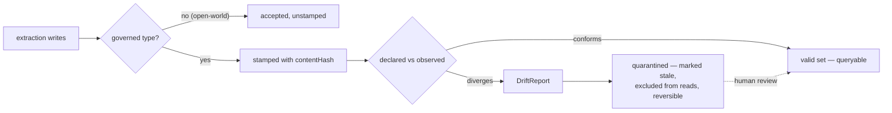

# DICE competitive positioning

Where DICE sits against the agent-memory field (Zep/Graphiti, Mem0, Letta, Cognee, Hindsight,
LangMem, and the three hyperscaler memory services), and against the enterprise data-governance
tooling whose vocabulary we should be borrowing rather than inventing.

Two halves. The first is the claim we lead with and the evidence behind it. The second is the
per-competitor detail — kept because it's still the fastest way to answer "how do we compare on X".

Surveyed mid-2026. Competitor surfaces move fast and several of them publish roadmap blogs as if
they were release notes, so re-verify anything here before it goes into a bakeoff or a deck.

## Delivery status: read this before quoting anything below

The governance story is **direction, not shipped surface**. `dice-metamodel` — `MetamodelVersion`,
`GovernedTypeSelector`, `DeclaredSchema`/`DeclaredSchemaSource`, `MetamodelVersionStore` — is an
unmerged PR train. Detection and quarantine are designed and not built. Everywhere below, a
metamodel or drift capability is marked **(in delivery)** or **(planned)**, and those markers are
load-bearing: this doc is for positioning conversations, and a present-tense claim about an unmerged
module is the exact thing that collapses in an eval. Say "this is where we're going and here's the
design" — that's still a differentiated answer, because nobody else is going there at all.

What *is* shipped and can be claimed flatly: the proposition model with confidence and decay,
multi-strategy entity resolution, source provenance (`ProvenanceEntry`), collector decision traces
(`CollectorTraceStore`), the conflict-detection SPI, and the pluggable store family.

## The claim

**DICE is the agent-memory substrate with schema governance an enterprise data team will
recognise.**

Every serious competitor has solved *extraction* and most have solved *entity resolution*. None of
them has solved *governance of the schema that extraction runs against* — and none of them has it on
a public roadmap. Across Zep/Graphiti, Mem0, Letta, Cognee and Hindsight, not one ships, and DICE is
building:

- governed metamodel versioning — a schema identity you can write down, store, and compare later
  **(in delivery)**;
- provenance from a stored claim back to the source text it came from **(shipped)**, and a
  correlatable trace of the extraction run that produced it **(planned — see below)**;
- drift quarantine as a first-class state, distinct from delete **(planned)**;
- conflict resolution behind an explicit, pluggable SPI rather than an opaque LLM call **(shipped)**,
  with versioned and audited policies **(planned)**.

That is a category gap, not a feature gap. The systems that treat memory as a datastore have
skipped the layer that every enterprise data platform grew in its second year. Our advantage is that
we're building it deliberately; it is not yet an advantage we can demo end to end.

## What the competition actually has

Differentiation that lies dies in the first eval. Stated straight, and generously:

| System | What it genuinely has |
|---|---|
| **Zep / Graphiti** | Bi-temporal edges (`valid_from`/`valid_until` plus ingestion time), cross-session entity dedup, Leiden community clustering with summaries, custom entity types via Pydantic, five reranking strategies, SOC 2 on the managed offering. The strongest temporal model in the field. |
| **Mem0** | Very fast single-pass ingestion (v3, April 2026, dropped the UPDATE/DELETE phases to cut latency), hybrid semantic + BM25 + entity-match retrieval, graph memory across Neo4j/Memgraph/Neptune/Kuzu, full SQLite change history, mentions counting. |
| **Letta (MemGPT)** | Agent-managed context with archival memory in Postgres/pgvector; the agent itself decides what to promote and how to resolve conflicts, via tool calls. Honest about being unstructured. |
| **Cognee** | The closest thing to declared schema in the field: LLM extraction into RDF triples with Pydantic validation, auto-generated ontology, and a custom-schema override. Shape validation, not versioning. |
| **Hindsight** | Structured facts into a knowledge graph with real entity resolution ("Alice" vs "my coworker Alice") and quality that compounds across sessions. |
| **LangMem** | Excellent extraction prompts — confidence-qualified, surprise-prioritised, SNR-shaped — plus gradient-style prompt optimisation and dilated-window retrieval. |
| **Google / AWS / Microsoft** | Fully managed, zero-infrastructure, IAM-scoped, framework-integrated. Flat fact strings underneath. |

Two of these are ahead of us on things we care about. Zep's bi-temporal model is better than our
system timestamps. Cognee's Pydantic validation is a real declared-shape check at write time. Say so.

## Where the governance line falls

| Capability | Zep | Mem0 | Letta | Cognee | Hindsight | DICE |
|---|---|---|---|---|---|---|
| Schema versioning | — | — | — | Pydantic override, unversioned | — | Content-hashed `MetamodelVersion` (in delivery) |
| Type hierarchy / ontology | Implicit (clustering) | — | — | RDF/RDFS, auto-generated | — | Declared `DataDictionary`, per-type governed (in delivery) |
| Source provenance | Bi-temporal timestamps only | — | — | — | — | `ProvenanceEntry` edges, append-only (shipped) |
| Extraction-run trace | — | — | — | — | — | Planned (no run identifier today — issue #67) |
| Collector decision audit | — | Full SQLite change history | — | — | — | `CollectorTraceStore` (shipped) |
| Contradiction handling | Temporal windows, manual | ADD-only (sidesteps it) | Manual, agent-driven | Unclear | Unclear | `ConflictDetector` SPI, both claims retained (shipped) |
| Versioned / audited conflict policy | — | — | — | — | — | Planned |
| Drift detection (declared vs observed) | — | — | — | — | — | Planned (tier 2) |
| Drift quarantine | — | — | — | — | — | Planned (tier 3) |

Four honest caveats. Zep and Cognee may have unpublished lineage APIs; this table is built from
public docs. Mem0's change history is genuinely better than anything we have for "what changed and
who changed it" — it is only weaker on *what schema it was valid under*. Our audit story is two
separate mechanisms, not one chain: `ProvenanceEntry` links a proposition to the source chunks it
came from, and `CollectorTraceStore` records why a collapse or merge decision was made. Neither
carries an extraction-run identifier, so there is no end-to-end "this claim came from that run under
that schema" trace today — that's planned work (issue #67), and the metamodel stamp is the piece
that would complete it. And the whole tier ladder — set out in `docs/design/metamodel-versioning.md`,
which lands with the `dice-metamodel` module — is designed, with only tier 1 in delivery.

Claim the architecture, not the checkbox.

## Identity semantics: content-addressed, not sequential

Confluent Schema Registry and AWS Glue both assign **sequential** version identity — Confluent a
global immutable integer schema ID plus a per-subject version number, Glue a per-schema version
number plus an opaque version ID. Registration is a stateful event: the same schema posted twice
gets one ID and one version because the registry remembers, not because the identity is derived from
the content.

DICE derives identity from the content. That design is in delivery, not merged, so the whole of this
section is a statement of direction. `MetamodelVersion.contentHash` is a SHA-256 over the structural
fields — sorted type names, per-type labels and properties, sorted relationship descriptors — with
every token length-prefixed so `["a;b"]` can't collide with `["a", "b"]`. Three consequences worth
stating in any comparison:

- **Registration is idempotent by construction.** `saveVersion` upserts on `(schemaName,
  contentHash)`; a re-save lands on identical content by definition. No sequence counter to get out
  of step across environments.
- **Schema is data.** A dev and a prod schema of identical shape hash identically, so they compare
  directly. The registries can't do that — same schema, different subject, different version number.
- **Stamps are portable.** A proposition carries `dice.metamodel.version` as metadata, so the schema
  a claim was extracted under travels with the claim rather than living in a registry it must be
  looked up in.

The second divergence is **granularity**. Both registries configure compatibility **per subject**,
flat: one mode for the whole schema. DICE governs **per type**, via `GovernedTypeSelector`. That's
not a stylistic difference — it's what lets one domain be closed-world where it matters (`Person`,
`Company`) and open-world everywhere else, so an exploratory type LLM extraction just invented
doesn't churn the version history.

**Adopt their vocabulary where it fits.** BACKWARD / FORWARD / FULL, and the transitive variants,
are well-understood terms for what a compatibility check means, and our detect tier should use them
rather than coining synonyms. Glue's *checkpoint* — a selectable reference point to compare against,
rather than "previous version" or "all versions" — is more expressive than transitive-yes/no and is
the right model if governed types ever get release windows.

**Name the divergence.** Both registries **hard-reject** an incompatible registration: HTTP 409, no
warn mode, no soft landing. DICE does not, and won't. Extraction is LLM-driven; a type nobody
declared is often a real finding. Rejecting at write time is the one decision that can't be undone
later.

## Opt-in and drift: observe, never auto-mutate

The migration and ORM world has already run this experiment, and the developer verdict is
unambiguous.

**Loved:**

- **`liquibase diff` / `diff-changelog`** — compares declared (reference) against observed (target)
  and *generates* the changesets that would close the gap. It reports; a human decides whether to
  apply or mark as run.
- **`flyway validate`** — checksums applied migrations against local ones and fails loudly on
  mismatch. Explicitly bound to a build phase, not fired automatically on every deploy.
- **Hibernate `hbm2ddl.auto=validate`** — check only, fail on mismatch, change nothing. And
  `hbm2ddl.auto=none` as the shipped default: no schema management unless you asked for it.
- **`@Version` per entity** — versioning is an annotation you put on the entities you chose. Nothing
  is versioned by inference.

**Hated:** `hbm2ddl.auto=update`. Uncontrolled schema evolution at startup, silently creating
columns and leaving zombies behind when a `@Column(name=...)` changes. A production anti-pattern in
every guide that mentions it.

DICE's stance follows directly, and it's a one-line elevator pitch: **liquibase diff for knowledge
graphs.** Observe and quarantine, never auto-mutate. That's the design; here is what it commits us
to, tier by tier:

- Nothing is versioned unless an application supplies a `DeclaredSchemaSource` (in delivery). No
  declared schema, no versioning — the Hibernate `none` default, not the `update` one.
- Governance is per governed type via `GovernedTypeSelector` (in delivery), the `@Version` model
  rather than a global switch.
- The detect tier (planned) will report the declared-vs-observed gap. It will not close it. Closing
  it stays a human act, the way Liquibase generates changesets rather than applying them.
- The quarantine tier (planned) marks affected propositions stale. Stale is reversible; delete is
  not.

The failure mode to watch, straight from the same brief: **opt-in fatigue**. All three tools require
explicit configuration, teams ship with defaults, and later regret having no drift visibility. Our
answer isn't to turn governance on by default — it's to make the on-switch a one-bean decision and to
lead every governance doc page with the gate.

## Escalation vocabulary: say what the data team says

OpenMetadata, DataHub, Great Expectations, Soda and the Open Data Contract Standard have converged on
one vocabulary. Use it verbatim. Every term we coin instead is a term a buyer has to translate.

| Term | Their meaning | Ours | Status |
|---|---|---|---|
| **Drift** | Structural or statistical divergence over time | Declared metamodel vs what the graph actually holds | Planned |
| **Contract** | Declared structure + quality + ownership | `DeclaredSchema` — the governed types and their shape | In delivery |
| **Assertion** | A comparison check fired on change | The declared-vs-observed comparison in the detect tier | Planned |
| **Policy** | Enforcement rule, configurable strictness | `SchemaAdherence` (STRICT/DEFAULT/RELAXED) shipped; `ConflictDetector` SPI shipped; versioned policy planned | Mixed |
| **Incident** | Raised on assertion failure, routed to an owner | `DriftReport` — the record a detection produces | Planned |
| **Quarantine** | Invalid records split off; the valid stream continues | Affected propositions marked stale, not deleted | Planned |

The escalation ladder they all implement is **observe → alert → block**. DICE's three tiers are
designed to map onto it directly:

| DICE tier | Their stage | What happens | Status |
|---|---|---|---|
| Stamp and observe | Observe | Schema gets an identity; propositions carry the stamp. No opinions. | In delivery |
| Detect and report | Alert | Compare declaration against declaration, and declaration against live graph. Emit a `DriftReport`. | Planned |
| Quarantine | Block (soft) | Mark affected propositions stale. The valid set stays queryable; the suspect set is excluded and recoverable. | Planned |

The diagram below is the target flow, not current behaviour.

Note the shape of the split: the pipeline **continues**. Quarantine is a valid/invalid partition, not
a halt — exactly the hybrid default the Spark/Soda world settled on. Fail-fast is what you escalate
to when quality drops below a threshold, not what you do on the first bad record.

Two decisions this vocabulary forces on us, both still open:

- **Is quarantine a metadata flag or physical routing?** Enterprise tools do both and neither is
  canonical. DICE's stale-marking is a flag; whether reads exclude by default is the real question.
- **Do we route incidents?** Their incident model assumes metadata ownership drives notification.
  DICE has events; it has no owner model. `DriftReport` without a routing story is a log line.

## Graph-native convergence: Neo4j GRAPH TYPE

Neo4j's GRAPH TYPE (preview, 2025) declares a schema once in Cypher DDL and enforces it at write
time, with SET/ADD/ALTER/DROP lifecycle commands and an Open variant that requires declared fields
while tolerating extras. TypeDB does the same thing more strictly: nothing can be written that
doesn't conform, and `redefine` checks existing instances before a migration commits.

**Read this as validation, not threat.** The store vendors are independently concluding that a
property graph needs a declared schema coupled to enforcement. That's the direction we're already
walking. The differentiation is *where the governance sits*.

DICE governs **above the store** — that's the architectural bet, with tier 1 in delivery and the
rest designed:

- **Per context, not per database.** Governance scopes to a `contextId`, so one deployment can hold
  a governed tenant and an exploratory one. GRAPH TYPE is a property of the graph.
- **Open-world by default.** GRAPH TYPE and TypeDB reject the undeclared. DICE tolerates it — an
  exploratory type is a finding, and per-type governance is what makes that safe rather than sloppy.
  Today's `SchemaAdherence` already takes this side of the trade at extraction time.
- **Quarantine rather than reject** (planned). Write-time enforcement means a non-conforming
  extraction is lost. Ours would be stored, flagged, and reviewable.
- **Survives a backend swap.** DICE's schema lives in `SchemaRegistry`/`DataDictionary`, not in the
  database. In-memory, Neo4j, or something later — the governance story is the same one. Adopting
  GRAPH TYPE would rewrite it.

The honest cost of governing above the store: our schema is application-enforced, so it *can* drift
if some entry point skips validation. Neo4j's cannot. That's a real trade, and the detect tier is
planned precisely because we took the flexible side of it — which also means that until that tier
lands, the drift it's meant to catch is undetected rather than prevented.

**SHACL validation reports are the prior art for `DriftReport`.** SHACL is the only standardised
violation-report format in this space: a conformance flag at the root, one result node per violation,
each carrying the focus node, the failed constraint, severity, and a human-readable message. Copy the
shape. Don't copy the serialisation — SHACL reports are RDF graphs, which would make every consumer
of a `DriftReport` parse RDF. PG-Schema and ProGS are the property-graph analogues and are worth
watching, but neither has a canonical report format to borrow.

## What we copy, what we reject, what only we do

| | Copy | Reject | Only us |
|---|---|---|---|
| **Schema registries** (Confluent, Glue) | BACKWARD/FORWARD/FULL vocabulary; Glue's checkpoint idea; idempotent registration | Sequential version IDs; flat per-subject compatibility; hard-reject on incompatible registration | Content-addressed identity; per-type governed selection; the stamp travelling with the data |
| **Migration & ORM** (Liquibase, Flyway, Hibernate) | Declared-vs-observed diff that reports rather than applies; validate-mode; per-entity `@Version` opt-in | `hbm2ddl.auto=update` auto-mutation; anything that changes a schema at startup | Drift detection over LLM-extracted knowledge, where the "observed" side is a graph nobody wrote by hand |
| **Data governance** (DataHub, Soda, ODCS) | drift / contract / assertion / policy / incident / quarantine, verbatim; observe→alert→block; valid/invalid split | Blocking at the producer boundary as a default; contract YAML as the primary authoring surface | Governance over probabilistic extraction — confidence-weighted claims, not rows |
| **Graph schema** (Neo4j GRAPH TYPE, TypeDB, SHACL) | SHACL's validation-report structure; GRAPH TYPE's Open variant semantics | Write-time rejection; RDF as a wire format; store-coupled schema declaration | Governance that works per context, tolerates open-world types, and survives a backend swap |
| **Agent memory** (Zep, Mem0, Cognee, LangMem) | Zep's bi-temporal model (GAP-4B); Mem0's integer re-indexing and change history; LangMem's extraction prompts; Cognee's declared-shape validation | ADD-only ingestion; hard delete on contradiction; opaque LLM consolidation | Source provenance and collector traces (shipped); governed metamodel versioning (in delivery); drift quarantine and versioned conflict policy (planned) — nobody else has any of the four, shipped or roadmapped |

## Per-competitor detail

### vs Zep/Graphiti

| Dimension | DICE | Zep | Edge |
|---|---|---|---|
| Ingestion speed | Batch classify + auto-merge + canonical dedup | Sequential only ("must be awaited") | **DICE** |
| Classification nuance | 5-way with edge cases + few-shot | Duplicate vs contradicted (binary) | **DICE** |
| Confidence model | Exponential decay + outcome-dependent adjustment + reinforceCount | No decay, no confidence scoring | **DICE** |
| Extraction quality | SNR, confidence-qualified, role-aware, schema-bound | Custom entity types via Pydantic, entity validation | Tie |
| Temporal model | System timestamps only (created/revised) | Bi-temporal (valid_at/invalid_at/expired_at) | **Zep** |
| Graph structure | Propositions + entity mentions, no graph DB required | Full knowledge graph in Neo4j with community detection | **Zep** |
| Retrieval | Vector similarity + canonical match | Cosine + BM25 + BFS + 5 rerankers | **Zep** |
| Schema governance | Content-hashed metamodel versions, per-type opt-in (in delivery) | None — entity types are code, not versioned artifacts | **DICE**, on direction |
| Infrastructure weight | Embeddable, JVM-native, no external deps | Requires Neo4j + embedding service + LLM | **DICE** |

**Their moat**: bi-temporal fact model, custom entity types via Pydantic, five reranking strategies,
community subgraph summaries, Neo4j-backed traversal.

**Their weakness**: sequential-only ingestion, Python/Go only, heavy infrastructure, no schema
versioning. Their audit story is SOC 2 on the managed service — an org-level control, not a
data-lineage API.

**Attack angle**: embeddable, no Neo4j requirement, faster at high-throughput ingestion. Governance
is the clean differentiator; the temporal gap (GAP-4B) is the thing to close before claiming parity.

### vs Mem0

| Dimension | DICE | Mem0 | Edge |
|---|---|---|---|
| Classification | 5-way taxonomy with edge-case guidance | v3 is ADD-only; supersession and contradiction aren't expressible | **DICE** |
| Dedup pipeline | Canonical + auto-merge + batch LLM | Entity linking at retrieval time, not at write | **DICE** |
| Ingestion latency | Batch LLM call per chunk | Single-pass, deliberately minimal | **Mem0** |
| Confidence model | Decay + outcome adjustment + qualification at extraction | None | **DICE** |
| ID safety | Integer re-indexing prevents hallucination | Integer re-indexing prevents hallucination | Tie |
| Graph memory | Entity mentions + Neo4j projection | Neo4j/Memgraph/Neptune/Kuzu | **Mem0** |
| Audit trail | Source provenance + collector decision traces, no run-level trace | Full SQLite history (old/new/event/actor) | **Mem0** |
| Schema governance | Governed metamodel versions (in delivery) | None | **DICE**, on direction |

**Their moat**: graph memory across four stores, vision, procedural memory for agent traces, a real
change history, and the lowest ingestion latency in the field.

**Their weakness**: v3 traded expressiveness for speed. ADD-only means contradictions accumulate
unresolved; there is no supersession semantics to appeal to.

**Attack angle**: their change history is genuinely good and ours should be at least as queryable.
Where we win is that their history records *what changed*, not *what schema it was valid under*.

### vs Cognee

| Dimension | DICE | Cognee | Edge |
|---|---|---|---|
| Declared shape | `DataDictionary` + `SchemaAdherence` (STRICT/DEFAULT/RELAXED), shipped | Pydantic models, optionally overriding an auto-generated ontology | Tie |
| Schema versioning | Content-hashed, stored, comparable (in delivery) | None — validation is per-run | **DICE**, on direction |
| Ontology | Declared types and relationships | RDF/RDFS triples, auto-generated from the corpus | **Cognee** |
| Validation failure handling | Adherence policy; non-conforming extraction retained and flaggable | Pydantic rejects the shape; no error feedback loop | **DICE** |
| Provenance | `ProvenanceEntry` edges to source chunks | Not documented | **DICE** |

**Their moat**: the only competitor with a real declared-schema check at write time, and
auto-generated ontology lowers the setup cost a lot.

**Their weakness**: shape validation without versioning. Change the Pydantic model and nothing tells
you what previously-stored data no longer conforms — which is the exact problem the detect tier
exists to solve.

**Attack angle**: closest competitor conceptually, and the one worth watching. Pydantic validation is
a good idea we should match at the extraction boundary.

### vs Letta (MemGPT) and Hindsight

Letta declines to have a schema at all: core memory managed by the LLM, archival memory as
pgvector passages, conflicts resolved by the agent through tool calls. Consolidation is agent-driven,
not governed. Nothing to compare on governance; the honest comparison is philosophical — Letta trusts
the agent, DICE trusts the substrate.

Hindsight structures facts into a graph with entity resolution good enough to link "Alice" to "my
coworker Alice", and improves across sessions. Smaller product surface than the incumbents, no
documented temporal invalidation or contradiction framework. Worth re-checking; the entity-resolution
quality is the part that could matter.

### vs LangChain/LangMem

| Dimension | DICE | LangMem | Edge |
|---|---|---|---|
| Extraction prompts | SNR, confidence-qualified, role-aware, few-shot | Confidence-qualified, surprise-prioritised, SNR | Tie |
| Dedup/classification | Structured 5-way pipeline with fast paths | LLM tool calls (insert/update/delete) | **DICE** |
| Batch processing | N propositions in 1 LLM call | Sequential tool calls | **DICE** |
| Prompt optimisation | Not applicable | Gradient-based prompt evolution | **LangMem** |
| Retrieval | Vector similarity | Dilated windows + LLM-generated queries | **LangMem** |
| Graph memory | Entity mentions on propositions | Commented-out prototype | **DICE** |
| Background processing | Synchronous pipeline | Debounced async reflection | **LangMem** |

**Attack angle**: great prompts, weak infrastructure. We've taken the prompt ideas; the pipeline
mechanics are ours.

### vs the managed services (Google, AWS, Microsoft)

All three converge on the same shape: a flat fact string, opaque LLM consolidation, hard delete on
contradiction, no entity model, no confidence, no provenance, and full vendor lock-in — traded
against zero infrastructure and native IAM.

| Dimension | DICE | Google Memory Bank | AWS AgentCore | Microsoft Foundry |
|---|---|---|---|---|
| Data model | Structured `Proposition` | Flat `fact` string | Flat `{"fact": "..."}` | Flat memory "items" |
| Memory types | `KnowledgeType` classifier | Managed + custom topics | Strategy-scoped | Profile + chat summary only |
| Confidence/decay | Decay + outcome adjustment | None | None | None |
| Entity resolution | Multi-strategy + LLM disambiguation | None | None | None |
| Contradiction | Both retained, reduced confidence | Old deleted | New entry, no detection | Old value discarded |
| Provenance | `ProvenanceEntry` to source chunks | None | None | None |
| Governance | Metamodel versioning (in delivery), drift (planned) | None | None | None |
| Managed | Self-hosted | Fully managed | Fully managed | Fully managed |
| Scale limits | Application-determined | Not published | Not published | 100 scopes, 10K memories/scope |

**Attack angle**: all three validate the category and none of them is a competitor for a team that
cares what happens to knowledge over time. The interesting question these raise isn't technical, it's
whether DICE eventually wants a managed offering — the embeddable library model is a strength today.

### vs Neo4j Agent Memory

| Dimension | DICE | Neo4j Agent Memory | Edge |
|---|---|---|---|
| Classification nuance | 5-way with edge cases + few-shot | No taxonomy — entity resolution handles dedup | **DICE** |
| Batch processing | N propositions in 1 LLM call | Sequential cascade stages | **DICE** |
| Confidence/decay | Decay + outcome adjustment + reinforceCount | None | **DICE** |
| Contradiction | Both retained with reduced confidence | Merged or left distinct | **DICE** |
| Extraction pipeline | Single LLM call, SNR-maximising | spaCy → GLiNER → LLM cascade | **Neo4j** |
| Graph structure | Propositions + mentions, Neo4j as projection | Native graph with POLE+O ontology | **Neo4j** |
| Temporal model | System timestamps only | valid_from/valid_until + geospatial | **Neo4j** |
| Retrieval | Vector + canonical + entity + composable query | Hybrid vector + up to 3-hop traversal | **Neo4j** |
| Schema enforcement | Application-layer, per context; quarantine planned | Heading toward store-level GRAPH TYPE enforcement | Different bets |
| Infrastructure weight | Embeddable, no external deps | Neo4j 5.11+ plus spaCy/GLiNER models | **DICE** |

**Attack angle**: the most architecturally serious competitor, and the one whose direction most
validates ours. The competition is proposition-centric versus entity-centric: DICE manages the
*lifecycle* of claims, they build a graph of entities. Their store-level schema bet (GRAPH TYPE) and
our substrate-level bet are the interesting divergence — theirs is stronger inside Neo4j, ours is the
only one that survives leaving it.

## Key remaining gaps

| Gap | Blocks us against | Impact |
|---|---|---|
| ~~ID hallucination prevention (GAP-6)~~ | ~~Mem0~~ | ~~DONE — integer re-indexing~~ |
| Detect tier (declared vs observed) | The whole governance claim | Tier 1 is still in delivery; the claim needs tier 2 |
| Quarantine tier | Nobody, yet — but it's the headline | Claim stays architectural until it lands |
| Bi-temporal model (GAP-4B) | Zep, Neo4j | No point-in-time queries or temporal contradiction resolution |
| Temporal anchoring (GAP-4A) | Zep | Relative dates stored as literal text |
| Surprise-prioritised retention (GAP-2) | LangMem | Novel facts don't get durable treatment |
| Incident routing for `DriftReport` | DataHub, Soda | A drift report nobody is notified about is a log line |

## Not worth chasing

- **Zep's 5-reranker retrieval** — deep feature tied to Neo4j traversal. Bi-temporal is the better
  investment.
- **LangMem's prompt optimisation** — interesting, orthogonal to memory quality.
- **Mem0's separate graph pipeline** — we already have entity mentions plus Neo4j projection.
- **Google's multimodal extraction** — the proposition model is format-agnostic; add later if a use
  case demands it.
- **AWS's episodic reflection** — our abstraction pipeline already synthesises across propositions.
- **Neo4j's POLE+O ontology** — domain-specific subtypes; the proposition model is domain-agnostic by
  design.
- **Neo4j's spaCy → GLiNER → LLM cascade** — cost-effective, operationally heavy (model downloads,
  dependency management). Not worth it for proposition extraction.
- **Contract YAML as the authoring surface** — ODCS is a good spec, but DICE's declared schema is
  already a JVM type an application owns. A second YAML dialect would be two sources of truth.
- **Write-time rejection of undeclared types** — the one governance move that destroys information
  irreversibly. Quarantine is strictly better for an LLM-driven substrate.
- **Managed hosting** — every hyperscaler validates the category; none of them makes the embeddable
  model less valuable.
