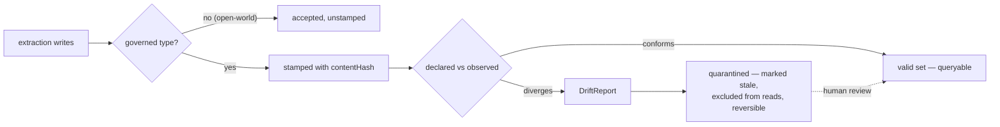

# DICE competitive positioning

Where DICE sits against the agent-memory field (Zep/Graphiti, Mem0, Letta, Cognee, Hindsight,
LangMem, Neo4j Agent Memory, and the three hyperscaler memory services), and which vocabulary to
borrow from enterprise data-governance tooling.

DICE differs from that field in one place: governance of the schema extraction runs against. No
surveyed competitor versions its extraction schema, compares a declaration against what a live
graph holds, or quarantines divergent records, and none has that work on a public roadmap.

Surveyed mid-2026. Several competitors publish roadmap posts in the register of release notes, so
re-verify anything here before it goes into a bakeoff or a deck.

## Delivery status

On main: the proposition model with confidence and decay, multi-strategy entity resolution, source
provenance (`ProvenanceEntry`), collector decision traces (`CollectorTraceStore`), the
`ConflictDetector` SPI, `SchemaAdherence` (STRICT/DEFAULT/RELAXED), declared types via
`SchemaRegistry`/`DataDictionary`, integer re-indexing of proposition IDs across LLM calls (GAP-6),
and the pluggable store family.

In the open PR train, unmerged as of this writing:

| PR | Contents |
|---|---|
| #83 | `dice-metamodel` core: `MetamodelVersion` (content-addressed stamp), `GovernedTypeSelector`, `DeclaredSchema`/`DeclaredSchemaSource`, `MetamodelVersionStore`, and `docs/design/metamodel-versioning.md` with the tier ladder |
| #84 | `DrivineMetamodelVersionStore`: Neo4j persistence, MERGE on natural key, per-schema monotonic sequence for write order |
| #85 | `ObservedSchema`/`ObservedSchemaSource`, `MetamodelDiff`/`MetamodelChange`, declared-vs-declared and declared-vs-observed differs |
| #86 | `DriftReport`/`DriftReportStore`, `DriftCheckRunner` (`dryRun` defaults true), quarantine contracts and `MentionTypeDriftQuarantinePolicy` |
| #87 | `DrivineDriftReportStore` and `DrivineObservedSchemaSource`, plus the end-to-end governance loop against a live Neo4j |
| #88 | `MetamodelAutoConfiguration`, activated by the presence of a `DeclaredSchemaSource` bean; `embabel.dice.metamodel.enabled` kill switch and `drift.mode` = `off` \| `observe` (default) \| `quarantine` |

Not built: an extraction-run identifier linking a stored claim to the run that produced it (issue
#67), versioned and audited conflict policies, incident routing for `DriftReport`, a bi-temporal
fact model, and temporal anchoring of relative dates.

The rest of this document describes the design across main and that train. This section is the
reference for where a given capability currently lives.

## What each competitor has

| System | Capabilities |
|---|---|
| **Zep / Graphiti** | Bi-temporal edges (`valid_from`/`valid_until` plus ingestion time), cross-session entity dedup, Leiden community clustering with summaries, custom entity types via Pydantic, five reranking strategies, SOC 2 on the managed offering. |
| **Mem0** | Single-pass ingestion (v3, April 2026, dropped the UPDATE/DELETE phases to cut latency), hybrid semantic + BM25 + entity-match retrieval, graph memory across Neo4j/Memgraph/Neptune/Kuzu, full SQLite change history, mentions counting. |
| **Letta (MemGPT)** | Agent-managed context with archival memory in Postgres/pgvector. The agent decides what to promote and how to resolve conflicts, via tool calls. No declared structure. |
| **Cognee** | LLM extraction into RDF triples with Pydantic validation, auto-generated ontology, custom-schema override. Validates shape per run; no stored version to compare a later run against. |
| **Hindsight** | Structured facts into a knowledge graph with entity resolution that links "Alice" to "my coworker Alice", and quality that compounds across sessions. |
| **LangMem** | Confidence-qualified, surprise-prioritised, SNR-shaped extraction prompts, gradient-style prompt optimisation, dilated-window retrieval. |
| **Google / AWS / Microsoft** | Fully managed, zero-infrastructure, IAM-scoped, framework-integrated. Flat fact strings underneath. |

Two of these exceed DICE's equivalents: Zep's bi-temporal model against DICE's system timestamps,
and Cognee's Pydantic validation, which is a declared-shape check at write time.

## Governance capabilities

| Capability | Zep | Mem0 | Letta | Cognee | Hindsight | DICE |
|---|---|---|---|---|---|---|
| Schema versioning | — | — | — | Pydantic override, unversioned | — | Content-hashed `MetamodelVersion` (#83) |
| Type hierarchy / ontology | Implicit (clustering) | — | — | RDF/RDFS, auto-generated | — | Declared `DataDictionary`, per-type governed (main + #83) |
| Source provenance | Bi-temporal timestamps only | — | — | — | — | `ProvenanceEntry` edges, append-only (main) |
| Extraction-run trace | — | — | — | — | — | None (issue #67) |
| Collector decision audit | — | Full SQLite change history | — | — | — | `CollectorTraceStore` (main) |
| Contradiction handling | Temporal windows, manual | ADD-only | Manual, agent-driven | Unclear | Unclear | `ConflictDetector` SPI, both claims retained (main) |
| Versioned / audited conflict policy | — | — | — | — | — | None |
| Drift detection (declared vs observed) | — | — | — | — | — | `DeclaredObservedDiffer`, `DriftCheckRunner` (#85, #86) |
| Drift quarantine | — | — | — | — | — | `DriftQuarantinePolicy`, STALE marking (#86) |

Caveats on that table. It is built from public documentation, so Zep and Cognee may have
unpublished lineage APIs. Mem0's change history records old value, new value, event and actor,
which is more than DICE records, and omits the schema the change was valid under. DICE's audit
trail is two separate mechanisms: `ProvenanceEntry` links a proposition to the source chunks it
came from, and `CollectorTraceStore` records why a collapse or merge decision was made. Neither
carries an extraction-run identifier, so there is no end-to-end "this claim came from that run
under that schema" trace (issue #67); the metamodel stamp is the piece that would complete it.

## Metamodel identity: content-addressed

Confluent Schema Registry and AWS Glue assign sequential version identity. Confluent uses a global
immutable integer schema ID plus a per-subject version number, Glue a per-schema version number
plus an opaque version ID. Registration is a stateful event: the same schema posted twice gets one
ID and one version because the registry remembers it.

DICE derives identity from content. `MetamodelVersion.contentHash` is a SHA-256 over the structural
fields (sorted type names, per-type labels and property signatures, sorted relationship
descriptors) with every token length-prefixed, so `["a;b"]` cannot collide with `["a", "b"]`. Three
consequences:

- **Registration is idempotent by construction.** `saveVersion` upserts on `(schemaName,
  contentHash)`, and a re-save of identical content lands on the same row. There is no sequence
  counter to get out of step across environments.
- **Schema is data.** A dev and a prod schema of identical shape hash identically and compare
  directly. In the registries the same schema under a different subject gets a different version
  number.
- **Stamps are portable.** A proposition carries `dice.metamodel.version` as metadata, so the
  schema a claim was extracted under travels with the claim and needs no registry lookup.

The second divergence is granularity. Both registries configure compatibility per subject: one mode
for the whole schema. DICE governs per type via `GovernedTypeSelector`, which lets one domain be
closed-world where it matters (`Person`, `Company`) and open-world elsewhere, so an exploratory type
the LLM invented leaves the version history unchanged.

DICE adopts the registries' compatibility vocabulary: BACKWARD, FORWARD, FULL and the transitive
variants are well-understood terms for what a compatibility check means. Glue's *checkpoint*, a
selectable reference point to compare against, is more expressive than transitive yes/no and is the
right model if governed types get release windows.

Both registries hard-reject an incompatible registration with HTTP 409 and no warn mode. DICE
accepts the write and records the divergence. Extraction is LLM-driven, a type nobody declared is
often a real finding, and a write-time rejection discards it irrecoverably.

## Opt-in and drift: prior art from migration tooling

Patterns developers adopt:

- **`liquibase diff` / `diff-changelog`** compares declared (reference) against observed (target)
  and generates the changesets that would close the gap. A human decides whether to apply them or
  mark them as run.
- **`flyway validate`** checksums applied migrations against local ones and fails loudly on
  mismatch. It is bound to a build phase.
- **Hibernate `hbm2ddl.auto=validate`** checks only: fail on mismatch, change nothing.
  `hbm2ddl.auto=none` is the shipped default, so no schema management happens unasked.
- **`@Version` per entity** makes versioning an annotation on the entities you chose. Nothing is
  versioned by inference.

The pattern developers warn against is `hbm2ddl.auto=update`: uncontrolled schema evolution at
startup, silently creating columns and leaving zombies behind when a `@Column(name=...)` changes.

DICE follows the first set:

- Versioning activates on an application-supplied `DeclaredSchemaSource` bean. With no declared
  schema there is no versioning.
- Governance is per governed type via `GovernedTypeSelector`.
- The drift check reports the declared-vs-observed gap and leaves closing it to a human act, the
  way Liquibase generates changesets and applies none of them.
- Quarantine marks affected propositions STALE and leaves them stored and recoverable. `drift.mode`
  defaults to `observe`.

The failure mode all three tools share is opt-in fatigue: they require explicit configuration,
teams ship with defaults, and later have no drift visibility. DICE's mitigation is a one-bean
switch and an activation condition stated in the first paragraph of every governance doc page.

## Escalation vocabulary

OpenMetadata, DataHub, Great Expectations, Soda and the Open Data Contract Standard have converged
on one vocabulary. DICE uses these terms with their existing meanings.

| Term | Their meaning | DICE |
|---|---|---|
| **Drift** | Structural or statistical divergence over time | Declared metamodel versus what the graph holds |
| **Contract** | Declared structure + quality + ownership | `DeclaredSchema`: the governed types and their shape |
| **Assertion** | A comparison check fired on change | The declared-vs-observed comparison in the detect tier |
| **Policy** | Enforcement rule, configurable strictness | `SchemaAdherence` (STRICT/DEFAULT/RELAXED) and the `ConflictDetector` SPI |
| **Incident** | Raised on assertion failure, routed to an owner | `DriftReport`: the record a detection produces |
| **Quarantine** | Invalid records split off, the valid stream continues | Affected propositions marked STALE |

Their escalation ladder is observe → alert → block. DICE's three tiers map onto it:

| DICE tier | Their stage | What happens |
|---|---|---|
| Stamp and observe | Observe | Schema gets an identity; propositions carry the stamp |
| Detect and report | Alert | Compare declaration against declaration, and declaration against live graph; emit a `DriftReport` |
| Quarantine | Block (soft) | Mark affected propositions STALE. The valid set stays queryable; the suspect set is excluded and recoverable |

Quarantine partitions the write stream into a valid and a suspect set, and the pipeline continues,
which is the hybrid default the Spark and Soda world settled on. Fail-fast is the escalation for
when quality drops below a threshold.

Two decisions this vocabulary forces, both open:

- **Is quarantine a metadata flag or physical routing?** Enterprise tools do both. DICE's
  STALE-marking is a flag; whether reads exclude it by default is the open question.
- **Do we route incidents?** Their incident model assumes metadata ownership drives notification.
  DICE emits events and has no owner model, so a `DriftReport` has no routing destination today.

## Graph-native convergence: Neo4j GRAPH TYPE

Neo4j's GRAPH TYPE (preview, 2025) declares a schema once in Cypher DDL and enforces it at write
time, with SET/ADD/ALTER/DROP lifecycle commands and an Open variant that requires declared fields
while tolerating extras. TypeDB is stricter: nothing that fails to conform can be written, and
`redefine` checks existing instances before a migration commits. Store vendors are independently
concluding that a property graph needs a declared schema coupled to enforcement. The divergence is
where the governance sits.

DICE governs above the store:

- **Per context.** Governance scopes to a `contextId`, so one deployment can hold a governed tenant
  and an exploratory one. GRAPH TYPE is a property of the graph.
- **Open-world by default.** GRAPH TYPE and TypeDB reject undeclared types. DICE stores them as
  findings, and per-type governance is what keeps that safe. `SchemaAdherence` already takes this
  side of the trade at extraction time.
- **Quarantine on divergence.** Write-time enforcement loses a non-conforming extraction. DICE
  stores it, flags it, and leaves it reviewable.
- **Backend-independent.** DICE's schema lives in `SchemaRegistry`/`DataDictionary`, outside the
  database, so the same governance applies across in-memory, Neo4j, or a later backend. Adopting
  GRAPH TYPE would move it into the store.

The cost of governing above the store is that the schema is application-enforced, so it can drift
if some entry point skips validation. Neo4j's is enforced by the database.

SHACL validation reports are the prior art for `DriftReport`, and the only standardised
violation-report format in this space: a conformance flag at the root, one result node per
violation, each carrying the focus node, the failed constraint, severity, and a human-readable
message. `DriftReport` follows that structure. SHACL serialises as RDF graphs, which
`DriftReport` does not adopt, so its consumers need no RDF parser. PG-Schema and ProGS are the
property-graph analogues and are worth watching; neither has a canonical report format to borrow.

## Adopted, rejected, unique

| | Adopt | Reject | Unique to DICE |
|---|---|---|---|
| **Schema registries** (Confluent, Glue) | BACKWARD/FORWARD/FULL vocabulary; Glue's checkpoint; idempotent registration | Sequential version IDs; flat per-subject compatibility; hard-reject on incompatible registration | Content-addressed identity; per-type governed selection; the stamp travelling with the data |
| **Migration & ORM** (Liquibase, Flyway, Hibernate) | Declared-vs-observed diff that reports; validate-mode; per-entity `@Version` opt-in | `hbm2ddl.auto=update` auto-mutation; anything that changes a schema at startup | Drift detection over LLM-extracted knowledge, where the observed side is a graph nobody wrote by hand |
| **Data governance** (DataHub, Soda, ODCS) | drift / contract / assertion / policy / incident / quarantine, verbatim; observe→alert→block; valid/invalid split | Blocking at the producer boundary by default; contract YAML as the primary authoring surface | Governance over probabilistic extraction: confidence-weighted claims |
| **Graph schema** (Neo4j GRAPH TYPE, TypeDB, SHACL) | SHACL's validation-report structure; GRAPH TYPE's Open variant semantics | Write-time rejection; RDF as a wire format; store-coupled schema declaration | Governance that is per context, tolerates open-world types, and is backend-independent |
| **Agent memory** (Zep, Mem0, Cognee, LangMem) | Zep's bi-temporal model (GAP-4B); Mem0's integer re-indexing and change history; LangMem's extraction prompts; Cognee's declared-shape validation | ADD-only ingestion; hard delete on contradiction; opaque LLM consolidation | Source provenance, collector traces, governed metamodel versioning, drift quarantine, versioned conflict policy |

## Per-competitor detail

### vs Zep/Graphiti

| Dimension | DICE | Zep |
|---|---|---|
| Ingestion | Batch classify + auto-merge + canonical dedup | Sequential only ("must be awaited") |
| Classification | 5-way with edge cases + few-shot | Duplicate vs contradicted (binary) |
| Confidence model | Exponential decay + outcome-dependent adjustment + reinforceCount | No decay, no confidence scoring |
| Extraction quality | SNR, confidence-qualified, role-aware, schema-bound | Custom entity types via Pydantic, entity validation |
| Temporal model | System timestamps only (created/revised) | Bi-temporal (valid_at/invalid_at/expired_at) |
| Graph structure | Propositions + entity mentions, no graph DB required | Full knowledge graph in Neo4j with community detection |
| Retrieval | Vector similarity + canonical match | Cosine + BM25 + BFS + 5 rerankers |
| Schema governance | Content-hashed metamodel versions, per-type opt-in | Entity types are code, unversioned |
| Infrastructure | Embeddable, JVM-native, no external deps | Neo4j + embedding service + LLM |

Zep is Python and Go only. Its audit story is SOC 2 on the managed service, an org-level control
with no data-lineage API. The temporal difference is GAP-4B.

### vs Mem0

| Dimension | DICE | Mem0 |
|---|---|---|
| Classification | 5-way taxonomy with edge-case guidance | v3 is ADD-only; supersession and contradiction are inexpressible |
| Dedup pipeline | Canonical + auto-merge + batch LLM | Entity linking at retrieval time |
| Ingestion latency | Batch LLM call per chunk | Single-pass, deliberately minimal |
| Confidence model | Decay + outcome adjustment + qualification at extraction | None |
| ID safety | Integer re-indexing prevents hallucination | Integer re-indexing prevents hallucination |
| Graph memory | Entity mentions + Neo4j projection | Neo4j/Memgraph/Neptune/Kuzu |
| Audit trail | Source provenance + collector decision traces, no run-level trace | Full SQLite history (old/new/event/actor) |
| Schema governance | Governed metamodel versions | None |

Mem0 also has vision and procedural memory for agent traces, and the lowest ingestion latency in
the field. Its v3 traded expressiveness for speed: ADD-only means contradictions accumulate
unresolved with no supersession semantics. Its change history records what changed and omits the
schema the change was valid under.

### vs Cognee

| Dimension | DICE | Cognee |
|---|---|---|
| Declared shape | `DataDictionary` + `SchemaAdherence` (STRICT/DEFAULT/RELAXED) | Pydantic models, optionally overriding an auto-generated ontology |
| Schema versioning | Content-hashed, stored, comparable | Validation is per-run |
| Ontology | Declared types and relationships | RDF/RDFS triples, auto-generated from the corpus |
| Validation failure handling | Adherence policy; non-conforming extraction retained and flaggable | Pydantic rejects the shape; no error feedback loop |
| Provenance | `ProvenanceEntry` edges to source chunks | Not documented |

Cognee is the only surveyed competitor with a declared-schema check at write time, and its
auto-generated ontology lowers setup cost. Changing the Pydantic model tells you nothing about
which previously-stored data no longer conforms, which is what the detect tier addresses.

### vs Letta (MemGPT) and Hindsight

Letta has no schema: core memory managed by the LLM, archival memory as pgvector passages,
conflicts resolved by the agent through tool calls, consolidation agent-driven. There is no
governance surface to compare against.

Hindsight structures facts into a graph with entity resolution good enough to link "Alice" to "my
coworker Alice", and improves across sessions. Smaller product surface than the incumbents, with no
documented temporal invalidation or contradiction framework. The entity-resolution quality is the
part worth re-checking.

### vs LangChain/LangMem

| Dimension | DICE | LangMem |
|---|---|---|
| Extraction prompts | SNR, confidence-qualified, role-aware, few-shot | Confidence-qualified, surprise-prioritised, SNR |
| Dedup/classification | Structured 5-way pipeline with fast paths | LLM tool calls (insert/update/delete) |
| Batch processing | N propositions in 1 LLM call | Sequential tool calls |
| Prompt optimisation | None | Gradient-based prompt evolution |
| Retrieval | Vector similarity | Dilated windows + LLM-generated queries |
| Graph memory | Entity mentions on propositions | Commented-out prototype |
| Background processing | Synchronous pipeline | Debounced async reflection |

DICE has taken several of LangMem's prompt ideas.

### vs the managed services (Google, AWS, Microsoft)

All three share a shape: a flat fact string, opaque LLM consolidation, hard delete on
contradiction, no entity model, no confidence, no provenance, vendor lock-in, zero infrastructure,
native IAM.

| Dimension | DICE | Google Memory Bank | AWS AgentCore | Microsoft Foundry |
|---|---|---|---|---|
| Data model | Structured `Proposition` | Flat `fact` string | Flat `{"fact": "..."}` | Flat memory "items" |
| Memory types | `KnowledgeType` classifier | Managed + custom topics | Strategy-scoped | Profile + chat summary only |
| Confidence/decay | Decay + outcome adjustment | None | None | None |
| Entity resolution | Multi-strategy + LLM disambiguation | None | None | None |
| Contradiction | Both retained, reduced confidence | Old deleted | New entry, no detection | Old value discarded |
| Provenance | `ProvenanceEntry` to source chunks | None | None | None |
| Governance | Metamodel versioning, drift checking | None | None | None |
| Hosting | Self-hosted | Fully managed | Fully managed | Fully managed |
| Scale limits | Application-determined | Not published | Not published | 100 scopes, 10K memories/scope |

The open question these raise is whether DICE eventually wants a managed offering.

### vs Neo4j Agent Memory

| Dimension | DICE | Neo4j Agent Memory |
|---|---|---|
| Classification | 5-way with edge cases + few-shot | No taxonomy; entity resolution handles dedup |
| Batch processing | N propositions in 1 LLM call | Sequential cascade stages |
| Confidence/decay | Decay + outcome adjustment + reinforceCount | None |
| Contradiction | Both retained with reduced confidence | Merged or left distinct |
| Extraction pipeline | Single LLM call, SNR-maximising | spaCy → GLiNER → LLM cascade |
| Graph structure | Propositions + mentions, Neo4j as projection | Native graph with POLE+O ontology |
| Temporal model | System timestamps only | valid_from/valid_until + geospatial |
| Retrieval | Vector + canonical + entity + composable query | Hybrid vector + up to 3-hop traversal |
| Schema enforcement | Application-layer, per context, with quarantine | Store-level GRAPH TYPE enforcement |
| Infrastructure | Embeddable, no external deps | Neo4j 5.11+ plus spaCy/GLiNER models |

The division is proposition-centric against entity-centric: DICE manages the lifecycle of claims,
Neo4j builds a graph of entities. Their store-level schema bet is enforced by the database and
scoped to it; DICE's substrate-level bet applies across backends.

## Remaining gaps

- No extraction-run identifier, so a stored claim cannot be traced to the run and schema that
  produced it (issue #67).
- No bi-temporal model (GAP-4B): system timestamps only, so no point-in-time query and no temporal
  contradiction resolution.
- No temporal anchoring (GAP-4A): relative dates are stored as literal text.
- No surprise-prioritised retention (GAP-2): novel facts get no durability preference.
- No incident routing for `DriftReport`. DICE emits events and has no owner model.
- Conflict policy has no versioning or audit trail.

## Out of scope

- **Zep's 5-reranker retrieval.** Deep feature tied to Neo4j traversal. Bi-temporal is the better
  investment.
- **LangMem's prompt optimisation.** Orthogonal to memory quality.
- **Mem0's separate graph pipeline.** DICE has entity mentions plus Neo4j projection.
- **Google's multimodal extraction.** The proposition model is format-agnostic; add on demand.
- **AWS's episodic reflection.** The abstraction pipeline already synthesises across propositions.
- **Neo4j's POLE+O ontology.** Domain-specific subtypes; the proposition model is domain-agnostic.
- **Neo4j's spaCy → GLiNER → LLM cascade.** Cost-effective and operationally heavy (model
  downloads, dependency management).
- **Contract YAML as the authoring surface.** DICE's declared schema is a JVM type an application
  owns; a YAML dialect would be a second source of truth.
- **Write-time rejection of undeclared types.** It discards an extraction irrecoverably.
- **Managed hosting.** The embeddable library is the shipped distribution model.
