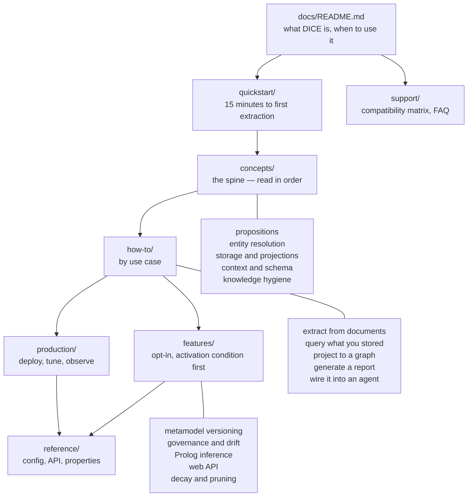

# Developer docs architecture

The target information architecture for DICE's developer documentation: what pages exist, in what
order, and who owns keeping them true. Most of what's below doesn't exist yet.

DICE ships to Maven Central as a set of JVM modules with Spring Boot autoconfiguration. The docs
that fit that shape are the ones Confluent Schema Registry, Flyway, Zep and Spring Boot itself
write: concept-anchored and workflow-layered, none of them strict Diátaxis. All of them open with a
runnable quickstart, then a small set of mental models, then task-shaped how-tos, then dense
reference, with optional features flagged at the top of their own page and a compatibility matrix
that answers "will this work with my stack" on its own.

## What we already have, and what's missing

`docs/design/` is the *why*: rationale notes aimed at someone changing DICE. They stay as they are.
`specs/` is strategy and planning, also internal.

The *how* is all in `README.md`, which is 2,621 lines. It holds Spring pipeline setup, the
proposition pipeline walkthrough, mention filtering, entity extraction and resolution, `ContextId`
and `PropositionQuery`, graph and Prolog projection, agent memory, the Oracle, the REST API, Spring
Boot integration, graph-backed storage config, API-key security and installation.

So the work is mostly a migration:

| Directory | Audience | Question it answers |
|---|---|---|
| `docs/design/` | DICE contributors | Why is it built this way? |
| `docs/` (new tree below) | DICE consumers | How do I use it? |
| `specs/` | Us | What are we building and why does it matter commercially? |
| `README.md` | Anyone landing on the repo | What is this, should I care, where do I start? |

Design docs and developer docs cross-link without duplicating. A concept page says what a
proposition is and how to make one; the design note says why confidence decays the way it does.

### Migrating the README

Target: a README under ~250 lines. Line numbers are as of this branch and will move, so re-check
before acting on the table.

| README section (line) | Fate |
|---|---|
| What is DICE, benefits table, architecture overview (24–116) | **Keep**, trimmed. This is the landing page's job. |
| Real-world example: Impromptu (117–176) | **Keep**, cut to a paragraph plus a link. |
| Pipeline setup, conversation analysis (127–176) | **Move** → `quickstart/` |
| Proposition pipeline, content dedup, mention filtering (177–489) | **Move** → `concepts/propositions.md`, `how-to/extract-from-documents.md`, `how-to/mention-filtering.md` |
| Entity extraction, entity resolution, resolution service (490–1225) | **Move** → `concepts/entity-resolution.md` + `how-to/tune-entity-resolution.md`. The largest block; split it. |
| Source analysis context, `ContextId`, `PropositionQuery` (1226–1419) | **Move** → `concepts/context-and-schema.md`, `how-to/query-propositions.md` |
| Relations, projector architecture, graph and Prolog projection (1420–1647) | **Move** → `concepts/storage-and-projections.md`, `how-to/project-to-graph.md`, `features/prolog-inference.md` |
| Agent memory, memory projection, memory maintenance (1648–1979) | **Move** → `how-to/agent-memory.md`, `concepts/knowledge-hygiene.md` |
| Proposition operations, Oracle (1980–2090) | **Move** → `how-to/query-propositions.md`, `how-to/oracle.md` |
| Package structure (2091–2205) | **Move** → `reference/` |
| REST API and endpoints (2206–2334) | **Move** → `features/web-api.md`; it is opt-in and gated by an API key. |
| Spring Boot integration, graph-backed storage, API-key security (2335–2572) | **Move** → `how-to/choose-a-backend.md`, `reference/configuration-properties.md`, `features/web-api.md` |
| Installation (2573–2585) | **Keep** as coordinates only; the working version lives in the quickstart. |
| Technology stack, references, license (2586–2621) | **Keep**. |

Two rules for the migration. Content moves: each section is deleted from the README as it lands in
`docs/`, so there is one copy. And every removed section leaves a one-line link where it was, so an
existing bookmark still lands somewhere useful. Do it as one PR per destination page.

## The IA

Five concepts, in that order, because each needs the one before it. Every other section is entered
from any direction.

## The concept spine

1. **Propositions** — natural-language claims are the system of record. Confidence, importance,
   decay, lifecycle states. Everything else is a projection of these.
2. **Entity resolution** — how mentions in text get matched to entities that already exist, or
   minted as new ones. Resolution outcomes, the escalating resolver chain, cross-chunk dedup.
3. **Storage and projections** — the `PropositionStore` SPI family, in-memory and the durable Neo4j
   backend, and the materialised views (vector, graph, Prolog, memory, oracle).
4. **Context and schema** — `contextId` scoping, the `DataDictionary`, `SchemaAdherence`, and what
   "extraction against a schema" constrains.
5. **Knowledge hygiene** — admission gates, reclamation, consolidation, and why they are three
   interventions at three moments.

Every concept page ends with **Try it now**: five to ten lines that exercise what was just
explained against the quickstart's setup, and the output to expect.

## The 15-minute quickstart

One page, one path, no branches. Copy, paste, run, see output.

### Prerequisite: there is no starter artifact

DICE ships `dice`, `dice-ingestion`, `dice-storage`, `dice-storage-autoconfigure` and
`dice-report`. There is no `dice-spring-boot-starter`, so a one-coordinate quickstart has a build
prerequisite:

- **Either** create a `dice-spring-boot-starter` aggregator module depending on
  `dice-storage-autoconfigure` (which pulls `dice-storage` and `dice`) plus `dice-report`, publish
  it to Maven Central, and let the quickstart use one coordinate. Small module, and it has to land
  before the quickstart page can be written as one line.
- **Or** write the quickstart against today's coordinates, `dice-storage-autoconfigure` and
  `dice-report`, both explicit, with a comment saying what each buys. Two lines, and it unblocks
  the docs from a release.

Pick one before writing the page. The page uses coordinates that are published.

### The page

1. **The dependencies.** Whichever of the two above we picked, with the version from the BOM.
2. **Configuration.** The minimum that works: an LLM provider (inherited from embabel-agent), an
   embedding model, and the default in-memory store, which means no Neo4j and no Docker for the
   first run. `InMemoryPropositionRepository` does vector search, so without a configured embedding
   model the vector query in step 6 returns nothing. To keep the config to one key, drop vector
   retrieval from the minimal path, query by entity and `ContextId` only, and introduce embeddings
   in the retrieval how-to. Either way the page's queries match the configuration it gave.
3. **What autoconfiguration gave you.** The beans that now exist and what each is for: a list of
   things you can `@Autowired`.
4. **Extract.** Feed one paragraph of text through the pipeline. Print the propositions with their
   confidence.
5. **Persist.** `PropositionPipeline` returns unsaved results, so the caller owns the transaction.
   Call `persist(propositionRepository, namedEntityDataRepository)` on the `PersistablePropositions`
   result, and say in one sentence why the pipeline leaves it to the caller. Skipping this step
   leaves an empty store.
6. **Query.** Retrieve what was just stored, by entity and `ContextId`, and by vector similarity if
   step 2 configured an embedding model.
7. **Report.** Produce one human-readable artifact so the run ends in something visible.
8. **Where to go next**, split by intent; see the audience note below.

Constraints. The 15 minutes holds: no Neo4j, no Docker, no `create` of anything external. The code
is real and compiles, and a test in `dice-integration-tests` runs the quickstart's exact snippets,
which is what catches a missing persist step. Anything that needs a decision (backend choice,
resolver chain, schema) takes the default and links out.

## How-to guides, by use case

Task-shaped, titled by what the reader wants, each stating its prerequisites at the top:

- Extract knowledge from a document set (chunking, dedup before extraction, batch, and persisting
  the unsaved results the pipeline hands back)
- Tune entity resolution (resolver chain, thresholds, when to spend an LLM call)
- Choose and configure a storage backend (in-memory → Neo4j, what changes)
- Query propositions (composable `PropositionQuery`, retrieval modes, trust filtering)
- Project to a Neo4j graph (typed nodes, lineage back to evidence, re-run idempotence)
- Query with Prolog (facts, rules, transitive reasoning)
- Generate a report
- Use DICE as agent memory in an embabel-agent application
- Handle conflicts and contradictions (the conflict policy SPI)
- Process a stream incrementally (windowing, dedup across windows)

Each states what it costs in LLM calls, latency, and infrastructure.

## Feature pages

Every optional feature gets its own page, and each page states its activation condition in the
first paragraph. This matters most for versioning and governance, where nothing happens until an
application asks for it: no `DeclaredSchemaSource`, no versioning; no governed types, no drift
detection. DICE versions a schema only when an application declares one.

Template, in order:

- **Availability** — which DICE version, which modules, what it costs to add.
- **Activation condition** — the exact bean, property, or annotation that switches it on, on the
  first screen. "Off unless you define a `DeclaredSchemaSource` bean" opens the versioning page.
- **When to use it**, and when to leave it off.
- **Impact** — latency, memory, extra infrastructure, extra LLM calls.
- **How to enable** — full working configuration.
- **Example** — real code with real output.

Opt-in surfaces that need this treatment: metamodel versioning, drift detection and quarantine,
Prolog inference, graph projection, the web API, decay and stale-pruning, the multi-signal
collector, concurrent extraction.

## Compatibility matrix

Its own page, linked from the README, answering "will this work with my stack" before any prose.
Four axes. The embabel-agent one is stated as a supported range, since DICE tracks a moving
platform.

| Axis | What we state |
|---|---|
| embabel-agent | Supported version range per DICE release, with the tested point release called out |
| Spring Boot | Minimum and maximum tested, per DICE release |
| JDK | Baseline is 21 (inherited from `embabel-build-parent`); newer JDKs listed as tested or untested |
| Neo4j | Required version floor for the durable backend, via Drivine; "not required" for in-memory |

Plus a feature-availability column, so a reader can see that governance arrives after 1.0. Exact
values get pinned at the 1.0 release; the page ships with the axes and the tested-against values we
have.

## Production guide

The page a team reads before going live:

- Backend choice and the migration from in-memory to Neo4j
- Schema declarations and index creation on startup
- Decay tick configuration, and why `prune-stale` defaults to false
- Concurrency: what's safe to run in parallel and where entity-resolution ordering matters
- LLM cost and latency budgets per pipeline stage
- Observability: the events DICE emits, what to alert on
- Backup, and what "system of record" obliges you to keep
- Governance rollout: stamp first, detect later, quarantine last

## Audience split

Two audiences arrive with different vocabularies and different first questions:

- **Data engineers** want to know where the data lands, what the schema is, how drift is handled,
  and what Cypher they can run. They read storage, schema, governance, projections.
- **LLM/agent engineers** want extraction quality, entity resolution, memory retrieval, and how it
  plugs into an agent. They read propositions, resolution, retrieval, agent memory.

The concept order is the same for both: propositions, then resolution, then storage. What differs
is the entry point. The quickstart's "where to go next" offers a data-engineer path and an
agent-engineer path through the same pages in different orders, and the README says which is which.
Two parallel doc sets drift.

A third audience, researchers wanting Prolog and reasoning, is real and small, and is served by the
Prolog feature page.

## Risks

**Reading-order enforcement.** The concept chain makes sense in order, and readers arrive from
search engines in the middle of it. Nothing in a static docs site forces sequence. Mitigations, all
cheap: number the concept pages, put a one-line "assumes you've read X" at the top of each, and end
each with an explicit next link. Each page has to stand on its own for a reader who lands mid-chain.

**Extraction variability.** The docs assume the extractor returns clean, schema-adhering
propositions. It won't always. Mention filtering and `SchemaAdherence` appear early and are weighted
heavily.

**Backend coupling surfaces late.** Prolog needs a store; graph projection needs decisions made
before extraction runs. The quickstart defers all of this, so the "choose your backend" how-to has
to be prominent and has to say plainly that changing it later means rework.

**Duplication across modules, and with the README.** Spring configuration examples exist in
`dice-storage-autoconfigure`, `dice-ingestion` and elsewhere, and the 2,621-line README holds a
version of most of them. One canonical example set in `docs/`; module READMEs and the root README
link to it. The migration table above works only if content moves.

**Doc rot.** Handled by the contract below, and by making the quickstart executable.

## The per-PR docs contract

**Every feature PR ships its design-doc delta and its developer-doc page in the same PR. Missing
docs are a review-blocking finding, on the same footing as a missing test.**

Concretely:

- New or changed behaviour visible to a consumer → the developer-doc page is updated in that PR.
- New or changed *rationale* → the `docs/design/` note is updated in that PR.
- A new opt-in feature → a feature page stating its activation condition, in that PR.
- A new configuration property → the reference page, in that PR.
- A version-support change → the compatibility matrix, in that PR.

Docs written later are written by someone who has forgotten the edge cases. Governance is opt-in,
so an undocumented switch cannot be turned on by the consumer it was built for.

Reviewers ask one question: *if I only had this PR's docs, could I use this feature?* If the answer
is no, the finding is blocking. "Docs to follow" does not resolve it.

Carve-outs: internal refactors with no consumer-visible change need no doc delta, and neither do
test-only or build changes.

## Open questions

- Does DICE ever ship a CLI (schema validation, drift check)? Flyway's docs work partly because the
  CLI gives every concept an executable form. If a CLI happens, it needs its own quickstart.
- Rendered site or Markdown in the repo? The IA works either way; the decision affects cross-linking
  and whether the compatibility matrix can be generated.
- Do the `docs/design/` notes stay contributor-facing, or do the best of them get promoted into
  concept pages? Current answer: they stay, because their audience is different. Concept pages will
  lift explanations from them.
